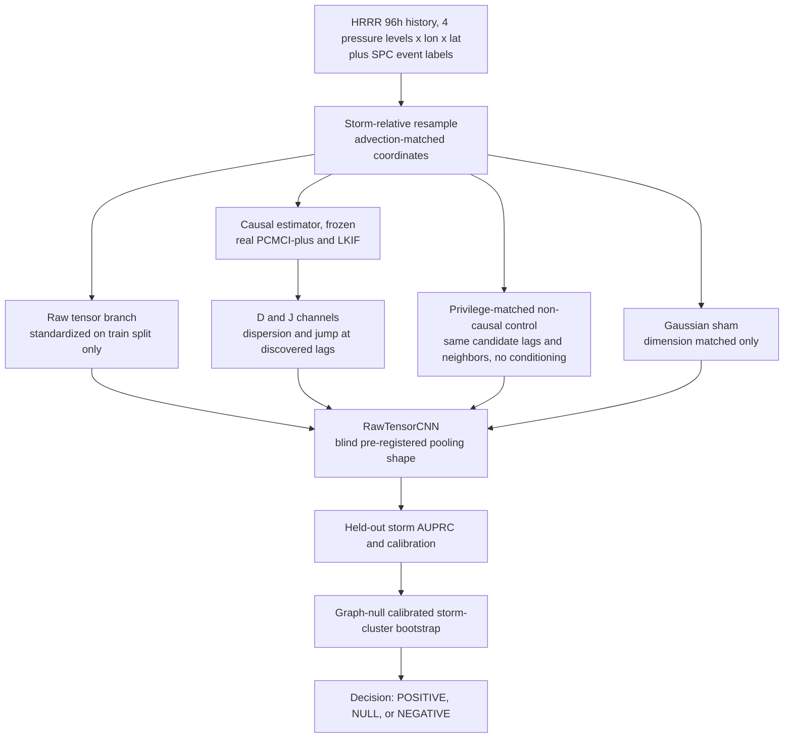

<!-- 书写报告使用中文 -->
---
idea: causal-scs-indicator
title: "因果时序不稳定性特征对原始 4D 强对流预警 CNN 的公平增量审计"
version: 1
date: 2026-07-13
workspace: workspace/causal-scs-indicator/
---

## Problem Anchor（原样保留, 逐版不漂移）

- Bottom-line problem: 跨气压层、多尺度滞后的因果时序不稳定性特征 `(D,J)`，能否为一个在原始 4D（pressure-level x longitude x latitude x time）场上端到端训练的强对流预警模型，提供该模型自身从原始历史中学不到的增量预警信息？
- Must-solve bottleneck: 此前九轮（v1-v9）比较的都不是"合格的原始张量端到端模型"——依次是无 CI 的单 seed 合成筛查、手工聚合特征上的 LR/RF、闭式统计量。v10 首次做到真正的 raw 张量直喂 CNN、容量匹配、含 sham，但两位独立审稿人一致指出仍有两处偏差源未受控：(1) v10b 架构（`4x2x2` 粗池化）是看到 v10（全局池化）训练失败后才选的，属于"看结果选架构"；(2) 维度匹配的 Gaussian sham 只控制参数量，没控制 `(D,J)` 享有的"已知真实滞后/邻接边"特权——容量相同但不知道该往哪看的 CNN 不是公平对照。
- Non-goals: 不主张因果估计器（PCMCI+/LKIF）新颖；不主张融合机制新颖；不识别真实大气因果图；不证明物理分岔机制；不构建新的时空骨干网络。
- Success condition（REAL-4D 阶段）: `>=2` 季节、`>=50` 个独立 storm systems 的 outer storm holdout 上，raw+`(D,J)` 相对同容量/同历史/独立冻结架构的 raw-only，`Delta AUPRC >= 0.02` 且 CI 下界 `> 0.01`；同时优于 sham 与特权匹配非因果对照；Brier/ECE 不退步；跨季节复现同号。

## 数据/计算资产交接状态（本轮核查）

- SPC 逐日报告（9 文件, 205KB, 2024-03-14/05-06/05-25）与 HRRR 单时刻 3km 分析子集（3 文件, 34MB）：均下载完成、未损坏（本轮核对字节数/SHA-256 与 `data/MANIFEST.md` 一致，无残留 `.part`/`.tmp`）。
- 连续多日/多风暴的完整 96h HRRR 序列：**未下载，且非中断或失败下载**——是刻意的 stop gate（v1-v9 合成前置门槛未通过前不启动全量拉取，避免烧预算）。本机当前无任何在跑/残留下载任务（已用 `squeue`/`ps` 核实）。因此不需要"接续中断下载"，而是要把 stop gate 解除条件写清楚——见 Gate 0 与 Compute/Timeline 两节。
- 计算环境：workspace 本地 uv venv（PyTorch 2.9.1+cu128, sklearn 1.9.0）、`tigramite`（PCMCI+/ParCorr）、`LK_Info_Flow`（LKIF）均已装好，直接复用。

## Technical Gap

**失败点**：v10 位置保留 CNN 是十轮里唯一让 raw 分支真正收敛（AUPRC 0.690）的版本，causal-minus-raw 仍是 `+0.065 [-0.013, +0.154]`——CI 跨零。但两位独立审稿人指出这个 NULL 可能仍偏乐观：比较双方不对等，`(D,J)` 在已知真实耦合边（850→250 hPa，3h）与真实滞后（500→850 hPa，24h）的位置上直接计算，raw/sham 分支必须从零学习"该往哪个像素、哪个时刻看"。参数量相同不等于任务难度相同。

**为什么朴素修补不够**：加 seed 只会让被污染的效应量估得更精确，不消除偏差；换更大/更现代的骨干不解决"对照没被告知往哪看"这一问题，任何容量的 raw 模型都吃同样的亏；单纯拿更多真实数据只是把同一偏差在更贵预算下重犯一遍。

**最小充分干预**：不引入新因果发现算法、新融合机制或新骨干，只修两处协议缺陷——(a) 架构选择在触碰任何因果/sham 通道结果之前，用独立合成校准集盲选并冻结；(b) 在 Gaussian sham 之外新增一个"特权匹配非因果对照"：给它和 `(D,J)` 相同的候选滞后/邻接搜索特权，但去掉条件化，只用确定性非因果统计量（边际滞后相关、局部方差、一阶差分幅度）。一个新表示同时回应审稿人列出的"结构化非因果对照"与"oracle 位置/滞后特权"两个缺口，不是两个新模块。

**Route 比较**：Route A（采用）——协议层最小修补，因果表示与骨干完全不变，直接对准两处具体偏差源，novelty 落在审计协议而非新模型上。Route B（放弃）——换现代时空骨干（3D ViT/Swin/扩散式）重做整套比较；更"前沿"但不对准瓶颈（瓶颈是协议不公平，不是表达能力不够），且骨干越复杂越难在预算内避免"看结果选设计"。用户已明确方法新颖性非重点，Route B 会把预算从"问对增量问题"移到"把骨干做新"，是研究问题漂移，予以拒绝；仅保留一条附录级 robustness check（见 Modern Primitive Usage）。

**核心技术主张**：消除架构事后选择与 oracle 位置/滞后特权后，`(D,J)` 能否为同历史、同容量、独立冻结架构的 raw-4D CNN，在真实 storm-level HRRR/SPC 数据上提供跨季节可复现的 AUPRC 增量——十轮里从未在去偏协议下问过的问题。

**所需最小证据**：合成 Gate 0 通过；`>=2` 季节 `>=50` storm 的真实 nested holdout 上 `Delta AUPRC` 的 storm-cluster 校准 CI；同时优于两类对照；校准不退步；移除新增控制会改变结论（证明协议非装饰）。

## Method Thesis

- 一句话主张：把审计协议本身修到公平（独立冻结架构 + 特权匹配非因果对照 + 校准 bootstrap），是判断 `(D,J)` 能否为已训练好的原始 4D 强对流 CNN 提供真实增量所需的最小且充分的修补。
- 为什么是最小充分干预：所有新增都是协议层（何时冻结架构、多一个对照臂、如何校准区间），零新学习组件、零新因果估计器、零新融合机制；因果表示、CNN 骨干、Gaussian sham 全部复用 v10 已验证代码。
- 为什么现在及时：不靠生成式前沿组件，而是 anchor regression / IRM / DomainBed 一脉文献（1801.06229, 2007.01434, 2010.16412, 2402.09891）反复证明因果衍生特征优于强 baseline 类主张在严格公平对照下大比例站不住；本项目把这一已成熟的审计标准具体应用到强对流预警上。

## Contribution Focus

- Dominant contribution：消除两处已知偏差源（架构事后选择、oracle 位置/滞后特权）后，对"`(D,J)` 能否为真实 storm-level 4D 数据上端到端训练的强对流预警 CNN 提供增量"给出 storm-holdout 级别、诚实标注统计可判定性的答案（无论方向）。
- Optional supporting contribution：把审计协议（盲选架构 + 特权匹配非因果对照 + graph-null 校准 bootstrap + 统一判据）写成可复用模板，供任何"物理/因果衍生特征 vs. 已训练原始网格模型"类主张审计使用。
- Explicit non-contributions：不提出新因果发现算法；不恢复真实大气 DAG；不提出新融合架构；不构建新时空骨干；不对 D/J 做超出统计定义之外的物理机制解释。

## Proposed Method

### Complexity Budget

- 冻结/复用：合成 Gate 0 沿用固定边局部回归 proxy；真实数据阶段用 PCMCI+（tigramite, ParCorr）与 LKIF（`LK_Info_Flow`，两环境均已装好，直接复用）；`RawTensorCNN` 架构族（`Conv3d→ReLU→MaxPool3d→Conv3d→ReLU→AdaptiveAvgPool3d→Linear`，唯一可变超参是池化粒度）；Gaussian sham（v10 已验证）保留为第一个对照臂；AUPRC 主指标与两阶段 seed/storm-cluster bootstrap（`factorial_helpers.py`/`cnn_fusion_helpers.py` 机制直接复用）。
- 新增：盲选架构预注册规则；特权匹配非因果对照表示；把 v6 的 exchangeable-null 校准审计（`null_audit_helpers.py`）扩展到本轮 CNN+bootstrap 管线（此前只覆盖旧 factorial 管线）；真实 HRRR/SPC storm-level 数据管线（storm-relative/平流匹配坐标 + `>=2` 季节 `>=50` storm 标签）；统一 POSITIVE/NULL/NEGATIVE 判据（去掉"CI 上界 `<0`"与"`<0.01`"两套阈值并存的歧义）；seed 不收敛诊断规则（v10 的 seed `20260901` 卡在 `log(2)` 却被直接平均进汇总，改为预注册排除/双报告）。
- 刻意不做：新因果发现方法；新融合/加权机制（沿用 v10 通道拼接）；新骨干网络（transformer/DiT 仅作附录 robustness check，只在 Gate 0 与主结果均 POSITIVE 时才跑）；P3 归因本轮不做，留待通过后下一轮。

### System Overview

### Core Mechanism

- Input / output：四通道标准化原始场（1000/850/500/250 hPa，96h，lon x lat）+ 一个辅助通道臂（zero / Gaussian-sham / 特权匹配非因果 / `(D,J)`），输出 2-6h 内目标邻域发生强对流灾害的概率。
- Architecture：`RawTensorCNN` 池化形状从 `{(1,1,1), (2,2,2), (4,2,2), (4,4,4)}` 中，用从未出现在 Gate 0 决定性运行或真实数据中的独立合成校准种子池，按"raw-only 验证 AUPRC 最高"规则盲选并冻结，再生成/比较其余三条件。
- 特权匹配非因果对照：合成场景下把与 `(D,J)` 相同的真实边位置/滞后（3h/24h）告诉一个非因果统计量（边际滞后相关或局部方差），即字面 oracle 对照；真实数据场景没有"真实边"，改为让该统计量使用与 PCMCI+/LKIF 相同的候选滞后/邻接搜索网格与同款筛选步骤但跳过条件化——分离"被告知该找哪些候选"（causal 与该对照共享）与"条件化本身"（只有 causal 有）。
- Training signal / loss：`BCEWithLogitsLoss`，Adam（`lr=0.003, weight_decay=0.01`），120 epoch（合成阶段沿用 v10 设置，真实阶段按数据量调整）。
- 主要新颖点：不是审计对象新，而是审计标准补齐了两处此前未被覆盖的偏差源——同一个"NULL"在 v10 里可能偏乐观，在本协议下才可信。

### Optional Supporting Component

- 协议模板可迁移性：本审计协议（盲选架构 + 特权匹配非因果对照 + graph-null 校准 bootstrap + 统一判据）只依赖"衍生表示是原始历史的确定性函数"这一前提，可直接套用到任何"物理诊断量/因果衍生特征 vs. 已训练原始网格模型"审计（如 CAPE/shear 衍生指数）。
- 为什么不发散：本轮只在本表示上实例化并报告，可迁移性只是 Discussion 段一句话论证，不构成第二个实验轴。

### Modern Primitive Usage

- 不以 LLM/VLM/Diffusion/RL 为核心机制；PCMCI+/LKIF 是经典因果发现方法，非前沿生成式组件。瓶颈是比较协议公平性而非表征能力，故不硬凑前沿组件（按 experiment-planning 规则明说并跳过 frontier block）。
- 唯一涉及"现代"骨干之处：把 transformer/DiT 式时空模型列为附录级 robustness check（非必需）——仅当 Gate 0 与主结果都 POSITIVE 时，才追加跑一次同容量预算下的现代骨干，检验结论是否只是 CNN 特定归纳偏置。

### Integration into Base Generator / Downstream Pipeline

- Gate 0（合成，协议冻结）→ 通过则 P1 真实 mini（管线验证，3 个既有日期 + 少量新日期）→ P1.5（storm-relative/平流对照 + graph-null 校准，P2 前置硬门）→ P2（`>=2` 季节 `>=50` storm confirmatory）。任何一步不通过即停止向下游花预算，转入诚实边界报告（见 Failure Modes）。
- 架构一旦在 Gate 0 冻结，P1/P1.5/P2 全程复用同一份权重初始化协议与超参，不再重新搜索。

### Training Plan

- 数据来源：真实阶段复用 `data/fetch_hrrr_subset.py`（NOAA 字节范围提取，已验证）与 `data/fetch_spc_reports.py`（SPC 逐日报告，已验证），泛化到多日期、多风暴窗口。
- 监督：事件标签来自 SPC 报告（tornado/wind/hail），负样本取同季节、时空匹配但未触发报告的窗口。
- 校准：nested storm holdout，任何模型选择（池化粒度、早停）只用内层折，外层折只在最终评估用一次。
- Curriculum：合成 Gate 0（先盲选架构，再比较四条件）→ 真实管线冒烟（沿用既有 3 日期资产）→ 真实 confirmatory（`>=2` 季节 `>=50` storm，同时报告 IID storm holdout 与季节/regime 迁移 holdout）。后者按 anchor-regression/CausalKinetiX 文献（1801.06229, 1810.11776, 1707.06422）的理论预期，是因果衍生表示最可能显现真实优势之处——若 `(D,J)` 有真实价值，跨 regime 泛化上的 `Delta` 应大于 IID holdout，这是文献综述给出的可操作、可证伪的具体预测，而非泛泛的"跨季节复现"要求。
- Losses/weighting：单一 BCE，不引入多任务花活；若类别极不平衡，允许类别加权但需同时应用于全部四条件，保持公平。

### Failure Modes and Diagnostics

- 架构预注册被污染（校准种子池与决定性池隐性相关）：用独立种子基生成校准池，Gate 0 报告中明确两池零重叠。
- 特权匹配对照过难/过易：检查该对照与 `(D,J)` 的单变量 AUROC 是否可比（类似既有 P0 诊断），差距过大先调整构造再进入真实数据阶段。
- 平流混淆：storm-relative/advection-matched 坐标变换是 P1.5 硬门，不通过不得进入 P2。
- seed 不收敛（如 v10 的 `20260901`）：raw 分支训练 loss 高于阈值（如 `0.65`，接近 `log(2)`）标记为不收敛，双报告含/不含该 seed 的汇总，不直接平均进主表。
- 真实数据获取超预算：允许缩小 N 并标注功效受限，不得静默降阈值凑 POSITIVE。
- 多重比较膨胀：对照臂 x holdout 切分，统一 Benjamini-Hochberg 校正后再报判据。
- 十轮九轮 NULL/NEGATIVE 的先验：诚实边界是同样可发表的结局，不为凑 POSITIVE 无限加码协议或样本；Gate 0 若仍是宽区间 NULL/NEGATIVE，直接停止 P2 预算，转写失败边界论文。

### Novelty and Elegance Argument

最近邻 Ganesh, Beucler, DeMaria, Runge（2025, SHIPS+, arXiv:2510.02050）：因果发现选出的预测因子增补进标准 21 个 SHIPS predictors，在真实台风业务数据上验证"因果衍生特征增强既有强 baseline"这一路线在邻域可行。Flora, Varga, Potvin, Lang（2026, arXiv:2603.20250）证明 U-Net/HGBT 可在 WoFS 网格化输出（经全文核验为 63-channel 时间聚合 2D 张量，非完整 96h 原始历史）上做 2-6h 强对流预警的真实业务先例。两者共同确立"因果特征可能有用"与"网格化 ML 可用于该窗口"两个前提，但都没做本提案要做的事：同历史、同容量、消除 oracle 特权之后，把 `(D,J)` 与完整时间序列原始张量端到端 CNN 做条件增量审计。Markov blanket 预测最优性文献（2002.09414）给出理论落点：足够表达、训练在完整历史上的模型，其预测能力上界覆盖该历史的任何确定性函数（含 `(D,J)`），真实增益只能来自有限样本归纳偏置，不能来自"额外信息"——这也是为什么"apply 因果特征 to 强对流预警"本身不构成贡献：贡献在于用去偏协议诚实回答归纳偏置是否存在、多大、在哪类 regime 下存在。协议只多了两处必要修补，不是模块堆叠。

## Claim-Driven Validation Sketch

### Claim 1（主锚点，直接对应 Bottom-line problem）

- Minimal experiment：真实 HRRR/SPC storm-level 数据上的公平增量审计。`>=2` 季节、`>=50` 个独立 storm systems，outer storm holdout；每个 storm 提供 96h 历史窗口 + 2-6h 提前量的灾害标签；同时报告 IID storm holdout 与季节/regime 迁移 holdout 两种切分。
- Baselines/ablations：raw-only（Gate 0 冻结架构）、raw+Gaussian-sham、raw+特权匹配非因果对照、raw+`(D,J)`（真实 PCMCI+/LKIF），四臂同历史同容量。
- Metric：paired `Delta AUPRC`（causal − raw）storm-cluster bootstrap 95% CI 为决定性指标；Brier/ECE 为次要指标。
- Expected evidence：POSITIVE 需 CI 下界 `>0.01` 且同时优于两个对照臂、两种 holdout 同号；否则按统一判据报 NULL（跨越 `[0, 0.01]`）或 NEGATIVE（CI 上界 `<0.01`，不与旧的"CI 上界 `<0`"混用）。若存在真实信号，regime 迁移 holdout 上的 `Delta` 理论上应大于 IID holdout。

### Claim 2（Gate 0 必要性 / stop-go 前置门）

- Minimal experiment：合成 oracle-favorable DGP 上，对比"v10 旧协议"（事后选架构 + 仅 Gaussian sham）与"新协议"（盲选架构 + 特权匹配对照 + 校准 bootstrap + 统一判据）在同一批种子上的判定是否一致。
- Baselines/ablations：v10 冻结代码作为未充分控制的协议本身；新协议在相同 DGP 上重跑。
- Metric：两套协议判据是否翻转；特权匹配对照相对 causal 的 CI 是否与 Gaussian sham 相对 causal 的 CI 有实质差异。
- Expected evidence：判据相同则说明新控制此处良性但非必要（仍需真实数据阶段重验）；判据不同（旧协议因未控制特权而偏乐观）则证明新控制确有必要，回应"加码复杂度"的质疑。Gate 0 同时充当 stop/go：新协议下非判定性 NEGATIVE 才授权 P2 预算。

## Paper Outline

- S1 Introduction：静态 diagnostics 局限 + 因果衍生特征可信度问题（十轮进展一句话总结）+ 贡献（去偏审计协议 + storm-level 诚实答案）。
- S2 Related Work：(a) 因果特征增强强 baseline 先例（SHIPS+）；(b) 网格化 ML 强对流预警先例（Flora et al., Sha et al. 2310.06045）；(c) Markov blanket / anchor regression / IRM 解释"因果条件化为何丢弃预测信息"及复现失败文献（DomainBed, 2402.09891）。
- S3 Method：架构盲选预注册、特权匹配非因果对照的双重定义（合成 oracle / 真实候选匹配）、graph-null 校准 storm-cluster bootstrap、统一判据。
- S4 Experiments：Gate 0 结果（Claim 2）；真实 storm-level 主结果（Claim 1），含 IID vs regime-迁移两种 holdout。
- S5 Analysis：校准诊断；storm-relative/平流对照是否改变结论；seed 不收敛诊断的影响。
- S6 Conclusion：诚实标注判据边界；P3 归因与现代骨干 robustness check 留作未来工作。
- Key figures：Fig 1（hero）四臂 `Delta AUPRC` 森林图（Gate 0 vs 真实数据 x IID vs regime-迁移），直接对应 Claim 1+2；Fig 2 系统图（mermaid 定稿版）；Fig 3 校准可靠性图；Fig 4（附录）seed 收敛诊断与协议必要性对比表。

## Compute and Timeline Estimate

- Estimated GPU-hours：Gate 0（架构扫描 + 真实 PCMCI+/LKIF + 更大校准 seed 池）约 5-10 L4 GPU-hour（较 v10 的 0.016 上调，仍是廉价筛查）；P1 真实 mini 约 2-5 GPU-hour；P1.5（CPU 坐标变换为主）GPU 开销很小；P2 confirmatory 约 20-50 GPU-hour + 1000-3000 CPU-hour（沿用 idea 阶段既有估计）。
- Data / annotation cost：SPC 报告体量小（KB 级/日），`fetch_spc_reports.py` 直接泛化到更多日期。HRRR 完整历史复用 `fetch_hrrr_subset.py` 已验证的字节范围提取，扩展到约 7-8 个候选变量 x 4 气压层 x 每风暴 96-150h 窗口 x `>=50` storm，量级预计数十到约百 GB；批量拉取前先做精确字节核算，不整档下载完整 GRIB。
- Timeline：Gate 0 约 1 周；P1 真实 mini + P1.5 约 2-3 周；P2 confirmatory 约 4-6 周（均与 idea 阶段既有估计一致）。Gate 0 若判 NEGATIVE 或功效不足，直接跳过 P2、转写失败边界论文，节省全部真实数据预算——这正是硬门的意义。

<review date="2026-07-13">

## Scores

评审口径：`topics/0710-causal-scs.md` 未声明 `Target venues`/`Review standards`（Claude 与 codex 独立核实一致），沿用 idea 阶段既定口径：顶级 Earth-system methods / AI4Science / 强对流预测应用论文标准。

| Dimension | Score | Notes |
|-----------|-------|-------|
| Problem Fidelity | 8/10（Claude 初评 9, codex 8, 收敛至 8） | 未漂移：Problem Anchor 逐字保留，所有新增均直接对准 v10 review 指出的两处偏差（架构事后选择、oracle 位置/滞后特权），无新骨干/新估计器/新融合机制的范围扩张。codex 补充一处措辞层面的精度要求：结论只能限定为"在该预注册数据、架构与优化协议下未学到"，不能读成信息论意义上的不可学习——这是 Claims Calibration 层面的收紧，不构成漂移，故不下修到 7 以下。 |
| Method Specificity | 6/10（Claude 初评 8, codex 5, 收敛至 6） | 架构族、损失、优化器、判据阈值、分阶段 gate 确实具体。但重新逐句核对正文后发现若干真实缺口，codex 独立指出且经 Claude 逐句核验属实：(1) 输入通道数不一致——Core Mechanism 称"四通道标准化原始场"，Compute 段又称扩展到"约 7-8 个候选变量 x 4 气压层"，未说明真实阶段 CNN 究竟吃 4 通道还是 28-32 通道；(2) 特权匹配非因果对照的具体统计量未收敛——Technical Gap 列出三个候选（"边际滞后相关、局部方差、一阶差分幅度"），Core Mechanism 又只提两个并用"或"连接，全文未选定唯一一个并预注册，这恰恰是整个协议想消除的"看结果选设计"问题在第三个组件上的重演；(3) 真实 PCMCI+/LKIF 的超参（显著性水平、max lag、条件集大小）未给出；(4) storm-relative/advection-matched 坐标变换的具体构造（风暴运动矢量来自何处：HRRR 风场？SPC 报告？追踪算法？）未操作化；(5) v6 exchangeable-null 审计"扩展到 CNN+bootstrap 管线"只是任务清单，未给出具体算法。(1)(2) 是 CRITICAL 级缺口，直接影响四臂比较的可复现性和公平性本身。 |
| Contribution Quality | 6/10（Claude 初评 7, codex 5, 收敛至 6） | 单一主线、克制的 Optional Supporting Component（限定一句话）本身值得肯定，无 sprawl。但 codex 的核心质疑成立：blind pre-registration + 特权匹配对照 + graph-null bootstrap + 统一判据，本质上是**补齐实验卫生**（experimental hygiene），不是一个有真实新颖性的机制级贡献；"协议模板可迁移性"作为 supporting contribution 建立在单一 (D,J) 实例之上，证据基础薄弱。idea 自身的 non-goals 已声明不追求估计器/融合机制新颖，这压低了 Contribution Quality 在"real novelty"这一子标准上的可达上限——不是可以简单修补掉的缺陷，而是这一 contribution type（empirical-finding+diagnostic+application）内在的天花板。 |
| Frontier Leverage | 6/10（Claude 与 codex 独立评估收敛一致，均为 6） | 不强行引入 LLM/VLM/RL/完整 diffusion 是对的判断——因果估计器不是待更新的表征学习瓶颈。但 Claude 与 codex 各自检索后独立得出同一结论：P2 真实数据阶段的 raw-only 骨干仍是一个从零训练的两层 3D CNN，在 `<=50 storm` 的小样本 real-data regime 下，这正是 foundation-model 时代最应该发挥优势的场景（预训练模型的样本效率），而不是继续从零训练。Modern Primitive Usage 一节把"瓶颈是协议公平性而非表征能力"的论证用于 Gate 0（无限合成数据）是对的，但同一论证不能照搬到 P2（数据稀缺）——数据稀缺场景下, representational/sample-efficiency 恰恰是真实的第二个瓶颈, 且只把现代骨干列为"仅当 Gate 0 与主结果都 POSITIVE 才跑"的附录 robustness check, 无法保护主结果本身不受弱 baseline 偏差污染。检索确认：Aurora（arXiv:2405.13063）、Prithvi-WxC（arXiv:2409.13598）为通用天气基座模型，已有微调到极端天气/临近预报下游任务的先例；codex 独立找到更贴近本任务分辨率的两个先例——StormCast（Pathak et al. 2024, arXiv:2408.10958，NVIDIA HRRR/3km convection-allowing 扩散仿真器）与 HRRRCast（Abdi, Flora, Potvin et al. 2025, arXiv:2507.05658，与本提案 Novelty 段已引用的 Flora/Potvin WoFS 工作同一作者群，ResNet/GNN 骨干的 HRRR 数据驱动仿真器）——这两者的预训练权重或至少其表征学习设计思路，比通用全球基座模型更直接可复用为本任务 raw-only 分支的冻结/微调骨干。 |
| Validation Focus | 6/10（Claude 初评 8, codex 5, 收敛至 6） | 分阶段硬门、附录级 robustness check 按条件触发、无一次性堆砌全部对照的设计初衷是对的，比十轮里任何一版都更克制。但 codex 指出且经 Claude 核验成立的几个统计操作化缺口足以动摇 Claim 1 主结果的可解释性：(1) Gate 0 的"新旧协议判据是否翻转"只能证明 comparator 强弱会改变结论（v10b/v10 反转已经证明过一次），不直接证明新协议本身已经过校准（特权匹配对照是否过难/过易的检查仍只是"比较单变量 AUROC"这一非正式启发式）；(2) `>=2` 季节 `>=50` storm 的样本量沿用 idea 阶段既有估计，未针对 storm-cluster bootstrap CI 是否能被压到 0.01 实用阈值内做功效/精度分析——而 idea v10 review 已经记录 n=8 seed-bootstrap CI 宽度约 ±0.08-0.09、相对 0.02 目标增量检验力有限，本提案未回应这一已知历史问题是否在 storm-cluster 尺度上被解决；(3) IID holdout 与 regime-迁移 holdout 之间的正例流行率（prevalence/base rate）大概率不同，直接比较两者的 `Delta AUPRC` 点估计（Claim 1 "regime 迁移 Delta 应大于 IID Delta"）会把技能变化与流行率变化混在一起，需要流行率调整或预注册标准化指标；(4) Benjamini-Hochberg 校正（基于 p 值）与 CI-阈值判据（POSITIVE/NULL/NEGATIVE）如何结合未定义。 |
| Paper Story and Claims Calibration | 6/10（Claude 初评 8, codex 6, 收敛至 6） | 六节结构与三张主图基本对应两条 Claim，POSITIVE/NULL/NEGATIVE 判据在措辞上刻意区分"不可判定"与"无实用增量"两种不同强度的负面结论，延续了 idea 阶段来之不易的谨慎——这是真实优点。但 codex 指出两处需要收紧：(a) 判据分桶不是穷尽互斥的——"CI 下界 `>0.01` 但点估计 `<0.02`"或"胜 raw 但不胜特权匹配对照"这类中间情形未被规则覆盖；(b) Method Thesis/Training Plan 把 anchor regression（1801.06229）与 CausalKinetiX（1810.11776）的理论结果直接搬来预测"若 (D,J) 有真实价值, regime 迁移 Delta 应大于 IID Delta", 但这两支文献各自成立所需的具体假设（anchor regression 需要一个良定义的 shift/anchor 变量结构；CausalKinetiX 需要跨环境局部动力学不变）在本应用中既未验证也未在提案中显式陈述为待验证前提，把"文献里有类似结论"直接当成本领域的可操作预测有过度引申之嫌；相关工作也应把"因果鲁棒性在特定假设下成立"一类文献（anchor regression/CausalKinetiX）与"公平基线下因果特征优势经验性不成立"一类文献（Nastl & Hardt, arXiv:2402.09891）分开陈述，而非合并成同一个理论预期。 |
| Overall | 6.1/10 | Claude 收敛后 (8+6+6+6+6+6)/6≈6.33；codex 独立给出 5.83（(8+5+5+6+5+6)/6）。两者按规则取平均 = (6.33+5.83)/2 ≈ 6.08 → 6.1。收敛前 Claude 初评 overall 为 7.67，与 codex 5.83 相差 1.83（< 2 的强制标注阈值，但已在上表逐维度标注收敛过程）；Method Specificity 与 Validation Focus 两个维度收敛前分歧达 3 分，是本轮最大的分歧来源，Claude 在逐句复核提案原文后认为 codex 在这两维度的具体指证（特权匹配对照统计量未收敛、通道数不一致、跨 holdout 流行率不可比、Gate 0 样本量未做功效分析）均有原文依据，故采纳并下修，而非机械平均了事。 |

## Verdict

REVISE（Claude 收敛后判定与 codex 判定一致，均为 REVISE；无需取更严者的额外争议）

## Weaknesses (dimensions < 7)

### Method Specificity (6/10)

- Weakness: 三处核心接口未收敛到可实现的单一定义：(a) 真实阶段 CNN 输入通道数在"四通道"与"7-8 变量 x 4 气压层"之间未澄清；(b) 特权匹配非因果对照的具体统计量仍是"边际滞后相关/局部方差/一阶差分幅度"三选一的菜单，未预注册唯一实现；(c) 真实 PCMCI+/LKIF 的显著性水平、max lag、条件集大小，以及 storm-relative/advection 坐标变换的风暴运动矢量来源均未操作化。(b) 尤其关键：如果留到看到结果后再从菜单里选，等于把"架构事后选择"偏差原样平移到"非因果对照事后选择"上，协议的核心卖点会被自己复制的漏洞抵消。
- Suggested fix: 在下一版加一张完整接口表：固定真实阶段输入张量形状（`[B, C, T, H, W]`，明确 `C` 是否等于变量数 x 气压层数并给出具体变量清单）；在触碰任何真实/合成结果之前，从三个候选统计量里选定唯一一个非因果对照实现并写入预注册文档（可以用与架构盲选完全相同的独立校准集机制来选，而不是留白）；给出 PCMCI+ 的 `alpha_level`/`tau_max`/条件集大小与 LKIF 的对应超参具体数值或至少数值范围；写明风暴运动矢量的数据来源（如 HRRR 分析风场平流估计 or SPC 报告自带的移动矢量）与坐标变换公式。
- Priority: CRITICAL

### Contribution Quality (6/10)

- Weakness: 协议层面的四处修补（盲选架构、特权匹配对照、graph-null bootstrap 扩展、统一判据）本质是补齐实验卫生，不是机制级新颖性；"协议可复用为通用模板"这一 supporting contribution 目前只建立在单一 `(D,J)` 实例上，证据单薄，容易被读者当作把"份内该做的对照做对"包装成第二个贡献点。
- Suggested fix: 把 supporting contribution 从"可迁移的通用审计模板"降格为 Discussion 里一句话的推测性备注（提案当前的自我约束方向是对的，应更进一步：如果篇幅紧张，直接删除这条，不做正式 contribution 列表的一员）；同时在 Contribution Focus 里更直接地承认"贡献的可信度来自诚实、去偏后的真实数据结论本身（无论方向），而不是协议设计的通用性"，把读者的期待锚定在 empirical-finding+diagnostic 这一契约上，不去争抢 top-venue 通常要求的方法新颖性叙事空间。
- Priority: IMPORTANT

### Frontier Leverage (6/10)

- Weakness: P2 真实数据阶段仍用一个从零训练的两层 3D CNN 作为四臂共享的 raw 骨干，在 `<=50 storm` 的小样本场景下，这类无预训练归纳偏置的模型很可能样本效率不足，把"raw 分支学不到 (D,J) 信息"这一空结论与"从零训练的小模型在小样本下学不好"混淆；现代骨干目前只作为"仅当 Gate 0 与主结果都 POSITIVE 才追加跑"的附录 robustness check，无法在主结果生成之前保护其不受弱 baseline 偏差影响。
- Suggested fix: 在 P2 之前预置且只预置一个现代 raw-only 备选骨干（不引入完整 diffusion/LLM/VLM/RL，与 idea 阶段的克制方向一致）：复用 HRRRCast（arXiv:2507.05658，与本提案已引用的 Flora/Potvin WoFS 工作同一作者群，直接在 HRRR/3km 分辨率上预训练）或 StormCast（arXiv:2408.10958）的编码器权重（冻结或轻量 LoRA 微调），接一个跨四条件共享、容量匹配的浅层 probe head；只用训练折的 raw-only 内层验证在"从零 RawTensorCNN" vs "冻结/微调预训练编码器"之间选择更强的一个并冻结，再去跑四臂比较。若无法在预算内获取这些权重，退而求其次，在训练折 HRRR 窗口上做一次轻量 masked-reconstruction/next-step 自监督预训练替代纯监督从零训练。这不违反"不构建新骨干"的 non-goal——是复用/微调已有开源权重，而非设计新架构。
- Priority: CRITICAL

### Validation Focus (6/10)

- Weakness: 四个统计操作化缺口足以动摇 Claim 1 主结果的可解释性：(1) Gate 0"新旧协议判据是否翻转"只证明 comparator 强弱影响结论，不证明新协议本身已校准；(2) `>=50` storm 的样本量沿用 idea 阶段估计，未针对 storm-cluster bootstrap CI 能否压到 0.01 实用阈值内做功效分析，而 idea v10 review 已记录 n=8 seed-CI 宽度约 ±0.08-0.09 检验力有限的历史问题，本提案未说明如何解决；(3) IID 与 regime-迁移 holdout 大概率有不同的正例流行率，直接比较两者 `Delta AUPRC` 会把技能变化与流行率变化混淆；(4) BH 校正（p 值层面）与 CI-阈值判据如何结合未定义。
- Suggested fix: 把 Gate 0 的必要性检验之外，再加一条独立的"特权匹配对照校准检验"（例如在合成 DGP 上验证该对照对随机噪声臂的 AUROC 落在预注册的合理区间内，而不只是和 (D,J) 做非正式比较）；用既有 n=8 seed-CI 宽度反推 P2 阶段需要的 storm 数或换用更保守的实用阈值，并在提案里写出这个功效核算，样本不足则明确降级为 exploratory 而非 confirmatory；跨 holdout 比较改用流行率调整后的指标（如 PR-gain 或以预注册的 baseline 流行率做标准化）而非原始 `Delta AUPRC`；明确 BH 校正只用于控制多重检验下的名义显著性，最终 POSITIVE/NULL/NEGATIVE 判据仍以 CI-阈值为准，二者的先后顺序写清楚（如先 BH 筛选是否统计显著，再在显著的臂上应用实用阈值判据）。
- Priority: CRITICAL

### Paper Story and Claims Calibration (6/10)

- Weakness: (a) POSITIVE/NULL/NEGATIVE 判据分桶不穷尽——"CI 下界 `>0.01` 但点估计 `<0.02`"、"胜 raw 但不胜特权匹配对照"等中间情形未被规则覆盖；(b) 把 anchor regression/CausalKinetiX 的理论结果直接当作"regime 迁移 Delta 应大于 IID Delta"这一本领域可操作预测，但两支文献各自需要的假设（良定义的 shift/anchor 变量结构；跨环境局部动力学不变）在本应用中未被验证也未被显式陈述为待验证前提；相关工作把"因果鲁棒性在特定假设下成立"文献与"公平基线下因果特征优势经验性不成立"文献（Nastl & Hardt, arXiv:2402.09891）混为同一理论预期来源。
- Suggested fix: 补全判据分桶使其穷尽互斥（例如把"胜 raw 但不胜特权匹配对照"显式定义为 NULL 的一个具名子情形，而不是留白）；把"regime 迁移 Delta 应大于 IID Delta"这一预测明确标注为"基于 anchor regression/CausalKinetiX 假设成立时的推测性预期，本工作不验证这些假设本身是否满足"，避免让读者误以为这是已证实的理论保证；Related Work 里把支持因果鲁棒性的理论文献与显示经验失败的文献分段陈述，说明二者共同构成"需要严格审计"的动机，而不是同一个方向性预测的两个来源。
- Priority: IMPORTANT

## Simplification Opportunities

- 特权匹配非因果对照一旦存在，Gaussian sham 提供的边际信息已经很少（它是特权匹配对照的一个更弱子集：只匹配容量，不匹配候选滞后/邻接特权）。可将 Gaussian sham 从 P2 confirmatory 主表降级为 Gate 0 / pipeline sanity check 附录项，真实数据阶段主比较收窄为 raw-only、特权匹配非因果对照、raw+`(D,J)` 三臂，不减弱 Claim 1 的证据链（Claude 与 codex 独立收敛到同一建议）。
- graph-null/permutation 校准与 BH 多重比较限制在数据充裕、可负担大量 permutation 次数的 Gate 0（合成）阶段；真实主分析只保留一条 paired storm-cluster bootstrap CI + 层级判据（先证 causal 优于 raw，再证 causal 优于特权匹配对照），避免在小样本真实 storm 数据上叠加 BH 轴带来的解释复杂度（codex 提出，Claude 认可）。
- P1（真实 mini，管线冒烟）与 P1.5（storm-relative/advection 对照 + 校准扩展，P2 强制门）都不产生独立可发表 claim，都是"进入 P2 前的必要合规检查"，可合并为单一"Pre-P2 管线冻结阶段"一次性跑完，减少一次门禁往返（Claude 初评与 codex 独立提出同一建议，两者收敛）。

## Modernization Opportunities

- 用一个输入兼容、在真实训练折内独立选择并冻结的现代 HRRR-scale encoder（HRRRCast，Abdi/Flora/Potvin et al. 2025, arXiv:2507.05658；或 StormCast，Pathak et al. 2024, arXiv:2408.10958；或更通用的 Prithvi-WxC, arXiv:2409.13598 / Aurora, arXiv:2405.13063）取代从零训练的两层 RawTensorCNN 作为 P2 raw-only 分支的骨干，接一个四条件共享、容量匹配的浅层 probe head。这不是"为前沿而前沿"：`<=50 storm` 的小样本真实数据阶段正是预训练模型样本效率优势最应该发挥的场景，而 Gate 0（无限合成数据）确实不需要这一改动，保持现状即可（Claude 与 codex 独立检索收敛到同一结论，codex 找到的 HRRRCast/StormCast 比 Claude 最初找到的通用基座模型更贴近本任务的 3km/HRRR 分辨率，且 HRRRCast 与本提案已引用的 Flora/Potvin WoFS 工作同一作者群，衔接自然）。
- 若预训练权重在预算内不可得，退而求其次：在训练折 HRRR 窗口上做一次轻量 masked-reconstruction/next-step 自监督预训练，得到一个比纯监督从零训练更强的 raw 编码器，再冻结接同一 probe head。两条路径都不引入完整 diffusion/LLM/VLM/RL 生成机制，也不违反"不构建新骨干"的 non-goal——是复用/微调已有开源权重或做一次性小规模自监督预训练，而非设计新架构，与本提案对 Modern Primitive Usage 的克制方向完全一致。

## Drift Warning

NONE（Claude 与 codex 独立评估一致）：提案严格对准 idea Problem Anchor 锚定的问题（`(D,J)` 能否为同历史同容量的已训练 raw-4D CNN 提供增量），所有新增均是协议层修补，未引入新因果发现算法、新融合机制或新骨干架构的范围扩张。

## Results-to-Claims Mapping

| Outcome | Supportable claim |
|---------|------------------|
| POSITIVE | 只有在 fold-safe 特征构造（因果图/滞后/归一化仅用训练 storms 拟合并冻结）、独立冻结且样本效率有保障的强 raw comparator、预设实用阈值（CI 下界 `>0.01`）、同时优于两个对照臂、校准不退步、跨 season/holdout 复现同号之后，才能限定声称该 `(D,J)` 实现在指定数据分布和训练协议下为这些模型提供了有用的工程化归纳偏置。不得声称"增加了原始历史之外的信息"、"证明 raw 表示普遍学不到该信号"，或"识别了真实大气因果机制"。 |
| NULL | 当前证据不足以判定增量是否超过预设实用阈值，或结果未通过特权匹配对照/跨 season 复现门槛，或功效不足（CI 过宽）。不能声称 raw 模型已吸收全部信号，也不能声称该 `(D,J)` 实现无效——十轮里九轮的先验说明这仍是一个诚实、可发表的收尾，但必须明确标注"未确认"而非"已证伪"。 |
| NEGATIVE | 只有在功效充分（样本量经过预注册的精度/功效核算）、优化稳定（无 seed 不收敛污染均值）、且 primary storm-cluster bootstrap CI 上界 `<=0.01` 并在预设 season/regime 切分上一致复现之后，才能称该具体 `(D,J)` 实现对指定 raw 模型和数据范围没有实用增量；若 CI 整体位于 0 以下，可额外限定声称存在统计意义上的性能损害（HARM 子结论，强度高于普通 NEGATIVE，需单独标注，不与"无实用增量"混用同一措辞）。两种情形均不得外推到全部因果衍生表示。 |

## Paper Outline Check

现有大纲的六节骨架与三张主图能覆盖 Claim 1 + Claim 2，POSITIVE/NULL/NEGATIVE 措辞已比 v1-v9 更谨慎，这是真实进步。但按 codex 的具体建议，缺两个必要的故事步骤：(1) S3 Method 开头应先形式化 estimand、outer/inner fold 边界与穷尽互斥的判据规则，再引出 `(D,J)` 与各对照算子的定义——当前顺序是先给机制再给判据，容易让读者带着未定义的 estimand 读完整个 Method 节；(2) S4 Experiments 前应新增一个 Data/Cohort 小节，明确 storm system 的构造规则、可用运动信息来源、真实自然流行率（base rate）与 split 流程——这部分目前散落在 Training Plan 与 Failure Modes 里，没有作为一个独立、可审计的小节呈现。建议把 Fig 2（系统图）替换或补充为一张 cohort/fold 数据流图；hero figure（Fig 1）应只展示真实 paired delta 森林图，Gate 0 结果降级为独立小图或附录（呼应上面 Simplification 建议对 Gate 0 角色的收窄）；若坚持"有限样本归纳偏置"这一 sample-efficiency 叙事，需要补一张预注册的训练规模曲线作为关键图，否则应删除这一措辞，避免读者以为已有实证支持。Related Work 需要把"因果鲁棒性在特定假设下成立"的理论文献与"公平基线下因果特征优势经验性不成立"的文献分开陈述（见 Paper Story 弱项），不能合并成同一个理论预期来源。

</review>

