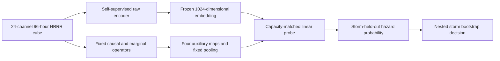

<!-- 书写报告使用中文 -->
---
idea: causal-scs-indicator
title: "自监督 raw-4D 骨干上的因果时序不稳定性公平增量审计"
version: 2
date: 2026-07-13
workspace: workspace/causal-scs-indicator/
---

## Problem Anchor（科学问题不漂移）

- Bottom-line problem: 跨气压层、多尺度滞后的因果时序不稳定性特征 `(D,J)`，能否为一个在原始 4D（pressure-level x longitude x latitude x time）场上端到端训练的强对流预警模型，提供该模型自身从原始历史中学不到的增量预警信息？
- Must-solve bottleneck: 此前九轮（v1-v9）比较的都不是“合格的原始张量端到端模型”；v10 虽做到 raw 张量直喂、容量匹配和 sham 对照，但位置保留架构是在看过失败结果后选定，且 `(D,J)` 独享真实边/滞后 oracle 信息。P2 还必须避免“小样本从零训练的弱 raw 模型”制造虚假增量。
- Non-goals: 不主张 PCMCI+/LKIF、新融合算子或 probe 新颖；不识别真实大气 DAG；不证明物理分岔；不设计新的时空骨干或额外时间聚合模块。
- Constraints: 保留 96 h 同历史、HRRR 3 km 场、2–6 h/36 km 强对流端点；所有选择限于 outer-training storms；先过合成与 Pre-P2 门，再授权多季节数据和算力。
- Success condition: 在功效充分的 `>=2` 季节 outer storm holdout 上，raw+`(D,J)` 对 raw-only 及特权匹配非因果臂的 `Delta AUPRC`、`Delta AUROC` 两个 co-primary estimand 的嵌套 storm-bootstrap 单侧 95% 下界均高于统一实用边界 `m=0.01`，Brier/ECE 退化均不超过 0.01，且逐季同号。v1 的“点估计 0.02 + CI 下界 0.01”双边界由单一 `m` 取代；`0.02` 只作为功效仿真的备择效应，不再参与结果分桶。

## 数据/计算资产交接状态（2026-07-13 复核）

- 9 个 SPC 报告（205 KB）及 3 个 HRRR 子集（34 MB）的字节数和 SHA-256 均与 `data/MANIFEST.md` 一致；无 `.part/.tmp`、相关进程或 Slurm 任务。
- 连续 96 h HRRR 尚未下载是刻意 stop gate，不是失败或中断；Gate 0 通过后才下载 Pre-P2 早期真实集。现有 `tigramite 5.2.10.1` 可直接跑 PCMCI+；LKIF 固定用 `numpy==1.26.4` 的独立环境，规避上游 `np.mat` 与 NumPy 2.x 不兼容。

## Technical Gap

`(D,J)` 是 raw history 的确定性函数，潜在收益只能是有限样本归纳偏置。v1 已补上架构冻结与特权匹配对照的方向，却仍留下四个会改变结论的自由度：真实输入究竟是 4 还是 28–32 通道、非因果统计量三选一、PCMCI+/LKIF 与 storm-relative 坐标无数值定义，以及小样本 raw 骨干仍从零训练。

**Route A（仅修协议）**不足：它会在 P2 把“raw 模型样本效率差”误写成“因果特征有增量”。**Route B（采用）**仍不发明骨干，而是在与任务完全同构的 96 h 数据上自监督预训练既有位置保留 3D CNN，再冻结编码器接线性 probe；协议修补同时保留。

不采纳 reviewer 原先的 checkpoint 直觉有明确证据链：HRRRCast（2507.05658）实际为 6 km、缺 500/250 hPa，且是单时刻到单时刻的模拟器，接入 96 h 必须新造时序聚合器；StormCast（2408.10958）是无可拆编码器的单体生成架构且无确认可用权重；后继 Stormscope（2601.17268）历史仅约 1 h、气压层更少。三者的模态错配大于其预训练收益。项目内 masked pretraining 直接匹配 `[24,96,64,64]`，不增加下游骨干；同领域强度后处理证据（2508.17903）又表明 CNN/UNet head 在更大样本下仍可能过拟合，因此 probe 固定为线性层。

## Method Thesis

- One-sentence thesis: 只有在任务同构自监督 raw encoder、唯一预注册的边际相关对照和 storm-cluster 校准推断共同成立时，才能把 `(D,J)` 的增量解释为有限样本归纳偏置而非弱 baseline、oracle 特权或 prevalence 的产物。
- Why smallest adequate: 复用现有 3D CNN、PCMCI+/LKIF 和通道拼接；新增的 decoder 只服务预训练并丢弃，主任务只有一个线性 probe。
- Foundation-model-era leverage: 自监督预训练只充当与 96 h HRRR 模态对齐的 representation prior，不充当生成器、因果 teacher 或第二项贡献。

## Contribution Focus

- Dominant contribution: 对因果时序不稳定性是否能增强一个样本效率受控的真实 raw-4D 强对流模型，给出功效与 cluster dependence 均可审计的正、零或负结论。
- Optional supporting contribution: 无；协议是可信度条件，不包装成通用方法贡献。
- Explicit non-contributions: 不声称增加 raw history 之外的信息，不声称预训练/线性 probe/边际相关对照本身新颖，也不把 regime 差异解释为已证实的因果鲁棒性定理。

## Proposed Method

### Complexity Budget 与固定接口

- Frozen / reused: v10 位置保留 3D CNN 拓扑、现有 4D synthetic generator、Tigramite PCMCI+、官方 LKIF、通道拼接与线性 readout。
- New but disposable: masked-pretraining decoder、storm-relative 重采样和 calibrated cluster inference；decoder 在下游前删除。
- Intentionally excluded: HRRRCast/StormCast/Stormscope、Transformer/DiT、新因果估计器、可学习融合权重、CNN probe 和结果驱动的 edge/lag 搜索。

| 接口 | v2 唯一定义 |
|---|---|
| Raw tensor | `[B,24,96,64,64]`；`C=6 variables x 4 levels=24`，变量为 `U,V,T,RH,omega,Z`，气压层为 `1000,850,500,250 hPa`；192 km 方窗、3 km 网格 |
| Auxiliary representation | raw 场先作无重叠 `8x8` 原格平均，得到 24 km 的 `8x8` 因果格；每个估计器固定 4 张图：`D_hour,J_hour,D_day,J_day`，再作固定 `2x2` average pooling 后展平为 64 维 |
| Raw embedding | 位置保留 3D CNN 输出 `64x4x2x2=1024` 维；不再扫描 pooling shape |
| Probe | `Linear(1024+64,1)`；raw-only 的 64 维为零，因此三臂参数数目完全相同 |
| Main arms | raw+zero、raw+特权匹配边际相关、raw+PCMCI+ `(D,J)`；Gaussian sham 仅留作 Gate 0 管线 sanity，不进 P2 主表 |
| Endpoint | issue time 后 2–6 h、中心 36 km 内任一 SPC tornado/wind/hail 报告 |

### System Overview

### Core Mechanism

1. **固定候选库。** 在任何连续真实数据到达前冻结 12 个有向跨层模板：`U1000->U850`、`V1000->V850`、`T1000->T850`、`RH1000->RH850`、`RH850->omega500`、`T850->omega500`、`omega500->RH850`、`Z500->U850`、`Z500->V850`、`U850->U250`、`V850->V250`、`omega500->omega250`。每条只允许同格和上游 24 km 两种 offset，以及 `{1,3,6,12,24}` h 五个 lag，共 120 个候选；不据结果增删。
2. **统一窗口。** 对 96 h 输入取结束于 `{78,84,90,96}` h 的四个 72 h 窗；每个节点先在窗内线性去趋势并 z-score。`tau_max=24` 后仍有 48 个有效时刻。36/48 h lag 被明确删除：在同一 96 h 历史内无法同时获得可靠条件检验样本和多个 D/J 窗口。
3. **唯一 causal 实现。** PCMCI+ 使用 Tigramite `ParCorr(significance='analytic')`、`tau_min=1`、`tau_max=24`、`pc_alpha=0.05`、`max_conds_dim=max_conds_py=max_conds_px=3`、`max_combinations=1`、`fdr_method='fdr_bh'`；`link_assumptions` 只开放上述 120 条。BH family 固定为每个 `(sample,window,causal-grid-cell)` 的 120 个候选，q<=0.05 的 `abs(ParCorr)` 进入表示，未通过者置零。
4. **唯一非因果实现。** 对完全相同的 edge/offset/lag/window 计算绝对 Fisher-z 边际 Pearson lag correlation，同样作 BH q<=0.05 并置零；不条件化、不搜索其他统计量。它是本轮预注册的唯一 privilege-matched control，局部方差和一阶差分永久退出主协议。
5. **`(D,J)`。** 每个 lag band、窗口和粗网格格点先取该 band 候选边绝对分数的中位数 `s_b(w,x,y)`；`D_b=sd_w(s_b)`，`J_b=max_w abs(s_b(w)-s_b(w-1))`。PCMCI+ 与边际相关走完全相同的聚合器。
6. **LKIF 锁定复核。** 官方 `multi_causality_est` 固定 `max_lag=24, significance_test=1`，每条边输入 source、target 及格点内 `{T850,RH850,omega500}`（去重后最多 3 个 conditioner），Fisher p<0.05 后作同一 BH 与 D/J 聚合。它只替换 PCMCI+ 重跑，不参与骨干或对照选择；若方向不一致，主结论降为 estimator-specific。

### Storm-relative 坐标构造

每个正负样本都以 issue-time HRRR 目标格点 `c_0` 为锚；SPC 只生成未来标签，不提供移动信息。由 predictor window 内 HRRR 风场递推

`v_t = median_{r<=36 km} ((U850,V850)+(U500,V500))/2`，`c_{t-1}=c_t-v_t*1 h`，

从 `c_0` 向后积分 96 次。每小时在 `c_t` 周围双线性重采样 192 km 方窗，并用 issue-time `v_0` 把 x 轴旋到顺移动方向；上游 offset 固定为 `-x` 方向一个 24 km 因果格。`|v_0|<2 m/s` 时保持 east-north 方向。轨迹出 HRRR 域或有效格点少于 90% 的样本按输入侧规则剔除。Pre-P2 另跑不跟踪的固定方窗敏感性，并用 outer-training 位移的 95% 分位掩码；两者差异过大则停止，不把平流当因果不稳定性。

### Modern Primitive Usage

现代 primitive 仅是项目内 self-supervised representation pretraining：它为 raw-only comparator 提供样本效率先验，不生成标签、不选择因果边，也不参与结果解释；主任务 inference 仍是一次 frozen-encoder forward 加线性 logit。

#### Self-supervised Raw Backbone 与 Probe

- 编码器固定为 v10 位置保留架构的加宽复用：`Conv3d(24,32,3)->ReLU->MaxPool3d(4,2,2)->Conv3d(32,64,3)->ReLU->AdaptiveAvgPool3d(4,2,2)`；不是新骨干，也没有 HRRRCast 所需的新时序模块。
- 预训练语料先用现有四层合成生成器的 6 个独立 realization 拼成 24 通道（20 epochs，标签不用），再用每个 outer fold 内全部未标注 HRRR 训练窗（最多 100 epochs）。随机遮蔽 50% 的 `4 h x 8 x 8` blocks；第二卷积层后接一次性 `1x1x1` decoder，仅在遮蔽位置最小化 Smooth-L1。AdamW `lr=1e-3, weight_decay=0.05`、cosine decay、mixed precision；checkpoint 只按 outer-training 内层 reconstruction loss 选。
- 丢弃 decoder 并冻结 encoder。线性 probe 用 unweighted BCE、AdamW `lr=1e-3, weight_decay=0.01`，最多 100 epochs；早停 epoch 只由 raw-only 内层 BCE 决定，再原样用于三臂。预训练 raw-only 必须在内层同时不差于同架构从零监督训练的 AUPRC 与 AUROC，否则 P2 降级为 exploratory；不得改投 HRRRCast/StormCast 或加 CNN head。1-hidden-layer MLP 仅作固定附录敏感性，不参与选择。

### Integration into Downstream Pipeline / Training Plan

1. **Gate 0，合成协议冻结。** 在独立种子上跑三臂；500 个 graph-null 数据集完整重算 edge、probe 和 interval。只有零效应 95% CI 覆盖率落在 `[0.925,0.975]`、one-sided false-positive rate `<=0.05`，且 privilege-matched 臂未制造系统性优势，才解锁早期真实数据。
2. **Pre-P2，一次性管线冻结。** 合并 v1 的 P1/P1.5：下载早期连续 HRRR，完成坐标、吞吐量、PCMCI+/LKIF、固定方窗敏感性和 raw-encoder adequacy gate；不产出 skill claim。
3. **P2，确认性 cohort。** SPC reports 若在 6 h 内且相距 `<=150 km` 则连边，连通分量按 24 h 最大跨度切分为 storm system；outer fold 同时持有整个 system 及其同日同区域负样本。报告 IID grouped 5-fold 与 leave-one-season-out 两种 holdout；所有标准化、SSL、early stopping 只看 outer-training storms。
4. **Positive-cluster-count 功效。** 先报告 storm 总数 `G`、含正例的 storm 数 `G1`。用 early-real pilot 的整 storm 预测向量，在 `G1 in {30,40,50,60,80,100}`、负 cluster 比 2:1 下做 2,000 次 Monte Carlo，并注入 co-primary `Delta=0.02`；首个使联合判据 power `>=0.80` 且两指标 CI half-width `<=0.01` 的 `G1` 才是样本门槛，`G>=50` 只是下限。达不到即标 exploratory。
5. **可信区间与杠杆。** 外层 2,000 次按正/负 storm 分层重采样；其中 500 个外层样本各再做 500 次内层重采样，以内层观察到的 coverage error 平移 percentile cutoff，冻结达到 95% 目标覆盖的校准分位数。对每个 storm 做 leave-one-storm-out，报告样本占比、正例占比及删一 storm 后两项 Delta。删一 cluster 改变任一指标符号，或其占比超过相应 equal-share 的 2 倍时标记 high leverage，不删除数据，只把 claim 降级。另做 UTC-day block 与 season-block bootstrap；明确 storm 是正确聚类单元仍是未经证明的假设。

### Failure Modes and Diagnostics

- **Prevalence 混淆：** McDermott et al.（2401.06091）证明 AUPRC 会系统偏向高 prevalence 子群。故 `Delta AUPRC` 与 `Delta AUROC` 在每个 holdout 内均为 co-primary；跨 IID/regime holdout 时报告实际 prevalence 及其比值，绝不凭 AUPRC 排序，跨 holdout 解释必须由 prevalence-invariant 的 AUROC 同向支持。
- **互斥判据：** `POSITIVE` 要求 causal-vs-raw 后 causal-vs-marginal 的固定顺序联合下界都 `>m`；`NEGATIVE` 要求功效充分且 causal-vs-raw 两个联合上界都 `<=m`；两者上界都 `<0` 另记 `HARM`；其余一律 `NULL`，包括只过一个 metric、只胜 raw、跨季节异号或功效不足。固定顺序 gatekeeping 取代真实主分析中的 BH p-value 菜单。
- **校准/优化：** POSITIVE 还要求 Brier/ECE 各不劣于 raw 超过 0.01；任何 seed 卡在 `log(2)` 均保留并双报告，不事后删除。
- **未解决限制：** 24 h 最大 lag 与仅四个估计窗口是 96 h 同历史下的可估计性取舍；storm clustering 与 steering-wind 轨迹是操作性代理；below-ground pressure cells 用 outer-training channel median 填补且不进入 edge score；模型参数量匹配不等于 PCMCI+ 的额外 CPU 成本匹配，故另报 feature-compute wall time。这些限制禁止物理 DAG、计算效率或普适可学习性主张。

### Novelty and Elegance Argument

SHIPS+（2510.02050）已做“因果发现特征增补业务 predictors”，Flora et al.（2603.20250）已做时间聚合后的 63-channel WoFS 网格预警；两者都不是“独立时序因果估计器生成不稳定性图，再注入同历史自监督 raw-4D encoder”的两阶段设计。deep-lit 又对最接近的 TabPFN-CFM（2606.26467）34 个 tex 文件及其 24 条引文逐项核验：它是 i.i.d. 表格数据上的单模型结构/效应联合学习，既无天气时空骨干，也无独立因果特征到预训练模型的融合。因此在已核验的 212 篇累计文献与该候选引文网络内，尚未发现本设计的直接先例。这个更强的排除证据支持“具体设计空白”，但不把检索未发现夸成绝对首创；论文价值仍取决于真实 storm 结果，而非部件命名。

## Claim-Driven Validation Sketch

### Claim 1（主锚点）

- Minimal experiment: 功效达标的多季节 P2 三臂 nested storm holdout。
- Baselines / ablations: frozen SSL raw+zero、raw+唯一边际相关对照、raw+PCMCI+ `(D,J)`；LKIF 替换复核。
- Metric: paired `Delta AUPRC` 与 `Delta AUROC` co-primary，nested storm-bootstrap joint bounds；Brier/ECE secondary。AUPRC 在同一 holdout 内比较模型有效，但因 prevalence 依赖不得单独支撑跨 holdout 结论。
- Expected evidence: 按上述穷尽判据报告 POSITIVE/NULL/NEGATIVE/HARM；不预言 regime Delta 必然大于 IID Delta。

### Claim 2（强 raw comparator 与协议必要性）

- Minimal experiment: Gate 0 null calibration；Pre-P2 比较同架构 SSL vs. from-scratch raw-only，并执行 earth-relative vs. storm-relative 与 causal vs. privilege-matched control。
- Metric: graph-null coverage/type-I、raw-only 两项 co-primary skill、坐标敏感性、causal-minus-control joint interval。
- Expected evidence: SSL 不弱于 from-scratch、null 校准通过且 causal 仍胜唯一对照，才说明 Claim 1 不是弱 raw baseline 或 oracle 特权的产物；任一失败即停止确认性花费或降为 exploratory。

## Paper Outline

- S1 Introduction：确定性衍生表示的有限样本增量问题与单一 empirical claim。
- S2 Related Work：分别写因果鲁棒性成立的条件、严格基线下的经验失败、天气预训练与因果特征融合空白。
- S3 Data/Cohort：storm system、自然 prevalence、坐标、outer/inner 边界。
- S4 Method：先定义 estimand/互斥判据，再给三臂、SSL encoder 和 `(D,J)`。
- S5 Experiments：Claim 1 主表；Claim 2 adequacy/null 诊断；限制。
- Key figures: Fig.1 真实三臂两项 co-primary forest plot（hero）；Fig.2 cohort/fold/坐标数据流；Fig.3 positive-`G1` power 与 LOSO leverage；Gate 0 降附录。

## Compute and Timeline Estimate

- Estimated compute: Gate 0 `5–10` L4 GPU-h；Pre-P2 `5–10` GPU-h；每个 outer fold SSL 加 probe 合计约 `40–80` L4 GPU-h，PCMCI+/LKIF 约 `1,500–4,000` CPU-h。若功效要求更多 season，预算随 fold 数线性增长，不能继续沿用 v1 的 `20–50` GPU-h 乐观估计。
- Data: 单个 float16 raw cube 约 18.9 MB；最终体量由 `G1` 功效门决定，预计 HRRR byte-range 子集为 `0.1–0.3 TB`。SPC 无新增标注费。
- Timeline: Gate 0 约 1 周；Pre-P2 2–3 周；功效核算、数据拉取与 P2 约 6–10 周。若 Gate 0、encoder adequacy 或 `G1` 任一不通过，停止 confirmatory 路线并只报告失败边界。
