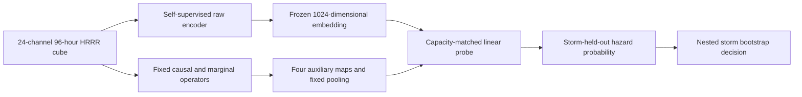

<!-- 书写报告使用中文 -->
---
idea: causal-scs-indicator
title: "自监督 raw-4D 骨干上的因果时序不稳定性公平增量审计"
version: 2
date: 2026-07-13
workspace: workspace/causal-scs-indicator/
---

## Problem Anchor（科学问题不漂移）

- Bottom-line problem: 跨气压层、多尺度滞后的因果时序不稳定性特征 `(D,J)`，能否为一个在原始 4D（pressure-level x longitude x latitude x time）场上端到端训练的强对流预警模型，提供该模型自身从原始历史中学不到的增量预警信息？
- Must-solve bottleneck: 此前九轮（v1-v9）比较的都不是“合格的原始张量端到端模型”；v10 虽做到 raw 张量直喂、容量匹配和 sham 对照，但位置保留架构是在看过失败结果后选定，且 `(D,J)` 独享真实边/滞后 oracle 信息。P2 还必须避免“小样本从零训练的弱 raw 模型”制造虚假增量。
- Non-goals: 不主张 PCMCI+/LKIF、新融合算子或 probe 新颖；不识别真实大气 DAG；不证明物理分岔；不设计新的时空骨干或额外时间聚合模块。
- Constraints: 保留 96 h 同历史、HRRR 3 km 场、2–6 h/36 km 强对流端点；所有选择限于 outer-training storms；先过合成与 Pre-P2 门，再授权多季节数据和算力。
- Success condition: 在功效充分的 `>=2` 季节 outer storm holdout 上，raw+`(D,J)` 对 raw-only 及特权匹配非因果臂的 `Delta AUPRC`、`Delta AUROC` 两个 co-primary estimand 的嵌套 storm-bootstrap 单侧 95% 下界均高于统一实用边界 `m=0.01`，Brier/ECE 退化均不超过 0.01，且逐季同号。v1 的“点估计 0.02 + CI 下界 0.01”双边界由单一 `m` 取代；`0.02` 只作为功效仿真的备择效应，不再参与结果分桶。

## 数据/计算资产交接状态（2026-07-13 复核）

- 9 个 SPC 报告（205 KB）及 3 个 HRRR 子集（34 MB）的字节数和 SHA-256 均与 `data/MANIFEST.md` 一致；无 `.part/.tmp`、相关进程或 Slurm 任务。
- 连续 96 h HRRR 尚未下载是刻意 stop gate，不是失败或中断；Gate 0 通过后才下载 Pre-P2 早期真实集。现有 `tigramite 5.2.10.1` 可直接跑 PCMCI+；LKIF 固定用 `numpy==1.26.4` 的独立环境，规避上游 `np.mat` 与 NumPy 2.x 不兼容。

## Technical Gap

`(D,J)` 是 raw history 的确定性函数，潜在收益只能是有限样本归纳偏置。v1 已补上架构冻结与特权匹配对照的方向，却仍留下四个会改变结论的自由度：真实输入究竟是 4 还是 28–32 通道、非因果统计量三选一、PCMCI+/LKIF 与 storm-relative 坐标无数值定义，以及小样本 raw 骨干仍从零训练。

**Route A（仅修协议）**不足：它会在 P2 把“raw 模型样本效率差”误写成“因果特征有增量”。**Route B（采用）**仍不发明骨干，而是在与任务完全同构的 96 h 数据上自监督预训练既有位置保留 3D CNN，再冻结编码器接线性 probe；协议修补同时保留。

不采纳 reviewer 原先的 checkpoint 直觉有明确证据链：HRRRCast（2507.05658）实际为 6 km、缺 500/250 hPa，且是单时刻到单时刻的模拟器，接入 96 h 必须新造时序聚合器；StormCast（2408.10958）是无可拆编码器的单体生成架构且无确认可用权重；后继 Stormscope（2601.17268）历史仅约 1 h、气压层更少。三者的模态错配大于其预训练收益。项目内 masked pretraining 直接匹配 `[24,96,64,64]`，不增加下游骨干；同领域强度后处理证据（2508.17903）又表明 CNN/UNet head 在更大样本下仍可能过拟合，因此 probe 固定为线性层。

## Method Thesis

- One-sentence thesis: 只有在任务同构自监督 raw encoder、唯一预注册的边际相关对照和 storm-cluster 校准推断共同成立时，才能把 `(D,J)` 的增量解释为有限样本归纳偏置而非弱 baseline、oracle 特权或 prevalence 的产物。
- Why smallest adequate: 复用现有 3D CNN、PCMCI+/LKIF 和通道拼接；新增的 decoder 只服务预训练并丢弃，主任务只有一个线性 probe。
- Foundation-model-era leverage: 自监督预训练只充当与 96 h HRRR 模态对齐的 representation prior，不充当生成器、因果 teacher 或第二项贡献。

## Contribution Focus

- Dominant contribution: 对因果时序不稳定性是否能增强一个样本效率受控的真实 raw-4D 强对流模型，给出功效与 cluster dependence 均可审计的正、零或负结论。
- Optional supporting contribution: 无；协议是可信度条件，不包装成通用方法贡献。
- Explicit non-contributions: 不声称增加 raw history 之外的信息，不声称预训练/线性 probe/边际相关对照本身新颖，也不把 regime 差异解释为已证实的因果鲁棒性定理。

## Proposed Method

### Complexity Budget 与固定接口

- Frozen / reused: v10 位置保留 3D CNN 拓扑、现有 4D synthetic generator、Tigramite PCMCI+、官方 LKIF、通道拼接与线性 readout。
- New but disposable: masked-pretraining decoder、storm-relative 重采样和 calibrated cluster inference；decoder 在下游前删除。
- Intentionally excluded: HRRRCast/StormCast/Stormscope、Transformer/DiT、新因果估计器、可学习融合权重、CNN probe 和结果驱动的 edge/lag 搜索。

| 接口 | v2 唯一定义 |
|---|---|
| Raw tensor | `[B,24,96,64,64]`；`C=6 variables x 4 levels=24`，变量为 `U,V,T,RH,omega,Z`，气压层为 `1000,850,500,250 hPa`；192 km 方窗、3 km 网格 |
| Auxiliary representation | raw 场先作无重叠 `8x8` 原格平均，得到 24 km 的 `8x8` 因果格；每个估计器固定 4 张图：`D_hour,J_hour,D_day,J_day`，再作固定 `2x2` average pooling 后展平为 64 维 |
| Raw embedding | 位置保留 3D CNN 输出 `64x4x2x2=1024` 维；不再扫描 pooling shape |
| Probe | `Linear(1024+64,1)`；raw-only 的 64 维为零，因此三臂参数数目完全相同 |
| Main arms | raw+zero、raw+特权匹配边际相关、raw+PCMCI+ `(D,J)`；Gaussian sham 仅留作 Gate 0 管线 sanity，不进 P2 主表 |
| Endpoint | issue time 后 2–6 h、中心 36 km 内任一 SPC tornado/wind/hail 报告 |

### System Overview

### Core Mechanism

1. **固定候选库。** 在任何连续真实数据到达前冻结 12 个有向跨层模板：`U1000->U850`、`V1000->V850`、`T1000->T850`、`RH1000->RH850`、`RH850->omega500`、`T850->omega500`、`omega500->RH850`、`Z500->U850`、`Z500->V850`、`U850->U250`、`V850->V250`、`omega500->omega250`。每条只允许同格和上游 24 km 两种 offset，以及 `{1,3,6,12,24}` h 五个 lag，共 120 个候选；不据结果增删。
2. **统一窗口。** 对 96 h 输入取结束于 `{78,84,90,96}` h 的四个 72 h 窗；每个节点先在窗内线性去趋势并 z-score。`tau_max=24` 后仍有 48 个有效时刻。36/48 h lag 被明确删除：在同一 96 h 历史内无法同时获得可靠条件检验样本和多个 D/J 窗口。
3. **唯一 causal 实现。** PCMCI+ 使用 Tigramite `ParCorr(significance='analytic')`、`tau_min=1`、`tau_max=24`、`pc_alpha=0.05`、`max_conds_dim=max_conds_py=max_conds_px=3`、`max_combinations=1`、`fdr_method='fdr_bh'`；`link_assumptions` 只开放上述 120 条。BH family 固定为每个 `(sample,window,causal-grid-cell)` 的 120 个候选，q<=0.05 的 `abs(ParCorr)` 进入表示，未通过者置零。
4. **唯一非因果实现。** 对完全相同的 edge/offset/lag/window 计算绝对 Fisher-z 边际 Pearson lag correlation，同样作 BH q<=0.05 并置零；不条件化、不搜索其他统计量。它是本轮预注册的唯一 privilege-matched control，局部方差和一阶差分永久退出主协议。
5. **`(D,J)`。** 每个 lag band、窗口和粗网格格点先取该 band 候选边绝对分数的中位数 `s_b(w,x,y)`；`D_b=sd_w(s_b)`，`J_b=max_w abs(s_b(w)-s_b(w-1))`。PCMCI+ 与边际相关走完全相同的聚合器。
6. **LKIF 锁定复核。** 官方 `multi_causality_est` 固定 `max_lag=24, significance_test=1`，每条边输入 source、target 及格点内 `{T850,RH850,omega500}`（去重后最多 3 个 conditioner），Fisher p<0.05 后作同一 BH 与 D/J 聚合。它只替换 PCMCI+ 重跑，不参与骨干或对照选择；若方向不一致，主结论降为 estimator-specific。

### Storm-relative 坐标构造

每个正负样本都以 issue-time HRRR 目标格点 `c_0` 为锚；SPC 只生成未来标签，不提供移动信息。由 predictor window 内 HRRR 风场递推

`v_t = median_{r<=36 km} ((U850,V850)+(U500,V500))/2`，`c_{t-1}=c_t-v_t*1 h`，

从 `c_0` 向后积分 96 次。每小时在 `c_t` 周围双线性重采样 192 km 方窗，并用 issue-time `v_0` 把 x 轴旋到顺移动方向；上游 offset 固定为 `-x` 方向一个 24 km 因果格。`|v_0|<2 m/s` 时保持 east-north 方向。轨迹出 HRRR 域或有效格点少于 90% 的样本按输入侧规则剔除。Pre-P2 另跑不跟踪的固定方窗敏感性，并用 outer-training 位移的 95% 分位掩码；两者差异过大则停止，不把平流当因果不稳定性。

### Modern Primitive Usage

现代 primitive 仅是项目内 self-supervised representation pretraining：它为 raw-only comparator 提供样本效率先验，不生成标签、不选择因果边，也不参与结果解释；主任务 inference 仍是一次 frozen-encoder forward 加线性 logit。

#### Self-supervised Raw Backbone 与 Probe

- 编码器固定为 v10 位置保留架构的加宽复用：`Conv3d(24,32,3)->ReLU->MaxPool3d(4,2,2)->Conv3d(32,64,3)->ReLU->AdaptiveAvgPool3d(4,2,2)`；不是新骨干，也没有 HRRRCast 所需的新时序模块。
- 预训练语料先用现有四层合成生成器的 6 个独立 realization 拼成 24 通道（20 epochs，标签不用），再用每个 outer fold 内全部未标注 HRRR 训练窗（最多 100 epochs）。随机遮蔽 50% 的 `4 h x 8 x 8` blocks；第二卷积层后接一次性 `1x1x1` decoder，仅在遮蔽位置最小化 Smooth-L1。AdamW `lr=1e-3, weight_decay=0.05`、cosine decay、mixed precision；checkpoint 只按 outer-training 内层 reconstruction loss 选。
- 丢弃 decoder 并冻结 encoder。线性 probe 用 unweighted BCE、AdamW `lr=1e-3, weight_decay=0.01`，最多 100 epochs；早停 epoch 只由 raw-only 内层 BCE 决定，再原样用于三臂。预训练 raw-only 必须在内层同时不差于同架构从零监督训练的 AUPRC 与 AUROC，否则 P2 降级为 exploratory；不得改投 HRRRCast/StormCast 或加 CNN head。1-hidden-layer MLP 仅作固定附录敏感性，不参与选择。

### Integration into Downstream Pipeline / Training Plan

1. **Gate 0，合成协议冻结。** 在独立种子上跑三臂；500 个 graph-null 数据集完整重算 edge、probe 和 interval。只有零效应 95% CI 覆盖率落在 `[0.925,0.975]`、one-sided false-positive rate `<=0.05`，且 privilege-matched 臂未制造系统性优势，才解锁早期真实数据。
2. **Pre-P2，一次性管线冻结。** 合并 v1 的 P1/P1.5：下载早期连续 HRRR，完成坐标、吞吐量、PCMCI+/LKIF、固定方窗敏感性和 raw-encoder adequacy gate；不产出 skill claim。
3. **P2，确认性 cohort。** SPC reports 若在 6 h 内且相距 `<=150 km` 则连边，连通分量按 24 h 最大跨度切分为 storm system；outer fold 同时持有整个 system 及其同日同区域负样本。报告 IID grouped 5-fold 与 leave-one-season-out 两种 holdout；所有标准化、SSL、early stopping 只看 outer-training storms。
4. **Positive-cluster-count 功效。** 先报告 storm 总数 `G`、含正例的 storm 数 `G1`。用 early-real pilot 的整 storm 预测向量，在 `G1 in {30,40,50,60,80,100}`、负 cluster 比 2:1 下做 2,000 次 Monte Carlo，并注入 co-primary `Delta=0.02`；首个使联合判据 power `>=0.80` 且两指标 CI half-width `<=0.01` 的 `G1` 才是样本门槛，`G>=50` 只是下限。达不到即标 exploratory。
5. **可信区间与杠杆。** 外层 2,000 次按正/负 storm 分层重采样；其中 500 个外层样本各再做 500 次内层重采样，以内层观察到的 coverage error 平移 percentile cutoff，冻结达到 95% 目标覆盖的校准分位数。对每个 storm 做 leave-one-storm-out，报告样本占比、正例占比及删一 storm 后两项 Delta。删一 cluster 改变任一指标符号，或其占比超过相应 equal-share 的 2 倍时标记 high leverage，不删除数据，只把 claim 降级。另做 UTC-day block 与 season-block bootstrap；明确 storm 是正确聚类单元仍是未经证明的假设。

### Failure Modes and Diagnostics

- **Prevalence 混淆：** McDermott et al.（2401.06091）证明 AUPRC 会系统偏向高 prevalence 子群。故 `Delta AUPRC` 与 `Delta AUROC` 在每个 holdout 内均为 co-primary；跨 IID/regime holdout 时报告实际 prevalence 及其比值，绝不凭 AUPRC 排序，跨 holdout 解释必须由 prevalence-invariant 的 AUROC 同向支持。
- **互斥判据：** `POSITIVE` 要求 causal-vs-raw 后 causal-vs-marginal 的固定顺序联合下界都 `>m`；`NEGATIVE` 要求功效充分且 causal-vs-raw 两个联合上界都 `<=m`；两者上界都 `<0` 另记 `HARM`；其余一律 `NULL`，包括只过一个 metric、只胜 raw、跨季节异号或功效不足。固定顺序 gatekeeping 取代真实主分析中的 BH p-value 菜单。
- **校准/优化：** POSITIVE 还要求 Brier/ECE 各不劣于 raw 超过 0.01；任何 seed 卡在 `log(2)` 均保留并双报告，不事后删除。
- **未解决限制：** 24 h 最大 lag 与仅四个估计窗口是 96 h 同历史下的可估计性取舍；storm clustering 与 steering-wind 轨迹是操作性代理；below-ground pressure cells 用 outer-training channel median 填补且不进入 edge score；模型参数量匹配不等于 PCMCI+ 的额外 CPU 成本匹配，故另报 feature-compute wall time。这些限制禁止物理 DAG、计算效率或普适可学习性主张。

### Novelty and Elegance Argument

SHIPS+（2510.02050）已做“因果发现特征增补业务 predictors”，Flora et al.（2603.20250）已做时间聚合后的 63-channel WoFS 网格预警；两者都不是“独立时序因果估计器生成不稳定性图，再注入同历史自监督 raw-4D encoder”的两阶段设计。deep-lit 又对最接近的 TabPFN-CFM（2606.26467）34 个 tex 文件及其 24 条引文逐项核验：它是 i.i.d. 表格数据上的单模型结构/效应联合学习，既无天气时空骨干，也无独立因果特征到预训练模型的融合。因此在已核验的 212 篇累计文献与该候选引文网络内，尚未发现本设计的直接先例。这个更强的排除证据支持“具体设计空白”，但不把检索未发现夸成绝对首创；论文价值仍取决于真实 storm 结果，而非部件命名。

## Claim-Driven Validation Sketch

### Claim 1（主锚点）

- Minimal experiment: 功效达标的多季节 P2 三臂 nested storm holdout。
- Baselines / ablations: frozen SSL raw+zero、raw+唯一边际相关对照、raw+PCMCI+ `(D,J)`；LKIF 替换复核。
- Metric: paired `Delta AUPRC` 与 `Delta AUROC` co-primary，nested storm-bootstrap joint bounds；Brier/ECE secondary。AUPRC 在同一 holdout 内比较模型有效，但因 prevalence 依赖不得单独支撑跨 holdout 结论。
- Expected evidence: 按上述穷尽判据报告 POSITIVE/NULL/NEGATIVE/HARM；不预言 regime Delta 必然大于 IID Delta。

### Claim 2（强 raw comparator 与协议必要性）

- Minimal experiment: Gate 0 null calibration；Pre-P2 比较同架构 SSL vs. from-scratch raw-only，并执行 earth-relative vs. storm-relative 与 causal vs. privilege-matched control。
- Metric: graph-null coverage/type-I、raw-only 两项 co-primary skill、坐标敏感性、causal-minus-control joint interval。
- Expected evidence: SSL 不弱于 from-scratch、null 校准通过且 causal 仍胜唯一对照，才说明 Claim 1 不是弱 raw baseline 或 oracle 特权的产物；任一失败即停止确认性花费或降为 exploratory。

## Paper Outline

- S1 Introduction：确定性衍生表示的有限样本增量问题与单一 empirical claim。
- S2 Related Work：分别写因果鲁棒性成立的条件、严格基线下的经验失败、天气预训练与因果特征融合空白。
- S3 Data/Cohort：storm system、自然 prevalence、坐标、outer/inner 边界。
- S4 Method：先定义 estimand/互斥判据，再给三臂、SSL encoder 和 `(D,J)`。
- S5 Experiments：Claim 1 主表；Claim 2 adequacy/null 诊断；限制。
- Key figures: Fig.1 真实三臂两项 co-primary forest plot（hero）；Fig.2 cohort/fold/坐标数据流；Fig.3 positive-`G1` power 与 LOSO leverage；Gate 0 降附录。

## Compute and Timeline Estimate

- Estimated compute: Gate 0 `5–10` L4 GPU-h；Pre-P2 `5–10` GPU-h；每个 outer fold SSL 加 probe 合计约 `40–80` L4 GPU-h，PCMCI+/LKIF 约 `1,500–4,000` CPU-h。若功效要求更多 season，预算随 fold 数线性增长，不能继续沿用 v1 的 `20–50` GPU-h 乐观估计。
- Data: 单个 float16 raw cube 约 18.9 MB；最终体量由 `G1` 功效门决定，预计 HRRR byte-range 子集为 `0.1–0.3 TB`。SPC 无新增标注费。
- Timeline: Gate 0 约 1 周；Pre-P2 2–3 周；功效核算、数据拉取与 P2 约 6–10 周。若 Gate 0、encoder adequacy 或 `G1` 任一不通过，停止 confirmatory 路线并只报告失败边界。

<review date="2026-07-13">

## Scores

评审口径：`topics/0710-causal-scs.md` 未声明 `Target venues`/`Review standards`，沿用 idea/v1 review 既定口径：顶级 Earth-system methods / AI4Science / 强对流预测应用论文标准。本轮先由 Claude 对 v2 全文逐句复核并独立核实 5 篇 v2 引用/依赖的关键 deep-lit 文献 (2507.05658/2408.10958/2601.17268/2401.06091/2606.26467) 原文，确认这些引用转述均准确、无夸大；随后按 dispatch_manual.md 请 codex 独立评审（zero-context，未告知 Claude 的发现）。codex 独到地指出一处 Claude 初评遗漏的 CRITICAL 级问题（frozen-SSL-probe 与 idea 锚定的"端到端训练模型"之间的操作性漂移），Claude 逐句核对提案原文后确认该问题真实存在，据此下修多项初评分数。

| Dimension | Score | Notes |
|-----------|-------|-------|
| Problem Fidelity | 6/10（Claude 初评 9, codex 5, 收敛至 6） | codex 独立发现且经 Claude 核实为真的 CRITICAL 漂移：idea Problem Anchor 与 v2 正文均逐字保留"能否为一个在原始 4D 场上**端到端训练**的强对流预警模型提供增量"这一措辞，但 P2 confirmatory 阶段的 raw 分支实际是"masked self-supervised 预训练 → 冻结 encoder → 只训练线性 probe"（Modern Primitive Usage 一节："丢弃 decoder 并冻结 encoder。线性 probe 用 unweighted BCE..."）。Claude 逐句检索全文确认：除 Problem Anchor 转引 idea 原句外，正文任何位置都不存在"微调/fine-tune/端到端"字样，raw encoder 从未在 BCE 分类目标上获得梯度，只有 1024+64 维输入之上的单层线性 probe 见过任务标签。"预训练 raw-only 必须不差于同架构从零监督训练"这一 adequacy gate 只是比较两个都可能同样弱的表示，不能替代"raw 分支本身是否被真正训练到位"这一更根本的问题。这意味着 P2 实际检验的科学问题是"`(D,J)` 能否为一个冻结自监督表示上的线性读出提供增量"，比 idea 锚定的"能否为一个训练充分的端到端 raw CNN 提供增量"更容易，任何 POSITIVE 结果都无法直接回答原问题。判定为 CRITICAL 而非 RETHINK：修复路径明确且局部（SSL 初始化后接 outer-training storms 上的监督微调，或按 codex 建议改为 residual-fusion：`logit = logit_raw(微调后) + beta^T a`），不需要推翻三臂比较框架本身。 |
| Method Specificity | 6/10（Claude 初评 8, codex 5, 收敛至 6） | v1 三个 CRITICAL 中与本维度相关的两个（通道数不一致、非因果对照未预注册）已被彻底解决，PCMCI+/LKIF 数值超参与 storm-relative 坐标公式也已具体化，这部分改进真实。但 codex 指出且经 Claude 独立复核证实的新缺口足以把分数打回原位：(1) BH-then-median 聚合存在结构性退化——Core Mechanism 步骤 3-5 先对 120 个候选边做 BH q<=0.05 置零，再在每个 lag band 内取候选边绝对分数的**中位数**得到 `s_b(w,x,y)`；只要该 band 内超过一半候选未通过 BH 检验（对稀疏/局地信号完全可能），中位数恒为 0，导致 `D_b=sd_w(s_b)` 与 `J_b=max_w|Δs_b|` 大片坍缩为零，这不是边缘情形而是聚合公式本身的数学性质。(2) SSL decoder 与 masking 目标的空间对齐未定义——"随机遮蔽 50% 的 `4h x 8x8` blocks；第二卷积层后接一次性 `1x1x1` decoder，仅在遮蔽位置最小化 Smooth-L1"，但 Conv3d/MaxPool3d 的 stride/padding 全文未给出，Claude 按最常见默认假设（无 padding、stride=kernel）重新推算第二个 Conv3d 层输出形状约为 `[64,21,29,29]`，既不能整除也不能对齐到 `4h x 8x8` 的原始 mask 网格（`96/4=24, 64/8=8`），reconstruction loss 在遮蔽位置如何与该输出对齐没有可执行定义。(3) 全文只在接口表出现一次"`D_hour,J_hour,D_day,J_day`"命名，`{1,3,6,12,24}h` 五个候选 lag 中哪些属于 hour band、哪些属于 day band，Claude 用 grep 全文核实**从未被显式定义**——这是延续 v10 review 就已存在但被 v1/v2 两轮修补漏掉的一个具体缺口。(1)(2) 直接影响主特征与预训练目标能否按文本字面实现，判定 CRITICAL。 |
| Contribution Quality | 6/10（Claude 初评 7, codex 6, 收敛至 6） | v1 flagged 的"协议模板可迁移性"次要贡献已被删除，Contribution Focus 现在只保留单一贡献陈述，这是真实的 parsimony 改进。但 codex 与 Claude 收敛一致：当前"主贡献"表述为"给出功效与 cluster dependence 均可审计的结论"，这是实验可信度要求而非机制贡献；真正的候选机制（`(D,J)` 这一 edge-first 时序不稳定性算子）被 SSL 预训练、storm-relative 追踪、双估计器、匹配对照、双层 bootstrap 等协议组件包围，读者仍会看到一组组件堆叠而非一个清晰机制。idea 自身声明的 contribution type（empirical-finding+diagnostic+application，非 method）决定了"real novelty"子标准存在结构性天花板，这不是可单靠再改一版文本修补的缺陷。 |
| Frontier Leverage | 7/10（Claude 初评 8, codex 6, 收敛至 7） | 对 v1 CRITICAL（P2 骨干应考虑预训练模型）的核心判断——不直接采用 HRRRCast/StormCast/Stormscope——经 Claude 独立读取三篇原文全文核实完全站得住脚：HRRRCast 实为 6km 网格（非 3km，"coarser 6 km grid spacing"）、HRRR 变量气压层为 `200,300,475,800,825,850,875,900,925,950,975,1000hPa`（无 500/250hPa）、且是给定 t 时刻单状态预测 t+{1,3,6}h 的扩散仿真器（无原生 96h 历史输入）；StormCast 的 synoptic conditioning 仅 4 气压层且嵌在单体 DDPM++ UNet 内无可拆编码器，全文无权重开源声明；Stormscope 更差（仅 Z500 单通道、历史仅 6 帧/1h）。这一"不硬凑前沿组件"的判断有真实证据支撑，而非回避现代化。但 codex 指出且 Claude 认可的问题是：v2 选择的 SSL 目标是纯 masked **reconstruction**（空间/局部插值即可能解出该任务），并未强迫 encoder 学习 96h 尺度上与危险演化相关的时序动力学，也未做 Prithvi WxC（2409.13598）式的 masked+forecasting 混合目标或 Aurora（2405.13063）式的下游任务全模型适配；结合 Problem Fidelity 处的"冻结+线性 probe"问题，当前预训练目标与下游读出方式都偏保守。经 Claude 独立 arxiv 检索（关键词：convection-allowing model foundation model pretraining severe weather 2026）未发现比这三者更贴合 3km/96h/24-channel 场景的现成替代模型，"不采用外部权重"这一判断仍然正确；需要现代化的是预训练目标本身（reconstruction → masked temporal prediction）与下游适配方式（frozen probe → fine-tune），而非引入新模型。 |
| Validation Focus | 6/10（Claude 初评 8, codex 6, 收敛至 6） | v1 CRITICAL（功效分析缺失）与三处 IMPORTANT（Gate 0 未校准特权匹配对照本身、BH 与 CI 阈值判据先后顺序未定义、跨 holdout prevalence 不可比）确实都有具体回应：新增 positive-cluster-count 功效仿真、Gate 0 显式校准"privilege-matched 臂未制造系统性优势"、明确 BH 只做候选边预处理与最终 CI 阈值判据分离、AUROC 提升为 co-primary 并放弃"regime Delta 必大于 IID Delta"这一原本缺乏前提验证的预测——这些改进真实。但 codex 指出两处 Claude 未捕捉到的新缺口，经复核成立：(1) storm system 按"6h 内且 150km 内连边"的聚类规则只保证同一系统内的报告不跨 fold，不保证**不同**（不相连的）storm system 之间的 96h 前置 HRRR 历史窗口不重叠——两个时空相近但被判为不同系统的风暴，其前置大尺度天气背景场可能高度重合，若二者恰好落入不同 fold，会在训练/测试之间产生预测量泄漏，这是双层 storm bootstrap 和 day/season block 稳健性检查都不解决的问题（它们校正的是推断方差，不是训练/评估切分本身的独立性）。(2) 同时报告 IID grouped 5-fold 与 leave-one-season-out 两种 holdout，但全文未明确指定哪一个是触发 POSITIVE/NULL/NEGATIVE 正式判据的唯一确认性分析——Success condition 里的"逐季同号"暗示季节切分更核心，但从未显式声明"以 leave-one-season-out 为唯一确认性分析、grouped 5-fold 降级为描述性附录"，存在"挑对自己有利的 holdout 报判据"的操作空间。 |
| Paper Story and Claims Calibration | 6/10（Claude 初评 8, codex 6, 收敛至 6） | v1 flagged 的两处具体缺口（判据分桶不穷尽、anchor-regression/CausalKinetiX 预测过度引申）确实被解决：穷尽性通过"其余一律 NULL"兜底类别实现；Related Work 大纲现在"分别写"三条独立文献线；Method 大纲顺序改为"先定义 estimand/互斥判据，再给三臂定义"；新增独立 S3 Data/Cohort 小节；Key figures 把 Gate 0 降为附录、hero figure 收窄为真实三臂森林图。这些是真实的结构改进。但 codex 指出且与 Problem Fidelity 发现直接相关的问题成立：现有 hero figure（Fig.1）是结果森林图，全篇大纲中没有一张图解释 `(D,J)` 本身如何从候选边构造、四窗口如何聚合、marginal control 与 causal 估计的对照关系——对一篇仍以 `(D,J)` 这一 edge-first 算子为核心卖点的论文，缺一张机制图是叙事上的缺口；同时，在 raw 分支实际是"冻结 SSL+线性 probe"的当前设计下，若不在 Method/Results-to-Claims 部分显式收窄，"POSITIVE"的既有措辞（"为已训练好的 raw-grid 模型提供增量"）会系统性超出实际证据范围，这一收窄尚未写入大纲或判据文本。 |
| Overall | 5.9/10 | Claude 收敛后 (6+6+6+7+6+6)/6≈6.17；codex 独立给出 5.7（(5+5+6+6+6+6)/6≈5.67）。两者按规则取平均 = (6.17+5.67)/2≈5.92 → 5.9。**分歧标注**：收敛前 Claude 初评 overall 为 8.0，与 codex 5.7 相差 2.3（≥2 强制标注阈值）。核心分歧来源于 codex 独立发现、Claude 初评完全遗漏的 Problem Fidelity CRITICAL 漂移（frozen-SSL-probe 未端到端训练 raw 分支）以及 Method Specificity 的两处可验证退化（BH-median 聚合坍缩、SSL decoder/masking 形状不对齐）——Claude 对三者均独立复核（grep 原文确认无微调步骤、手算聚合公式退化条件、按默认 conv 参数重算 decoder 输出形状）后认定 codex 的具体指证站得住脚，故未做机械平均，而是先下修各维度初评再取平均。 |

## Verdict

REVISE（Claude 收敛后判定与 codex 判定一致，均为 REVISE；核心机制——三臂同历史容量匹配比较 + 唯一预注册非因果对照 + storm-cluster 校准推断——框架本身仍成立，问题集中在 raw 分支训练方式与若干聚合/预处理细节的具体实现缺口，修复路径明确，未达 RETHINK 门槛）

## Weaknesses (dimensions < 7)

### Problem Fidelity (6/10)

- Weakness: P2 confirmatory 阶段的 raw 分支是"masked self-supervised 预训练 → 冻结 encoder → 仅线性 probe 见任务标签"，而不是 idea Problem Anchor 逐字锚定的"在原始 4D 场上端到端训练的强对流预警模型"。Claude 全文检索确认除 Problem Anchor 引用 idea 原句外，正文任何位置都未出现微调/端到端字样；"SSL raw-only 不差于同架构从零监督训练"这一 adequacy gate 只是比较两个可能同样弱的表示，不能证明冻结表示已经吸收了一个真正训练充分的 raw CNN 会学到的信息。这意味着任何 P2 正结果只能回答"`(D,J)` 能否补充一个冻结自监督线性读出"，无法直接回答原问题。
- Suggested fix: 采纳 codex 的具体修复路径：用 SSL 权重初始化 raw encoder，再在 outer-training storms 上对"encoder + raw 分类头"做完整监督微调（BCE），得到一个真正端到端训练过的 raw base；随后冻结这个任务训练后的 raw logit，两个辅助臂（marginal / causal）只学习残差项 `logit = logit_raw(微调后) + beta^T a`。这样三臂共享同一个端到端训练过的 raw base，原先的"冻结 encoder + 线性 probe"设计降级为附录中的样本效率诊断，而非主结果的比较基准。若因预算限制无法微调整个 encoder，至少应在 Method Thesis / Results-to-Claims Mapping 中明确把 POSITIVE 的声称范围收窄为"该冻结 SSL 表示"，不得使用与 idea 原始措辞相同的"已训练好的 raw-grid 模型"字样。
- Priority: CRITICAL

### Method Specificity (6/10)

- Weakness: 两处可独立验证的实现缺口：(1) `(D,J)` 的 BH-then-median 聚合公式（先 BH q<=0.05 置零，再对 lag band 内候选取中位数）在候选边超过半数不显著时会使 `s_b` 恒为零，进而 `D_b`/`J_b` 大片坍缩，这是公式本身的数学性质而非边缘情形；(2) SSL decoder 挂接在第二个 Conv3d 层之后直接对遮蔽位置计算 Smooth-L1，但全文未给出 Conv3d/MaxPool3d 的 stride/padding，按最常见默认假设重算该层输出形状（约 `[64,21,29,29]`）既不能整除、也无法对齐到 `4h x 8x8` 的原始 mask 网格 (`96/4=24, 64/8=8`)，reconstruction loss 与 mask 位置如何对应没有可执行定义。此外，全文只有接口表出现过一次"`D_hour,J_hour,D_day,J_day`"命名，`{1,3,6,12,24}h` 五个 lag 中哪些划入 hour band、哪些划入 day band 从未被显式定义（grep 全文确认零命中）。
- Suggested fix: (1) 把聚合器改为 edge-first 连续统计量，例如 `D_b=mean_e sd_w|r_e(w)|`、`J_b=mean_e max_w||r_e(w)|-|r_e(w-1)||`（对候选边取均值而非对置零后的分数取中位数），BH 只保留作为可解释性/敏感性诊断，不进入特征值本身；(2) 明确给出 Conv3d/MaxPool3d 的 padding/stride 数值，并用对称的 `ConvTranspose3d` decoder 恢复到与 `4h x 8x8` mask 网格对齐的分辨率，或者反过来把 masking 定义在与已知中间特征图分辨率对齐的网格上；(3) 显式给出 `hour = {1,3,6}h`、`day = {12,24}h`（或等价的明确划分）并写入 Core Mechanism 正文，不能只留在命名里。
- Priority: CRITICAL

### Contribution Quality (6/10)

- Weakness: 当前表述的"主贡献"（"给出功效与 cluster dependence 均可审计的结论"）是实验可信度要求，不是机制级贡献；真正的候选机制——edge-first 时序不稳定性算子 `(D,J)`——被 SSL 预训练、storm-relative 追踪、双估计器（PCMCI+/LKIF）、匹配对照、双层 bootstrap 等协议组件包围，读者体感仍是组件堆叠。这一天花板部分源自 idea 自身声明的 contribution type（empirical-finding+diagnostic+application），不是能靠单版文本修补的缺陷。
- Suggested fix: 把 edge-first、threshold-free 的 `(D,J)`-类不稳定性算子明确定为唯一方法贡献，SSL、坐标构造、双层推断全部显式降级为"保证该贡献能被公平检验的协议脚手架"而非并列贡献；PCMCI+ 定为唯一主估计器，LKIF 降为冻结后的附录复核而非主表并列臂，进一步收窄读者感知的组件数量。若不愿意在机制层面主张新颖性，应在摘要/Contribution Focus 中更直接地转向"empirical audit"框架定位，不与 top-venue 通常期待的方法新颖性叙事竞争。
- Priority: IMPORTANT

### Validation Focus (6/10)

- Weakness: 两处新发现的统计设计缺口：(1) storm system 聚类规则（6h/150km 连通分量）只保证同系统报告不跨 fold，不保证两个被判为不同系统、但时空相近的风暴之间的 96h 前置 HRRR 历史窗口不重叠——若这类风暴分属不同 fold，会在训练/测试之间产生预测量泄漏，现有的双层 bootstrap 和 day/season-block 稳健性检查只校正推断方差，不解决这一切分独立性问题；(2) IID grouped 5-fold 与 leave-one-season-out 两种 holdout 同时报告，但全文未显式指定哪一个是触发正式 POSITIVE/NULL/NEGATIVE 判据的唯一确认性分析，存在"挑对自己有利的 holdout 报判据"的操作空间。
- Suggested fix: (1) 把 storm system 之间的时间重叠也纳入连边规则（例如任意两风暴的 96h 前置窗口有重叠即视为同一 fold-group，即使 SPC 报告本身不满足 6h/150km 连通条件），或至少作为 Pre-P2 的一项显式泄漏检查（比较跨 fold 相近风暴对之间的历史窗口相似度）；(2) 在 Success condition 中显式声明 leave-one-season-out 为唯一确认性分析、IID grouped 5-fold 降级为描述性/稳健性附录（或反之），并在 Failure Modes 中写清两者不一致时的处理规则，不能任由两者并列而不设优先级。
- Priority: CRITICAL

### Paper Story and Claims Calibration (6/10)

- Weakness: (a) 现有 hero figure（Fig.1）是三臂结果森林图，但大纲全篇没有一张图解释 `(D,J)` 本身如何从候选边构造、四窗口如何聚合、marginal control 与 causal 估计的对照关系——对一篇仍以该算子为核心卖点的论文，缺一张机制图是叙事缺口；(b) 在 raw 分支实际是"冻结 SSL + 线性 probe"的当前设计下，Method Thesis 与判据文本仍沿用"为已训练好的 raw-grid 模型提供增量"这一措辞，未显式收窄到"该冻结表示"，POSITIVE 的既有措辞会系统性超出实际证据范围。
- Suggested fix: 新增一张 `(D,J)` 机制图（候选边模板 → PCMCI+/marginal 双算子 → 聚合公式 → 64 维特征）作为 Fig.1 候选或紧跟 hero figure；在 S5 Experiments 前先报告 raw-base adequacy（无论是否采纳 Problem Fidelity 处建议的微调路径），再给三臂主结果；在 Method Thesis、Failure Modes 与（若补充）Results-to-Claims Mapping 中把 POSITIVE 声称显式收窄为当前 raw 分支的实际训练方式所能支撑的范围。
- Priority: IMPORTANT

## Simplification Opportunities

- 双层嵌套 storm bootstrap（外层 2000 x 内层各 500）相对目标（校准 0.01 精度的实用边界）可能过度工程化；可先用单层 storm-cluster bootstrap 报告名义覆盖率，只有诊断显示名义覆盖率明显偏离 95% 时才触发双层校正，作为条件触发而非默认流程（Claude 初评已提出，codex 独立给出高度一致的建议：LKIF、IID split、MLP probe、固定方窗与 double-bootstrap 均降级为冻结后的附录或触发式诊断，主文只保留 PCMCI+、单一确认性 holdout 与一个 cluster bootstrap）。
- 用"任务微调后的固定 raw logit + 一个线性辅助残差"取代当前"三套重新拟合 probe + 靠 zero-padding 凑参数匹配"的设计（codex 提出，Claude 认可：marginal arm 已经提供了真正匹配的额外容量对照，不再需要用置零技巧维持"参数量相同"这一表面公平性）。
- PCMCI+ 定为唯一主估计器、LKIF 降为冻结后的附录复核，进一步收窄主表比较臂数与读者需要同时追踪的组件数量（呼应 Contribution Quality 的修复建议）。

## Modernization Opportunities

- 将当前 reconstruction-only 的 masked self-supervised 目标替换为模态同构的 masked **temporal prediction**（从可见历史预测被遮蔽的未来 6h blocks），或 reconstruction + forecasting 的混合目标，更贴近 Prithvi WxC（arXiv:2409.13598）的 masked-plus-forecasting 思路；随后在 outer-training storms 上对该 encoder 做真正的任务监督微调，呼应 Aurora（arXiv:2405.13063）的全模型任务适配范式。这不是"为前沿而前沿"：reconstruction 目标容易靠局部空间插值解出，未必强迫 encoder 学到与危险演化相关的时序动力学，而这正是 P2 raw comparator 需要具备的能力。
- 拒绝直接采用 HRRRCast/StormCast/Stormscope 这一判断本身已是经独立核实成立的现代化决策（NONE：不需要在"是否接入外部预训练权重"这一问题上进一步现代化），需要现代化的只是自建 SSL 目标与下游适配方式，而非引入新的外部模型或生成式组件。

## Drift Warning

存在需要在下一版正面回应的操作性漂移（非文本性漂移）：idea Problem Anchor 与 v2 正文均逐字保留"能否为一个在原始 4D 场上**端到端训练**的强对流预警模型提供增量"这一措辞，但 P2 confirmatory 阶段实际实现的 raw 分支是"masked self-supervised 预训练 → 冻结 encoder → 仅线性 probe 见任务标签"，raw encoder 本身从未在分类目标上获得梯度。这不是范围扩张式的 drift（未引入新因果估计器/新融合机制/新骨干），而是"用于回应 v1 Frontier Leverage CRITICAL 的具体修复手段，无意中把待检验的科学问题从'`(D,J)` 能否为一个训练充分的端到端 raw CNN 提供增量'替换成了一个更容易回答的'`(D,J)` 能否为一个冻结自监督表示的线性读出提供增量'"。修复路径明确（SSL 初始化后接监督微调，或改为 residual-fusion-on-fine-tuned-base 设计），不需要放弃三臂比较框架本身，故仍属 REVISE 范畴而非需要重新构思核心机制的 RETHINK。

## Results-to-Claims Mapping

| Outcome | Supportable claim |
|---------|------------------|
| POSITIVE | 按当前设计，只能声称 `(D,J)` 在所评估季节中为该**冻结 SSL 表示上的线性读出**提供了超过特权匹配非因果对照的增量；只有采纳 Problem Fidelity 处的任务监督微调修复后，才可把声称范围扩大到"为已训练好的 raw-grid 模型提供了有限样本归纳偏置"，仍不得声称增加了原始历史之外的信息、证明了普遍不可学习性，或识别了真实大气因果机制。 |
| NULL | 至少一个 metric、对照、season、校准或功效门未通过，或 IID/season-holdout 判据不一致。只能称当前证据不足以判定增量是否超过预设实用阈值；在当前"冻结 encoder"设计下，NULL 结果尤其不能被解读为"一个训练充分的 raw 模型已吸收该信号"——因为 raw encoder 本身从未针对任务被训练过，NULL 同样可能只反映冻结表示的信息瓶颈。 |
| NEGATIVE | 只有功效达标、raw base 充分（无论是否完成监督微调）、且两项 causal-vs-raw 联合上界均 `<=0.01` 并跨 season/holdout 一致复现之后，才能称该具体 `(D,J)` 实现在指定 estimator、模型（当前设计下需明确限定为"冻结 SSL 表示"）和数据范围内没有实用增量；若上界均 `<0` 可另记 HARM，两者均不得外推到其他因果衍生表示或以完整微调的 raw 模型为基准的判断。 |

## Paper Outline Check

现有六节结构（Introduction/Related Work/Data-Cohort/Method/Experiments/Conclusion）与三张主图基本对应 Claim 1+2，较 v1 已有实质改进（新增独立 Data/Cohort 小节、Method 先定义 estimand 再给机制、Gate 0 降附录）。但仍缺两个必要故事步骤：(1) 缺一张 `(D,J)` 机制图（候选边模板→双算子→聚合公式→64维特征的构造链条），当前三张 key figure 全部是结果/诊断图，没有一张图解释方法本身如何工作，对一篇仍以该算子为核心卖点的论文这是叙事缺口；(2) S5 Experiments 应在给出三臂主结果前先独立报告 raw-base adequacy（无论是否采纳监督微调修复），当前设计下这一步骤只隐含在 Modern Primitive Usage 的一句"必须不差于同架构从零监督训练"里，未成为 Results 部分的独立故事步骤，容易让读者跳过对 raw comparator 本身强度的审视直接看三臂对比结果。若采纳 Problem Fidelity 修复（微调后的 raw base + residual fusion），Method 一节的叙述顺序也应相应调整为"先给任务训练后的 raw base，再定义 `(D,J)`/marginal 残差项"。

</review>

