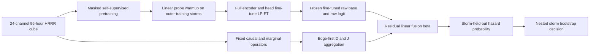

<!-- 书写报告使用中文 -->
---
idea: causal-scs-indicator
title: "LP-FT 端到端微调 raw-4D 骨干上的因果时序不稳定性公平增量审计"
version: 3
date: 2026-07-13
workspace: workspace/causal-scs-indicator/
---

## Problem Anchor（科学问题不漂移，逐字保留自 idea/v1/v2）

- Bottom-line problem: 跨气压层、多尺度滞后的因果时序不稳定性特征 `(D,J)`，能否为一个在原始 4D（pressure-level x longitude x latitude x time）场上端到端训练的强对流预警模型，提供该模型自身从原始历史中学不到的增量预警信息？
- Must-solve bottleneck: 此前九轮（v1-v9）比较的都不是"合格的原始张量端到端模型"；v10 虽做到 raw 张量直喂、容量匹配和 sham 对照，但位置保留架构是在看过失败结果后选定，且 `(D,J)` 独享真实边/滞后 oracle 信息。P2 还必须避免"小样本从零训练的弱 raw 模型"制造虚假增量。
- Non-goals: 不主张 PCMCI+/LKIF、新融合算子或 probe 新颖；不识别真实大气 DAG；不证明物理分岔；不设计新的时空骨干或额外时间聚合模块。
- Constraints: 保留 96 h 同历史、HRRR 3 km 场、2–6 h/36 km 强对流端点；所有选择限于 outer-training storms；先过合成与 Pre-P2 门，再授权多季节数据和算力。
- Success condition: 在功效充分的 `>=2` 季节 outer storm holdout 上，raw+`(D,J)` 对 raw-only 及特权匹配非因果臂的 `Delta AUPRC`、`Delta AUROC` 两个 co-primary estimand 的嵌套 storm-bootstrap 单侧 95% 下界均高于统一实用边界 `m=0.01`，Brier/ECE 退化均不超过 0.01，且逐季同号。

## 数据/计算资产交接状态（2026-07-13 复核，同日二次核实）

- 9 个 SPC 报告（205 KB）及 3 个 HRRR 子集（34 MB）字节数/SHA-256 均与 `data/MANIFEST.md` 一致；`find` 未见 `.part/.tmp`，`squeue` 未见下载任务，状态与 v2 复核完全一致，本轮无新增下载。
- 连续 96 h HRRR 尚未下载仍是刻意 stop gate，非失败或中断；Gate 0 通过后才下载 Pre-P2 早期真实数据。`tigramite 5.2.10.1` 可直接跑 PCMCI+；LKIF 用 `numpy==1.26.4` 独立环境规避 `np.mat` 与 NumPy 2.x 不兼容。

## Technical Gap

`(D,J)` 是 raw history 的确定性函数，潜在收益只能是有限样本归纳偏置。v2 锁定了真实输入、非因果对照、数值超参和 storm-relative 坐标，但引入一处操作性漂移：raw 分支为"冻结 encoder+线性 probe"，encoder 从未接收任务梯度，与 idea 锚定的"端到端训练"不符。deep-lit 第二轮确认无文献支持默认冻结——LP-FT（Kumar et al. 2022, ICLR, arXiv:2202.10054）证明先探测再全量微调同时改善 ID/OOD 精度；v2 援引的灵感来源 Prithvi WxC（2409.13598）自己也不用"冻结+纯线性 probe"，而是更重的下游头设计，并自陈该简化做法效果不佳。

**Route A（仅修协议）**不足：继续冻结会让 P2 检验更容易回答的问题——`(D,J)` 能否补充冻结表示的线性读出，而非训练充分的端到端模型。**Route B（采用）**：保留自监督预训练与三臂协议，下游适配换成 LP-FT——先训练线性 probe 稳定，再解冻整个 encoder 在 outer-training storms 联合微调，得到真正端到端训练过的 raw base；三臂改为在冻结的微调后 base 上做容量精确匹配的线性残差比较，去掉 v2 零填充凑参数量的技巧（细节见 Modern Primitive Usage）。

不采纳 checkpoint 的证据链不变：HRRRCast（2507.05658）实为 6km、缺 500/250hPa 且单时刻到单时刻；StormCast（2408.10958）单体架构无可拆编码器；Stormscope（2601.17268）历史仅约 1h、气压层更少，模态错配大于预训练收益。同领域证据（2508.17903）表明 CNN/UNet head 在更大样本下仍可能过拟合，故下游头固定线性层，即便 encoder 整体微调仍成立。

## Method Thesis

- One-sentence thesis: 只有在任务同构自监督预训练+LP-FT 端到端微调的 raw encoder、唯一预注册的边际相关对照、storm-cluster 校准推断共同成立时，才能把 `(D,J)` 的增量解释为有限样本归纳偏置，而非弱 baseline、oracle 特权或 prevalence 的产物。
- Why smallest adequate: 复用现有 3D CNN 拓扑、PCMCI+/LKIF 和线性残差融合；LP-FT 只解冻已有 encoder、不新增容量；decoder 只服务预训练并丢弃，辅助臂只有一个 64 维残差 `beta`。
- Foundation-model-era leverage: 自监督预训练+LP-FT 只充当与 96h HRRR 模态对齐、最终接受任务梯度的样本效率先验，不充当生成器、因果 teacher 或第二项贡献。

## Contribution Focus

- Dominant contribution: 对因果时序不稳定性能否增强一个样本效率受控、真实端到端微调过的 raw-4D 强对流模型，给出功效与 cluster dependence 均可审计的正/零/负结论。
- Optional supporting contribution: 无；协议是可信度条件，不包装成方法贡献。
- Explicit non-contributions: 不声称增加 raw history 之外的信息，不声称预训练/LP-FT/残差融合本身新颖，不把 regime 差异解释为已证实的因果鲁棒性定理。

## Proposed Method

### Complexity Budget 与固定接口

- Frozen/reused: 4D synthetic generator、Tigramite PCMCI+、官方 LKIF；v10 位置保留 3D CNN 拓扑复用，仅首层 `MaxPool3d` 步幅从 `(4,2,2)` 改 `(4,8,8)` 对齐 masking grid（分类嵌入维度不变）。
- New trainable: masked-pretraining `1x1x1` decoder（预训练后丢弃）、LP-FT Stage C 微调并冻结的 raw base（encoder+线性头）、marginal/causal 两个 64 维残差 `beta`、storm-relative 重采样与校准 cluster inference。
- Intentionally excluded: HRRRCast/StormCast/Stormscope、Transformer/DiT、新因果估计器、CNN probe、结果驱动 edge/lag 搜索、masked-temporal-prediction pretext、Prithvi-CAFE 门控融合、SFAS 默认微调（均为触发式/附录备选，理由见对应小节）。

| 接口 | v3 唯一定义 |
|---|---|
| Raw tensor | `[B,24,96,64,64]`；`C=6变量x4层=24`，变量 `U,V,T,RH,omega,Z`，层 `1000,850,500,250hPa`；192km 方窗、3km 网格 |
| Auxiliary representation | raw 场无重叠 `8x8` 原格平均得 24km 因果格；lag `{1,3,6,12,24}h` 分 hour`={1,3,6}h`/day`={12,24}h`；每估计器 4 图 `D_hour,J_hour,D_day,J_day`，`2x2` 池化展平 64 维 |
| Raw embedding | 3D CNN 经 `AdaptiveAvgPool3d(4,2,2)` 输出 `64x4x2x2=1024` 维，不受本轮池化步幅改动影响 |
| Raw base（LP-FT） | Stage B probe warmup + Stage C 全量微调后冻结，产出固定 `logit_raw(x)` |
| Fusion | 辅助臂 `logit=logit_raw(x)+beta^T a`，`beta in R^64` 单独训练；`logit_raw` 与 encoder 全程冻结 |
| Main arms | raw-only（仅 `logit_raw`）、raw+边际相关残差、raw+PCMCI+ `(D,J)` 残差；Gaussian sham 仅留 Gate 0 sanity |
| Endpoint | issue time 后 2–6h、中心 36km 内任一 SPC tornado/wind/hail 报告 |

### System Overview

### Core Mechanism

1. **固定候选库。** 冻结 12 个有向跨层模板：`U1000->U850, V1000->V850, T1000->T850, RH1000->RH850, RH850->omega500, T850->omega500, omega500->RH850, Z500->U850, Z500->V850, U850->U250, V850->V250, omega500->omega250`。每条只允许同格和上游 24 km 两种 offset，以及 `{1,3,6,12,24}h` 五个 lag（hour band `={1,3,6}h`、day band `={12,24}h`），共 120 个候选；不据结果增删。
2. **统一窗口。** 96h 输入取结束于 `{78,84,90,96}h` 的四个 72h 窗；节点先窗内去趋势并 z-score，`tau_max=24` 后仍有 48 个有效时刻。36/48h lag 明确删除，因同一 96h 历史内无法同时获得可靠条件检验样本和多个 D/J 窗口。
3. **唯一 causal 实现。** PCMCI+ 用 Tigramite `ParCorr(significance='analytic')`、`tau_min=1,tau_max=24`、`pc_alpha=0.05`、`max_conds_dim=max_conds_py=max_conds_px=3`、`max_combinations=1`；`link_assumptions` 只开放上述 120 条。`fdr_bh(q<=0.05)` 只对每个 `(sample,window,格点)` 报告显著边计数作诊断，**不再置零、不进入步骤 5 聚合**（修正 v2 review 的 BH-median 坍缩问题）。
4. **唯一非因果实现。** 对完全相同 edge/offset/lag/window 计算绝对 Fisher-z 边际 Pearson lag correlation，同样只作 BH 诊断，不置零；是唯一预注册 privilege-matched control，局部方差与一阶差分永久退出主协议。
5. **`(D,J)` — edge-first 聚合（v3 修正）。** 每个 lag band `b`、窗口 `w`、格点 `(x,y)`，对该 band 全部候选边 `e` 取 `|r_e(w,x,y)|`（PCMCI+ 用 partial-correlation 强度，边际对照用 Fisher-z 强度），定义 `D_b=mean_e sd_w(|r_e|)`、`J_b=mean_e max_w||r_e(w)|-|r_e(w-1)||`。取候选边均值取代 v2 对 BH 置零后分数取中位数：只有 band 内全部候选边跨窗口恒定时才精确为零，不再因半数候选未过 BH 而坍缩。PCMCI+ 与边际相关走同一聚合器。
6. **LKIF 锁定复核。** `multi_causality_est` 固定 `max_lag=24, significance_test=1`，每边输入 source、target 及格点内 `{T850,RH850,omega500}`（最多 3 个 conditioner），Fisher p<0.05 计数仅作诊断，特征走同一 edge-first 聚合。只替换 PCMCI+ 重跑；方向不一致则主结论降为 estimator-specific。

### Storm-relative 坐标构造

与 v2 不变：以 issue-time HRRR 格点 `c_0` 为锚，由 predictor window 内风场递推 `v_t=median_{r<=36km}((U850,V850)+(U500,V500))/2`、`c_{t-1}=c_t-v_t*1h` 向后积分 96 次；每小时双线性重采样 192km 方窗并用 `v_0` 旋到顺移动方向，上游 offset 固定 `-x` 方向一格，`|v_0|<2m/s` 保持 east-north；轨迹出域或有效格点 `<90%` 剔除。Pre-P2 另跑不跟踪的固定方窗敏感性并用 outer-training 位移 95% 分位掩码，差异过大则停止。

### Modern Primitive Usage

现代 primitive 仍是 self-supervised representation pretraining，但下游读出从"冻结 encoder+线性 probe"改为 **LP-FT**（Kumar et al. 2022, arXiv:2202.10054）：raw encoder 在任务 BCE 梯度下端到端训练，回应 Problem Anchor 的"端到端训练"措辞。

#### Self-supervised Raw Backbone、LP-FT 与残差 Probe

- **编码器（拓扑复用，池化步幅修正）。** `Conv3d(24,32,3,pad=1)->ReLU->MaxPool3d((4,8,8),(4,8,8))->Conv3d(32,64,3,pad=1)->ReLU`；第二卷积层输出精确为 `[64,24,8,8]`（`96/4=24`、`64/8=8`），与 `4h x 8x8` masking grid 逐元素对齐，修正 v2 review 的 decoder 形状缺口。分类路径仍接 `AdaptiveAvgPool3d((4,2,2))` 得 `1024` 维，不受步幅改动影响。
- **Stage A（reconstruction pretext）。** 合成 6 realization 拼 24 通道预热（20 epochs），接每 outer fold 未标注 HRRR 窗（最多 100 epochs）。随机遮蔽 50% 的 `4h x 8x8` 原格块（输入侧零填充，无 mask token）；`Conv3d(64,24,kernel=1)` decoder 接在 `[64,24,8,8]` 后，预测每块 24 通道块均值（8x8 空间+4h 时间平均），仅遮蔽块取 Smooth-L1；`lr=1e-3,wd=0.05`，checkpoint 按内层 loss 选。**诚实表述：** 保留纯重建而非 masked-temporal-prediction——无论文（含 Prithvi WxC 自身）做过受控消融，仅有间接类比（MAM4WF 证明预测未来对 SEVIR 有效但属全监督；SatVision-TOA 成功依赖下游不需时序推理）；这是有依据但未经证实最优的选择，Stage C 会用任务梯度进一步重塑时序表征。
- **Stage B（probe warmup）。** 冻结 encoder，训练 `Linear(1024,1)`，BCE，`lr=1e-3,wd=0.01`，早停由 raw-only 内层 BCE 决定。
- **Stage C（LP-FT 全量微调）。** 从 Stage B 初始化解冻 encoder；`lr=1e-5`（低两个数量级）`wd=0.05`，线性头 `lr=1e-4`，cosine decay，最多 20 epochs、patience=3 早停控制小样本过拟合。inner-fold BCE 差于 Stage B 即回退 degraded-FT（保守，不拔高 raw base）。冻结最终权重得 `logit_raw(x)`。
- **SFAS 备选：** 触发式、非默认，细节见 Failure Modes。
- **残差融合（替代 v2 零填充容量匹配）。** `logit(x,a)=logit_raw(x)+beta^T a`，`a in R^64`，`beta` 单独 BCE 训练，`logit_raw` 与 encoder 冻结。三臂共享同一微调后 raw base，只比较 `beta` 能否降低 held-out loss，无需零填充。

**为何不采用 Prithvi-CAFE 注意力门控融合。** 唯一可迁移架构 Prithvi-CAFE（2601.02315，adapter+并行 CNN 分支+逐尺度门控）不采纳：线性残差的价值在于容量可精确审计（`beta` 唯一新增参数），门控的表达力差异本身可能制造表面增量，与"增量须可追溯到 `(D,J)` 信息含量"冲突。留作 P2 POSITIVE 后的附录鲁棒性检查。

### Integration into Downstream Pipeline / Training Plan

1. **Gate 0，合成协议冻结。** 独立种子跑三臂（含 Stage A-C）；500 个 graph-null 数据集重算 edge、`beta` 和 interval。只有零效应 95% CI 覆盖率落 `[0.925,0.975]`、FPR `<=0.05`，且 privilege-matched 臂未制造系统性优势，才解锁真实数据。
2. **Pre-P2，一次性管线冻结。** 下载早期连续 HRRR，完成坐标、吞吐量、PCMCI+/LKIF、固定方窗敏感性和 raw-base adequacy gate（Stage C 相对 Stage B 内层 AUPRC/AUROC 不得双双下降，否则记 degraded-FT 并回退）。**新增历史窗口重叠诊断：** 比较不同 fold、`<=150km` 且 `<=24h` 的 storm 对之间 96h 前置窗口重叠比例；中位数重叠 `>50%` 的对占比超 5% 时追加"重叠即同一 fold-group"规则，本轮只诊断不改分组，不产出 skill claim。
3. **P2，确认性 cohort。** SPC reports 6h 内且 `<=150km` 连边，连通分量按 24h 最大跨度切分 storm system；outer fold 持有整个 system 及同日同区域负样本。报告 IID grouped 5-fold 与 leave-one-season-out；**后者为唯一确认性分析**触发判据，前者降级为描述性附录。标准化、SSL、LP-FT、early stopping 只看 outer-training storms。
4. **Positive-cluster-count 功效。** 报告 storm 总数 `G`、含正例数 `G1`；用 early-real pilot 预测向量，`G1 in {30,40,50,60,80,100}`、负 cluster 比 2:1 下做 2,000 次 Monte Carlo 注入 `Delta=0.02`；首个使联合 power `>=0.80` 且 CI half-width `<=0.01` 的 `G1` 是样本门槛，`G>=50` 只是下限，达不到标 exploratory。
5. **可信区间与杠杆。** 外层 2,000 次分层重采样，500 个各再做 500 次内层重采样校准覆盖分位数。对每 storm 做 leave-one-storm-out，删一 cluster 改变符号或占比超 equal-share 2 倍标记 high leverage（不删数据只降级）；另做 UTC-day/season-block bootstrap，storm 是正确聚类单元仍是未经证明的假设。

### Failure Modes and Diagnostics

- **Stage C 过拟合：** inner-fold BCE 差于 Stage B，回退 Stage B 权重标注 degraded-FT；多 fold 系统性触发时评估 WeatherPEFT/SFAS（2509.22020）Fisher 引导选择性微调（0.1%-4% 参数）替代 Stage C——不默认采纳，其 Fisher 估计仅在数千样本验证过，`<=50-100 storm` 未经验证，采纳前须先做小样本稳定性检查（本轮未做）。
- **Edge-first 聚合退化：** `D_b/J_b` 仅当 band 内候选边跨窗口恒定时精确为零，属正确"无信号"；若 120 候选边同时恒定，判管线故障需人工复核。
- **Prevalence 混淆：** McDermott et al.（2401.06091）证明 AUPRC 偏向高 prevalence 子群，故 `Delta AUPRC/AUROC` 每 holdout 内均为 co-primary，跨 holdout 解释须由 AUROC 同向支持。
- **互斥判据：** `POSITIVE` 要求 causal-vs-raw 后 causal-vs-marginal 固定顺序联合下界都 `>m`；`NEGATIVE` 要求功效充分且两上界都 `<=m`；两上界 `<0` 记 `HARM`；其余一律 `NULL`。
- **校准：** POSITIVE 还要求 Brier/ECE 不劣于 raw 超 0.01；seed 卡 `log(2)` 保留并双报告。
- **历史窗口重叠泄漏：** Pre-P2 诊断若触发，须锁定新分组规则并重跑 Gate 0。
- **未解决限制：** 24h 最大 lag、storm clustering/steering-wind 均为操作性代理；below-ground cells 用 channel median 填补且不进边分数；参数量匹配不等于 PCMCI+ CPU 成本匹配，另报 wall time；禁止物理 DAG、计算效率或普适可学习性主张。

### Novelty and Elegance Argument

SHIPS+（2510.02050）已做"因果发现特征增补业务 predictors"，Flora et al.（2603.20250）已做时间聚合后的 63-channel WoFS 网格预警；两者都不是"独立时序因果估计器生成不稳定性图，再注入同历史自监督 raw-4D encoder"的两阶段设计。deep-lit 第二轮再以 Granger 特征融合、因果图嵌入辅助输入、transfer entropy 特征融合、handcrafted+deep 混合融合四种措辞广谱检索，仍未发现该先例，证据强度较第一轮（仅 TabPFN-CFM 最接近但不构成先例）进一步加固。唯一可迁移的是 Prithvi-CAFE（2601.02315）门控融合架构，评估后未采用（见 Modern Primitive Usage），因为线性残差的可审计性是可信度论证的必要条件，不夸成绝对首创；论文价值仍取决于真实 storm 结果。

## Claim-Driven Validation Sketch

### Claim 1（主锚点）

- Minimal experiment: 功效达标的多季节 P2 三臂 nested storm holdout（leave-one-season-out 为唯一确认性分析）。
- Baselines / ablations: LP-FT 微调后 raw-only（`logit_raw` 单独作 baseline）、raw+边际相关残差、raw+PCMCI+ `(D,J)` 残差；LKIF 复核；degraded-FT fold 单独标注。
- Metric: paired `Delta AUPRC/AUROC` co-primary，nested storm-bootstrap joint bounds；Brier/ECE secondary。
- Expected evidence: 按穷尽判据报告 POSITIVE/NULL/NEGATIVE/HARM；不预言 regime Delta 必大于 IID Delta。

### Claim 2（强 raw comparator 与协议必要性）

- Minimal experiment: Gate 0 null calibration；Pre-P2 比较 Stage B vs C raw-only 技能确认微调不劣化，再执行 earth-relative vs. storm-relative、causal vs. privilege-matched control 及历史窗口重叠诊断。
- Metric: graph-null coverage/type-I、Stage B/C skill 对比、坐标敏感性、causal-minus-control joint interval、跨 fold 重叠比例。
- Expected evidence: Stage C 不劣于 Stage B、null 校准通过、causal 仍胜对照、重叠诊断未触发新规则，才说明 Claim 1 非弱 baseline/oracle 特权/泄漏产物；任一失败降为 exploratory。

## Paper Outline

- S1 Introduction：确定性衍生表示的有限样本增量问题与单一 empirical claim。
- S2 Related Work：因果鲁棒性成立条件、严格基线下经验失败、天气预训练（含 LP-FT/SFAS）与因果特征融合空白。
- S3 Data/Cohort：storm system、自然 prevalence、坐标、outer/inner 边界、重叠诊断结果。
- S4 Method：先给 raw base adequacy（Stage B vs C），再定义 estimand/互斥判据，再给三臂、SSL encoder 和 edge-first `(D,J)`。
- S5 Experiments：Claim 1 主表；Claim 2 adequacy/null 诊断；限制。
- Key figures: Fig.1 三臂两项 co-primary forest plot（hero）；Fig.2 cohort/fold/坐标数据流；Fig.3 positive-`G1` power 与 LOSO leverage；Gate 0 降附录。缺一张 `(D,J)` 构造机制图仍是已知叙事缺口，留待下一轮。

## Compute and Timeline Estimate

- Estimated compute: Gate 0 `5–10` L4 GPU-h；Pre-P2 `5–10` GPU-h（重叠诊断为纯 CPU）；每 outer fold SSL+LP-FT 合计约 `50–100` L4 GPU-h（较 v2 增 `10–20` GPU-h 用于 Stage C 反传）；PCMCI+/LKIF 约 `1,500–4,000` CPU-h，预算随 fold 数线性增长。
- Data: 单个 float16 raw cube 约 18.9 MB；体量由 `G1` 功效门决定，预计 HRRR 子集 `0.1–0.3 TB`。SPC 无新增标注费。
- Timeline: Gate 0 约 1 周；Pre-P2 2–3 周；功效核算/数据拉取/P2 约 6–10 周。Gate 0、raw-base adequacy 或 `G1` 任一不通过即停止 confirmatory 路线，只报告失败边界。

<review date="2026-07-13">

## Scores

评审口径：`topics/0710-causal-scs.md` 未声明 `Target venues`/`Review standards`，沿用 idea/v1/v2 review 既定口径：顶级 Earth-system methods / AI4Science / 强对流预测应用论文标准。本轮 Claude 先独立通读 v3 全文、v2 `<review>` 原文与 idea v10 的 `<review>`/`<deep-lit-integration>`，并用 arxiv-tools 拉取 arXiv:2202.10054（LP-FT）与 arXiv:2409.13598（Prithvi WxC）全文核验 v3 的两处关键文献转述，同时独立重算 SSL decoder 的 Conv3d/MaxPool3d 张量形状与 edge-first 聚合公式，形成 Claude 初评；随后按 dispatch_manual.md 请 codex 独立评审（zero-context）。codex 指出一处 Claude 初评遗漏的 CRITICAL 级问题（首层 `MaxPool3d` 步幅 `(4,2,2)→(4,8,8)` 把 raw 分支空间分辨率在仅一层非降采样卷积后就压缩到与 `(D,J)` 完全相同的 24km，重新制造弱 raw comparator 问题）以及一处 Method Specificity 新缺口（PCMCI+ 条件集跨窗口是否固定未声明、marginal 对照与 causal 估计量采样方差不匹配）。Claude 独立重算张量形状（`Conv3d(24,32,3,pad=1)` 保持 `[32,96,64,64]` 不变，`MaxPool3d((4,8,8))` 后为 `[32,24,8,8]`，第二层 `Conv3d` 保持 `[64,24,8,8]`，`192km/8=24km`，与 `(D,J)` 24km 因果格分辨率完全一致）确认 codex 的具体指证站得住脚，据此下修相关维度分数。

| Dimension | Score | Notes |
|-----------|-------|-------|
| Problem Fidelity | 6/10（Claude 初评 8，codex 6，收敛至 6） | LP-FT 修复本身真实且文献支撑成立：Claude 独立拉取 arXiv:2202.10054 全文摘要确认 "the easy two-step strategy of linear probing then full fine-tuning (LP-FT)...combines the benefits of both...outperforms both fine-tuning and linear probing"，与 v3 转述一致；独立拉取 arXiv:2409.13598 全文 grep 确认 Prithvi WxC 明确写"simply tuning a new head for each problem will lead to subpar results. Instead, we always add new embedding and output layers...the typically frozen core of a model with a few additional layers"、且 gravity-wave 任务显式"we freeze the encoder and decoder part of the model"再接 4 个新卷积块——v3"Prithvi WxC 自己也不用冻结+纯线性 probe"的表述准确，但有一处未言明的细微张力：Prithvi WxC 自己的实际补救方案是"冻结骨干+更重的新头"，并非 v3 采纳的"解冻整个 encoder 全量微调"（LP-FT），两条引用各自成立但并不互相印证同一条补救路径，这一 nuance 不构成误导但值得下一版说明。真正的 CRITICAL 是 codex 发现、Claude 独立重算张量形状确认为真的新问题：本轮为对齐 SSL decoder 与 masking grid 把首层 `MaxPool3d` 步幅从 `(4,2,2)` 改为 `(4,8,8)`，导致 raw 分支在仅经过一层不改变空间尺寸的 `Conv3d(24,32,3,pad=1)` 之后，空间分辨率就被直接压到 `8x8`（`192km/8=24km`）——与 `(D,J)` 所用的 24km 因果格完全同分辨率，且发生在网络学到任何分层特征之前。该压缩后的特征图同时被 SSL decoder 与下游 `AdaptiveAvgPool3d((4,2,2))` 分类路径共享，v3 正文"分类路径…不受本轮池化步幅改动影响"这句话只在**输出张量形状**层面为真（`AdaptiveAvgPool3d` 对任意输入分辨率都会给出目标形状），在**信息含量**层面并不成立——这正是 idea v10 review 已经诊断并修复过一次的"位置信息被 pooling 抹除、制造虚假 causal 增量"失效模式，这次换了触发机制（从 global pooling 换成极早期大步幅局部 pooling）重新出现。判定为 CRITICAL 而非 RETHINK：修复路径明确且局部（解耦 decoder 用的 pooling 与分类路径用的 pooling），不需要放弃 LP-FT 或三臂框架本身。 |
| Method Specificity | 7/10（Claude 初评 8，codex 6，收敛至 7） | v2 明确要求修复的两处 CRITICAL 经独立验证确实被正确、优雅地修复：(1) edge-first 均值聚合器 `D_b=mean_e sd_w|r_e|` 从结构上消除了"BH 置零后取中位数"的坍缩路径，只有全部 120 条候选边跨窗口恒定时才精确为零，Failure Modes 也诚实标注了这一边界；(2) `MaxPool3d((4,8,8))` 后第二卷积层输出精确为 `[64,24,8,8]`，Claude 独立重算确认与 `4h x 8x8` masking grid 逐元素对齐，`Conv3d(64,24,kernel=1)` decoder 直接预测块均值、无需上采样，是比 v2 review 建议的 `ConvTranspose3d` 方案更简洁的修法。但 codex 指出一处此前 v1/v2/idea 各轮 review 均未捕捉到的新缺口：全文未声明 PCMCI+ 为每条候选边选出的 conditioner（最多 3 个）是否跨四个 72h 窗口固定；若逐窗口独立重选，同一条边在不同窗口的 `r_e(w)` 可能对应不同的条件 estimand，`D_b/J_b` 会把真实效应变化与有限样本 parent-set 选择噪声混淆；同时 marginal 对照用的是无条件 Fisher-z Pearson 相关，与 PCMCI+ 的 0-3 conditioner partial correlation 采样方差/自由度不匹配，使当前"privilege-matched"对照并未真正匹配估计量噪声地板，本身就可能制造一个与 `(D,J)` 信息含量无关的 causal-vs-marginal 差异。这是一个新发现、直接影响 `(D,J)` 是否测到了论文声称的东西的具体缺口，判定 CRITICAL。 |
| Contribution Quality | 6/10（Claude 与 codex 一致，v2 沿用） | 与 v2 完全一致，proposals.xml one-line 也自陈"本轮未处理，留待下一轮"。"主贡献"仍是"给出可审计的正/零/负结论"，属实验可信度要求而非机制贡献；`(D,J)` 这一候选机制仍被 SSL 预训练、LP-FT、storm-relative 追踪、双估计器、双层 bootstrap 包围。且新发现的 Method Specificity 缺口（条件集未冻结、估计量未匹配）意味着 `(D,J)` 目前还不能被干净地从估计量伪影中剥离出来单独主张为机制贡献。 |
| Frontier Leverage | 7/10（Claude 初评 8，codex 7，收敛至 7） | LP-FT 是恰当且克制的现代化选择，两篇关键引用（2202.10054/2409.13598）经全文核验转述准确，不是"为前沿而前沿"。codex 补充的保留意见成立且应予承认：LP-FT 的实证基准来自视觉分布偏移任务（Breeds/DomainNet/ImageNet 变体），其理论分析建立在理想化两层线性网络设定上，只能"motivate"而非"guarantee"其在这个 `<=50-100 storm` 小样本天气 CNN 场景下同样成立。Claude 另外核验了 codex 在 Modernization Opportunities 中提到的两篇陌生文献（arXiv:2606.31248 STRATA、arXiv:2601.20342 StormDiT），均为真实存在且被准确描述：STRATA 是 tile-based 全球风暴解析 transformer，单时刻到下一时刻自回归滚动，无原生 96h 历史堆叠；StormDiT 是在中国雷达/降水事件上训练的生成式临近预报模型，模态错配。两者进一步加固而非削弱"不直接复用外部预训练权重、自建小规模 SSL 骨干"这一判断。 |
| Validation Focus | 6/10（Claude 初评 7，codex 6，收敛至 6） | 本轮真实进展：leave-one-season-out 被显式声明为唯一确认性 holdout（IID grouped 5-fold 降级为描述性附录），直接解决 v2 CRITICAL 的"挑对自己有利的 holdout"问题；新增 Pre-P2 历史窗口重叠泄漏诊断，是对 v2 CRITICAL 的诚实"先诊断后修"分阶段回应（本轮只诊断不改分组，明确标注不产出 skill claim）。但由于 marginal 对照未真正 estimator-matched（见 Method Specificity），当前三臂比较尚不能建立其想要建立的结论，这本身就封顶了本维度的分数；同时 grouped 5-fold、LKIF、SFAS、Prithvi-CAFE 等触发式/附录分支在核心识别问题未解决前仍分散确认性资源。 |
| Paper Story and Claims Calibration | 6/10（Claude 初评 7，codex 6，收敛至 6） | `(D,J)` 构造机制图缺口延续自 v2，作者已自陈"留待下一轮"，诚实但未解决。codex 进一步指出：raw-base adequacy（Stage B vs C）目前嵌在 Method 小节而非作为 Results 的第一个独立结果报告，鉴于本轮新发现的 pooling 分辨率问题，这一顺序缺陷变得更关键——读者会在看到 hero forest plot 前无从判断三臂比较的可信度基础（raw 分辨率是否被压缩、对照是否估计量匹配）是否成立；且 POSITIVE/NULL/NEGATIVE 判据边界目前只写在 Failure Modes 的 bullet 列表里，缺一个独立 Discussion/Conclusion 用正文语言复述这些边界。 |
| Overall | 6.3/10 | Claude 收敛后 (6+7+6+7+6+6)/6≈6.33；codex 独立给出 6.2（(6+6+6+7+6+6)/6≈6.17，文中写 6.2）。两者按规则取平均 = (6.33+6.2)/2≈6.27 → 6.3。**分歧标注**：Problem Fidelity 一项收敛前 Claude 初评 8 与 codex 6 相差 2（达到维度级 ≥2 标注阈值），核心分歧来源于 codex 独立发现、Claude 初评完全遗漏的 pooling 分辨率坍缩问题——Claude 独立重算张量形状（`Conv3d` 不改变空间尺寸、`MaxPool3d((4,8,8))` 后为 `8x8=24km`）确认该指证成立后下修；整体 Overall 分歧 0.13，未达标注阈值。 |

## Verdict

REVISE（Claude 收敛后与 codex 判定一致，均为 REVISE；核心机制——LP-FT 端到端 raw base + 唯一预注册非因果对照 + storm-cluster 校准推断——框架本身仍成立且比 v2 更接近可信，问题集中在本轮修复 SSL decoder 对齐时意外引入的分辨率坍缩、以及此前各轮都未发现的估计量匹配缺口，两者修复路径均明确且局部，未达 RETHINK 门槛）

## Weaknesses (dimensions < 7)

### Problem Fidelity (6/10)

- Weakness: LP-FT 真实修复了 v2 的"encoder 从未接收任务梯度"漂移（文献核验见上）。但为修复 v2 另一处 CRITICAL（SSL decoder 与 masking grid 不对齐）而做的架构改动——首层 `MaxPool3d` 步幅 `(4,2,2)→(4,8,8)`——把 raw 分支的空间分辨率在仅一层不降采样的 `Conv3d(24,32,3,pad=1)` 之后就压缩到 `8x8`（`192km/8=24km`），与 `(D,J)` 因果格完全同分辨率。该被压缩的特征图同时喂给 SSL decoder 和下游分类 `AdaptiveAvgPool3d((4,2,2))`，"分类路径不受本轮改动影响"这一表述只在输出形状层面成立，在信息含量层面不成立，重新制造了 idea v10 review 已诊断并修复过的"弱 raw comparator 制造虚假增量"失效模式。
- Suggested fix: 解耦两个被错误共享到同一层的 pooling 需求：分类路径（raw-only/marginal/causal 三臂共用的 embedding）保留原 `(4,2,2)` 步幅或更精细分辨率，让至少两层卷积在 3km 尺度上构建层级特征；只在 SSL decoder 分支前额外插入一个无参数的 `AvgPool3d`，把该分支单独降到 `4h x 8x8` 的 mask-block 分辨率。这是一处局部改动（只新增一个 pretraining-only 的 pooling 算子），完整保留已修复的 decoder/mask 对齐，同时消除新引入的共享干路分辨率坍缩。改动后需重跑 raw-base adequacy gate（Stage C vs Stage B），因为当前 adequacy 比较是在分辨率坍缩后的架构上做的。
- Priority: CRITICAL

### Method Specificity (7/10)

- Weakness: v2 要求修复的两处 CRITICAL（BH-median 坍缩、decoder/mask 不对齐）均被正确修复，经独立重算验证。但 codex 指出且此前各轮均未捕捉的新缺口：(1) PCMCI+ 为每条候选边选出的 conditioner 是否跨四个窗口固定未声明，若逐窗口重选，`D_b/J_b` 会混入 parent-set 选择噪声；(2) marginal Pearson 对照（无条件）与 PCMCI+ partial correlation（0-3 conditioner）采样方差/自由度不匹配，当前"privilege-matched"只匹配了 edge/lag/window 身份，未匹配估计量噪声地板。
- Suggested fix: 仅用 outer-training storms 为每条候选边冻结一个 conditioner set，并在全部窗口与 held-out storms 复用该固定集合；把 marginal 对照替换为 estimator-matched conditional sham——保持 edge/lag/window、conditioner 数量与 MCI 计算完全相同，只按预注册规则置换 conditioner 身份，从而把"条件是否正确"与"估计量噪声地板是否相同"两个变量分离开。
- Priority: CRITICAL

### Contribution Quality (6/10)

- Weakness: 与 v2 完全一致，本轮未处理（proposals.xml one-line 自陈）。"主贡献"仍是实验可信度陈述而非机制贡献；`(D,J)` 被协议组件包围，且新发现的估计量匹配缺口意味着它目前还不能被干净地从估计量伪影中剥离。
- Suggested fix: 沿用 v2 review 建议——把"固定条件集、方差标准化的 edge-first `(D,J)` 残差"定义为唯一机制贡献，SSL/LP-FT/坐标/双层 bootstrap 全部显式降级为协议脚手架；待 Method Specificity 两处 CRITICAL 修复后，这一贡献才能被干净归因。
- Priority: IMPORTANT

### Validation Focus (6/10)

- Weakness: leave-one-season-out 唯一确认性判据、历史窗口重叠诊断均是真实进展。但 marginal 对照未 estimator-matched 意味着当前三臂比较尚不能建立其核心可信度论证，这直接封顶本维度；grouped 5-fold/LKIF/SFAS/Prithvi-CAFE 等触发式分支在核心问题未解决前仍构成不必要的分散。
- Suggested fix: 先修复 Method Specificity 的估计量匹配缺口；随后确认性验证只保留强 raw base（分辨率修复后）、estimator-matched conditional sham、causal `(D,J)` 三臂加 LOSO；LKIF 降为一次性附录复核而非并列主表臂；SFAS/Prithvi-CAFE 保持触发式/POSITIVE-后附录，不进入主确认路径。
- Priority: IMPORTANT

### Paper Story and Claims Calibration (6/10)

- Weakness: `(D,J)` 构造机制图缺口延续 v2，已自陈延后但未解决。raw-base adequacy 仍嵌在 Method 而非作为 Results 首个独立结果，鉴于本轮新发现的分辨率问题这一顺序缺陷更关键；POSITIVE/NULL/NEGATIVE 判据只藏在 Failure Modes 列表里，缺独立 Discussion/Conclusion 正文陈述。
- Suggested fix: 新增机制图作为 Fig.1（候选边模板→固定条件集→逐窗口估计→edge-first 聚合→64 维残差），forest plot 顺延为 Fig.2；S5 顺序改为先报告 raw-base adequacy（分辨率修复后重跑）与 matched-control 校验，再报告三臂主结果；新增独立 S6 Discussion，用正文语言复述 Results-to-Claims 边界。
- Priority: IMPORTANT

## Simplification Opportunities

- 解耦 SSL decoder 用的 pooling 与分类路径用的 pooling（新增一个无参数、只在 pretraining 分支生效的 `AvgPool3d`），而不是共用一层大步幅 `MaxPool3d`——同时消除本轮新引入的分辨率坍缩，且不影响已修复的 decoder/mask 对齐，是最小的局部改动。
- 用"固定 conditioner set + estimator-matched conditional sham"同时解决 Method Specificity 与 Validation Focus 的两处缺口，取代当前分离的"BH 诊断 + marginal Pearson 对照"设计，减少读者需要同时追踪的估计量种类。
- （沿用 v2 未采纳部分）LKIF 降为冻结后单次附录复核，双层 storm bootstrap 先用单层报告名义覆盖率，只有诊断显示明显偏离 95% 时才触发双层校正。

## Modernization Opportunities

NONE（本轮无需引入新的外部前沿组件；需要现代化的是估计量匹配与架构分辨率细节，不是加入更大的预训练模型）。Claude 独立核验 codex 提出的两篇新增候选文献均真实存在且描述准确：STRATA（arXiv:2606.31248，全球风暴解析、tile-based transformer，单时刻到下一时刻自回归 rollout，无原生 96h 历史堆叠）与 StormDiT（arXiv:2601.20342，生成式临近预报，训练于中国雷达/降水事件，模态错配）——两者与此前已排除的 HRRRCast/StormCast/Stormscope 一样存在结构性不匹配，进一步加固而非削弱"自建小规模 SSL 骨干、不直接复用外部预训练权重"这一判断。LP-FT（arXiv:2202.10054）与 Prithvi WxC（arXiv:2409.13598）的引用经全文核验均准确，是恰当、克制的现代化选择。

## Drift Warning

v2 的 CRITICAL 漂移（冻结 encoder + 线性 probe，raw encoder 从未见任务梯度）已被 LP-FT 真实修复，经独立核验 arXiv:2202.10054 与 arXiv:2409.13598 全文，两处引用转述均准确无夸大。但修复过程中，为对齐 SSL decoder 与 masking grid 而调整的首层 `MaxPool3d` 步幅（`(4,2,2)→(4,8,8)`），产生了一个新的、未被此前任何一轮 review 识别的漂移路径：raw 分支的空间分辨率在仅经过一层非降采样卷积后即被压缩到与 `(D,J)` 24km 因果格完全相同的分辨率，这重新制造了 idea v10 review 已经诊断并修复过的"弱 raw comparator 因信息丢失而制造虚假增量"失效模式（触发机制从 global pooling 换成了极早期大步幅局部 pooling，后果相同）。这不是引入 idea 锚定问题之外的新问题，而是同一个"raw 模型是否真的训练充分、观测充分"的核心可信度问题以新的技术形式复发；判定为 CRITICAL 而非 RETHINK，因为修复路径明确且局部（解耦分类路径与 decoder 路径的 pooling），不需要放弃 LP-FT 或三臂比较框架本身。

## Results-to-Claims Mapping

| Outcome | Supportable claim |
|---------|------------------|
| POSITIVE | 在修复 pooling 分辨率坍缩与 PCMCI+ 条件集/估计量匹配两处新发现的 CRITICAL 问题之前，即便观测到 POSITIVE，也只能声称"`(D,J)` 残差优于一个空间分辨率被压缩到 24km 的 LP-FT 微调 raw 模型，以及一个未做 estimator-matching 的边际相关对照"，不能声称已证明该增量来自因果条件信息而非弱 baseline 或估计量噪声差异。修复后才可限定声称：在该 season、该分辨率修复后的 LP-FT raw base、该 estimator-matched 条件对照下，`(D,J)` 为已训练好的原始网格模型提供了超过预设阈值的有限样本增量；仍不得声称增加了原始历史之外的信息或识别了真实大气因果机制。 |
| NULL | 至少一个 metric、对照、season、校准、功效或 raw/comparator adequacy 门未通过。在当前架构下，NULL 结果尤其不能被解读为"`(D,J)` 无价值"，因为 raw 分支本身可能因分辨率坍缩而被人为削弱，NULL 可能只反映一个被削弱的 raw comparator 恰好追平了同样受限的 `(D,J)` 表示。 |
| NEGATIVE | 只有在功效达标、raw-base adequacy（含分辨率修复后的重新校验）、estimator-matched 对照校准、且跨 season 一致复现之后，才能称该具体 `(D,J)` 实现在指定 estimator、模型与数据范围内没有实用增量；两上界均 `<0` 可另记 HARM。两者均不得外推到其他因果衍生表示、其他 backbone 分辨率或其他 estimator。 |

## Paper Outline Check

六节结构与三张主图基本对应 Claim 1+2 的骨架，v3 相对 v2 无结构性改动（Contribution Quality 与 Paper Story 两处 IMPORTANT 被作者显式标注为"本轮未处理"）。仍缺 `(D,J)` 构造机制图；raw-base adequacy 仍嵌在 Method 小节而非作为 Results 的第一个独立结果——随着本轮新发现的 pooling 分辨率问题，这一顺序缺陷更加关键：若不先在 Results 中独立证明 raw base（分辨率修复后）与因果对照的 estimator-matching 均成立，读者会在看到 hero forest plot 前无从判断三臂比较的可信度基础是否成立。建议：机制图提升为 Fig.1、forest plot 顺延为 Fig.2；S5 先报告 raw adequacy + matched-control 校验、再报告主结果；新增独立 S6 Discussion/Conclusion 显式陈述 POSITIVE/NULL/NEGATIVE 判据边界，而非只留在 Failure Modes 列表中。

</review>

