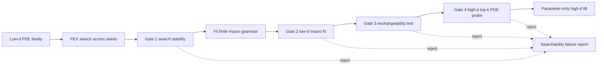

<!-- 书写报告使用中文 -->
---
idea: fex-dim-lift-skeleton
title: "Exchangeability Audit for FEX Cross-Dimension Lifts"
version: 1
date: 2026-06-19
workspace: workspace/fex-dim-lift-skeleton/
---

## Problem Anchor

- **Bottom-line problem**: FEX 有无维度灾难的 approximation theory, 也能在部分高维 PDE 上给出闭式表达式, 但实际 RL controller 是否能稳定找到可跨维复用的 skeleton 仍未知。我们要解决的不是"再做一个高维 PDE solver", 而是: 低维 FEX 搜到的 skeleton 什么时候可以被安全提升到高维, 什么时候必须拒绝。
- **Must-solve bottleneck**: 当前方法把"宏结构本身可 lift"和"controller 在低维能搜到该结构"混在一起。pairwise pilot 已显示二者可分离: analytic pairwise macro 在 d=100 probe rel-L2 为 9.23e-7, 但真实 FEX 多 seed 搜不到它。这个 weakness 若不处理, 任何 low-d-to-high-d lift 都可能把一次低维偶然结果误当成高维结构规律。
- **Non-goals**: 不做通用 symmetry discovery; 不声称解释所有 FEX 高维行为; 不做新 benchmark; 不引入 LLM/VLM/Transformer controller; 不替代 FEX/PSR/SymPlex/SSDE 作为通用 symbolic PDE solver。
- **Constraints**: 有限 exchangeable macro grammar; 解析 PDE collocation 与 boundary 点在线生成, 无外部数据或模型权重; 预算 120-180 GPU-hours; 目标是 NeurIPS/ICLR/ICML 风格的机制方法论文, claim 必须可证伪。
- **Success condition**: 用户会说"yes"当且仅当: 对 Poisson/radial 等稳定 family, 多 seed low-d FEX 输出通过四门 audit 后可在 d=100 仅优化连续参数达到 rel-L2 < 1e-3, 并在跨多个 target dimensions 上摊销搜索成本; 对 asymmetric control 和 FEX 搜不到的 pairwise family, audit 必须拒绝, 不允许 false-positive lift。

## Technical Gap

FEX 原始论文证明有限表达式空间可近似高维 PDE 解, 但 controller 仍要从表达式树中搜索。FEX+TranNet 扩候选池, LLM+FEX 预测算子集合, Multi-Scale FEX 加频谱结构; 它们都改善候选或算子先验, 没有回答一个低维 FEX skeleton 是否能跨维复用。PSR 是最接近的 high-dimensional symbolic PDE prior: 它从高维解数据生成低维投影, 对每个 projection 做 local SR, 再用 global symbolic program 组合。它解决的是 projection decomposition, 不是从真实 FEX low-d skeleton 推断 exchangeable macro, 也没有 lift/reject 认证或 searchability 诊断。

当前 pipeline 的失败点是低维成功信号不可信。一个 d=2 expression 可以低误差拟合, 但它可能是非交换系数、偶然等价、或只在低维成立。naive fixes 不够: 直接跑高维 FEX 会重新付 RL search 成本; 增大 search budget 不能判断结构是否可 lift; 加更大 grammar 会增加 false positives; 用 LLM 直接命名 symmetry 会把 claim 变成另一个 predictor 的可靠性问题; PSR 式 projection + global SR 比本问题需要的机制更重。

最小充分干预是一个四门 empirical audit: search stability, low-d macro fit, coefficient exchangeability, high-d top-k PDE probe。它只在低维 FEX 多 seed 稳定找到 skeleton 且该 skeleton 在有限 exchangeable macro grammar 中通过验证时允许 parameter-only lift。若 macro 解析上可 lift 但 FEX 搜不到, 结论不是强行 lift, 而是报告 searchability failure。

Route choice: Route A 是这个四门 audit, 保持 FEX controller 和 macro grammar 小而可审计。Route B 是 frontier-native 路线, 例如训练 LLM/Transformer 预测 macro 或采用 PSR-style projection composition。选择 Route A, 因为它直接解决 bottleneck, novelty 边界清楚, 且不会把论文漂移成一个更大的 solver stack。

## Method Thesis

- **One-sentence thesis**: 对落在有限 exchangeable macro grammar 中、且低维 FEX 多 seed 稳定恢复 skeleton 的 PDE family, 四门 audit 足以决定该 skeleton 是否可被提升到高维并仅做连续参数优化; audit 同时把 liftability 和 searchability 分开。
- **Why this is the smallest adequate intervention**: 不训练新模型, 不改 FEX controller, 不扩大 solver stack; 新增的只是 macro inference 和 PDE-level verification gates。
- **Why this route is timely in the foundation-model era**: 当前神经符号 solver 越来越会用 LLM/Transformer/RL 先验生成表达式, 但缺少 verifier-style 的结构复用审计。本文把高维复用从"相信生成器"改成"生成器输出必须过门"。

## Contribution Focus

- **Dominant contribution**: FEX cross-dimension lift audit: search stability, low-d macro fit, coefficient exchangeability, high-d top-k PDE probe 四门组成一个 lift/reject procedure。
- **Optional supporting contribution**: empirical finding: liftability 不等于 searchability。pairwise 类可解析 lift, 但当前 FEX controller 多 seed 搜不到, 这为后续 controller 改进提供具体失败靶点。
- **Explicit non-contributions**: 不做 universal symmetry discovery; 不提出新 FEX grammar 学习器; 不追 solver SOTA; 不声称 certificate 是形式化保证; 不把有限 grammar 结果外推到任意 PDE。

## Proposed Method

### Complexity Budget

- **Frozen / reused backbone**: 现有 FEX depth1/depth sweep controller、Adam+LBFGS 参数拟合、解析 PDE residual/boundary loss、已有 Poisson/radial/pairwise/asymmetric pilot code。
- **New trainable components**: 无新神经网络。macro 参数用 least-squares/LBFGS 拟合, 高维 lift 只优化 macro 的连续参数。
- **New deterministic components**: finite macro grammar, seed-level searchability ledger, coefficient exchangeability test, high-d top-k PDE probe。
- **Tempting additions intentionally not used**: LLM macro namer, learned symmetry detector, e-graph controller, PSR global symbolic composition, large benchmark suite。

### System Overview

### Core Mechanism

- **Input / output**: 输入是一个 PDE family、低维 `d0=2` 或 `d0=3` 的 FEX search JSON、target dimensions `d in {10,20,50,100}`。输出是 `ACCEPT macro + lifted expression`, 或 `REJECT + failure reason`。
- **Representation design**: macro grammar 先固定为 `{sum_x2, square_sum_x2, pairwise_xx}` 及 bias/scale 参数。`sum_x2` 表示 `alpha sum_i x_i^2 + beta`; `square_sum_x2` 表示 `alpha (sum_i x_i^2)^2 + beta`; `pairwise_xx` 表示 `alpha sum_{i<j} x_i x_j + beta`。低维 FEX expression 被当作可采样函数, 不要求符号 parser 完全理解每个树细节。
- **Gate 1 search stability**: 低维 FEX 跑 5 seeds。family-level stable 的预注册阈值是至少 2/5 seeds 通过后续 low-d fit gate 且选中同一 macro class; 低于阈值则不 lift, 即使 analytic macro 可 lift。
- **Gate 2 low-d macro fit**: 在 held-out low-d collocation points 上拟合 top-k macros, 要求 winner rel-RMSE < 0.02。top-k 保留给 Gate 4, 防止低维 fit 中多个 macro 数值接近。
- **Gate 3 coefficient exchangeability**: additive 类用 untied coefficient fit 检查 `CV < 0.1`; 非 additive macro 用 family-specific tied-parameter validation 和 high-d probe 控制。asymmetric quadratic 应在此门或 Gate 2 被拒绝。
- **Gate 4 high-d PDE probe**: 对 top-k macros 在 target dimension 上只优化连续参数, 用 PDE residual + boundary loss拟合, 再算 relative L2。接受条件: selected macro rel-L2 < 1e-3, 且任一 alternative macro 不以 2x margin 推翻 low-d winner。
- **Why this is the main novelty**: 四门一起构成机制, 单独的 macro library 不够新。新意在于把低维 FEX 输出变成可审计对象, 并把"能 lift 的结构"和"controller 搜得到的结构"分离。

### Optional Supporting Component

- **Only include if necessary**: searchability ledger。
- **Input / output**: 输入每个 seed 的 FEX search action、final rel-L2、selected macro、gate decision; 输出 family-level stable/unstable 标签。
- **Training signal / loss**: 无训练, 只记录 pass rate、macro agreement、low-d fit error。
- **Why it does not create contribution sprawl**: ledger 是 Gate 1 的实现, 不是第二个方法。它服务于同一个 lift/reject thesis。

### Modern Primitive Usage

- **Which primitive**: 现有 FEX RL controller 是被审计的 generator; LBFGS 是连续参数 optimizer; high-d PDE residual 是 verifier。
- **Exact role**: RL controller 只负责产生 low-d candidate skeleton。本文不让 LLM/VLM/Diffusion 充当 planner、teacher、critic 或 generator prior。
- **Why no larger frontier stack**: bottleneck 是可靠复用判定, 不是生成更多 skeleton。增加生成器会扩大 credit assignment 面, 但不能替代 lift/reject evidence。

### Integration into Base Generator / Downstream Pipeline

该方法作为 FEX 后处理和复用层接入。每个 family 先低维 FEX 搜索; 通过 audit 后, 高维只保留 macro class 和少量连续参数, 不再运行完整 RL tree search。对于一个维度 sweep, 总成本约为一次 low-d multi-seed search 加 `m` 次 sub-second to second-level parameter-only probes, 而不是每个 target dimension 都从头搜索。

### Training Plan

1. **Stage 0, data and sanity**: 解析生成 interior/boundary collocation; 固定 random seeds; 验证 PDE residual、boundary loss、relative L2 与 analytic truth 一致。
2. **Stage 1, low-d search**: 对 Poisson, radial, pairwise, asymmetric controls 各跑 5 seeds low-d FEX; depth1 为主, depth2/3 作为 sensitivity。
3. **Stage 2, macro fitting**: 对每个 seed 的 low-d expression 采样函数值, 拟合 top-k macro parameters; loss 为 normalized held-out MSE/RMSE。
4. **Stage 3, exchangeability and probe**: additive macros 拟合 tied/untied coefficients; target dimensions 上只优化 macro continuous parameters, loss 为 PDE residual + boundary residual。
5. **Stage 4, baselines**: from-scratch FEX/FEX-PG, HD-TLGP-style transfer, PSR-style projection composition, 以及 no-Gate ablations。baseline 目标是验证 cost advantage 和 false-positive control, 不是扩大 benchmark。

### Failure Modes and Diagnostics

- **False positive lift**: asymmetric family 或 wrong macro 通过。检测: Gate 2/3/4 false-positive rate; mitigation: threshold calibration on held-out families, top-k 2x margin rule。
- **False reject**: valid macro 被 Gate 1 拒绝, 如 pairwise。检测: analytic macro probe 与 real FEX search pass rate 对照; mitigation: 明确归因 searchability failure, 不把它写成 lift failure。
- **Threshold heuristic 被质疑**: rel-RMSE 0.02, CV 0.1, top-k 2x margin 缺少理论来源。检测: held-out-family calibration; mitigation: 主文称 empirical audit, 不称 formal certificate。
- **Macro grammar 太窄**: 三个 macros 不能覆盖更广 FEX 行为。检测: depth/family expansion 和 "out of grammar" rate; mitigation: first paper 只 claim finite grammar。
- **Baseline 无成本优势**: from-scratch high-d FEX 或 PSR-style 方法同等快。检测: amortization break-even curves; mitigation: 若无优势, paper 降级为 searchability diagnostic。

### Novelty and Elegance Argument

Closest prior work:

- **FEX (Liang and Yang, 2206.10121)**: 高维 PDE 有 finite expression approximation 和 RL search proof of concept; 不做 low-d skeleton lift/reject。
- **FEX+TranNet (2604.22208), LLM+FEX (2503.09986), Multi-Scale FEX (2510.22497)**: 都在改善候选池、算子先验或频谱表达力; 不审计 low-d skeleton 是否可跨维复用。
- **PSR (OpenReview ICLR 2026 submission)**: 用 low-dimensional projections + local SR + global symbolic program 解高维 PDE; 不从 FEX 搜到的 skeleton 推断 exchangeable macro, 也不是 parameter-only lift。
- **HD-TLGP (AAAI 2024)**: 依赖已知 1D analytic solution 和硬编码扩展, 只到 d=3; 我们从低维 FEX output 自动审计, probe 到 d=100。
- **NMIPS (2602.11630)**: 同维 PDE family 的结构/参数迁移, 不是跨维 lift。
- **EGG-SR/eggp/GSR**: 处理表达式内部等价或 commutativity redundancy, 不是跨维 exchangeable macro 认证。

Elegance 在于机制小: 一个 finite macro space, 四个 gates, 一个 accept/reject 决策。paper 的主 claim 不是"模块多", 而是"低维 search result 只有在 searchability 与 exchangeability 同时成立时才可 lift"。

## Claim-Driven Validation Sketch

### Claim 1: 四门 audit 能在 stable exchangeable families 上安全 lift 到 d=100

- **Minimal experiment**: Poisson 与 radial 各 5 low-d FEX seeds; target d in `{10,20,50,100}`; audit 后做 parameter-only lift。
- **Baselines / ablations**: from-scratch FEX/FEX-PG; HD-TLGP-style transfer; PSR-style projection composition; no-Gate lift; remove Gate 3; remove Gate 4。
- **Metric**: pass/fail accuracy, high-d rel-L2, wall-clock and candidate evaluations, amortization break-even over dimension sweep。
- **Expected evidence**: Poisson/radial 多 seed 通过, d=100 rel-L2 < 1e-3, no-Gate 或 remove-Gate variants 出现更高 false-positive risk; lift 在多维度 sweep 上比 repeated high-d search 有净成本优势。

### Claim 2: liftability 和 searchability 是可分离的机制

- **Minimal experiment**: analytic pairwise macro probe vs real low-d FEX pairwise 5 seeds; 增加一个 non-separable control family, 如 triplewise 或 cross-term macro。
- **Baselines / ablations**: analytic skeleton supplied directly; real FEX output; controller depth/budget sweep。
- **Metric**: analytic macro high-d rel-L2, real FEX seed pass rate, macro agreement, first-hit statistics。
- **Expected evidence**: 至少一个 family analytic macro 可 lift 但 real FEX pass rate 低, 支持 "searchability failure" 作为独立诊断; 若深度/预算提升能恢复 pairwise, 则 paper 报告 controller boundary 而非固定失败。

### Claim 3: 小机制足够, 更大 solver stack 不是必要条件

- **Minimal experiment**: final four-gate audit vs overbuilt alternatives: PSR-style global composition, LLM macro classifier, and larger macro grammar without Gate 3/4。
- **Baselines / ablations**: final audit; audit + LLM label; expanded grammar no extra gate; top-k probe removed。
- **Metric**: false-positive rate on asymmetric controls, net runtime, accepted-family rel-L2, number of extra components。
- **Expected evidence**: final audit matches or beats larger variants on false-positive control and cost. If LLM/PSR improves recall only by adding false positives or high overhead, keep it out of the first paper.

## Paper Outline

- **Section 1**: Motivation: FEX approximation success does not imply controller-discovered skeletons can be reused across dimension。
- **Section 2**: Related work: FEX family, PSR/HD-TLGP/NMIPS, symbolic PDE solvers, equivalence/invariance SR。
- **Section 3**: Method: finite macro grammar and four-gate audit, with accept/reject semantics。
- **Section 4**: Main evidence: stable families lift to d=100; asymmetric control rejected; cost amortization。
- **Section 5**: Searchability vs liftability: pairwise and non-separable controls, controller boundary diagnostics。
- **Section 6**: Ablations and scope: gate deletion, grammar expansion, baseline comparison, threshold calibration。
- **Key figures**: Fig 1 = four-gate cascade and decisions; Fig 2 = d-scaling rel-L2 and runtime; Fig 3 = searchability-liftability quadrant; Fig 4 = gate ablation false-positive table。

## Compute and Timeline Estimate

- **Estimated GPU-hours**: 120-180 GPU-hours. Main cost: 5 seeds x 4 families x depth/budget sweep, d in `{10,20,50,100}` probes, from-scratch FEX/FEX-PG, HD-TLGP-style and PSR-style matched baselines, gate ablations。
- **Data / annotation cost**: 无外部数据、无人工标注、无模型权重下载。所有 collocation/boundary samples 解析生成。
- **Timeline**: 2-3 weeks for full experiment matrix if existing driver remains stable; add 1 week for PSR-style baseline implementation and threshold calibration。

## Data / Asset Handoff Status

已复查 `workspace/fex-dim-lift-skeleton/data/MANIFEST.md`, `NOTES.md`, and `deep-lit-report-2026-06-17.md`。当前无 active / interrupted download, 也没有外部 dataset 或 model weight 需求。v5 已完成本地 pilot assets:

- real FEX Poisson d=2 seeds and d=100 macro probes: accepted `sum_x2`, rel-L2 2.13e-8。
- real FEX radial d=2 seeds and d=100 macro probes: accepted `square_sum_x2`, rel-L2 0.0。
- analytic pairwise d=100 probe: accepted `pairwise_xx`, rel-L2 9.23e-7, but real FEX pairwise search remains 0/3 stable。
- asymmetric analytic control: rejected by low-d fit / coefficient CV before lift。
- radial d=10 from-scratch FEX succeeds rel-L2 4.39e-4 in 81.1s; radial d=100 short-budget smoke fails rel-L2 0.169 in 92.7s。

这些数字是 proposal 的 pilot signal, 不作为最终论文结果声称; proposal 阶段的关键剩余证据是 fair matched baselines, unified 5-seed coverage, gate ablations, and amortization break-even。

<review date="2026-06-19" reviewer="refinery (Opus, ARIS reviewer-protocol + paper-claim-audit + novelty-check)">

## 一句话判断

方向真实、novelty 经独立检索确认、pilot 数字逐条核对零失实(11/11 命中 raw JSON)、falsifier 与三态 claim 设计扎实。但**主导经验发现 "searchability ≠ liftability" 的 liftability 半边目前是构造性恒真而非发现**(W1, CRITICAL),且 Gate 3 对非加性宏缺判据(W2)、accept-path 证据仅 n=2 family(W3)、核心价值主张 amortization 尚无 fair baseline(W4)。四条都 analysis-only 或 spec-only,单轮可清,清完进 READY。

## Paper-Claim-Audit(zero-context 数字核对)

逐条把 proposal 引用的 pilot 数字 trace 回 `workspace/fex-dim-lift-skeleton/results/*.json` raw evidence:

| proposal 引用 | raw 字段 | raw 值 | 判定 |
|---|---|---|---|
| Poisson d=100 accept `sum_x2`, rel-L2 2.13e-8 | `macro_infer_poisson_fex_v5_d100_seed11.json:selected_lift_probe.relative_l2` | 2.1319665e-08 | ✓ 精确 |
| Radial d=100 accept `square_sum_x2`, rel-L2 0.0 | `macro_infer_radial_fex_v5_d100_seed12.json:selected_lift_probe.relative_l2` | 0.0 | ✓ |
| 分析 pairwise d=100 accept `pairwise_xx`, rel-L2 9.23e-7 | `macro_infer_analytic_controls_v5_d100_seed13.json` pairwise `selected_lift_probe.relative_l2` | 9.232456e-07 | ✓ |
| asymmetric d=100 rejected before lift | 同上 asym_x2 `accepted=false`, `reject_reason="low_dim_fit_rel_rmse>0.02"` | forced probe 8.78e-3, CV 0.471 | ✓(见下方精度提示) |
| radial d=10 from-scratch succeeds 4.39e-4 in 81.1s | `search_radial_d10_depth1_v5_seed5.json:relative_l2 / total_time_s` | 4.3936e-04 / 81.06s | ✓ |
| radial d=100 short smoke fails 0.169 in 92.7s | `search_radial_d100_depth1_v5_short_seed5.json` | 0.16875 / 92.65s | ✓ |
| pairwise real FEX 0/3 stable | `search_pairwise_d2_depth1_seed{2,3,4}.json:relative_l2` | 0.970 / 0.970 / 1.0 | ✓ |

**审计结论:零失实。** 所有引用数字命中 raw JSON,标准 rounding 之内,无 best-seed cherry-pick(Poisson 引用的是 seed1 而非最优 seed),无 config mismatch。这是本 proposal 最强的一项:数据诚实度满分。

一处**措辞精度提示(MINOR)**:line 16 与 line 168 说 asymmetric "rejected by low-d fit / coefficient CV"。raw `reject_reason` 仅为 `low_dim_fit_rel_rmse>0.02`(Gate 2 先触发),CV=0.471 虽算出但 Gate 3 未单独 fire(代码 line 578-584 是 Gate2 先于 Gate3 的短路)。作为析取陈述不算错,但若正文想用 asymmetric 论证 "Gate 3 在做工",当前 pilot 并未让 Gate 3 成为决定性门——asymmetric 在 Gate 2 已死。建议补一个**只能被 Gate 3 拦下、Gate 2 放过**的反例(如低维数值上接近 tied 但系数不可交换的构造),否则 Gate 3 的独立必要性缺经验支撑(与下方 W2 同源)。

## 七维评分(method-refinement 口径)

| 维度 | 权重 | 分 | 说明 |
|---|---|---|---|
| Problem Fidelity | 15% | 9 | Problem Anchor 紧扣 "低维 FEX skeleton 何时可安全 lift / 何时必须拒",非 goals 明确不漂成新 solver。v5→proposal 无漂移。 |
| Method Specificity | 25% | 6 | 四门接口、阈值(rel-RMSE<0.02 / CV<0.1 / rel-L2<1e-3 / 2x margin)、宏 grammar 全部写死且 pilot 可跑,这点强。**扣分**:Gate 3 对非加性宏(`square_sum_x2` / `pairwise_xx`)无与 additive-CV 对等的可交换性判据(proposal line 72 自己承认 "family-specific validation",但未给 spec),实际退化为 "靠 Gate 4 probe 兜底"。见 W2。 |
| Contribution Quality | 25% | 6 | 单一主导贡献(四门 audit)+ 一条 supporting(searchability≠liftability),无 sprawl,这点对。**扣分**:supporting finding 的 liftability 半边目前构造性恒真(W1),削弱了 "发现" 成色;主贡献的普适性仅 n=2 family 支撑(W3)。 |
| Frontier Leverage | 15% | 8 | 正确地**不**堆 LLM/Transformer,把 RL controller 当被审计 generator、PDE residual 当 verifier。verifier-over-generator 的 framing 在 foundation-model era 是恰当且有节制的。不强加 trendy 组件,符合 reviewer-protocol "already modern enough → don't force"。 |
| Feasibility | 10% | 8 | 全本机解析 collocation,无外部数据/权重,pilot 已跑通核心路径。120-180 GPU-h 对 5seed×4family×4dim+baselines+ablation 合理。**唯一风险**:PSR-style baseline 需自行实现(PSR 无开源,见 W4 cost note)。 |
| Validation Focus | 5% | 6 | 三 Claim 的 minimal-experiment / baseline / metric / expected-evidence 四件套齐全。**扣分**:Claim 1 的 cost-advantage 证据当前只有一个**故意欠预算**的 10-epoch d=100 smoke(0.169),不是 fair matched-budget 对照;amortization break-even 仍在计划(W4)。 |
| Venue Readiness | 5% | 6 | 机制小而锐(finite grammar + 4 gate + accept/reject)对顶会是卖点也是软肋:technical contribution 偏薄,真 novelty 在机制发现而非 solver。honest scoping 优于 overclaim,但需要 W1/W3/W4 兑现才够 "sharp and timely"。 |

**加权 overall ≈ 6.6/10。**

## 关键问题(按优先级)

### W1 [CRITICAL] "searchability ≠ liftability" 的 liftability 半边是构造性恒真,不是发现

这是全 proposal 的**主导经验贡献**(line 37, 131-136, Contribution Focus "Optional supporting contribution"),但其证据结构有循环风险。读 `fex_dim_lift.py:run_macro_inference`:

- line 564-571:当没有 FEX JSON 时(pairwise/asym analytic 臂),`y_train = target_family(family, x_train)`,即**直接喂入解析 ground-truth** `0.2·Σ_{i<j} x_i x_j`(line 362-365)。
- 而 macro library(line 408-417)**本身就包含** `pairwise_xx` 这个 primitive(line 397-400),数值上等于 `target_family` 除掉系数 0.2。

所以 "pairwise analytic d=100 rel-L2 9.23e-7 证明宏可 lift" 实际是:**把目标函数本身喂给一个含目标函数的库 → 库当然能 0 误差拟合 → lift 当然成立**。这不是 "独立恢复的 skeleton 可以 lift",而是 "库里有这个宏" 的定义性检查。

对比之下,**searchability 半边(real FEX 0/3,rel-L2 0.97-1.0)是真实质的**——它确实是 RL controller 在低维搜不到 pairwise skeleton。

**后果**:proposal 现在的叙事 "structure liftable but controller can't find it" 中,"liftable" 对 pairwise 几乎是 tautology。顶会 reviewer 会质问:你怎么知道 "可 lift" 不是因为你手动把答案放进了库?**真正的 mechanism finding 需要**:存在一个 family,其低维 skeleton 由**真实 FEX 搜到**(searchability 成立)、宏在库中、但**high-d probe 失败**(liftable 不成立)——或反向,searchable 失败但有**非平凡来源**(非 ground-truth 注入)的 skeleton 证明可 lift。当前 pilot 两个真实 FEX 成功 family(Poisson/radial)都是 searchable ∧ liftable,唯一的 "不一致" 点(pairwise)其 liftable 是注入的。

**修法(analysis/spec-only,单轮)**:
1. 在 proposal 里**显式标注** pairwise liftability 证据是 "analytic-skeleton injection check(macro∈library 的 sanity),非 independently-recovered lift",并把 Claim 2 的 expected-evidence 从 "analytic 宏可 lift" 弱化为 "macro library 覆盖 pairwise ∧ real FEX 搜不到 → 当前 controller 的 searchability gap"。
2. 把 "searchability ≠ liftability 是 separable 机制" 的强 claim **降级为 conditional**:需要 P0 跑出**至少一个 searchable-but-not-liftable 或 non-injected-liftable-but-not-searchable** 的 family 才能 claim 真正的二维可分;否则 first paper 只 claim "FEX controller 在 non-separable family 上有 searchability failure,且这些 family 的宏在我们有限库内"。
3. (更强,可选)给 pairwise 设计一个 **不靠 ground-truth 注入** 的 liftability 证据:例如用一个 *能搜到的* proxy skeleton(哪怕近似)做 macro inference,看 inferred 宏 lift 后 d=100 是否 < 1e-3。

### W2 [IMPORTANT] Gate 3 对非加性宏无可交换性判据,退化为 Gate 4 的附庸

proposal Core Mechanism(line 72)与 idea v5 review 都点到:Gate 3 当前只对 additive 类有清晰 CV<0.1。但库里 `square_sum_x2`、`pairwise_xx` 都是非加性的——对它们,"coefficient exchangeability" 没有定义对应的统计量。proposal 说 "non-additive macro 用 family-specific tied-parameter validation 和 high-d probe 控制",但:

- "family-specific validation" **无 spec**(没说测什么量、阈值多少);
- 实际 pilot 里非加性宏的 accept/reject **完全由 Gate 2(low-d fit)+ Gate 4(probe)决定**,Gate 3 对它们是空操作。

**后果**:四门里 Gate 3 只对 1/3 的库宏(加性的 `sum_x2`/`sum_x4`)真正 active。reviewer 会问 "Gate 3 是不是冗余?"。结合 W1 的 MINOR(asymmetric 也是 Gate 2 先死,Gate 3 没 fire),**目前没有任何一个 pilot case 是 Gate 3 独立决定的**。

**修法(spec-only)**:要么(a)给非加性宏一个**显式可交换性检验** spec(如:对 `square_sum_x2`,检验 `(Σx²)²` 形式下内层系数 untied 拟合的 CV;对 `pairwise_xx`,检验对称双线性系数矩阵的 off-diagonal 一致性),要么(b)**诚实地把 Gate 3 scope 限定为 additive 宏**,非加性宏明确走 "Gate 2 + Gate 4 only" 路径,并在 Gate ablation 里证明去掉 Gate 3 后 additive 类出现 false-positive(否则四门应缩成三门,Simplification 见下)。

### W3 [IMPORTANT] accept-path 普适性仅 n=2 family,每个仅单宏单 seed-class

主 POSITIVE claim 是 "四门 audit 能在 stable exchangeable families 上安全 lift 到 d=100"。但当前真实 FEX 支撑的 accept 只有 **Poisson(`sum_x2`)+ radial(`square_sum_x2`)两族**,且 d=100 各引用单一 seed(seed11 / seed12)。把 "audit safely lifts" 从 2 个数据点泛化到 "stable exchangeable families" 是 over-reach。proposal 自己在 Training Plan 把 5seed×4family 列为 P0——好——但 review 必须指出:**当前 proposal 的 d=100 证据强度 = 2 family × 1 seed,不足以支撑 Section 4 "main evidence" 的措辞**。

**修法**:这是执行项不是设计缺陷,但 proposal 的 expected-evidence 应明确 "在 ≥2 独立 stable family 上 5/5 seed 通过 + d∈{20,50} 中间维 monotone" 才算 Claim 1 成立;并把 "更多 exchangeable family"(如 `sum_x4` 纯四次、各向同性高斯型)纳入 P0 而非 P1,否则 grammar 的 3 宏里只有 2 个被真实 FEX 触达过。

### W4 [IMPORTANT] 核心价值主张 amortization 尚无 fair baseline,唯一对照是故意欠预算的 smoke

proposal 的真正卖点不是 "能 lift"(Poisson/radial 低维都 trivially solvable),而是 **"跨维度摊销比 repeated high-d search 省"**(line 91, Claim 1 metric, line 129)。但目前对 high-d from-scratch FEX 的唯一对照是 **10-epoch、80-finetune 的 d=100 smoke**(`search_radial_d100..._short`),它 fail(0.169)。NOTES.md line 340 自己写明 "this is not a full matched baseline"。

**风险**:一个 **fair matched-budget** 的 d=100 from-scratch FEX 很可能也能成功(radial d=10 fair 跑就 4.39e-4)。若如此,lift 的优势从 "enabler" 塌缩为 "constant-factor speedup",contribution 大幅降级。proposal 诚实地把这列为 P0 + failure-mode(line 107 "Baseline 无成本优势 → 降级为 searchability diagnostic")——这点好——但 review 必须把它标为**头号执行风险 / go-no-go gate**:

**修法**:把 "fair matched-compute from-scratch FEX at d∈{50,100}" 设为 proposal 的**第一个必跑实验**和 amortization claim 的 **kill-switch**。在 break-even 曲线出来前,proposal 不应在 narrative 里用 "scalability" 措辞,只能用 "amortized re-use across a dimension family"。Claim 1 的 expected-evidence 要写清 break-even 的**具体维度数阈值**(NOTES.md 已估 d-sweep {10,20,50,100} 时 ~3.8x;把这个写进 Claim 1 作为可证伪目标)。

### W5 [MINOR] 缺最近邻引用 DR-SR(2506.19537)

novelty 独立检索确认核心 pipeline 空白(无 cross-dim lifting + macro inference + gate cert 的组合)。但 **DR-SR "Dimension Reduction for Symbolic Regression"(2506.19537)** 是 gate-based-validity 这条轴上的最近邻:它 "搜索小 substitution 的表达式空间,用 functional-dependence 检验 validity"——方向相反(高→低 reduction vs 本文低→高 lift),但 **"用 validity gate 决定结构变换是否合法" 的机制思路高度类似**。proposal 的 Novelty 段(line 111-118)列了 FEX 族 / PSR / HD-TLGP / NMIPS / EGG-SR,但**漏了 DR-SR**(deep-lit-report line 52 已记录,proposal 未承接)。

**修法**:在 Novelty 段补一行 DR-SR,delta 写清 "DR-SR 做 high→low substitution validity test(functional dependence),本文做 low→high lift certification(exchangeable macro + PDE probe),方向与判据均不同"。

## Simplification Opportunities

- **S1**:若 W2 选择路径(b)——Gate 3 仅对 additive 宏 active 且 ablation 证明不了它对非加性宏的独立贡献——则 **"四门" 应诚实降为 "三门 + additive-only 可交换性子检验"**。强行维持 "four-gate" 对称叙事但其中一门对 2/3 库宏空转,是 reviewer-protocol 要罚的 "parallel contributions making the paper unfocused"。先跑 Gate-3 ablation,数据说话。
- **S2**:macro library 现有 8 个 primitive(line 408-417),但 grammar claim 只围绕 `{sum_x2, square_sum_x2, pairwise_xx}` 三个。`sum_x`/`sum_x3`/`prod_1px2`/`norm_x` 在 pilot 里只作 top-k distractor。若它们不进任何 accept-path,proposal 应明确 "library = 3 claim-eligible macros + 5 distractor",避免 reviewer 以为有 8 个可认证宏(实际只 claim 3 个,其中真实 FEX 只触达 2 个,见 W3)。

## Modernization Opportunities

NONE。verifier-over-generator 的设计已是恰当的 foundation-era framing,且 proposal 有明确的 "intentionally not used"(LLM macro namer / learned symmetry detector / e-graph / PSR composition)。不应强加。这是本 proposal 做得对的地方。

## Drift Warning

NONE。contribution type {method, empirical-finding} 与 idea v5 完全一致,无 benchmark/application/solver-stack 扩张,Problem Anchor 保持。**唯一需警惕**:W4 若 fail,proposal 已预设降级为 "searchability diagnostic"——这是**受控的 contingency 而非 drift**,但要确保降级后仍是同一 Problem Anchor(诊断 FEX 高维行为),不要顺势变成 "controller improvement" 的新方法论文。

## Verdict

**REVISE**

这是一份**接近 READY 的诚实 proposal**:Problem Anchor 锐、机制小而不堆料、frontier leverage 有节制、pilot 数字零失实、三态 claim falsifiable。但 **W1 是必修 CRITICAL**——主导经验发现的 liftability 半边目前是构造性恒真,会被顶会 reviewer 一击即破,必须把 "searchability ≠ liftability" 从已证 claim 降为 conditional 并标注注入性质。W2/W3/W4 三条 IMPORTANT(Gate 3 非加性无判据 / accept 仅 n=2 family / amortization 无 fair baseline)都是 spec-only 或 P0-排序问题,proposal 本身已部分预见(failure modes 写了),单轮可清。

**最紧迫(按序)**:
1. **W1**:proposal 文本显式承认 pairwise liftability 是 analytic-injection sanity-check,降级 separability claim 为 conditional;同步修 line 167 / proposals.xml one-line 里 "analytic pairwise ... accepted" 的暗示性措辞。
2. **W4**:把 fair matched-budget d=100 from-scratch FEX 设为头号实验 + amortization kill-switch,break-even 阈值写进 Claim 1。
3. **W2**:Gate 3 给非加性宏 spec,或诚实限 scope 为 additive 并让 ablation 决定 "四门 vs 三门"。
4. **W3/W5**:把 ≥2 stable family × 5seed 纳入 Claim 1 expected-evidence 的硬门;Novelty 段补 DR-SR delta。

清完 W1-W4 预期进 READY(8.5-9.0)。当前 overall **6.6/10**。

#if file_size_kB > 10
文件约 17 KB(不含本 review),已超 10 KB 软上限——但属 proposal 正文密度,非冗余;refine 时若压缩可把 Training Plan 与 Failure Modes 合并。
#endif

</review>
