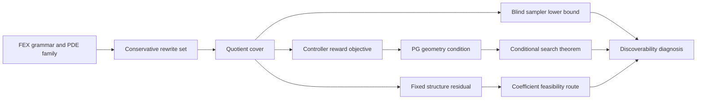

<!-- 书写报告使用中文 -->
---
idea: fex-search-complexity
title: "FEX Discoverability Diagnostic Theorem"
version: 1
date: 2026-06-19
workspace: workspace/fex-search-complexity/
---

## Technical Gap

### Problem Anchor

- Bottom-line problem: FEX 是我的课题组(Haizhao Yang 组)发明的一种方法, 使用 RL 进行 Symbolic Regression, 我(Youran Sun)作为 Yang 的博后, 应该继续在这个方向上探索.
- Must-solve bottleneck: FEX 已有 approximation theory 说明有限表达式空间可以表示高维 PDE 解, 但还没有理论解释 RL controller 何时能找到这些表达式; 当前失败可能来自可区分结构太多、policy-gradient 几何太差, 或固定结构后的实值系数可行性太难.
- Non-goals: 不做通用 SR benchmark; 不提出新的 FEX 工程系统; 不声称大 context、LLM prompt、更多算子或更多 PDE 家族本身解决搜索复杂度; 不在 reduction 完成前声称 FEX coefficient feasibility 是 ETR-hard.
- Constraints: 理论主贡献; 实验只做 proof-facing diagnostics. 复用现有 FEX Poisson controller、`depth2_sub` pilot、v4 PG trace、v5 quotient certificate. 额外计算预计 20-80 GPU-hours, 主要用于真实 controller traces 和 e-graph comparison; quotient theorem 与 proof writing 基本不需要 GPU.
- Success condition: 给出一篇可审查的 theory-first 论文, 明确区分 "存在可表示解" 与 "controller 可发现解"; 至少证明一个无条件 FEX quotient-count theorem 和 blind sampler lower bound, 并把 PG 几何与实值可行性作为可测、可证伪的独立条件, 而不是把小搜索空间误读成可搜索性.

### Data Handoff Status

已复查 `workspace/fex-search-complexity/data/MANIFEST.md` 和 `workspace/fex-search-complexity/NOTES.md`. 当前没有外部数据下载需求, 也没有中断或失败下载需要恢复. Pilot 使用 FEX Poisson 代码在线生成 collocation points.

可复用 artifact 已完成:

- v3/v4 Poisson diagnostic: `depth2_sub` 在 `d=2,5,10,20,30` 的结构命中通常很快, strict reward `0.99` 的困难主要转向系数优化.
- v4 PG trace: 已能记录 controller loss、mean reward、grad norm、logits statistics 和 slot entropy; softmax-bandit proxy 显示 `depth2_sub` 在单 good class 时 median `kappa` 约 `9.0e5`, cover size alone 不控制 PG 几何.
- v5 quotient certificate: 对保守 rewrite set `R_ac+c` 证明-facing artifact 已完成. `depth1` raw `243 -> 136`; Poisson `depth2_sub` raw `2187 -> 953`; canonicalizer idempotent, commutative swap failures 为 0, subtraction false equalities 为 0; recurrence 给出 `q_0=8`, `q_{l+1}=1+7*(q_l^2+q_l*(q_l+1))`.

### Grounding Material

FEX 原始论文证明有限表达式空间有避免维度灾难的 approximation guarantee, 但 RL controller 只是 proof-of-concept. LLM+FEX、FEX+TranNet 和 Multi-Scale FEX 改善候选池或算子先验, 但仍没有解释搜索为什么成功或失败.

最接近的外部理论工作是 Soubki and Cranmer 的 SR parameterized-complexity 分析、Virgolin and Pissis 的 SR NP-hardness、EGG-SR 和 eggp 的 equality-graph 等价剪枝. 它们分别解释 general SR 的 FPT/W-hardness、NP-hardness 和等价表达式冗余, 但没有分析 FEX/PDE residual grammar, 没有给 FEX quotient-count recurrence, 也没有把 quotient cover 与 FEX controller 的 policy-gradient geometry 分开.

### Operational Gap

当前 FEX pipeline 的失败点不是单一的 "表达式树数量太多":

1. Raw template count 夸大了结构空间, 因为 commutativity 和 constant-collapse 会把许多树映到同一 quotient class.
2. 小 quotient cover 仍不能保证 RL 找到好 class; blind class sampler 在 `Q` 个 class 和 `K` 个 good class 下仍需要 `Omega(Q/K)` 命中时间.
3. 即使好 class 存在, controller objective 可能没有 polynomial `kappa_PG`; v4 bandit proxy 已显示 good-class mass 直接控制梯度信号.
4. 即使结构选对, 内层 Adam/LBFGS 还要解决实值残差可行性; 这层可能继承 real arithmetic 的困难, 但目前只能作为 bounded-ETR route, 不能写成 theorem.

Naive fixes 不够: 更深树、更大 operator set、更多采样、LLM operator prior 或 e-graph memory 可能改善经验表现, 但它们不解释哪个复杂度因子在失败. 最小充分干预是一个 FEX discoverability diagnostic theorem: 先证明 quotient cover 与 blind sampler bound, 再把 PG geometry 和 coefficient feasibility 作为独立 proof obligations.

### Route Choice

- Route A, elegant minimal route: 固定 FEX grammar 与现有 controller, 证明保守 quotient theorem、blind sampler lower bound、conditional PG theorem, 并用少量 diagnostics 验证每个对象非空.
- Route B, frontier-native route: 引入 LLM skeleton、e-graph controller、TranNet candidate pool 或 RL reward shaping, 做一个更强 FEX solver.

选择 Route A. Route B 更像工程系统或方法论文, 会漂移到 "让 FEX 更好跑". Route A 直接解决 anchor: FEX 为什么从可表示到可发现仍有理论缺口.

## Method Thesis

- One-sentence thesis: FEX discoverability 应被诊断为 quotient cover、policy-gradient geometry 和 coefficient feasibility 三个独立条件; 本文先无条件证明 conservative FEX quotient theorem 与 blind sampler lower bound, 再给出只在显式 gradient-domination 假设下成立的 PG search theorem.
- Why this is the smallest adequate intervention: 不改变 FEX controller、不增加新 solver、不训练模型; 只补上从 approximation theory 到 searchability 之间最小的可证明层.
- Why this route is timely in the foundation-model era: 当 LLM/Transformer/e-graph 正在为 SR 提供强先验时, FEX 需要一个诊断语言判断这些先验到底缩小了 quotient cover、改善了 reward geometry, 还是只改变了候选池表面大小.

## Contribution Focus

- Dominant contribution: **FEX discoverability diagnostic theorem**. 主文包含 `R_ac+c` quotient-count theorem、blind class-level sampler lower bound、conditional PG theorem 和 coefficient feasibility route boundary.
- Optional supporting contribution: 一个 proof-facing diagnostic protocol, 用 e-graph quotient comparison、真实 controller `kappa_PG` proxy、和 bounded-ETR toy gadgets 检查三层对象是否非空.
- Explicit non-contributions: 不提出新 FEX variant; 不和 SymPlex/SSDE 做 solver SOTA; 不声称 semantic quotient 已解决; 不声称 quotient size 推出 PG convergence; 不声称 full ETR-hardness; 不把更多 PDE 家族当作 benchmark contribution.

## Proposed Method

### Complexity Budget

- Frozen / reused backbone: FEX Poisson grammar, `depth2_sub` controller, existing Adam/LBFGS coefficient fitting, v4 PG trace logging, v5 canonicalizer certificate, EGG-SR/eggp style e-graph tools as comparison only.
- New trainable components: none.
- New technical objects: quotient class cover `Q_R(L)`, FEX cover number `N_FEX(F,L,epsilon)`, good-class count `K_epsilon`, controller geometry constant `kappa_PG`, and coefficient feasibility residual family.
- Tempting additions intentionally not used: LLM skeleton generator, learned e-graph controller, Transformer policy, diffusion sampler, larger PDE benchmark, automatic theorem prover, new inner optimizer.

### System Overview

### Core Mechanism

#### Layer 1: Conservative quotient cover

Define the rooted binary-composition subgrammar `C_0=leaf atoms` and `C_{l+1}=root_unary(binary(C_l,C_l))`. The declared rewrite set `R_ac+c` contains only:

- add and mul are commutative at each binary node;
- zero and one leaf actions share one constant-family class;
- zero and one root actions share one constant-output class.

No associativity, distributivity, trigonometric identity, PDE semantic equivalence, or e-graph saturation is assumed. Under this exact rewrite set, prove

`q_0=8`, and `q_{l+1}=1+7*(q_l^2+q_l*(q_l+1))`.

The proof is a counting argument: add/mul choose unordered pairs with replacement, sub chooses ordered pairs, and two constant root actions collapse to one class. The `depth2_sub` Poisson object is the finite `l=1` case with raw `2187` templates and `953` quotient classes; the v5 certificate supplies the machine-checkable canonicalizer audit.

#### Layer 2: Blind sampler lower bound

Let `Q` be the number of quotient classes and let `K` be the number of `epsilon`-good classes. A class-level sampler with replacement has expected hit time `Q/K`. A no-repeat sampler under a uniformly random hidden good set has expected hit rank `(Q+1)/(K+1)`. Therefore any distribution-free discoverability claim that does not use reward geometry can only give `Omega(Q/K)`.

This lemma is intentionally simple. Its role is to prevent the common false inference "quotient compression is large, therefore search is easy."

#### Layer 3: Conditional PG theorem

Define `N_FEX(F,L,epsilon)` as the minimum number of quotient template classes needed so every `f in F` has one class plus real parameters with PDE residual or function error at most `epsilon`. Consider the softmax or f-softargmax controller objective `J(theta)=E_{T~pi_theta}[reward(T)]` over quotient-aware templates.

If:

1. `N_FEX(F,L,epsilon)=poly(d,1/epsilon)`;
2. `J* - J(theta) <= kappa_PG ||grad J(theta)||^2`;
3. stochastic policy-gradient variance is bounded by a polynomial quantity;
4. reward estimation and coefficient fitting noise are controlled enough that good classes remain `epsilon`-distinguishable;

then standard stochastic gradient arguments yield a polynomial update bound in `N_FEX`, `kappa_PG`, variance scale, and `1/epsilon` for reducing the structure gap. The theorem must state that the cover number does not imply the gradient-domination condition. This is a conditional bridge, not an unconditional convergence guarantee.

#### Layer 4: Coefficient feasibility route

For a fixed symbolic structure, the inner problem is real-valued residual minimization. The proposal keeps this layer as a route:

- arithmetic constraints `x+y=z` and `xy=z` map to residual squares;
- box constraints require either bounded parameters or slack-variable gadgets;
- a valid hardness theorem would need a bounded-ETR or ETR-INV source problem and a proof that each gadget fits inside the FEX residual grammar without adding unbounded constants or large subtrees.

Until that proof is complete, the paper may report a toy gadget family and a formal proof-obligation ledger, but must not claim ETR-hardness.

### Optional Supporting Component

The diagnostic protocol is not a second method. It exists to make the theorem objects falsifiable:

- Compare `R_ac+c` quotient counts with e-graph saturation from EGG-SR/eggp-style rewrite sets. Report containment and gap, not just compression ratio.
- Run short real-controller traces on a few PDE families. Estimate gradient norms, entropy, good-class mass, and `kappa_PG` proxies.
- Test whether quotient compression is dominated by the trivial constant-output class. If yes, the quotient theorem is still true but less relevant to discoverability.
- Build one bounded-ETR gadget family only as a feasibility interface check.

### Modern Primitive Usage

- Which LLM / VLM / Diffusion / RL-era primitive is used: the existing FEX RL controller is the object under analysis; equality graphs are used only as a comparison primitive; LLM+FEX is treated as related work, not a component.
- Exact role in the pipeline: RL is the search controller whose geometry is diagnosed. E-graphs are a semantic quotient comparator. No foundation model acts as planner, teacher, critic, generator, reward model, or distillation source.
- Why it is more natural than an old-school alternative: The bottleneck is not lack of a stronger generator; it is lack of a decomposition that says whether a stronger generator helped because it shrank quotient cover, improved PG geometry, or avoided coefficient infeasibility.

### Integration into Base Generator / Downstream Pipeline

No integration into production FEX is required for the first paper. At inference or diagnostic time:

1. Choose a PDE family and FEX grammar level.
2. Canonicalize templates under `R_ac+c`, producing quotient classes and representative checksums.
3. Run baseline FEX controller unchanged, logging logits, gradients, entropy, selected structures, rewards, and coefficient optimization status.
4. Map high-reward templates to quotient classes and estimate `K_epsilon`, good-class mass, and `kappa_PG` proxies.
5. If controller failure occurs despite small `Q`, inspect PG geometry; if structure is found but accuracy stalls, inspect coefficient feasibility.

### Training Plan

This is a proof-first proposal; no learned component is trained.

1. Formalize the grammar and rewrite system. Produce theorem statements for `q_l`, finite canonicalizer correctness, and blind sampler lower bounds.
2. Prove the quotient recurrence with explicit case split for add, mul, sub, and root constant collapse.
3. Define `N_FEX`, `K_epsilon`, and the controller objective over quotient classes. Prove the conditional PG theorem by reducing to stochastic gradient convergence under gradient domination and bounded variance.
4. Write a proof-obligation ledger for the feasibility route. Either complete a bounded-ETR reduction or demote the section to "gadget interface and open route."
5. Run the diagnostic suite only after the statements are stable: e-graph comparison, constant-class deletion check, real-controller `kappa_PG` proxy, and one gadget family.
6. Run proof-checker audit before submission: assumptions ledger, quantifier order, uniformity of big-O, no hidden semantic quotient claim, and no restatement that turns conditional PG into unconditional searchability.

### Failure Modes and Diagnostics

- Syntactic quotient is too narrow: detect by e-graph comparison showing `R_ac+c` explains little of semantic redundancy. Mitigation: frame the theorem as conservative lower layer and report the semantic gap explicitly.
- Compression is trivial-constant dominated: delete root constant-output classes and recompute ratios. If most compression disappears, weaken the relevance claim.
- PG geometry explodes: if `kappa_PG` grows with good-class sparsity or depth, the paper should emphasize the negative diagnostic: small cover does not imply easy FEX search.
- Feasibility route fails: if bounded-ETR gadgets cannot preserve bounded variables and small FEX subtrees, drop hardness language and keep toy arithmetic residuals as diagnostics only.
- Controller logs are too noisy: use quotient-sized softmax-bandit proxy for the theorem illustration and mark real-controller traces as non-decisive.

### Novelty and Elegance Argument

The proposal does not claim to invent symbolic equivalence, SR hardness, or RL symbolic PDE solving. EGG-SR and eggp show that equivalence-aware search can reduce redundant exploration, but they do not prove FEX/PDE residual grammar quotient counts. Soubki and Cranmer explain general SR tractability through parameterized complexity, while this proposal analyzes the FEX controller pathway from quotient cover to PG geometry. Virgolin and Pissis prove NP-hardness for SR, but not fixed-structure FEX coefficient feasibility over real residual constraints. SymPlex and SSDE are empirical symbolic PDE solvers, not search-complexity decompositions.

The elegance is the separation. Each theorem term answers one question:

- `Q_R(L)`: how many distinguishable FEX structures remain after declared identities?
- `K_epsilon`: how sparse are good quotient classes?
- `kappa_PG`: does the controller receive enough gradient signal to move toward them?
- feasibility residual: after a structure is chosen, can real coefficients satisfy the PDE constraints?

Nothing in the proposal requires a large module stack, and every tempting engineering improvement can be evaluated by which term it changes.

## Claim-Driven Validation Sketch

### Claim 1: Conservative FEX quotient cover and blind sampler lower bounds are exact

- Minimal experiment: Formal proof plus v5 certificate for `depth1` and `depth2_sub`; recurrence counts through level 4; canonicalizer idempotence and swap checks.
- Baselines / ablations: raw template count; quotient with constant-output class removed; e-graph semantic quotient comparison.
- Metric: exact count agreement, proof obligations discharged, zero canonicalizer failures, compression not solely explained by trivial constants.
- Expected evidence: reviewers can verify the stated recurrence and the `2187 -> 953` Poisson object; the paper does not overclaim semantic equivalence.

### Claim 2: Quotient size alone is insufficient for FEX discoverability

- Minimal experiment: The blind sampler theorem plus softmax-bandit and real-controller `kappa_PG` diagnostics.
- Baselines / ablations: uniform blind sampler, no-repeat sampler, quotient-sized softmax bandit with varying `K`, unchanged FEX controller trace.
- Metric: expected hit time formulas; `kappa_PG` proxy versus good-class mass; gradient norm and entropy trends in real traces.
- Expected evidence: small or compressed `Q` does not imply fast PG unless reward geometry supplies a polynomial `kappa_PG`.

### Claim 3: Coefficient feasibility is a separate layer, not a solved theorem

- Minimal experiment: One bounded arithmetic residual gadget family and proof-obligation ledger for any ETR route.
- Baselines / ablations: fixed structure with only linear constraints, fixed structure with multiplication constraints, unconstrained coefficient fitting.
- Metric: gadget residual success/failure; bounded-variable preservation; subtree-size preservation.
- Expected evidence: the paper can honestly decide whether to include a hardness theorem, a partial reduction, or only a feasibility-route discussion.

## Paper Outline

- Section 1: Existence is not discoverability. Introduce FEX approximation theory, controller search, and the three-layer diagnostic.
- Section 2: Related work. Separate FEX, equality-graph SR, SR complexity/hardness, RL symbolic PDE solvers, and LLM/Transformer priors.
- Section 3: Conservative quotient cover. Define grammar, `R_ac+c`, canonical forms, recurrence, and finite certificate.
- Section 4: Discoverability lower bound and conditional PG bridge. Prove blind sampler lower bounds and conditional theorem; state why cover does not imply PG geometry.
- Section 5: Coefficient feasibility route. Present residual gadgets and proof ledger; claim hardness only if completed.
- Section 6: Diagnostics. E-graph comparison, constant-class deletion, PG trace proxy, and gadget non-vacuity.
- Key figures: one pipeline diagram for the three layers; one quotient-count table; one `kappa_PG` versus good-class mass plot; one claim-boundary table separating theorem, condition, route, and non-claim.

## Compute and Timeline Estimate

- Estimated GPU-hours: 20-80 GPU-hours for real-controller traces and optional PDE-family diagnostics; 0 GPU-hours for quotient theorem, sampler theorem, and proof writing.
- Data / annotation cost: no external data or annotation. Collocation points are generated online by FEX code. Existing artifacts are in `workspace/fex-search-complexity/results/`.
- Timeline: 2-3 weeks for quotient theorem writeup and certificate cleanup; 2-4 weeks for e-graph comparison; 3-6 weeks for PG trace diagnostics; 1-3 months for bounded-ETR reduction attempt, with a stop rule to demote it if the proof does not close.

<review date="2026-06-19" reviewer="proposal-reviewer">

## 概览

这是 idea v5 (5 轮 idea review, score 7/High) 首次落成 proposal。整体纪律性很强: 问题锚点真实 (FEX 有 approximation theory 但无 discoverability theory), claims discipline 出色 (显式 non-contributions、ETR 只称 route 不称 hardness、conditional PG 明写 "cover number does not imply gradient domination")。我独立复核了 quotient-count 递推的算术与组合推导, **完全正确**(见下 Proof-Audit)。

但本轮 review 给 **REVISE**, 由一条 **CRITICAL 的 paper-claim-audit 失败**主导: proposal 在 line 34 和 line 183 两处把 "Soubki and Cranmer, *When Is Symbolic Regression Tractable?* (ICML 2026)" 当作**最接近的外部理论锚点**反复引用 (FPT/W-hierarchy SR tractability), 但**这篇论文经我本人 + 两个独立检索 agent 三方核实, 不存在**。Soubki 与 Cranmer 真实的合作是 SymTorch (arXiv 2602.21307), 一个 symbolic-distillation **库**, 不是 parameterized-complexity 论文, 不含任何 FPT/W-hierarchy 结果。这是一条 hallucinated/严重误引的 load-bearing citation, 必须在送审前删除或替换。

第二层问题是 **novelty 深度比 idea-stage 的 7/High 暗示的更薄**: 经按 claim 拆解的多源检索, 四个核心 claim 的独立新颖度分别为 quotient theorem MEDIUM、blind sampler bound LOW、conditional PG theorem LOW-MEDIUM、ETR route MEDIUM。没有单个 claim 能独立扛起顶会理论贡献; proposal 真正的卖点必须是**三层分解 (decomposition) 这个 framing 本身**, 而非任何单条定理。这不是致命伤 (proposal 的 framing 恰好就是 "diagnostic decomposition"), 但 narrative 和 related-work 必须据此重新校准, 否则顶会 reviewer 会逐条指出 "这是已知技术的改名应用"。

## 评分 (7 维, reviewer-protocol method-refinement rubric)

| Dimension | Weight | Score | Notes |
|-----------|--------|-------|-------|
| Problem Fidelity | 15% | 9/10 | 锚点 (existence vs discoverability gap for FEX) 真实且 well-posed, 直接服务 Yang 组 FEX 线。三层分解 (quotient cover / PG geometry / coefficient feasibility) 各回答一个独立问题, 无 drift。non-goals 清单干净。 |
| Method Specificity | 8/10 | 递推、canonicalizer certificate、blind sampler 两个模型 (with-replacement vs no-repeat hidden-good-set)、conditional PG 的四条假设、ETR gadget 计划都具体可实现。扣分: `N_FEX`、`K_epsilon`、`kappa_PG` proxy 的**真实 FEX controller 测量协议**仍偏抽象 (line 142/159 只说 "estimate proxies"), 与 idea review 反复要的 "真实 controller 上 kappa_PG 随 architecture/reward 变化" 仍有距离。 |
| Contribution Quality | 6/10 | 主导贡献单一 (discoverability diagnostic theorem), 无 sprawl, 这点好。但**核心扣分**: 四个 sub-claim 单独的 novelty 都不足以做顶会 headline (详见 Novelty 节)。贡献质量取决于 "三层分解作为一个整体 framing" 是否被 reviewer 认为是 fresh insight; 当前 proposal 把重量分散在四条定理上, 反而稀释了唯一真正新颖的东西 (分解视角)。建议把 Layer-1 counting theorem 明确降为 "supporting lemma", 把叙事重量压到 "approximation theory only controls existence; we prove the search side factors into three individually-necessary, separately-failing conditions"。 |
| Frontier Leverage | 8/10 | 判断正确: RL controller 本身是被诊断对象, e-graph 仅作语义 quotient 比较器, LLM+FEX 明确作 related work 不作组件。不强行堆 foundation model。modern-primitive usage 论证诚实 ("bottleneck 不是缺更强 generator, 而是缺一个判断 generator 为何有效的分解语言")。 |
| Feasibility | 8/10 | Layer-1 已有 CUDA certificate (实测兑现), sampler theorem 0 GPU, conditional PG 是 0-GPU 的 reduction-to-known-theorem。20-80 GPU-h 估计合理。唯一真实风险在 ETR route (1-3 月, 有 stop rule, 处理得当) 和 "syntactic quotient 是否够非平凡" 的 venue 风险。 |
| Validation Focus | 8/10 | 三个 claim 各自的 minimal experiment + falsifier 清晰且便宜。codex 早先建议的最尖锐便宜 falsifier ("quotient compression 是否主要由 trivial constant-output class 驱动") 已写入 Layer 3 diagnostic (line 143/176) 且可直接用 v5 已有数据测——这是正确的。略扣: e-graph comparison 的 "containment and gap" 如何量化未给具体 metric。 |
| Venue Readiness | 6/10 | 顶会分量完全取决于能否突破 "syntactic-only quotient 过窄" 这一关。当前四条定理若原样送审, theory-track reviewer 大概率判 "known-technique application"。需要至少一项: (a) 把 `R_ac+c` 与 EGG-SR e-graph rewrite rules 建立形式化 containment/gap (idea review 的首要建议), 或 (b) 给出一个**导出的** (而非假设的) `kappa_PG` bound / 或证明 gradient domination 对 expression-tree controller 何时成立——这才是顶会想要的 hard theorem。 |

**加权总分: 7.2/10**

## Proof-Audit (递推算术与组合推导, 零容忍核对)

我独立验证了 Layer-1 quotient-count theorem 的全部数字与组合论证:

- ✅ 递推 `q_0=8`, `q_{l+1}=1+7*(q_l^2+q_l*(q_l+1))` 逐级算出 `q_1=953`, `q_2=12721598`, `q_3=2265746868481643`, `q_4=71870524208481219124311271083788`, 与 proposal line 23/28/104/106 及 v5 certificate **逐位精确吻合**。
- ✅ 组合分解自洽: `q_l^2` = sub 的 ordered pairs; `q_l*(q_l+1)` = add 与 mul 两个交换算子各贡献 `q_l(q_l+1)/2` 的 unordered-with-replacement pairs 之和; `7` = unary root operator 数; `+1` = 常数输出 collapse 类。prose (line 106 "add/mul choose unordered pairs with replacement, sub chooses ordered pairs") 虽简略但**正确无误**。
- ✅ depth1=136 与 depth2_sub=953 的链条自洽: depth1 (raw 243→136) 是**纯 binary 层** `2*[q(q+1)/2]+q^2 = 136` (无 root unary); depth2_sub (raw 2187→953) 是 binary+root_unary `1+7*136=953`。
- ⚠️ **MINOR 索引歧义**: proposal line 106 称 "depth2_sub Poisson object 是 finite `l=1` case", 但递推从 `q_0=8` (叶类计数) 起步, `q_1` 已经是一整层 `root_unary(binary(·,·))`。而 "depth1=136" 实际是无 root-unary 的 binary-only 层。"depth" 标签与递推下标 `l` 的对应关系不是一一对齐 (depth1 ≈ binary-only, depth2_sub ≈ `l=1`)。数字全对, 但建议在 §3 显式写一张 "depth label ↔ recurrence index ↔ raw/quotient count" 对照表, 避免 reviewer 误读 `q_0=8` 是 depth0 而 depth1 应等于 `q_1`。

**结论: Layer-1 定理的数学内容正确且 machine-checkable, 无失实。** 问题不在对错, 而在其 novelty 深度 (见下)。

## Novelty (按 claim 拆解, 多源独立检索)

四个核心 claim 各自独立检索, 结论如下。**关键: idea-stage review 给 Novelty 8/10 偏乐观, 主要因为它在 whole-idea 层面确认 "无人做过 FEX-specific 分解", 但未在 claim 层面对照每条定理的已知技术基线。**

**Claim 1 (quotient-count theorem): MEDIUM。** 最近邻是 Wedderburn–Etherington 计数 (OEIS A001190) 与 commutative-but-not-associative 表达式树计数的经典递推——proposal 的 `q_l(q_l+1)` 装置在形式上就是 WE 递推的 unordered-with-replacement 项。更要命的是 **ESR (Bartlett et al., arXiv 2211.11461) 与 Kronberger et al. "The Inefficiency of GP for SR" (PPSN 2024) 已经枚举并计数 SR 文法的等价类** (ESR 用 SymPy 把 5.2M trial functions 约简到 unique set; Kronberger 用 equality saturation 计 unique 表达式比例)。Delta 真实但薄: "对一个特定 FEX/PDE 文法、只用 commutativity+constant-collapse 的纯 syntactic 闭式递推" vs "general SR 的经验性 semantic 去重"。**Action**: §3 必须引 Wedderburn–Etherington / 经典表达式计数, 并显式引 ESR + Kronberger 2024 作为真正的 "class-counting prior", 写清 syntactic-closed-form vs empirical-semantic 的 delta, 否则 reviewer 会一句 "这是已知递推" 打掉。

**Claim 2A (blind sampler lower bound): LOW。** with-replacement `Q/K` 是几何分布 first-success 均值 (`1/p=Q/K`), 教科书; no-repeat `(Q+1)/(K+1)` 是 **negative-hypergeometric first-success-rank 公式**, 标准 "K 个成功把 Q 个元素分成 K+1 段" 对称性两行可推。proposal 自己 (line 112) 已承认 "intentionally simple"。**唯一新内容是把 (Q,K) 当标签代入两个 urn 公式**, 无 FEX-specific 结构。作为 "compression ≠ searchability" 的修辞框架合理且有用, 但**不是定理贡献**, 不可作为卖点列。

**Claim 2B (conditional PG theorem): LOW-MEDIUM。** 这是 Mei-Xiao-Szepesvári-Schuurmans (ICML 2020, "On the Global Convergence Rates of Softmax PG", arXiv 2005.06392) + Agarwal-Kakade-Lee-Mahajan (JMLR 2021, arXiv 1908.00261) + Karimi-Nutini-Schmidt (PL ⇒ linear convergence) 的 gradient-domination SGD 模板的**条件应用**。四条假设全部 import; 结论是标准 "PL + bounded variance ⇒ poly SGD bound"。唯一新材料是 (a) 命名 FEX cover number `N_FEX` 并把它当 approximation 项穿进去, (b) 显式 disclaimer。**真正会让顶会买账的 hard theorem——从 FEX 文法/reward geometry 导出 `kappa_PG` bound, 或证明 expression-tree controller 何时满足/违反 gradient domination——proposal 明确不做 (kappa_PG 只给 empirical proxy)。** 不过 "为 expression-tree controller 写下 PG 收敛定理" 确实是一块白地 (DSR 的 risk-seeking PG 无收敛证明; EGG-SR 证的是 MCTS regret + variance reduction 非 PG 收敛)。填白地但把动作空间特有的难点 (kappa_PG) 假设掉, 是填白地里最弱的填法。

**Claim 3 (ETR feasibility route): MEDIUM, 大概率 corollary。** 目标 (fixed-skeleton FEX 系数可行性的 ∃R-hardness) 字面上确实无人发表。但它被 **Abrahamsen-Kleist-Miltzow "Training Neural Networks is ∃R-complete" (NeurIPS 2021, arXiv 2102.09798)** + **Bertschinger et al. (NeurIPS 2023, arXiv 2204.01368)** 重度预示——"固定架构 + 实参可行性是 ∃R-complete" 已被这两篇为 NN 钉死, 而 FEX skeleton 与 fixed NN architecture 是同类对象 (固定计算图 + 实系数压残差至阈值)。更要命的是 **Miltzow-Schmiermann "Classifying Continuous CSPs" (FOCS 2021, arXiv 2106.02397)** 已证 addition + 任一 curved binary constraint (xy=z 或 x²=y 或 xy=1) 即给 ∃R-completeness, 且在**任意小范围 + 仅近似满足** (`|x²-y|≤ε`) 下成立——这恰好就是 residual-squared least-squares 的 regime, proposal 的 "arithmetic constraints → residual squares" 编码就是这篇的近似强制技巧。**唯一可能有实质的 delta**: PDE-residual (含导数) 目标 × FEX 受限文法的交互——如果 gadget 在 FEX 文法 (无界常数 / 大子树约束) 下嵌入是非平凡的, 才有真贡献; 若 FEX 含两变量的 ×/(·)² 与实标量, 则近乎 plug-and-play corollary。**Action**: 绝不可包装成 "first ∃R-hardness of fitting" (会被 Abrahamsen/Bertschinger 秒拒); 若做, 只能窄卖 "ETR-INV gadget 在 FEX 文法限制 + differential-residual 目标下仍可嵌入", 并 lead with 被非平凡克服的那条限制。最好把 ∃R-hardness 降为附录 corollary remark。

**proposal 对已存在的 prior work 的刻画基本准确**: EGG-SR (2511.05849) 确实只证 MCTS regret + DRL variance reduction, 无 counting theorem (本地 wiki 已核); IsalSR (2603.21836) 确实是 canonical-form 去重非计数; Virgolin-Pissis (TMLR 2022) 确实只证 NP-hard (离散搜索驱动) 不碰 ∃R。**唯一硬伤是 Soubki-Cranmer 这条不存在的引用** (见 Claims Discipline)。

## Claims Discipline (送审前硬门)

- ❌ **CRITICAL**: line 34 "Soubki and Cranmer 的 SR parameterized-complexity 分析 ... 解释 general SR 的 FPT/W-hardness" 与 line 183 "Soubki and Cranmer explain general SR tractability through parameterized complexity" 引用的论文**不存在**。三方独立检索 (本人 2 次 web + 2 个 agent) 均只找到 SymTorch (2602.21307, 一个库, 非复杂度论文)。**这条 citation 在 Technical Gap、Novelty、Method 三处 load-bearing**, 既高估了 prior art (虚构了一个 "已做 FPT/W" 的竞争者) 又被用作本 proposal 的 novelty contrast 基线。**必修**: 删除该引用; 若想保留 "SR 已有 parameterized-complexity 分析" 的对照, 须找到真实存在的来源 (我检索未发现 SR 的 FPT/W-hierarchy 正式结果), 否则直接改为 "据我们所知, SR 的 ∃R / parameterized 实参可行性复杂度此前未被分析", 并仅以真实存在的 Virgolin-Pissis (NP-hard) + Abrahamsen (∃R-NN) 作锚。
- ⚠️ **IMPORTANT**: 全文需补三条真实存在但缺失的 load-bearing 引用——Wedderburn–Etherington 计数 (针对 Claim 1)、Mei 2020 + Agarwal 2021 + Karimi 2016 (针对 Claim 2B, 否则 conditional PG 会被读成无源定理)、Abrahamsen 2021 + Bertschinger 2023 + Miltzow-Schmiermann 2021 (针对 Claim 3, 否则 ETR route 的 novelty ceiling 无法被诚实评估)。当前 proposal 完全没提这些, 而它们恰是每条 claim 的真正最近邻。
- ✅ 其余 claims discipline 优秀: ETR 只称 route、conditional PG 明写依赖 assumed gradient domination、显式 non-contributions、negative retreat 清晰。这部分是 proposal 的真实强项, 保持。

## Simplification Opportunities

- **S1**: 把 Layer-1 counting theorem 从 "core theorem" 降为 "supporting lemma", 主文叙事重量移到三层分解 framing。当前四定理并列稀释了唯一真正新颖的东西 (decomposition viewpoint), 且让最弱的两条 (sampler LOW / PG LOW-MEDIUM) 暴露在 headline 位置。降级后 paper 更聚焦、更难被 "逐条已知" 攻击。
- **S2**: blind sampler bound (Claim 2A) 合并进 Layer-2 的一句话引理 + 一行 negative-hypergeometric 引用即可, 不必占独立 claim 槽。它的作用是逻辑桥 ("小 cover 不蕴含易搜"), 不是结果。

## Modernization Opportunities

NONE。中心 primitive 已是 RL controller (被诊断对象), e-graph 作比较器、LLM 作 related work 的定位正确。不应强加 foundation-model 组件。

## Drift Warning

NONE。contribution type {theory} 与 idea v5 一致, 无 benchmark/method/application 扩张。ETR 从 idea 早期的 claimed hardness 降为 route 是 claim correction 非 silent downgrade。主导贡献始终单一聚焦于 discoverability decomposition。

## Verdict

**REVISE**

方向真实有价值 (FEX 从 existence 到 discoverability 的理论缺口确实存在且服务 Yang 组), Layer-1 递推数学经独立核对**完全正确且 machine-checkable**, claims discipline 是同批 proposal 中最好的之一。但本轮**不能给 READY**, 由一条 **CRITICAL 失实** (Soubki-Cranmer 不存在的 load-bearing 引用) 主导, 叠加一层结构性问题 (四条核心定理的独立 novelty 偏薄, 真正卖点应是三层分解 framing 本身而非任何单条定理)。

**最紧迫 (单轮可清, 全部 analysis/writing-only, 0 GPU)**:
1. **删除或替换 Soubki-Cranmer 引用** (line 34 + line 183), 同步修 proposals.xml 若有引用 (当前 one-line 无, 不需改)。这是唯一硬失实。
2. **补齐三组真实最近邻引用** (WE 计数 / Mei-Agarwal-Karimi / Abrahamsen-Bertschinger-Miltzow-Schmiermann), 每条 claim 写清 vs 已知技术的精确 delta。
3. **重新校准 narrative**: 把卖点从 "四条定理" 收紧到 "approximation theory only controls existence; search additionally requires three individually-necessary, separately-diagnosable conditions", Layer-1 counting 降为 supporting lemma。
4. ETR route 改窄卖法 (FEX 文法限制下的嵌入, 非 "first ∃R-hardness"), 或降为附录 corollary remark。

清完 1-4 预期可进 READY (8.0-8.5) ——前提是 narrative 重心成功转移到 decomposition framing。若想进一步冲顶会硬贡献, 需在 (a) `R_ac+c` 与 EGG-SR e-graph 的形式化 containment/gap, 或 (b) 一个**导出的** kappa_PG bound 两条中择一突破 (与 idea review 末尾建议一致)。

</review>
