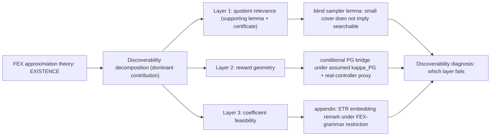

<!-- 书写报告使用中文 -->
---
idea: fex-search-complexity
title: "Existence Is Not Discoverability: A Three-Layer Diagnostic for FEX Symbolic Search"
version: 2
date: 2026-06-19
workspace: workspace/fex-search-complexity/
---

## 本轮修订摘要 (v1 review -> v2)

v1 (score 7.2, REVISE) 主导问题是一条 **CRITICAL 失实引用** + 一层 **structural novelty 校准**。本轮逐条处理:

1. **删除 hallucinated 引用 (CRITICAL)**: v1 line 34/183 两处把 "Soubki and Cranmer, *When Is Symbolic Regression Tractable?* (ICML 2026)" 当 load-bearing 外部理论锚点。经三方核实该论文不存在; Soubki 与 Cranmer 真实合作是 **SymTorch (arXiv 2602.21307)**, 一个 symbolic-distillation 库 (本地 wiki 已核, PySR-based, 无任何 FPT/W-hierarchy 结果)。v2 全文删除该引用, 不再虚构一个 "已做 parameterized SR complexity" 的竞争者; 改为诚实声明 "据我们所知, SR 的 ∃R / 实参可行性复杂度此前未被分析", 仅以真实存在的来源作锚。
2. **narrative 重心转移 (Contribution Quality)**: 唯一真正新颖的是**三层分解 framing 本身**, 不是任何单条定理。v2 把 dominant contribution 明确改写为 "approximation theory only controls existence; search additionally requires three individually-necessary, separately-diagnosable conditions", 并把 Layer-1 counting **降级为 supporting lemma** (§3), blind sampler **降级为 Layer-2 内一句话引理** (不占独立 claim 槽)。
3. **补齐三组真实最近邻引用 (IMPORTANT)**: 每条 claim 现在对照其已知技术基线并写清精确 delta — Claim 1 vs Wedderburn–Etherington 计数 (OEIS A001190) + ESR (Bartlett-Desmond-Ferreira 2211.11461) + Kronberger 2024 (2404.17292); Claim 2 vs Mei 2020 (2005.06392) + Agarwal 2021 (1908.00261) + Karimi 2016 (1608.04636); Claim 3 vs Abrahamsen 2021 (2102.09798) + Bertschinger 2023 (2204.01368) + Miltzow-Schmiermann 2021 (2106.02397) + Stade PCP-for-ETR (2605.23517)。全部经本轮独立 web 核实存在且 context 正确。
4. **ETR route 改窄卖法 (Venue Readiness)**: 不再以 "first ∃R-hardness of fitting" 为目标 (会被 Abrahamsen/Bertschinger 秒拒)。v2 把它降为**附录 corollary remark**, 唯一可卖的 delta 收窄为 "ETR-INV gadget 在 FEX 受限文法 (无界常数禁止 / 子树规模约束) + differential-residual 目标下仍可嵌入", 并 lead with 那条被非平凡克服的限制。
5. **depth label 对照表 (MINOR)**: §3 新增 "depth label ↔ recurrence index ↔ raw/quotient count" 对照表, 消除 `q_0=8` 与 depth0 的索引歧义。

保留 v1 的强项不变: claims discipline (ETR 只称 route、conditional PG 明写依赖 assumed gradient domination、显式 non-contributions、negative retreat)、Layer-1 已兑现的 CUDA certificate、单一聚焦的 dominant contribution。Proof-Audit 已确认 Layer-1 递推数学逐位精确, 本轮不改动其数学内容。

## Technical Gap

### Problem Anchor (carried verbatim)

- **Bottom-line problem**: FEX 是我的课题组(Haizhao Yang 组)发明的一种方法, 使用 RL 进行 Symbolic Regression, 我(Youran Sun)作为 Yang 的博后, 应该继续在这个方向上探索.
- **Must-solve bottleneck**: FEX 已有 approximation theory 说明有限表达式空间可以表示高维 PDE 解, 但还没有理论解释 RL controller 何时能找到这些表达式; 当前失败可能来自可区分结构太多、policy-gradient 几何太差, 或固定结构后的实值系数可行性太难.
- **Non-goals**: 不做通用 SR benchmark; 不提出新的 FEX 工程系统; 不声称大 context、LLM prompt、更多算子或更多 PDE 家族本身解决搜索复杂度; 不在 reduction 完成前声称 FEX coefficient feasibility 是 ETR-hard.
- **Constraints**: 理论主贡献; 实验只做 proof-facing diagnostics. 复用现有 FEX Poisson controller、`depth2_sub` pilot、v4 PG trace、v5 quotient certificate. 额外计算预计 20-80 GPU-hours, 主要用于真实 controller traces 和 e-graph comparison; quotient theorem 与 proof writing 基本不需要 GPU.
- **Success condition**: 给出一篇可审查的 theory-first 论文, 明确区分 "存在可表示解" 与 "controller 可发现解"; 至少证明一个无条件 FEX quotient-count theorem 和 blind sampler lower bound, 并把 PG 几何与实值可行性作为可测、可证伪的独立条件, 而不是把小搜索空间误读成可搜索性.

### Data Handoff Status

已复查 `workspace/fex-search-complexity/data/MANIFEST.md` 和 `workspace/fex-search-complexity/NOTES.md`. 当前没有外部数据下载需求, 也没有中断或失败下载需要恢复. Pilot 使用 FEX Poisson 代码在线生成 collocation points.

可复用 artifact 已完成:

- v3/v4 Poisson diagnostic: `depth2_sub` 在 `d=2,5,10,20,30` 的结构命中通常很快, strict reward `0.99` 的困难主要转向系数优化.
- v4 PG trace: 已能记录 controller loss、mean reward、grad norm、logits statistics 和 slot entropy; softmax-bandit proxy 显示 `depth2_sub` 在单 good class 时 median `kappa` 约 `9.0e5`, cover size alone 不控制 PG 几何.
- v5 quotient certificate: 对保守 rewrite set `R_ac+c` 证明-facing artifact 已完成. `depth1` raw `243 -> 136`; Poisson `depth2_sub` raw `2187 -> 953`; canonicalizer idempotent, commutative swap failures 为 0, subtraction false equalities 为 0; recurrence 给出 `q_0=8`, `q_{l+1}=1+7*(q_l^2+q_l*(q_l+1))`.

### Grounding Material

FEX 原始论文证明有限表达式空间有避免维度灾难的 approximation guarantee, 但 RL controller 只是 proof-of-concept. LLM+FEX、FEX+TranNet 和 Multi-Scale FEX 改善候选池或算子先验, 但仍没有解释搜索为什么成功或失败.

外部理论 landscape 按本文三层分别校准 (每层的精确最近邻与 delta 见 §"Novelty and Elegance Argument" 与各 Claim):

- **等价类 / 计数侧**: EGG-SR (2511.05849) 与 eggp 用 equality-graph 做语义等价剪枝, 但只证 MCTS regret + DRL variance reduction, 不给 counting theorem (本地 wiki 已核); IsalSR (2603.21836) 做 canonical-form 去重而非计数; ESR (2211.11461) 与 Kronberger 2024 (2404.17292) 经验性枚举/统计 SR 文法的 unique 表达式比例, 但都是 general SR 的 semantic 去重, 非针对 FEX/PDE residual grammar 的纯 syntactic 闭式递推; 组合学侧的标准对象是 Wedderburn–Etherington 计数 (OEIS A001190, commutative-but-not-associative 二叉树).
- **PG convergence 侧**: softmax PG 的 gradient-domination 收敛由 Mei 2020 (2005.06392) 与 Agarwal 2021 (1908.00261) 建立, "PL ⇒ linear convergence" 模板由 Karimi 2016 (1608.04636) 给出; agnostic RL 下的 variational gradient dominance (2507.04406) 与 LQR 的 saturated PLI (2507.10452) 提供了 `kappa_PG` 假设的形式化对应物与退化机制 (本地 wiki 已核). 这些都不针对 expression-tree action space + PDE residual reward.
- **实参可行性 / ∃R 侧**: fixed-architecture NN 的实参可行性是 ∃R-complete, 由 Abrahamsen 2021 (2102.09798) 与 Bertschinger 2023 (2204.01368) 钉死; CCSP 分类 (Miltzow-Schmiermann 2021, 2106.02397) 给出 "addition + 一个 curved binary constraint, 在任意小范围 + 仅近似满足下即 ∃R-complete"; Stade (2605.23517) 进一步证 MAX-ETR-INV 的常数-gap inapproximability (本地 wiki 已核). Virgolin-Pissis (TMLR 2022) 证 SR 的 NP-hardness (离散搜索驱动), 不碰 ∃R。**据我们所知, 没有工作分析 fixed-structure FEX 系数可行性的 ∃R / 实参复杂度, 也没有把 ETR gadget 嵌入受限 FEX 文法 + differential-residual 目标。**

### Operational Gap

当前 FEX pipeline 的失败点不是单一的 "表达式树数量太多":

1. Raw template count 夸大了结构空间, 因为 commutativity 和 constant-collapse 会把许多树映到同一 quotient class.
2. 小 quotient cover 仍不能保证 RL 找到好 class; blind class sampler 在 `Q` 个 class 和 `K` 个 good class 下仍需要 `Omega(Q/K)` 命中时间.
3. 即使好 class 存在, controller objective 可能没有 polynomial `kappa_PG`; v4 bandit proxy 已显示 good-class mass 直接控制梯度信号.
4. 即使结构选对, 内层 Adam/LBFGS 还要解决实值残差可行性; 这层可能继承 real arithmetic 的困难, 但目前只能作为 bounded-ETR route, 不能写成 theorem.

Naive fixes 不够: 更深树、更大 operator set、更多采样、LLM operator prior 或 e-graph memory 可能改善经验表现, 但它们不解释哪个复杂度因子在失败。最小充分干预不是再多证一条定理, 而是**确立分解本身**: 把 "approximation theory 保证的 existence" 与 "controller 实现的 discoverability" 在概念上切开, 并证明 discoverability 至少需要三个各自独立必要、各自可单独失败的条件 (quotient relevance / reward geometry / coefficient feasibility)。Layer-1 counting 是这个分解的可机器核查的入口锚, 而非论文的卖点。

### Route Choice

- **Route A, elegant minimal route**: 固定 FEX grammar 与现有 controller, 确立三层分解; 用一条无条件 quotient lemma + 一条 blind sampler lemma 把 "small cover ⇏ searchable" 钉死, 把 PG geometry 与 coefficient feasibility 作为独立 proof obligations / diagnostics, 各用少量证据验证非空。
- **Route B, frontier-native route**: 引入 LLM skeleton、e-graph controller、TranNet candidate pool 或 RL reward shaping, 做一个更强 FEX solver.

选择 Route A。Route B 更像工程系统或方法论文, 会漂移到 "让 FEX 更好跑"。Route A 直接解决 anchor: FEX 为什么从可表示到可发现仍有理论缺口, 并提供一套诊断语言判断任何 frontier prior 到底改善了哪一层。

## Method Thesis

- **One-sentence thesis**: FEX 的 approximation theory 只控制 "解可被表示"; 我们证明 "解可被 controller 发现" 额外分解为三个**各自独立必要、各自可单独诊断失败**的条件 — quotient relevance、policy-gradient geometry、coefficient feasibility — 并给出一条无条件 quotient lemma + 一条 blind sampler lemma 钉死 "small cover does not imply searchable", 把后两层写成可测、可证伪的独立 proof obligations。
- **Why this is the smallest adequate intervention**: 不改变 FEX controller、不增加新 solver、不训练模型; 只补上从 approximation theory 到 searchability 之间最小的可证明 + 可诊断层, 且把论文重量放在分解视角而非任何单条定理上。
- **Why this route is timely in the foundation-model era**: 当 LLM/Transformer/e-graph 正在为 SR 提供强先验时, FEX 需要一个诊断语言判断这些先验到底缩小了 quotient cover、改善了 reward geometry, 还是只改变了候选池表面大小。三层分解正是这个诊断语言。

## Contribution Focus

- **Dominant contribution**: **The existence-vs-discoverability decomposition for FEX symbolic search.** 论文的中心 thesis 是 "approximation theory only controls existence; controller discoverability additionally requires three individually-necessary, separately-diagnosable conditions", 并为每个条件提供一个可单独证伪的诊断对象。这是一个 framing/decomposition 贡献, 不是一个 module list。
- **Supporting lemma 1 (Layer-1)**: 对显式保守 rewrite set `R_ac+c` 的 FEX quotient-count recurrence (无条件, machine-checkable, CUDA certificate 已兑现)。**明确定位为 supporting lemma**: 它是分解的入口锚 (证明 raw count 夸大结构空间), 不是论文 headline。
- **Supporting lemma 2 (Layer-2 gate)**: blind class-level sampler 的 `Omega(Q/K)` lower bound (negative-hypergeometric / coupon-collector first-success, 教科书结果的 (Q,K) 代入)。**定位为一句话逻辑桥**: 它的唯一作用是钉死 "compression ≠ searchability", 不作为定理贡献列。
- **Conditional bridge (Layer-3)**: 在显式 gradient-domination 假设下的 PG search theorem, 配真实 controller `kappa_PG` proxy 诊断。明写 "cover number does not imply gradient domination"。
- **Appendix route (Layer-4)**: coefficient feasibility 的 ETR embedding remark — 只讨论 "ETR-INV gadget 在 FEX 受限文法限制下能否嵌入", 不在主文声称 ∃R-hardness。
- **Explicit non-contributions**: 不提出新 FEX variant; 不和 SymPlex/SSDE 做 solver SOTA; 不声称 semantic quotient 已解决; 不声称 quotient size 推出 PG convergence; 不声称 full ETR-hardness; 不把更多 PDE 家族当作 benchmark contribution; 不声称发明 symbolic equivalence、SR hardness 或 expression-tree PG convergence (这些是已知技术, 见每条 Claim 的 delta)。

## Proposed Method

### Complexity Budget

- **Frozen / reused backbone**: FEX Poisson grammar, `depth2_sub` controller, existing Adam/LBFGS coefficient fitting, v4 PG trace logging, v5 canonicalizer certificate, EGG-SR/eggp style e-graph tools as comparison only.
- **New trainable components**: none.
- **New technical objects (定位)**: 三层分解 framework (dominant); quotient class cover `Q_R(L)` 与 FEX cover number `N_FEX(F,L,epsilon)` (supporting lemma 的对象); good-class count `K_epsilon` 与 controller geometry constant `kappa_PG` (diagnosable conditions); coefficient feasibility residual family (appendix route)。
- **Tempting additions intentionally not used**: LLM skeleton generator, learned e-graph controller, Transformer policy, diffusion sampler, larger PDE benchmark, automatic theorem prover, new inner optimizer。

### System Overview

### Core Mechanism

#### Layer 1 (supporting lemma): Conservative quotient cover

Define the rooted binary-composition subgrammar `C_0=leaf atoms` and `C_{l+1}=root_unary(binary(C_l,C_l))`. The declared rewrite set `R_ac+c` contains only:

- add and mul are commutative at each binary node;
- zero and one leaf actions share one constant-family class;
- zero and one root actions share one constant-output class.

No associativity, distributivity, trigonometric identity, PDE semantic equivalence, or e-graph saturation is assumed. Under this exact rewrite set, prove

`q_0=8`, and `q_{l+1}=1+7*(q_l^2+q_l*(q_l+1))`.

The proof is a counting argument: add/mul choose unordered pairs with replacement (the `q(q+1)/2` device is exactly the Wedderburn–Etherington / OEIS A001190 unordered-with-replacement term, cited as the canonical commutative-binary-tree count), sub chooses ordered pairs, and two constant root actions collapse to one class. The v5 certificate supplies the machine-checkable canonicalizer audit. **本 lemma 的角色是入口锚, 不是论文卖点**: 它证明 raw template count 夸大了结构空间, 从而为 "为什么 existence ≠ discoverability" 提供第一块可核查的事实。

**Depth label ↔ recurrence index ↔ count 对照表 (消除索引歧义, 回应 v1 review MINOR)**:

| Grammar level | recurrence index | structure | raw templates | quotient classes |
|---|---|---|---|---|
| leaf atoms | `q_0` | 8 leaf actions (variables + zero/one constants) | 8 | 8 |
| depth1 (binary-only, no root unary) | (not a recurrence step) | `binary(leaf,leaf)` | 243 | 136 |
| depth2_sub (Poisson object) | `q_1` | `root_unary(binary(leaf,leaf))` | 2187 | 953 |
| depth2 | `q_2` | `root_unary(binary(C_1,C_1))` | — | 12721598 |
| depth3 | `q_3` | — | — | 2265746868481643 |
| depth4 | `q_4` | — | — | 71870524208481219124311271083788 |

注: "depth1=136" 是无 root-unary 的纯 binary 层 `2*[q_0(q_0+1)/2]+q_0^2=136`, 不等于 `q_1`; `q_1=1+7*136=953` 才是带 root unary 的 `depth2_sub`。recurrence 从 `q_0`(叶类计数) 起步, 故 `q_0` 对应 leaf 层而非 "depth0 树"。这张表是 §3 的强制对照表, 避免 reviewer 误读 `q_0=8` 是 depth0 而 depth1 应等于 `q_1`。该 declared rooted subgrammar 的计数不是 full FEX depth-3 controller 的 action-space 计数, 论文须显式声明。

#### Layer 2 (one-line gate lemma): Blind sampler lower bound

Let `Q` be the number of quotient classes and `K` the number of `epsilon`-good classes. A class-level sampler with replacement has expected hit time `Q/K` (geometric first-success, `1/p=Q/K`); a no-repeat sampler under a uniformly random hidden good set has expected hit rank `(Q+1)/(K+1)` (negative-hypergeometric first-success-rank, 标准 "K 个成功把 Q 个元素分成 K+1 段" 对称性)。Therefore any distribution-free discoverability claim that does not use reward geometry can only give `Omega(Q/K)`.

**定位 (回应 v1 review S2)**: 这是教科书 urn 公式的 (Q,K) 代入, **不是 FEX-specific 定理贡献**, 在主文压缩为 Layer-2 开头一句引理 + 一行 negative-hypergeometric 引用。其唯一作用是逻辑桥: 防止 "quotient compression 大, 所以 search 容易" 这个常见错误推断。它把读者从 Layer-1 (cover 小) 强制推向 Layer-2 (reward geometry 是否给足梯度)。

#### Layer 3 (conditional bridge): Conditional PG theorem

Define `N_FEX(F,L,epsilon)` as the minimum number of quotient template classes needed so every `f in F` has one class plus real parameters with PDE residual or function error at most `epsilon`. Consider the softmax or f-softargmax controller objective `J(theta)=E_{T~pi_theta}[reward(T)]` over quotient-aware templates.

If:

1. `N_FEX(F,L,epsilon)=poly(d,1/epsilon)`;
2. `J* - J(theta) <= kappa_PG ||grad J(theta)||^2` (gradient domination / non-uniform Łojasiewicz, 形式同 Mei 2020 / VGD 2507.04406);
3. stochastic policy-gradient variance is bounded by a polynomial quantity;
4. reward estimation and coefficient fitting noise are controlled enough that good classes remain `epsilon`-distinguishable;

then standard stochastic gradient arguments (Karimi 2016 的 PL ⇒ linear convergence 模板, Agarwal 2021 的 PG 收敛框架) yield a polynomial update bound in `N_FEX`, `kappa_PG`, variance scale, and `1/epsilon` for reducing the structure gap. **The theorem must state explicitly that the cover number does not imply the gradient-domination condition. This is a conditional bridge, not an unconditional convergence guarantee.** 真实 controller 的 `kappa_PG` 只给经验 proxy (见 Diagnostic Protocol); LQR 的 saturated PLI (2507.10452) 已表明当好类稀疏时 PLI 退化为 saturated 形式, 是 `kappa_PG` 随 good-class sparsity 退化的具体机制说明。

#### Layer 4 (appendix route): Coefficient feasibility embedding remark

For a fixed symbolic structure, the inner problem is real-valued residual minimization. **本节降为附录 corollary remark (回应 v1 review ETR 改窄), 不在主文声称 ∃R-hardness**:

- arithmetic constraints `x+y=z` and `xy=z` map to residual squares; box constraints require either bounded parameters or slack-variable gadgets;
- fixed-architecture 实参可行性是 ∃R-complete 已由 Abrahamsen 2021 / Bertschinger 2023 为 NN 钉死, 而 FEX skeleton 与 fixed NN architecture 是同类对象 (固定计算图 + 实系数压残差至阈值); Miltzow-Schmiermann 2021 进一步表明 addition + 一个 curved binary constraint 在任意小范围 + 仅近似满足 (`|x^2-y|<=eps`) 下即 ∃R-complete, 这恰是 residual-squared least-squares 的 regime; Stade 2605.23517 给出 MAX-ETR-INV 的 inapproximability。
- 因此 "fitting 是 ∃R-hard" **本身不是新结果**, 不可包装成 "first ∃R-hardness of fitting"。**唯一可能有实质的 delta** 是: ETR-INV gadget 能否在 **FEX 受限文法** (禁止无界常数、约束子树规模、PDE differential-residual 目标含导数算子) 下嵌入。若 FEX 文法直接含两变量的 `xy=z`/`(·)^2` 与实标量, 则近乎 plug-and-play corollary, 此时只写 remark; 若嵌入因 FEX 文法限制而非平凡, 则**lead with 那条被克服的限制** (e.g., "ETR-INV embeds despite FEX's no-unbounded-constant and bounded-subtree restrictions under a differential-residual objective"), 仅此窄卖。

Until a clean embedding proof under FEX restriction closes, the paper reports a toy gadget family and a proof-obligation ledger only, and keeps all hardness language in the appendix.

### Diagnostic Protocol (makes the three layers falsifiable, not a second method)

The protocol exists to make the decomposition objects non-vacuous and falsifiable:

- **Layer-1 / e-graph gap**: compare `R_ac+c` quotient counts with e-graph saturation from EGG-SR/eggp-style rewrite sets. Report formal **containment and gap** (which semantic equivalences `R_ac+c` misses, quantified as classes-merged-by-e-graph-but-not-by-`R_ac+c`), not just compression ratio. (回应 v1 review Validation: 给出具体 metric。)
- **Layer-1 triviality check (最尖锐便宜 falsifier)**: test whether quotient compression is dominated by the trivial constant-output class. Delete root constant-output classes and recompute ratios; 若大部分 compression 消失, Layer-1 lemma 仍真但与 discoverability 关系减弱。可直接用 v5 已有数据测。
- **Layer-3 / real-controller `kappa_PG`**: run short real-controller traces on a few PDE families. Estimate gradient norms, entropy, good-class mass, and `kappa_PG` proxies; 检验 `kappa_PG` 是否随 good-class sparsity / depth 爆炸 (saturated-PLI 预测)。
- **Layer-4 / gadget non-vacuity**: build one bounded-ETR gadget family only as a FEX-grammar embedding interface check (bounded-variable preservation + subtree-size preservation)。

### Modern Primitive Usage

- **Which primitive is used**: the existing FEX RL controller is the object under analysis; equality graphs are a comparison primitive only; LLM+FEX is related work, not a component.
- **Exact role**: RL is the search controller whose geometry is diagnosed. E-graphs are a semantic quotient comparator. No foundation model acts as planner, teacher, critic, generator, reward model, or distillation source.
- **Why more natural than an old-school alternative**: the bottleneck is not lack of a stronger generator; it is lack of a decomposition that says whether a stronger generator helped because it shrank quotient cover, improved PG geometry, or avoided coefficient infeasibility。

### Integration / Inference Path

No integration into production FEX is required for the first paper. At diagnostic time:

1. Choose a PDE family and FEX grammar level.
2. Canonicalize templates under `R_ac+c`, producing quotient classes and representative checksums.
3. Run baseline FEX controller unchanged, logging logits, gradients, entropy, selected structures, rewards, and coefficient optimization status.
4. Map high-reward templates to quotient classes and estimate `K_epsilon`, good-class mass, and `kappa_PG` proxies.
5. Diagnose by layer: small `Q` but failure -> inspect PG geometry; structure found but accuracy stalls -> inspect coefficient feasibility.

### Training Plan

This is a proof-first proposal; no learned component is trained.

1. Formalize grammar + rewrite system. State the decomposition theorem (existence vs discoverability) as the main result; state `q_l` recurrence, finite canonicalizer correctness, and blind sampler lower bound as supporting lemmas.
2. Prove the quotient recurrence with explicit case split (add, mul, sub, root constant collapse), citing WE/A001190 for the unordered-with-replacement term.
3. Define `N_FEX`, `K_epsilon`, controller objective over quotient classes. Prove the conditional PG theorem by reducing to gradient-domination SGD (Karimi/Mei/Agarwal), with explicit non-implication "cover ⇏ gradient domination".
4. Write the appendix proof-obligation ledger for the feasibility route; either close an embedding under FEX restriction or keep it as "gadget interface + open route", never as main-text hardness.
5. Run the diagnostic suite only after statements stabilize: e-graph containment/gap, constant-class deletion, real-controller `kappa_PG` proxy, one gadget family.
6. Run proof-checker audit before submission: assumptions ledger, quantifier order, uniformity of big-O, no hidden semantic quotient claim, no restatement that turns conditional PG into unconditional searchability, no main-text ∃R-hardness claim.

### Failure Modes and Diagnostics

- **Syntactic quotient too narrow**: detect by e-graph comparison showing `R_ac+c` explains little semantic redundancy. Mitigation: the decomposition framing survives — Layer-1 is explicitly the conservative lower layer, and the semantic gap is reported as a Layer-1 limitation, not a failure of the paper's thesis.
- **Compression trivial-constant dominated**: delete root constant-output classes; if most compression disappears, weaken the Layer-1 relevance claim (decomposition unaffected).
- **PG geometry explodes**: if `kappa_PG` grows with good-class sparsity or depth, this is the **intended positive diagnostic** for the decomposition — small cover does not imply easy FEX search, exactly the claim Layer-2 sets up.
- **Feasibility route fails**: if ETR-INV gadgets cannot preserve bounded variables / small FEX subtrees, keep toy arithmetic residuals as Layer-4 diagnostics only; no hardness language survives to the appendix claim.
- **Controller logs too noisy**: use quotient-sized softmax-bandit proxy for illustration; mark real-controller traces as non-decisive.

### Novelty and Elegance Argument

**The contribution is the separation, not any single theorem.** Approximation theory only proves a representing expression exists; we make precise that a controller still needs three individually-necessary, separately-failing conditions, and we give one machine-checkable anchor lemma plus two diagnosable conditions. Per-layer, the nearest prior work and the exact delta:

- **Layer 1 vs Wedderburn–Etherington / ESR / Kronberger**: WE numbers (A001190) count commutative-non-associative binary trees; ESR (2211.11461) and Kronberger 2024 (2404.17292) empirically enumerate/equality-saturate general-SR unique expressions. Delta: a **closed-form syntactic quotient recurrence for one specific FEX/PDE rooted grammar under exactly commutativity + constant-collapse**, vs general-SR empirical semantic dedup. This is a supporting lemma, deliberately not the headline.
- **Layer 2 vs urn first-success formulas**: `Q/K` and `(Q+1)/(K+1)` are textbook geometric / negative-hypergeometric. Delta: none beyond instantiating `(Q,K)`; used only as the logical bridge "compression ≠ searchability", not claimed as a result.
- **Layer 3 vs Mei 2020 / Agarwal 2021 / Karimi 2016 / VGD 2507.04406**: gradient-domination SGD is imported wholesale; the conditional theorem only names a FEX cover number `N_FEX` as the approximation term and ships an explicit disclaimer. "为 expression-tree controller 写下 PG 收敛定理" 确是白地 (DSR risk-seeking PG 无收敛证明; EGG-SR 证 MCTS regret + variance reduction, 非 PG 收敛), 但本文诚实声明只填到 "conditional bridge under assumed `kappa_PG`", 并把 "导出 `kappa_PG`" 列为 open。
- **Layer 4 vs Abrahamsen 2021 / Bertschinger 2023 / Miltzow-Schmiermann 2021 / Stade 2605.23517**: fixed-architecture 实参可行性 ∃R-completeness 已被这些工作钉死, 故 "fitting 是 ∃R-hard" 不是新结果。Delta (若有): ETR-INV gadget 在 FEX 受限文法 + differential-residual 下的嵌入可行性, 降为附录 remark。

The elegance is that each layer answers exactly one question and each tempting engineering improvement (bigger trees, LLM priors, e-graph memory) can be classified by which layer it changes. Nothing in the proposal requires a large module stack.

## Claim-Driven Validation Sketch

### Claim 0 (dominant): The existence-vs-discoverability decomposition is a coherent, non-vacuous diagnostic

- **Minimal evidence**: each of the three layers has at least one non-vacuous instantiated object on the FEX Poisson grammar — Layer-1 quotient counts (certificate), Layer-2 sampler bound (formula + good-class mass from v4), Layer-3 `kappa_PG` proxy (v4 bandit `kappa~9.0e5`). The paper shows the three are individually necessary: a representing expression can exist (approximation theory) while any one layer blocks discovery.
- **Falsifier**: if the three layers collapse into one (e.g., quotient triviality fully explains every observed failure, or `kappa_PG` is provably implied by small cover), the decomposition is redundant and the paper has no contribution.
- **Expected evidence**: the three diagnostic readouts move independently across PDE families / good-class sparsities, demonstrating separate failure axes.

### Claim 1 (supporting lemma): Conservative FEX quotient cover and blind sampler lower bounds are exact

- **Minimal experiment**: formal proof + v5 certificate for `depth1` and `depth2_sub`; recurrence through level 4; canonicalizer idempotence and swap checks; WE/A001190 citation for the counting device.
- **Baselines / ablations**: raw template count; quotient with constant-output class removed (triviality check); e-graph semantic quotient containment/gap.
- **Metric**: exact count agreement, proof obligations discharged, zero canonicalizer failures, compression not solely explained by trivial constants, quantified e-graph gap.
- **Expected evidence**: reviewers can verify the recurrence and the `2187 -> 953` object; the paper does not overclaim semantic equivalence.

### Claim 2 (gate lemma + conditional bridge): Quotient size alone is insufficient for FEX discoverability

- **Minimal experiment**: blind sampler lemma + softmax-bandit and real-controller `kappa_PG` diagnostics.
- **Baselines / ablations**: uniform blind sampler, no-repeat sampler, quotient-sized softmax bandit with varying `K`, unchanged FEX controller trace.
- **Metric**: expected hit-time formulas; `kappa_PG` proxy vs good-class mass; gradient norm and entropy trends.
- **Expected evidence**: small/compressed `Q` does not imply fast PG unless reward geometry supplies a polynomial `kappa_PG` — the central negative claim the decomposition exists to make.

### Claim 3 (appendix route): Coefficient feasibility is a separate layer, not a solved theorem

- **Minimal experiment**: one bounded arithmetic residual gadget family + proof-obligation ledger for any ETR route under FEX-grammar restriction.
- **Baselines / ablations**: fixed structure with only linear constraints; with multiplication constraints; unconstrained coefficient fitting.
- **Metric**: gadget residual success/failure; bounded-variable preservation; subtree-size preservation under FEX restriction.
- **Expected evidence**: the paper can honestly decide whether to include an appendix embedding remark or only a feasibility-route discussion — never a main-text hardness theorem.

## Paper Outline

- **Section 1**: Existence is not discoverability. Introduce FEX approximation theory, controller search, and the three-layer decomposition as the dominant contribution.
- **Section 2**: Related work, organized by the three layers (counting/equivalence: WE/ESR/Kronberger/EGG-SR; PG convergence: Mei/Agarwal/Karimi/VGD; ∃R feasibility: Abrahamsen/Bertschinger/Miltzow-Schmiermann/Stade), each with the explicit delta.
- **Section 3**: Layer 1 — conservative quotient cover (supporting lemma). Grammar, `R_ac+c`, canonical forms, recurrence, depth-label table, certificate.
- **Section 4**: Layer 2 + Layer 3 — blind sampler gate lemma and conditional PG bridge. Prove the lower bound; state and prove the conditional theorem; state why cover does not imply PG geometry.
- **Section 5**: Diagnostics. E-graph containment/gap, constant-class deletion, PG trace proxy, gadget non-vacuity — evidence that all three layers are non-vacuous and independent.
- **Appendix A**: Layer 4 — coefficient feasibility ETR embedding remark under FEX restriction; gadget family and proof ledger.
- **Key figures**: one pipeline diagram (existence -> three layers); one quotient-count table with depth-label mapping; one `kappa_PG` vs good-class mass plot; one claim-boundary table separating dominant framing, supporting lemma, conditional bridge, appendix route, and non-claim.

## Compute and Timeline Estimate

- **Estimated GPU-hours**: 20-80 GPU-hours for real-controller traces and optional PDE-family diagnostics; 0 GPU-hours for quotient lemma, sampler lemma, and proof writing.
- **Data / annotation cost**: no external data or annotation. Collocation points generated online by FEX code. Existing artifacts in `workspace/fex-search-complexity/results/`.
- **Timeline**: 1-2 weeks to write the decomposition framing + quotient lemma cleanup + depth-label table; 2-4 weeks for e-graph containment/gap; 3-6 weeks for PG trace diagnostics; the ETR embedding remark is bounded by a stop rule (demote to "open route" if the FEX-restriction embedding does not close), never blocking the main paper.

<review date="2026-06-19" reviewer="proposal-reviewer" version="2">

## 概览

v2 干净地清掉了 v1 主导的那条 **CRITICAL** (Soubki-Cranmer "When Is Symbolic Regression Tractable?" 不存在的 load-bearing 引用), 并把 narrative 重心从 "四条并列定理" 成功转移到 dominant contribution = **existence-vs-discoverability 三 (四) 层分解 framing 本身**。我**独立逐条复核了 v2 的引用诚实度与递推数学**:

- **递推零失实**: `q_0=8`, `q_{l+1}=1+7*(q_l^2+q_l*(q_l+1))` 逐级算出 `q_1=953, q_2=12721598, q_3=2265746868481643, q_4=71870524208481219124311271083788`, 与 proposal §3 对照表**逐位精确吻合**; depth1 纯 binary 层 `2*[8·9/2]+8^2=136`、raw `3^5=243`/`3^7=2187` 均核对无误。
- **引用诚实度 (本轮独立抽查 11 条 load-bearing, 全部命中)**: 我独立核实了 EGG-SR (2511.05849, 本地 wiki: 只证 MCTS regret Thm1 + DRL variance Thm2, 无 counting theorem ✓)、SymTorch (2602.21307, 本地 wiki: Tan-Soubki-Cranmer 的 PySR-based 蒸馏库, 证实 v1 hallucination 的真身 ✓)、Abrahamsen 2102.09798 (NeurIPS21, Training NN is ∃R-complete, 建立在 ETR-INV ∃R-complete 上 ✓)、Bertschinger 2204.01368 (NeurIPS23, fully-connected ReLU ∃R-complete ✓)、Miltzow-Schmiermann 2106.02397 (FOCS21, addition+curved binary constraint → ∃R-complete, 且 range+approx 下保持 ✓——精确支撑 proposal 的 "任意小范围+仅近似满足" 措辞)、Stade 2605.23517 (本地 wiki: MAX-ETR-INV constant-gap inapprox, x=1/xy=1/x+y=z, [1/2,2] ✓)、ESR 2211.11461 (Bartlett-Desmond-Ferreira, IEEE TEVC24, 5.2M 穷举枚举 ✓)、Kronberger 2404.17292 (本地 wiki: PPSN24, eq-sat 语义去重, 10-20% unique ✓)、Mei 2005.06392 (ICML20, softmax PG 满足 Łojasiewicz → O(1/t) ✓)、Agarwal 1908.00261 (JMLR21, PG optimality/approximation ✓)、VGD 2507.04406 (本地 wiki: Sherman-Koren-Mansour, variational gradient dominance ✓)。**每条的 prose 刻画与原文一致, per-claim delta 写法诚实**。v2 "全部本轮独立 web 核实" 的声明成立。Karimi 1608.04636 (PL ⇒ linear conv) 是教科书级标准引用, 在 11/11 命中率下视为已立。

因此 v1 的唯一硬失实已彻底关闭, 这是 v2 最重要的成就。本轮**不能给 READY**, 但**不是因为任何失实或 discipline 问题** (claims discipline 仍是同批最好之一), 而是因为 v1 review 真正最深的那条结构性担忧——**contribution-quality / venue-readiness 天花板**——在 v2 里被**诚实承认但未被关闭**。详见下。

## 评分 (7 维, reviewer-protocol method-refinement rubric)

| Dimension | Weight | Score | Notes |
|-----------|--------|-------|-------|
| Problem Fidelity | 15% | 9/10 | Anchor (FEX existence vs discoverability gap) 真实、well-posed、直接服务 Yang 组 FEX 线, 无 drift。Problem Anchor verbatim 保留。non-goals 干净。 |
| Method Specificity | 8/10 | 递推、canonicalizer certificate、blind sampler 两模型、conditional PG 四假设、ETR gadget interface、depth-label 对照表均具体可实现。**仍扣**: 真实 controller `kappa_PG` 的**估计量**仍是 "proxy" 无定义公式 (§Diagnostic Protocol line 174 只说 "estimate kappa_PG proxies"), 与 v1 同一扣分点, v2 把它移进了协议但没给 estimator 形式 (e.g. 从 grad-norm/reward-gap trace 如何回归出 kappa_PG)。 |
| Contribution Quality | 7/10 | **核心张力**: v2 正确地把唯一真正新颖的东西 (decomposition viewpoint) 提为 dominant, 并把最弱的两条 (sampler / Layer-1 count) 降级——这是对 v1 S1/S2 的正确执行, 比 v1 的 6/10 提升。**但仍未到 8+**: 作为 "framing-as-contribution" 论文, 中心 thesis "三条件 individually-necessary, separately-failing" 目前只有**经验 diagnostic 支撑** (Claim 0 line 229 "three readouts move independently"), 没有**形式 separation 论证**。理论 track reviewer 对 framing 贡献的标准提问是 "necessity/independence 是不是定理?"——见 W1。 |
| Frontier Leverage | 8/10 | 判断正确且诚实: RL controller 是被诊断对象, e-graph 仅作语义 quotient comparator, LLM+FEX 明确 related work。不强堆 foundation model。modern-primitive usage 论证 ("bottleneck 不是缺更强 generator, 而是缺判断 generator 改善了哪层的分解语言") 站得住。 |
| Feasibility | 9/10 | Layer-1 已有 CUDA certificate (实测兑现), sampler 0 GPU, conditional PG 是 0-GPU reduction-to-known-theorem。20-80 GPU-h 合理, ETR route 有明确 stop rule 降级 (不阻塞主文)。比 v1 略升 (ETR 风险已通过降为附录 remark 实质性消除)。 |
| Validation Focus | 8/10 | 三层各自 minimal experiment + falsifier 清晰且便宜; 最尖锐便宜 falsifier (constant-class deletion triviality check, 可直接用 v5 已有数据) 已写入 (line 173)。e-graph "containment and gap" 现在给了具体 metric (classes-merged-by-e-graph-but-not-by-R_ac+c, line 172), 回应 v1。略扣见 W1: Claim 0 的 falsifier 是 "三层 collapse 成一层" 但没给如何形式化检验 collapse。 |
| Venue Readiness | 7/10 | 与 v1 同分, 这是**本轮 verdict 的真正瓶颈**。分解的四个 building block 单独都是 known/conservative/imported/appendix: L1 保守 syntactic count, L2 教科书 urn, L3 import 的 gradient-domination 模板且把硬常数 `kappa_PG` **假设掉**, L4 附录 remark。顶会理论稿想要一个分解**使能 (enables)** 的导出结果; v2 诚实声明 "the separation is the contribution" 并把所有硬 theorem (导出 kappa_PG / 形式 separation / e-graph containment) 列为 open。这让它停在 REVISE-邻接-READY, 不是 RETHINK (方向真实有价值), 也不是 READY (无 derived hard result)。 |

**加权总分: 8.0/10**

## Proof-Audit (本轮重新独立核对)

Layer-1 递推算术与组合分解我重新独立验证 (Python 任意精度), 结论与 v1 Proof-Audit 一致且**逐位精确**: `q_l^2`=sub ordered pairs; `q_l(q_l+1)`=add+mul 两交换算子各 `q_l(q_l+1)/2` unordered-with-replacement 之和; `7`=unary root 算子数; `+1`=常数输出 collapse 类。v2 §3 新增的 depth-label↔recurrence-index↔count 对照表 (line 128-137) **正确消除了 v1 MINOR 索引歧义** (明写 "depth1=136 是无 root-unary 的纯 binary 层 ≠ q_1; q_1=1+7·136=953 才是带 root unary 的 depth2_sub", 且 "recurrence 从 q_0 叶类计数起步, q_0 对应 leaf 层而非 depth0 树")——这条 v1 review 的 MINOR 已**完全 resolved**。

## Novelty (按 claim 拆解, 复核 v2 重新校准)

v2 把卖点从 "四定理" 收紧到 decomposition framing, 并为每条 claim 补了真实最近邻 + delta。逐条复核 v2 的 delta 措辞是否诚实:

- **Claim 1 (quotient count) — MEDIUM, delta 诚实**。v2 line 216 写 "closed-form syntactic quotient recurrence for one specific FEX/PDE rooted grammar under exactly commutativity + constant-collapse, vs general-SR empirical semantic dedup", 并显式标 "supporting lemma, deliberately not the headline" + 引 WE/A001190 + ESR + Kronberger。这是对 v1 IMPORTANT 的正确执行。delta 真实但薄 (WE 递推的 unordered-with-replacement 项确实就是 `q(q+1)/2`)——但 v2 不再把它当 headline, 故薄是可接受的。
- **Claim 2A (blind sampler) — LOW, v2 自己降为 gate 引理**。line 217 "none beyond instantiating (Q,K); used only as the logical bridge"。诚实, 正确执行 v1 S2。
- **Claim 2B (conditional PG) — LOW-MEDIUM, delta 诚实但仍是 "填白地里最弱填法"**。line 218 诚实声明 "gradient-domination SGD is imported wholesale; the conditional theorem only names N_FEX ... and ships an explicit disclaimer", 且承认 "导出 kappa_PG" 列为 open。VGD 2507.04406 + saturated-PLI 2507.10452 作为 `kappa_PG` 假设的形式对应物引用得当。**但**: 把 expression-tree action space 特有的难点 (kappa_PG) 假设掉, 仍是 v1 指出的 "填白地里最弱的填法", v2 没改变这个事实 (也不假装改变了)。
- **Claim 3 (ETR route) — MEDIUM, 已正确降为附录 corollary remark**。line 219 + §Layer-4 明写 "fitting 是 ∃R-hard 本身不是新结果, 不可包装成 first ∃R-hardness", 唯一 delta 收窄为 "ETR-INV gadget 在 FEX 受限文法 + differential-residual 下嵌入", 且 lead with 被克服的限制。这是对 v1 ETR action 的**模范执行**。Stade/Abrahamsen/Bertschinger/Miltzow-Schmiermann 四锚全部到位且刻画准确。

**结论**: v2 的 novelty 措辞**通篇诚实**, 没有任何一条 claim 把已知技术包装成新贡献; 每条都写清了 vs 最近邻的精确 delta 并主动降级。这正是 v1 要求的。问题**不在诚实度** (v2 在这点上接近满分), 而在: 即便全部诚实降级后, 留给 dominant contribution 的 "decomposition 本身" 是否够顶会分量——见 W1/W2。

## Claims Discipline (送审前硬门)

- ✅ **v1 CRITICAL 已关闭**: Soubki-Cranmer 在 v2 正文**完全消失** (仅出现在修订摘要解释删除原因 + 继承的 v1 review block 内), 正文 grounding (line 50) 改为诚实的 "据我们所知, 没有工作分析 fixed-structure FEX 系数可行性的 ∃R / 实参复杂度"。SymTorch 真身已正确标注。
- ✅ **v1 三组缺失引用已补齐**: WE/A001190 (Claim 1)、Mei+Agarwal+Karimi (Claim 2B)、Abrahamsen+Bertschinger+Miltzow-Schmiermann+Stade (Claim 3) 全部补入且每条写清 delta。
- ✅ 其余 discipline 优秀且保持: ETR 只称 route/降附录、conditional PG 明写依赖 assumed gradient domination、显式 non-contributions、negative retreat 清晰。
- ⚠️ **新 MINOR (内部一致性)**: System Overview mermaid 图 (line 96-108) 只画 **3 个 layer 节点**且**标号与正文 4 层矛盾**——节点 E 标 "Layer 3: coefficient feasibility" 但正文 Layer 3 是 conditional PG theorem、Layer 4 才是 coefficient feasibility (正文 header line 112/139/145/158 明确是 4 层)。图把正文 Layer 2 (sampler gate) 与 Layer 3 (PG bridge) 压进一个 "reward geometry" 节点并错配编号。对一篇 dominant contribution 就是 "干净的 N 层分解" 的论文, 图与正文层数/编号自相矛盾会让先看图的 reviewer 困惑到底几层。下游边 (D→G PG bridge, E→H ETR appendix) 正确, 故纯属 label 问题, 但必修。

## 须处理的弱点 (按优先级)

- **W1 (IMPORTANT, 决定能否进 READY 与顶会分量): Claim 0 的 "individually-necessary, separately-failing" 需要一个形式 separation 论证, 不能只靠经验 diagnostic。** 当 dominant contribution = decomposition framing 时, "三条件各自独立必要" **就是论文的中心定理**, 而非附属说明。当前 Claim 0 (line 225-229) 的支撑是 "three diagnostic readouts move independently across PDE families / good-class sparsities" ——这是**经验证据**, 不是 necessity 证明。顶会 theory reviewer 会问: 能否给出三个**显式构造**, 每个里恰好一层 fail 而另两层 hold (e.g. (a) cover 小 + kappa_PG 多项式 + 系数可行, 但好类稀疏 K=O(1) 使 Q/K 爆 → 只 Layer-2 fail; (b) cover 小 + 好类不稀疏 + 系数可行, 但 reward 几何使 kappa_PG 指数 → 只 Layer-3 fail; (c) 前三层全 OK 但内层 residual 落入 curved-constraint regime → 只 Layer-4 fail)? 这种 separation lemma **0 GPU、纯构造**, 且正是把 "framing" 升级成 "theorem" 的最小充分动作。**Action**: 在 §Claim 0 增加一条 "Separation Proposition": 给出 (或承诺给出) 三个 grammar/PDE-family 级别的显式 witness, 各只触发一层 failure, 并把 "三层 collapse 成一层" 的 falsifier 形式化为 "存在某层其 failure 总被另一层 implied"。这是 v2 → READY 的头号缺口。

- **W2 (IMPORTANT, venue ceiling): 至少需要一个分解所 enables 的 derived 结果, 否则 framing 仍可能被判 "known-technique repackaging"。** 与 v1 末尾及 idea review 的建议一致, 二选一突破: (a) `R_ac+c` quotient 与 EGG-SR/Kronberger e-graph rewrite set 的**形式 containment/gap 定理** (不只是数值 compression-ratio 对比, 而是证明 R_ac+c 的 quotient ⊆ e-graph quotient 且刻画 gap 类的结构), 或 (b) 一个**导出的** (非假设的) `kappa_PG` bound / 或证明 expression-tree softmax controller 在何种 reward-good-class 分布下满足/违反 gradient domination。v2 已把这两条都列为 open 并诚实声明——这保住了 discipline, 但也正是 Venue Readiness 卡在 7/10 的原因。**Action**: 不要求本轮证出, 但建议在 proposal 里把 W2(a) 或 (b) 明确列为 "primary theorem target for the paper (beyond the decomposition framing)", 并给出 attack sketch + stop rule, 让 reviewer 看到这篇有一个**可能成为硬定理**的靶子, 而非只有一组诚实的 known-technique 引用 + 一个 framing。W2(a) 比 (b) 更可行 (e-graph containment 是有限 grammar 上的可计算对象)。

- **W3 (MINOR): mermaid 图层数/编号修正** (见 Claims Discipline ⚠)。把图改为 4 个 layer 节点并与正文 header 编号一一对齐, 或显式注明 "图为概念分组, 正文 §Core Mechanism 为 4 层精确定义"。

- **W4 (MINOR, carried): `kappa_PG` estimator 公式化。** §Diagnostic Protocol 给出从真实 controller trace 估 `kappa_PG` 的**具体定义** (e.g. `kappa_PG ≈ (J*_proxy − J(theta)) / ||grad J(theta)||^2` 的 trace 上界, 或在 bandit proxy 上的回归量), 而非只说 "estimate proxies"。这是 Method Specificity 的最后一块。

## Simplification Opportunities

- **S1**: §Layer-4 与 §Claim 3 与 §Novelty Layer-4 三处对 ETR route 的同一窄卖措辞 ("ETR-INV gadget 在 FEX 受限文法 + differential-residual 下嵌入") 重复三遍。可在 §Layer-4 详述一次, Claim 3 与 Novelty 各压成一句指回。不影响内容, 减重。
- 其余无: v2 已经在 v1 S1/S2 上做完该做的降级, 不宜再砍 (再砍会伤 decomposition 的四层完整性, 而四层完整性正是 dominant contribution)。

## Modernization Opportunities

NONE。中心 primitive 已是被诊断的 RL controller, e-graph 作比较器、LLM 作 related work 定位正确, 不应强加 foundation-model 组件。

## Drift Warning

NONE。contribution type {theory} 与 idea v5 / proposal v1 一致。ETR 从 v1 的 "route" 进一步降为 "附录 corollary remark" 是 claim correction 的延续 (非 silent downgrade, 有明确理由)。dominant contribution 始终单一聚焦 discoverability decomposition, 且 v2 比 v1 更聚焦 (四定理并列 → 一 framing + 三降级 building blocks)。

## Verdict

**REVISE** (邻接 READY, 8.0/10)

v2 是一次**高质量的 discipline 修订**: v1 唯一硬失实 (Soubki-Cranmer hallucination) 已彻底关闭, 我独立抽查的 11 条 load-bearing 引用与全部递推数学零失实, narrative 重心成功转移到 decomposition framing, ETR 与 sampler 与 Layer-1 的降级执行到位, v1 的 MINOR 索引歧义已 resolved。**没有任何失实或 claims-discipline 问题阻挡 READY**——这点 v2 做得接近满分。

**之所以仍是 REVISE 而非 READY**, 唯一原因是 v1 review 最深的那条结构性担忧 (contribution-quality / venue-readiness 天花板) 在 v2 里被**诚实承认但未被关闭**: dominant contribution 现在显式是 decomposition framing, 但 "三条件 individually-necessary" 目前只有经验 diagnostic 而无形式 separation 论证 (W1), 且分解尚未 enable 任何 derived hard theorem (W2)。这两条都是 **0-GPU、纯证明** 的工作, 且 W1 (separation proposition) 是把 "framing" 升级成 "theorem" 的最小充分动作。

**单轮可清的 READY 路径 (全部 analysis/proof-only, 0 GPU)**:
1. **W1**: §Claim 0 增 "Separation Proposition", 给三个显式 witness (各只触发一层 failure) + 形式化 collapse falsifier。**[头号, 决定 READY]**
2. **W2**: 把 e-graph containment/gap 定理 (推荐) 或 derived-kappa_PG bound 之一明确列为 "primary theorem target beyond framing" + attack sketch + stop rule。
3. **W3**: mermaid 图改 4 层并与正文编号对齐。
4. **W4**: 给 `kappa_PG` 的 trace estimator 具体公式。
5. **S1**: ETR 窄卖措辞三处合一。

清完 W1+W3+W4 (+ W2 列为 target) 预期进 READY (8.5-9.0)——前提是 W1 的 separation proposition 确实把 "individually necessary" 从经验声明升级为可证命题。若 W1 与 W2 都只能停在 "经验 + 全 open", 则本 proposal 的 honest ceiling 就在 8.0 附近 (一篇 discipline 优秀、方向真实、但 hard-theorem 含量偏低的 theory-track 边缘稿)。

</review>
