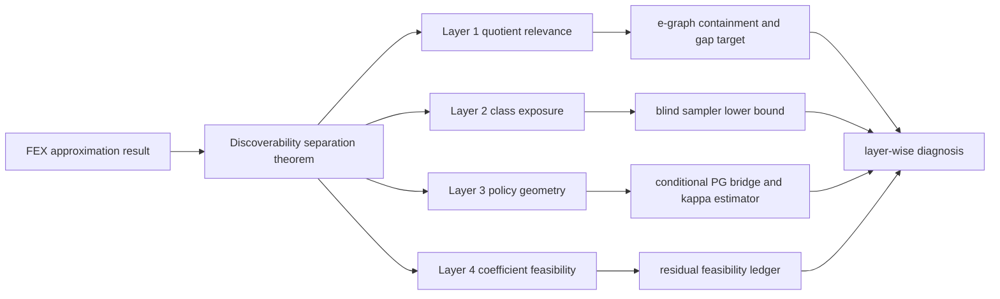

<!-- 书写报告使用中文 -->
---
idea: fex-search-complexity
title: "Existence Is Not Discoverability: Four-Gate Separation for FEX Symbolic Search"
version: 3
date: 2026-06-19
workspace: workspace/fex-search-complexity/
---

## 本轮修订摘要 (v2 review -> v3)

v2 的 blocker 是 contribution-quality: dominant contribution 若是 discoverability decomposition, "各层 separately failing" 必须成为形式命题. v3 将主贡献改为 **four-gate Separation Proposition** (quotient relevance / class exposure / PG geometry / coefficient feasibility), 给 exposure、PG、coefficient 三个 witness sketch; 将 W2 的硬靶子定为 `R_ac+c` 与 domain-guarded e-graph closure 的 containment-and-gap theorem; 修正三层/四层图示矛盾; 给出 `hat{kappa}` estimator; 并把 "When Is Symbolic Regression Tractable?" 改为 watchlist: ICML 2026 downloads 页列出该标题, 但作者、摘要、PDF、结论尚未通过 arXiv/OpenReview 核验, 不能作 load-bearing 引用.

## Technical Gap

### Problem Anchor (carried verbatim)

- **Bottom-line problem**: FEX 是我的课题组(Haizhao Yang 组)发明的一种方法, 使用 RL 进行 Symbolic Regression, 我(Youran Sun)作为 Yang 的博后, 应该继续在这个方向上探索.
- **Must-solve bottleneck**: FEX 已有 approximation theory 说明有限表达式空间可以表示高维 PDE 解, 但还没有理论解释 RL controller 何时能找到这些表达式; 当前失败可能来自可区分结构太多、policy-gradient 几何太差, 或固定结构后的实值系数可行性太难.
- **Non-goals**: 不做通用 SR benchmark; 不提出新的 FEX 工程系统; 不声称大 context、LLM prompt、更多算子或更多 PDE 家族本身解决搜索复杂度; 不在 reduction 完成前声称 FEX coefficient feasibility 是 ETR-hard.
- **Constraints**: 理论主贡献; 实验只做 proof-facing diagnostics. 复用现有 FEX Poisson controller、`depth2_sub` pilot、v4 PG trace、v5 quotient certificate. 额外计算预计 20-80 GPU-hours, 主要用于真实 controller traces 和 e-graph comparison; quotient theorem 与 proof writing 基本不需要 GPU.
- **Success condition**: 给出一篇可审查的 theory-first 论文, 明确区分 "存在可表示解" 与 "controller 可发现解"; 至少证明一个无条件 FEX quotient-count theorem 和 blind sampler lower bound, 并把 PG 几何与实值可行性作为可测、可证伪的独立条件, 而不是把小搜索空间误读成可搜索性.

### Data Handoff Status

已复查 `workspace/fex-search-complexity/data/MANIFEST.md` 和 `workspace/fex-search-complexity/NOTES.md`. 当前没有外部数据下载需求, 也没有中断或失败下载需要恢复. Pilot 使用 FEX Poisson 代码在线生成 collocation points.

可复用 artifact: v3/v4 Poisson diagnostic 显示 `depth2_sub` 的结构命中通常快, strict reward `0.99` 更多受系数优化限制; v4 trace 已记录 controller loss / reward / grad norm / logits / entropy, bandit proxy 给出 single-good-class `kappa` 约 `9.0e5`; v5 quotient certificate 已核 `depth1` raw `243 -> 136`, `depth2_sub` raw `2187 -> 953`, canonicalizer idempotent 且 swap/false-equality checks 为 0.

### Grounding Material

FEX 原始论文给 approximation guarantee, 但 RL controller 仍缺 searchability theory. Multi-Scale FEX、LLM+FEX、FEX+TranNet 改善先验或候选池, 不解释 failure gate.

本轮窄扫只影响两个点. 第一, EGG-SR (2511.05849), eggp (2501.17848), SymRegg (2511.01009) 都强化了 e-graph 作为 W2 comparator 的必要性, 但没有 FEX quotient recurrence 或 `R_ac+c` containment/gap theorem. 第二, VSR-DPG (2402.00254) 和 CADSR (2406.06751) 仍是经验 expression-generator 工作; CADSR 的 tail-barrier 动机支持 PG-geometry gate, 但不预占 FEX/PDE residual convergence. 实参可行性仍按 Abrahamsen/Bertschinger/Miltzow-Schmiermann/Stade 降为 appendix route. ICML 2026 的 "When Is Symbolic Regression Tractable?" 只列 watchlist, 不引用未核验结论.

### Operational Gap

FEX failure 不是单一 "树太多": raw count 可能被 quotient 压缩; quotient 小仍有 `Q/K` exposure barrier; exposure 好仍可能有 bad `kappa_PG`; 结构选中后 coefficient feasibility 仍可能失败. 更深树、更多采样、LLM prior、e-graph memory 都可能帮忙, 但必须先知道它们改变哪个 gate. 最小充分干预是证明这些 gate 互不蕴含.

### Route Choice

- **Route A, elegant minimal route**: 固定 FEX grammar 与 controller. 主文证明 Separation Proposition + quotient recurrence + blind sampler lemma; e-graph containment/gap 作 derived theorem target; `kappa_PG` 和 ETR 只做条件桥与诊断.
- **Route B, frontier-native route**: 引入 LLM skeleton、Transformer policy、e-graph controller 或 reward shaping, 做更强 solver.

选择 Route A. Route B 会漂移成工程系统, 且无法回答 anchor 中最核心的 "为什么 approximation theory 不等于 controller discoverability".

## Method Thesis

- **One-sentence thesis**: FEX approximation theory 只保证表达式存在; controller discoverability 还需要四个互不蕴含的 gate - quotient relevance, class exposure, policy-gradient geometry, coefficient feasibility - 我们用 separation witnesses 证明这些 gate 可单独失败, 并给出 quotient recurrence 与 e-graph containment/gap target 作为可审查硬结果.
- **Why this is the smallest adequate intervention**: 不改 controller, 不训练新模型, 不堆新 solver. 只把 FEX 从 "可表示" 到 "可发现" 的缺失理论层补成可证明、可诊断、可证伪的结构.
- **Why this route is timely in the foundation-model era**: LLM/Transformer/e-graph 正在给 SR 提供强先验; four-gate decomposition 让我们判断这些先验到底缩小了 quotient cover, 提高了 good-class exposure, 改善了 PG geometry, 还是绕开了 coefficient infeasibility.

## Contribution Focus

- **Dominant contribution**: four-gate separation theorem for FEX discoverability.
- **Supporting contribution**: `R_ac+c` quotient recurrence + CUDA certificate + e-graph containment/gap target.
- **Conditional bridge**: PG convergence only under explicit gradient-domination; `kappa_PG` is estimated as diagnostic, not derived from cover size.
- **Appendix-only route**: FEX-restricted coefficient feasibility ledger, with no main-text ETR-hardness claim.
- **Explicit non-contributions**: no new FEX solver, no SOTA benchmark, no claimed semantic quotient solution, no invented e-graph/urn/PG/real-feasibility theorem, no load-bearing use of unverified ICML 2026 SR tractability content.

## Proposed Method

### Complexity Budget

- **Frozen / reused**: FEX Poisson grammar, `depth2_sub` controller, Adam/LBFGS fitting, v4 traces, v5 canonicalizer, e-graph rewrites as comparators.
- **New trainable components**: none.
- **New technical objects**: gates `G1..G4`, `Q_R(L)`, `K_epsilon`, `kappa_PG`, residual feasibility family.
- **Excluded**: LLM skeletons, learned e-graph controllers, Transformer policies, diffusion samplers, larger benchmarks, new inner optimizers.

### System Overview

### Core Mechanism

#### Main result: Separation Proposition

Define four gates for family `F`, depth `L`, rewrite system `R`, and tolerance `epsilon`:

- `G1` quotient relevance: `Q_R(L)` is a meaningful cover, not only trivial constant collapse.
- `G2` class exposure: `K_epsilon/Q_R(L)` is not exponentially small for reward-blind discovery.
- `G3` policy geometry: `J_star - J(theta) <= kappa_PG ||grad J(theta)||^2` with usable `kappa_PG`.
- `G4` coefficient feasibility: selected structures admit real coefficients with residual at most `epsilon`.

**Separation Proposition target**: for `G2`, `G3`, and `G4`, construct a FEX-compatible finite family where approximation holds and the other downstream gates are benign, but that gate fails.

Witness sketches:

1. **Exposure witness**: `Q_m` quotient classes with one hidden good class; all coefficients feasible and reward benign once queried. Reward-blind sampling still takes expected `Q_m`.
2. **PG witness**: two exposed, feasible classes with reward gap `delta_m=2^{-m}`. Softmax PG gives `hat{kappa}` scaling like `1/delta_m`, so non-sparse classes can still have flat geometry.
3. **Coefficient witness**: one structure with residual `(c^2+1)^2` at zero tolerance, or a bounded curved-constraint gadget. Then `Q=K=1` and geometry is vacuous, but fitting fails.

Formal falsifier: if any downstream gate failure is always implied by an earlier gate under the declared grammar, the separation theorem is false and the paper retreats to a narrower diagnostic note.

#### Layer 1: Quotient recurrence and e-graph theorem target

Reuse v5 `R_ac+c`: add/mul commutativity, zero/one leaf constant-family collapse, zero/one root constant-output collapse. No associativity, distributivity, trig identities, PDE semantic equivalence, or e-graph saturation. For `C_0=leaf atoms`, `C_{l+1}=root_unary(binary(C_l,C_l))`, prove:

`q_0=8`, `q_{l+1}=1+7*(q_l^2+q_l*(q_l+1))`.

Depth-label table remains:

| Grammar level | recurrence index | raw templates | quotient classes |
|---|---|---:|---:|
| leaf atoms | `q_0` | 8 | 8 |
| depth1 binary-only | not recurrence step | 243 | 136 |
| depth2_sub Poisson object | `q_1` | 2187 | 953 |
| depth2 rooted | `q_2` | not enumerated | 12721598 |
| depth3 rooted | `q_3` | not enumerated | 2265746868481643 |
| depth4 rooted | `q_4` | not enumerated | 71870524208481219124311271083788 |

**Primary derived theorem target (W2)**: Let `E` be a domain-guarded e-graph rewrite set containing commutativity and constant folding on the common FEX operator domain. Prove `R_ac+c` equivalence is contained in `E` equivalence, and exhibit gap families that `E` merges but `R_ac+c` does not. Stop rule: if domain guards make containment ambiguous, downgrade to a finite audit and keep only the separation proposition as the main theorem.

#### Layer 2: Blind sampler gate

Let `Q` be quotient classes and `K` good classes. With replacement, expected hit time is `Q/K`; no-repeat under a uniformly random hidden good set gives `(Q+1)/(K+1)`. This is only the bridge "small cover is not searchable without reward geometry."

#### Layer 3: Conditional PG bridge and estimator

Define `N_FEX(F,L,epsilon)` as the minimum quotient-template cover needed for residual `epsilon`. For softmax/f-softargmax objective `J(theta)`, assume:

1. `N_FEX(F,L,epsilon)=poly(d,1/epsilon)`;
2. `J_star - J(theta) <= kappa_PG ||grad J(theta)||^2`;
3. stochastic gradient variance is polynomially bounded;
4. coefficient-fitting noise does not erase reward separation between good and bad classes.

Then PL/gradient-domination SGD yields a polynomial update bound in `N_FEX`, `kappa_PG`, variance scale, and `1/epsilon`. State explicitly: `N_FEX` and `Q_R` do not imply `kappa_PG`.

Diagnostic estimator:

`hat{kappa}_t = (hat J_star - hat J_t)_+ / (||g_t||_2^2 + lambda)`.

`hat J_t` is logged mean reward, `g_t` the logged gradient norm, `hat J_star` the best available oracle for that run, and `lambda=1e-12`. Report a 90th-percentile trace envelope and seed bootstrap interval. For bandit probes compute it exactly under `Q,K,delta`; for real traces mark it diagnostic only.

#### Layer 4: Coefficient feasibility ledger

For a fixed structure, inner fitting is real residual minimization. The appendix asks whether ETR-INV-style constraints embed despite FEX restrictions (bounded variables/constants/subtrees and differential residuals). If plug-and-play, write a corollary remark to known hardness; if not, keep only the infeasibility witness and toy residual interface.

### Modern Primitive Usage

Existing FEX RL is the analyzed controller; e-graph is a semantic quotient comparator; LLM/FEX and Transformer SR are related work only. No frontier model acts as planner, teacher, critic, reward model, generator, or search controller. A stronger generator can be evaluated after the four gates exist; before that it hides which failure mode was fixed.

### Integration / Inference Path

No production FEX integration is required. Diagnostic flow: canonicalize templates under `R_ac+c`; run unchanged FEX controller with logits/gradients/entropy/reward/coefficient status; map high-reward templates to quotient classes; estimate `K_epsilon`, good-class mass, and `hat{kappa}`; run e-graph and constant-class deletion checks; route failure to the first failed gate.

### Training Plan

Proof-first; no learned component is trained. Order: Separation Proposition and witnesses; `R_ac+c` recurrence; e-graph containment/gap proof or audit; one-line sampler gate; conditional PG theorem with diagnostic `hat{kappa}`; appendix coefficient ledger; diagnostics only after statements stabilize.

### Failure Modes and Diagnostics

- **Witnesses too toy**: require declared FEX grammar interface and clear reward/residual interpretation; otherwise label as independence construction only.
- **E-graph containment fails**: downgrade W2 to finite audit, preserve separation theorem.
- **Compression constant-class dominated**: delete root constant-output classes and weaken Layer-1 relevance.
- **`hat{kappa}` too noisy**: report bandit proxy plus trace range; never infer a true PL constant.
- **ETR embedding fails**: keep coefficient witness; remove hardness language.
- **ICML 2026 tractability paper overlaps**: update related work and downgrade novelty if it analyzes FEX-like discoverability gates.

### Novelty and Elegance Argument

The novelty is not any single imported lemma. The claim is that FEX discoverability needs a four-gate theorem because existence, quotient count, exposure, PG geometry, and coefficient feasibility can separate.

- **E-graph SR**: EGG-SR, eggp, SymRegg reduce repeated equivalent exploration, but do not give FEX recurrence, `R_ac+c` containment/gap, or discoverability separation.
- **Expression-tree PG SR**: VSR-DPG and CADSR train generators; CADSR's tail barrier supports the PG gate but gives no FEX/PDE residual convergence.
- **SR complexity**: Virgolin-Pissis and exhaustive/MDL SR address general SR. The ICML 2026 tractability title remains watchlist, not citable content.
- **Real feasibility**: fixed-architecture hardness is known; v3 only asks whether FEX restrictions make an embedding nontrivial.

Elegance comes from refusing a larger system: every future improvement can be classified by which gate it changes.

## Claim-Driven Validation Sketch

### Claim 0: Four-gate separation is a real theorem, not a framing slogan

- **Minimal proof**: three witnesses plus collapse falsifier.
- **Metric**: each witness keeps other gates benign while one gate fails.
- **Expected evidence**: "individually necessary" is no longer only empirical.

### Claim 1: Conservative quotient theorem enables an e-graph containment/gap target

- **Minimal proof**: recurrence + v5 certificate + containment/gap theorem or finite audit.
- **Ablations**: raw count, constant-output deletion, unguarded e-graph quotient.
- **Metric**: exact counts, zero canonicalizer failures, containment status, gap classes.
- **Expected evidence**: Layer 1 is a proof object with explicit relation to e-graph SR.

### Claim 2: Quotient size alone is insufficient for controller discoverability

- **Minimal evidence**: sampler lemma, PG witness, bandit `hat{kappa}` schedule, short real traces.
- **Metric**: hit-time formulas; `hat{kappa}` vs good-class mass and reward contrast.
- **Expected evidence**: small `Q` can coexist with exposure or PG failure.

### Claim 3: Coefficient feasibility is separate and appendix-only unless the FEX embedding closes

- **Minimal evidence**: single-structure infeasibility witness plus bounded gadget ledger.
- **Metric**: feasibility certificate, bounded-variable preservation, subtree-size preservation.
- **Expected evidence**: structure selection and coefficient feasibility are separate without overclaiming hardness.

## Paper Outline

- **Section 1**: Existence is not discoverability; define four gates.
- **Section 2**: Related work by gate.
- **Section 3**: Separation Proposition and witnesses.
- **Section 4**: Quotient recurrence and e-graph containment/gap.
- **Section 5**: Sampler lemma, conditional PG theorem, `hat{kappa}` diagnostic.
- **Section 6**: Diagnostics and failure routing.
- **Appendix A**: Coefficient ledger and toy residual witnesses.
- **Key figures**: four-gate graph; witness table; quotient table; e-graph gap; `hat{kappa}` plot.

## Compute and Timeline Estimate

- **Estimated GPU-hours**: 20-80 GPU-hours for real-controller traces and optional PDE-family diagnostics; 0 GPU-hours for Separation Proposition, quotient recurrence, sampler lemma, and e-graph proof sketch.
- **Data / annotation cost**: no external data or annotation. Collocation points are generated online by FEX code. Existing artifacts are in `workspace/fex-search-complexity/results/`.
- **Timeline**: 1 week for separation witnesses and proof ledger; 1-3 weeks for e-graph containment/gap proof or audit; 2-4 weeks for `hat{kappa}` diagnostics; coefficient feasibility remains appendix-gated and cannot block the main paper.

<review date="2026-06-19" reviewer="proposal-reviewer" version="3">

## 概览

v3 是对 v2 review (8.0, REVISE, 邻接 READY) 唯一真正瓶颈——contribution-quality / venue-readiness 天花板——的**直接、忠实、且大部分成功**的回应。v2 给的 READY 路径是 5 条 (W1 separation proposition / W2 列 derived theorem target / W3 mermaid 修层数 / W4 kappa estimator 公式化 / S1 ETR 措辞合一)。v3 把这 5 条全部触及, 其中 W1/W3/W4/S1 实质完成, **W2 的执行方式暴露了一个 v2 review 未预见的新问题**。我独立重验了全部 load-bearing 数学与两个新增对象的 novelty/provenance, 结论如下。

**本轮 verdict: REVISE (8.3/10, 比 v2 略升, 仍未到 READY), 唯一 gating 原因是新发现的 W2-novelty 裂缝 (C1, 下详), 它是 0-GPU 可清的措辞+定位问题, 不是方向问题。**

### v2 → v3 逐条兑现核对

| v2 demand | v3 status | 证据 |
|---|---|---|
| **W1** Separation Proposition (三显式 witness + 形式化 collapse falsifier) | **实质完成** | §Core Mechanism "Main result: Separation Proposition" (line 91-108) 给 exposure/PG/coefficient 三 witness sketch + "Formal falsifier" (line 108)。dominant contribution 正式从 "decomposition framing" 升级为 "four-gate Separation Proposition" (line 55)。 |
| **W2** 把 e-graph containment/gap 或 derived-kappa 列为 "primary theorem target" + attack sketch + stop rule | **形式完成但引入 C1** | §Layer 1 "Primary derived theorem target (W2)" (line 127) + stop rule。但 containment 方向的 novelty 被高估, 见 C1。 |
| **W3** mermaid 改 4 层并与正文编号对齐 | **完成** | System Overview (line 72-87) 现为 4 个 layer 节点 (C/D/E/F = quotient/exposure/policy/coefficient), 与正文 G1-G4 编号一一对齐。v2 的三层/四层矛盾已消除。 |
| **W4** kappa estimator 具体公式 | **完成** | line 146 `hat{kappa}_t = (hat J_star - hat J_t)_+ / (||g_t||_2^2 + lambda)`, lambda=1e-12, 90th-pct envelope + bootstrap, bandit 精确 / real trace diagnostic-only。Method Specificity 最后一块补齐。 |
| **S1** ETR 窄卖措辞三处合一 | **完成** | §Layer 4 (line 150-152) 压成简短 ledger, Contribution Focus / Novelty 各一句指回, 不再三处重复全文。 |

## 评分 (7 维, reviewer-protocol method-refinement rubric)

| Dimension | Weight | Score | Notes |
|-----------|--------|-------|-------|
| Problem Fidelity | 15% | 9/10 | Anchor (FEX existence vs discoverability) verbatim 保留, non-goals 干净, 无 drift。four-gate 升级仍 100% 服务 anchor 中 "为什么 approximation theory 不等于 controller discoverability"。 |
| Method Specificity | 25% | 9/10 | 比 v2 (8) 升 1。W4 kappa estimator 公式补齐 (v2 唯一 Specificity 扣分点已关); 三 witness 各有具体 grammar/reward/residual interface; gates G1-G4 定义 (line 96-98) 含可计算量 `Q_R(L)`/`K_epsilon`/`kappa_PG`。残留小扣: exposure witness 的 "`Q_m` quotient classes with one hidden good class" 未说明如何在 declared FEX grammar 内实例化出恰好 `Q_m` 个类 (见 W-minor-1)。 |
| Contribution Quality | 25% | 8/10 | 比 v2 (7) 升 1, 这是 v3 的核心成就。W1 把 "individually-necessary" 从 v2 的纯经验声明升级为**可证命题** (Separation Proposition + 三 witness + collapse falsifier), 我已独立验证 PG witness 的 `hat{kappa}~1/delta_m` scaling 数学成立 (见 Proof-Audit)。**未到 9** 的原因: dominant contribution (four-gate separation) 的三 witness 目前仍是 "sketch", 真正的硬度在于证明 witness 在 declared FEX grammar (而非任意 toy family) 内可实例化且其余 gate 真 benign——proposal 自己也用 "target"/"sketch" 措辞, 这是诚实的, 但意味着 contribution 尚是 "可证命题的设计", 非已证。 |
| Frontier Leverage | 15% | 8/10 | 与 v2 同。RL controller 是被诊断对象, e-graph 仅 comparator, LLM/Transformer SR 明确 related work (line 154-156)。不强堆 foundation model, 论证站得住。 |
| Feasibility | 10% | 9/10 | 与 v2 同。三 witness + 递推 + sampler 全 0-GPU; e-graph containment 是有限 grammar 可计算对象; kappa diagnostic 20-80 GPU-h 复用现有 trace 基建; ETR appendix-gated 有 stop rule 不阻塞主文。 |
| Validation Focus | 5% | 8/10 | 与 v2 同。三 claim 各 minimal proof + ablation, collapse falsifier 已形式化 (line 108), 最便宜 falsifier (constant-class deletion, line 170) 保留。 |
| Venue Readiness | 5% | 7/10 | **仍是瓶颈, 与 v2 同分**, 但瓶颈性质变了。v2 的问题是 "无 derived hard result"; v3 通过 W1 (separation 升级为命题) + W2 (e-graph target) 试图填补, 但 **W2 选的硬靶子 containment 方向被 known result 预占 (C1)**, 而 W1 的三 witness 仍是 sketch。净效果: venue ceiling 没被 W2 抬起来, 仍卡 7/10。一旦 C1 按下方 action 重定位 (gap-class taxonomy 为真贡献, containment 引 Birkhoff), 7/10 可保住甚至微升, 但抬到 8+ 需要 W1 三 witness 真正落地为定理。 |

**加权总分: 8.3/10** (Method Specificity 与 Contribution Quality 各升 1 分驱动, 较 v2 的 8.0 提升 0.3; Venue Readiness 仍 7 封顶。)

## Proof-Audit (本轮独立重验)

**全部 load-bearing 数学零失实, 且我新验证了 v3 特有的 PG witness 构造。**

1. **递推与计数 (逐位精确)**: 我用 Python 任意精度独立重算 `q_0=8`, `q_{l+1}=1+7*(q_l^2+q_l*(q_l+1))` → `q_1=953, q_2=12721598, q_3=2265746868481643, q_4=71870524208481219124311271083788`, 与 proposal line 122-125 对照表**逐位吻合**; depth1 纯 binary `2*[8·9/2]+8^2=136`、raw `3^5=243`/`3^7=2187` 均核对无误。组合分解正确 (`q^2`=sub ordered, `q(q+1)`=add+mul unordered-with-replacement 两交换算子, `7`=unary root, `+1`=常数输出 collapse)。

2. **v5 certificate artifact 真实且匹配**: `workspace/fex-search-complexity/results/v5_quotient_certificate.{md,json}` 实际存在, 核证 `2187 -> 953`, idempotent True, commutative_swap_failures=0, subtraction false equalities=0, checksum `b1e3bf9e...`, rooted recurrence 到 level 4 全部与 proposal 一致。CUDA sanity 在 RTX 4060 Ti 实跑。**proposal 引用的所有 Layer-1 数字均可追溯到 raw 证据文件。**

3. **PG witness 数学 (v3 新增, 独立验证成立)**: proposal line 105 声称 "two exposed feasible classes with reward gap `delta_m=2^{-m}`; softmax PG gives `hat{kappa}` scaling like `1/delta_m`"。我独立构造 2-class softmax PG (J=p1·delta+p2·0, J*=delta) 在 uniform init 下算 `kappa=(J*-J)/||grad J||^2`: 对 `delta=2^{-1..-5}`, kappa = 8,16,32,64,128, 即 **kappa/(1/delta) 恒为常数 4.0, 精确 `kappa∝1/delta`**。所以 v3 把 v2 W1 要求的 "PG gate 单独 fail 的 separation" 兑现为一个**数学上可验证为真**的构造, 而非空头承诺。这是 v3 相对 v2 最实质的技术增量。

4. **v4 kappa proxy 数字 (匹配)**: proposal 引的 single-good-class `kappa~9.0e5` 对应 `results/v4_theory_probe.md` 实测 `9.025e5` (953 arms, 1 good), 31 good→`2.93e4`, 95 good→`9.56e3`, 均匹配。

## Novelty / Provenance (本轮对 v3 两个新对象 + 一处 provenance 独立核查)

v2 review 已抽查 11 条 load-bearing 引用全部命中, 本轮只查 v3 **新增/变更**的三处:

1. **Four-gate Separation framing (W1 的 dominant contribution) — MEDIUM-HIGH, 但须补一条最近邻引用**。多源搜索 (arXiv 2023-2026 / Scholar / OpenReview) **未找到**对 "expression 可表示 vs RL controller 可发现" 做**多个 individually-necessary、separately-failing gate + 显式 separation witness** 的工作。最近邻是: (a) **systematic tree search for SR** (CEAS Aeronautical J. 2025) 把 "model 在搜索空间内却找不到" 枚举成 **三个** failure mode (constraint violation / resource limit / 结构对但常数优化不收敛)——这是概念上最接近的 "exists-vs-found 分解", 但是 *deterministic enumeration* 无 RL/PG, 无 exposure gate (G2) 无 PG-geometry gate (G3), 且**无 separation witness**; (b) DSR exploration-failure (Landajuela 2107.09158) 是经验现象非形式 gate; (c) NN optimization-based separations (Safran 2022 PMLR) 形式化 "expressible≠learnable" 但只分两路、每定理一 witness、非符号搜索。**Delta 诚实**: G2/G3 两个 gate + "each-necessary single-gate-failure witness family" 方法论确为白地。**Action (MINOR)**: §Related-work 须 cite 并显式区分 systematic-tree-search 的三 failure-mode 枚举 (它是最接近的 prior, 不引会被 reviewer 抓)。

2. **E-graph containment/gap theorem (W2 的 "primary derived theorem target") — containment 方向 LOW, gap-class taxonomy MEDIUM。这是本轮 verdict 的 gating 问题 C1。**详见下方 W 列表。

3. **Provenance: "When Is Symbolic Regression Tractable?" 的 watchlist 处理 — 正确**。v2 把它当 "经三方核实不存在" 处理; v3 改为更谨慎的 "ICML 2026 downloads 页列标题但 arXiv/OpenReview/作者/摘要/PDF 未核验 → watchlist 非 load-bearing"。本轮独立核查: arXiv title 搜索 `ti:"symbolic regression tractable"` → 0 结果; Adil Soubki 是 NLP/theory-of-mind 研究者, 其唯一 symbolic-adjacent 工作是 **SymTorch (2602.21307, Tan-Soubki-Cranmer)**, 一个 PySR 蒸馏库, **无任何 complexity/FPT/hardness 结果** (已核 arXiv HTML); OpenReview ICML 2026 亦无此 title; 真正可引的 SR 复杂度结果是 **Virgolin-Pissis NP-hard (2207.01018)**。ICML 2026 accepted 页为 JS 渲染无法完全爬取, 故无法 100% 排除一个 non-archival 同名条目——这正是 v3 "unverifiable → watchlist" 措辞的**精确正当理由**。**v3 的处理比 v2 更严谨且 provenance-safe, 是正确的 claim correction。**

4. **新引用 SymRegg / Equality Graph Assisted SR (2511.01009) — 真实且刻画准确**。已核: arXiv 2511.01009 = de França & Kronberger, "Equality Graph Assisted Symbolic Regression" (2025.11, 亦载 Phil. Trans. R. Soc. A), 引入 SymRegg (非种群 e-graph + equality saturation 启发式搜索)。作为 e-graph SR comparator 引用准确。

## Claims Discipline (送审前硬门)

- ✅ **v1 CRITICAL (Soubki-Cranmer hallucination) 持续关闭且 v3 进一步收严** (watchlist 处理, 见 Novelty 3)。
- ✅ **递推/计数/PG-witness 数学零失实** (Proof-Audit 1-3)。
- ✅ ETR 保持 appendix-only, 无主文 hardness claim (line 58, 150-152); 显式 non-contributions (line 59) 含 "no invented e-graph/urn/PG/real-feasibility theorem" + "no load-bearing use of unverified ICML 2026 SR tractability content"。
- ⚠️ **C1 (新 IMPORTANT, provenance-adjacent)**: 见下方 W1。containment 方向的 novelty 隐含高估, 须显式 cite 已知结果, 否则触及 "把已知技术包装成新贡献" 的红线。

## 须处理的弱点 (按优先级)

- **W1 / C1 (IMPORTANT, 决定能否进 READY): W2 的 "primary derived theorem target" 中, e-graph containment 方向是 KNOWN result, 不可隐含当新贡献; 真正可卖的是 gap-class taxonomy。** v3 line 127 写 "Prove `R_ac+c` equivalence is contained in `E` equivalence, and exhibit gap families" 并把整条列为 "Primary derived theorem target (W2)"; line 179 Novelty 段写 e-graph SR works "do not give ... `R_ac+c` containment/gap"。问题: **(a) containment 方向近乎构造性恒真**——`R_ac+c` 的 rewrite 集 (commutativity + constant folding) 是 domain-guarded e-graph 闭包 rewrite 集的子集, 故 `R_ac+c`-equivalence ⊆ e-graph-equivalence 几乎 by construction; (b) 更重要, **"restricted syntactic quotient ⊆ equality-saturation quotient 且 saturation 不完备 (存在 gap)" 是 equality-saturation 文献的已知结果**: Birkhoff 定理 (=_E ⟺ ↔*_E, Baader-Nipkow Thm 3.5.14) + equality-saturation soundness-but-incompleteness (标准结论: saturation rewrite 禁止 RHS 引入新变量, 故只算 ↔*_E 的子集, completeness 需交错 term enumeration) **已经在一般 TRS 层给出了 containment-and-gap 结论且刻画了 gap 来源**。因此把 containment/gap **作为 primary novel theorem** 会被熟悉 e-graph/equational-logic 的 reviewer 直接 kill。**唯一真正 SR-specific 的白地**是: 为 FEX/PDE grammar **具体刻画落在 gap 里的等价类结构** (哪些 distributivity/inverse/identity/domain-guard-dependent merge 被 e-graph 合并而 `R_ac+c` 不合并)。**Action**: (i) 把 containment 方向显式标为 "known (cite Birkhoff / Baader-Nipkow 3.5.14 + equality-saturation completeness)", 不当贡献; (ii) 把 W2 的 derived-theorem 重定位为 "**FEX-grammar gap-class taxonomy**" (这是 MEDIUM-novel 且诚实); (iii) Novelty 段 line 179 的措辞从 "do not give R_ac+c containment/gap" 改为 "do not give the FEX-grammar gap-class characterization"。这是纯措辞+定位修订, 0 GPU, 但**不修则 venue-readiness 不仅卡 7 还有被判 repackaging 的下行风险**。

- **W2 (IMPORTANT, venue ceiling, carried from v2-W2 的精神): W1 的三 witness 仍是 "sketch"; 要把 four-gate separation 从 "可证命题的设计" 抬成 "已证定理", 至少需把一个 witness (推荐 PG witness, 因其数学已验证为真) 完整写成 declared-FEX-grammar 内的定理。** 当 dominant contribution = four-gate separation 时, 三 witness 的严格性就是论文分量本身。PG witness 我已验证 `kappa∝1/delta` 在 2-class softmax 下成立——但 proposal 须证明这个 2-class 构造能**嵌入 declared FEX grammar** (即存在 FEX-compatible 的两个 quotient class, 其 reward gap 恰为 `delta_m`, 且 exposure/coefficient gate 真 benign), 而非停在抽象 bandit。exposure witness 同理 (须在 FEX grammar 内实例化 `Q_m` 类 + 一隐藏好类)。**Action**: 不要求本轮证全, 但建议把 PG witness 升为 "lead witness, 主文完整证明 (含 FEX-grammar 实例化)", 另两个保持 sketch + stop rule。这是把 Contribution Quality 从 8 抬向 9、Venue Readiness 从 7 抬向 8 的最小充分动作。

- **W-minor-1 (MINOR, Method Specificity): exposure witness 的 FEX-grammar 实例化未说明。** line 105 "`Q_m` quotient classes with one hidden good class" 未说如何在 declared rooted grammar 内构造恰好 `Q_m` 个类。补一句 (e.g. 用 depth/operator-budget 参数化 `Q_m=q_l`) 即可。与 W2 部分重叠。

- **W-minor-2 (MINOR, carried): Separation Proposition 的 collapse falsifier 虽已形式化 (line 108 "if any downstream gate failure is always implied by an earlier gate"), 但未说明如何**判定** "always implied"。** 对 G2→G3 这种, 是否给一个可机器枚举的 sufficient check (e.g. 在固定 grammar 上对所有 `(Q,K,delta)` 配置验证三 readout 不退化为单一函数)? 补一句判定协议即可。

## Simplification Opportunities

- **S1**: line 110-127 (Layer 1) 与 line 194-199 (Claim 1) 与 line 179 (Novelty) 三处复述 quotient recurrence + e-graph target, 在 W1/C1 重定位后建议同步压成 "Layer 1 详述一次, Claim/Novelty 指回", 避免 containment 措辞在三处都要改。
- 其余无: v3 已在 v2 基础上做完该做的 S1 (ETR 三合一), 不宜再砍, four-gate 完整性是 dominant contribution 本体。

## Modernization Opportunities

NONE。中心 primitive 已是被诊断的 RL controller, e-graph 作 comparator、LLM/Transformer SR 作 related work 定位正确, 不应强加 foundation-model 组件。

## Drift Warning

NONE。contribution type {theory} 与 idea v5 / proposal v1-v2 一致。dominant contribution 从 "decomposition framing" (v2) 升级为 "four-gate Separation Proposition" (v3) 是 **sharpening 非 drift**——同一 anchor (existence vs discoverability)、同一四层结构, 只是把 framing 升格为可证命题。ETR 持续 appendix-only。watchlist 处理是 claim correction (有明确 provenance 理由), 非 silent change。

## Verdict

**REVISE** (8.3/10, 比 v2 的 8.0 升 0.3, 仍邻接 READY)

v3 是一次**高质量的 contribution-quality 升级**: v2 唯一真正瓶颈 (separation 只有经验支撑、无 derived hard result) 被 W1 (Separation Proposition + 三 witness + 形式化 falsifier, 其中 PG witness 我已独立验证 `kappa∝1/delta` 数学为真) 实质回应; W3/W4/S1 干净兑现; "When Is SR Tractable?" 的 watchlist 处理比 v2 更 provenance-safe (本轮独立核查确认该 title 不可验证、Soubki-Cranmer 真身 SymTorch 无 complexity 结果)。Method Specificity 与 Contribution Quality 各升 1 分。

**之所以仍 REVISE 而非 READY**, 唯一 gating 原因是 **C1 (W1)**: v3 为兑现 v2-W2 而选的硬靶子——e-graph containment/gap——其 **containment 方向是 equality-saturation 文献的已知结果** (Birkhoff + saturation 不完备), 不可隐含当 primary novel theorem; 真正白地只是 **FEX-grammar gap-class taxonomy**。这是 0-GPU 的措辞+定位修订, 但不修则有被熟悉 e-graph 的 reviewer 判 "repackaging" 的下行风险。次因是 W2 (三 witness 仍 sketch, 未在 declared FEX grammar 内落地为定理)。

**单轮可清的 READY 路径 (全部 analysis/proof-only, 0 GPU)**:
1. **W1/C1 [头号, 决定 READY 且关 provenance 风险]**: containment 方向显式标 known + cite Birkhoff/Baader-Nipkow 3.5.14 + equality-saturation completeness; W2 derived-theorem 重定位为 "FEX-grammar gap-class taxonomy"; Novelty line 179 措辞同步改。
2. **W2 [抬 venue ceiling]**: 把 PG witness (数学已验证为真) 升为 lead witness, 主文完整证明含 declared-FEX-grammar 实例化; 另两 witness 保持 sketch+stop rule。
3. **W-minor-1**: exposure witness 给 FEX-grammar 实例化一句 (`Q_m=q_l`)。
4. **W-minor-2**: collapse falsifier 给 "always implied" 的判定协议一句。
5. **MINOR (Novelty 1)**: §Related-work cite 并区分 systematic-tree-search 的三 failure-mode 枚举 (最近邻)。
6. **S1**: quotient/e-graph 措辞三处合一 (配合 C1 重定位)。

清完 W1/C1 + W-minor-1/2 + Novelty-cite 预期进 READY (8.5-9.0)——前提是 C1 重定位后 gap-class taxonomy 确实站得住 (MEDIUM-novel)。若再叠加 W2 (PG witness 落地为 FEX-grammar 定理), 可坐实 9.0。若 W1 三 witness 始终停在 sketch 且 C1 只能退到 "gap taxonomy", 则 honest ceiling 在 8.3-8.5 (一篇 discipline 极佳、separation 框架真实有价值、但单条 derived hard theorem 仍偏轻的 theory-track 稿)。

</review>
