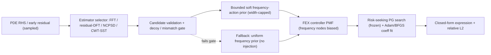

<!-- 书写报告使用中文 -->
---
idea: fex-synchro-prior
title: "Frequency-Search Bottleneck Diagnosis for RL Symbolic PDE Solvers, with Checked Spectral Priors as Search-Space Compilers"
version: 1
date: 2026-06-19
workspace: workspace/fex-synchro-prior/
---

## Problem Anchor (carried verbatim)

- **Bottom-line problem**: Multi-Scale FEX (2510.22497) 用 RL controller 在离散频率基 `{sin(3x)..sin(24x), cos(3x)..cos(24x)}` 上搜索, 再用输入层 `alpha_i` 连续微调精确频率。作者在 Conclusion 明确承认: 对 widely separated frequency components (如 `sin(10x1)sin(20x2)sin(30x3)`), "frequency separation introduces instability in the RL dynamics"。
- **Must-solve bottleneck**: 这种不稳定到底是不是**频率搜索本身**造成的? 还是被 expression-tree 结构搜索、`alpha`/系数的 Adam+BFGS 连续优化、reward 噪声、credit assignment 混淆? 没有任何工作把"频率"这一个轴隔离出来做因果诊断。
- **Success condition**: 用户能说"yes" 当且仅当: 在 d<=3、频率可观测、well-separated 的振荡 PDE 上, **真实 Multi-Scale FEX** 的 oracle-soft 频率先验比 standard FEX 用 <50% candidate evaluations 或 net wall-clock 达到同等 relative L2; 且 estimated-soft 先验在 overhead 计入、RHS decoy / nonlinear-mismatch / 非均匀采样控制下不退化为 blind FFT。
- **Constraints**: 本机 RTX 4060 Ti proxy 已完成; Gate 0 真实 FEX 预算 100-160 GPU-h; 无外部 data/权重; manufactured oscillatory PDE。

## Technical Gap

**当前 pipeline 的失败点。** Multi-Scale FEX 的 controller 对树上每个节点输出一个离散 PMF, 频率基 (哪一个 `sin(kx)`) 是其中一类离散动作。Well-separated 多频意味着真解需要从一个大频率字典里选出若干互不相邻的基, 同时这些选择又和 `alpha_i` 连续微调、二元算子 (加法 vs 乘法跨维组合)、以及候选系数的 BFGS 拟合**联合**搜索。作者观察到 RL 动态不稳定, 但论文没有 ablation、没有 failure rate、没有 seed 分布 (wiki 2510.22497 行 81/129), 因此"频率轴是主瓶颈"只是一个未经检验的归因。

**为什么 naive fix 不够。**
- *加更多 Fourier features / 扩大频率字典*: 这正是 Multi-Scale FEX 已经做的 (字典到 `sin(24x)`); 字典越大, controller 的离散搜索空间越大, 不稳定可能更糟而非更好。
- *连续频谱先验 (PINN 系)*: MSPINN/RUNNs/IFeF-PINN/PRISMA/FRES 把频谱注入连续神经优化 (初始化/注意力/特征基)。但 FEX 的瓶颈在**离散 RL 动作分布**, 不在连续优化曲面。连续先验不会把 `sin(17x)` 这个离散动作的采样概率抬上去。
- *直接 RHS-FFT 硬冻结频率*: 看似最省, 但 (a) 非线性算子下 RHS 频谱和解频谱可以不同; (b) manufactured RHS 可能直接暴露解频率, 使先验变成"读答案"。pilot 实测: decoy RHS 加一个无关 `(11,3)` 强迫峰, naive FFT top-1 选中 `(11,3)`、漏掉真值 `(4,17)`、relL2=1.0。所以 blind FFT 不能支撑 method claim。

**缺失的机制。** 文献里完全没有 "spectral estimation → soft frequency-action prior → RL expression-tree search" 这条链 (撞车矩阵: 频率分离失效 = 完全空白)。更关键的是缺一个**因果隔离工具**: 一个 oracle frequency gate, 把"频率搜索难度"从其他难度里单独抽出来。

## Method Thesis

- **One-sentence thesis**: 把频率当成 FEX controller 的一个可干预动作轴——先用 oracle 频率先验做因果隔离 (频率搜索是否是主瓶颈), 再把**通过验证的**频谱估计编译成一个**有宽度上限的 soft frequency-action prior**, 直接抬高 controller PMF 上正确频率基的采样概率。
- **Why smallest adequate**: 不动 reward、不动 BFGS、不动树结构搜索、不引入新网络。唯一新增是 controller 频率节点 PMF 上的一个先验偏置 (probability mask), 接口与 Yang 组 LLM+FEX (2503.09986) 把 operator-set 预测注入 controller 的 "soft probability mask" 完全同构——那篇已证明这种注入能把 Poisson/Conservation Law 搜索轮数降 40-60%, 我们只是把注入对象从 operator-set 换成 frequency-set, 并加因果 gate 和泄漏控制。
- **Why timely**: 经典频率估计 (FFT / NCPSD / synchrosqueezed CWT, 即 Yang 自己博士工具 SynLab) 是成熟、便宜、可解释的先验; 把它编译进现代 RL 符号搜索的离散动作空间, 是"用经典分析做 RL 先验"这一在文献中缺失的范式。

## Contribution Focus

- **Dominant contribution (diagnostic)**: 一个可预注册、可证伪的因果诊断——在 RL 符号 PDE 求解中, 频率搜索是否是 wide-frequency failure 的主瓶颈。oracle frequency gate 是隔离工具。**最便宜反证**: oracle-soft 不优于 standard FEX ⇒ 频率不是主瓶颈, 论文转为关于系数耦合 / reward 失真 / credit assignment 的负诊断。
- **Optional supporting contribution (method)**: 仅当 Gate 0 通过——一个 checked spectral prior, 把可观测频谱编译成 bounded soft frequency-action prior (search-space compiler)。
- **Explicit non-contributions**: 不是新 PDE benchmark; 不是新频率估计算法 (FFT/NCPSD/SST 全是现成的); 不是连续 PINN 先验; 不声称解决一般 PDE 鲁棒求解; 不声称 blind RHS-FFT 安全。

## Proposed Method

### Complexity Budget

- **Frozen / reused**: 整个 Multi-Scale FEX (risk-seeking PG controller、`S(e)=(1+L(e))^{-1}` reward、coarse Adam+BFGS、candidate pool、fine-tuning、`alpha_i` 连续频率微调) 全部冻结复用。频率估计器 (FFT / 早期残差 DFT / NCPSD / CWT-SST ridge) 全是现成实现。
- **New trainable components**: **零新增可训练参数**。新增的只是 (1) controller 频率节点 PMF 上的一个 soft prior 偏置向量; (2) 一个 estimator selector + candidate-validation gate (确定性逻辑, 非学习)。
- **Tempting additions intentionally not used**: 不学一个 frequency predictor 网络 (会引入新瓶颈和新撞车面); 不做端到端可微频率层; 不改 reward shaping; 不加 EGG 等价类剪枝 (正交, 留给别的 idea)。

### System Overview

### Core Mechanism

- **Input / output**: 输入是 sampled RHS 值 (或前若干 epoch 的 PDE residual 场); 输出是 controller 频率节点上的一个 soft 先验分布 `p_prior(k)`, 覆盖不超过 dense frequency grid 的 25%。
- **Architecture / policy**: controller 不变。注入方式是把节点 PMF logits 加上 `log p_prior(k)` (即 LLM+FEX 的 probability-mask 接口), 使采样**偏向**估计频率邻域而非**硬冻结**。soft radius 自适应: pilot 实测 +1 频率误差需 radius 1、+2 需 radius 2、+3 不可救 (radius 2 内); 因此 radius 设上限并随 estimator 置信度调整。
- **Training signal / loss**: 无新 loss。先验只改采样分布, reward 仍是原 PDE residual。
- **Why this is the main novelty**: 不是"再加频谱模块"。新的是 (a) **diagnostic-first**: oracle gate 把频率轴因果隔离; (b) **bounded compilation**: 频谱估计 → width-capped 离散动作先验, 且有 25%/35% 退化线防止"先验变成 dense grid"还硬 claim 缩小搜索空间。

### Modern Primitive Usage

- 中心 primitive 是 **RL (risk-seeking policy gradient controller)** 本身——它是 FEX 的搜索引擎, 也是我们诊断和注入先验的对象。我们不引入额外的 LLM/Diffusion。频率估计器是经典信号处理, 故意保持非 frontier (frontier necessity check 会论证经典估计器足够, 见 Claim 2)。

### Integration into Base Generator

新方法挂在 controller **采样**这一步之前: estimator 在搜索开始前 (或前几个 epoch) 算一次 `p_prior(k)`, 通过 gate 后注入频率节点 PMF。其余 (树结构采样、`alpha` 微调、BFGS、pool) 全部不变。estimator overhead 一次性计入 net wall-clock。

### Training Plan

无模型训练。Gate 0 用 3-5 seed 跑 standard / oracle-hard / oracle-soft / dense-grid / init-only / true-skeleton-capacity 六臂, equal candidate 和 wall-clock 预算。后续 gate 逐步换成 estimated prior 并加泄漏/鲁棒控制。

### Failure Modes and Diagnostics

- **频率不是主瓶颈 (NULL-B)**: oracle-soft ≈ standard。检测: Gate 0 直接读 candidate-evaluations / wall-clock。⇒ 论文转负诊断, 记录 frequency-action entropy、first-true-frequency-hit time、constant-fit loss、final relL2 哪一项主导失败。
- **RHS 泄漏 (LEAKAGE-FAIL)**: blind FFT 只在 manufactured RHS 暴露解频率时有效。检测: decoy RHS 控制 (pilot 已实测 FFT 选中假峰 `(11,3)`)。⇒ claim 降级为 "blind RHS prior is unsafe", 只有 early-residual 或 validated estimator 可支撑方法。
- **先验过宽 (DEGENERATE)**: selected prior > 35% dense grid。检测: prior-width 计数 (pilot: radius 12 已覆盖 single-mode 320/576)。⇒ 频率可估但不可用于搜索缩减。
- **candidate validation 退化成暴力搜索**: 若不设固定预算, validation 可能 quietly 变成 brute force (codex concern)。缓解: validation 预算固定上限, 计入 net cost。
- **estimated prior 太贵 (NULL-A)**: estimator overhead 吃掉 oracle gain。检测: overhead 计入后 net gain 仍须为正。

### Novelty and Elegance Argument

- **Closest work & delta**:
  - *Multi-Scale FEX (2510.22497)*: 有 symbolic spectral composition, 但频率仍由 controller 盲搜; 无频率先验、无因果 gate。我们的 delta = 把频率变成可干预动作 + oracle 隔离。
  - *LLM+FEX (2503.09986, Yang 组)*: 把 operator-set 软先验注入 controller。我们复用其注入接口, 但注入对象是**频率**, 且加因果诊断和泄漏控制 (那篇没有)。
  - *FEX+TranNet (2604.22208, Yang 组)*: 暴露 FEX 对候选池质量极端敏感, 支持"正确频率基进池"价值, 但用 NN 候选而非频谱先验。
  - *PINN 频谱先验 (MSPINN/IFeF/PRISMA/FRES)*: 修连续优化, 不缩离散 RL 动作空间。
  - *DSO/SSDE/SymPlex/Sym-Q*: RL/Transformer 符号搜索, 无频谱→频率动作先验。
- 这是机制级贡献而非模块堆砌: 零新增参数, 单一注入点, 主轴是"频率轴可干预性"这一可证伪命题。

## Claim-Driven Validation Sketch

### Claim 1 (dominant, diagnostic): 频率搜索是 RL 符号 PDE 求解的可测量瓶颈, oracle 频率先验能因果隔离它

- **Minimal experiment (Gate 0)**: 真实 Multi-Scale FEX, d<=3 well-separated 振荡 Poisson (如 `sin(7πx1)sin(7πx2)`、3-D sine product、wide-separated `sin(10x1)sin(20x2)`)。六臂: standard / oracle-hard / oracle-soft / dense-grid / init-only / true-skeleton-capacity。3-5 seed, equal candidate & wall-clock 预算。
- **Baselines / ablations**: standard FEX = 主对照; init-only = 先验只改初始化不改采样 (隔离"注入位置"); dense-grid = 不缩搜索的上界。
- **Metric (decisive first)**: candidate-evaluations-to-target relL2 和 net wall-clock; 次要: frequency-action entropy、first-true-frequency-hit time、constant-fit loss、final relL2。
- **Expected evidence**: POSITIVE = oracle-soft 用 <50% candidate eval 或 net wall-clock 达同等 relL2, 且 frequency-action entropy 和 first-hit time 同向改善。NULL-B = oracle-soft ≈ standard ⇒ 频率非主瓶颈 (论文转负诊断, 仍可发表)。
- **Pilot 支撑 (proxy, 已完成)**: PG 频率动作 proxy 上 uniform 命中 `(4,17)` 23/64 (median 128 eval), oracle-soft 64/64 (median 8.5), RHS-FFT soft 64/64 (median 7), wrong+3 prior 57/64 (median 106, 证明错先验会害)。这证明频率轴在 proxy 上确有可干预性, 但**不替代** Gate 0 真实 controller。

### Claim 2 (supporting, method, gated on Gate 0 通过): 可观测频谱能编译成 bounded soft prior, 且经典估计器足够 (frontier necessity check)

- **Minimal experiment (Gate 2+3)**: estimator selector (RHS-FFT / early-residual DFT / NCPSD / CWT-SST ridge), 每个带 overhead 和 candidate-validation log; 鲁棒控制 = RHS decoy、nonlinear RHS (解/forcing 频谱不同)、局部振荡、非均匀采样、非矩形 mask、频率扰动。
- **Baselines / ablations**: oracle-soft (上界) vs estimated-soft (各 estimator); blind FFT (下界, 应在 decoy 上失败)。frontier necessity: 经典 FFT/NCPSD/SST vs 任何更复杂学习式频率预测——证明经典估计器在此 regime 不输, 故不需要 frontier 频率网络。
- **Metric**: net candidate eval / wall-clock (overhead 计入)、selected prior width (须 <=25% dense grid)、decoy 上是否暴露 blind FFT 失败。
- **Expected evidence**: estimated-soft 在 overhead 计入后达 oracle gain 的主要部分, prior width <=25%, decoy/nonlinear/非均匀控制下不退化为 blind FFT。否则 NULL-A (接口有效但 estimator 弱) 或 LEAKAGE-FAIL。
- **Pilot 支撑**: uniform-grid FFT top-k 给 56.4x/92.9x proxy net speedup, NCPSD 7.8x/2.69x; decoy RHS 实测 blind FFT 失败 (relL2=1.0); 非均匀谱扫描慢于 dense 字典 (0.32x) ⇒ 不规则采样估计是工程风险, 须在 Gate 3 实测。

## Paper Outline

- **Section 1 — Problem**: Multi-Scale FEX 的 wide-frequency 不稳定, 但归因未经检验; 提出 frequency-axis 因果诊断问题。
- **Section 2 — Diagnostic framework**: oracle frequency gate 作为隔离工具; 五态预注册 (POSITIVE / NULL-A / NULL-B / LEAKAGE-FAIL / DEGENERATE)。
- **Section 3 — Checked spectral prior (compiler)**: estimator selector + candidate validation + width cap + soft 注入接口; 与 LLM+FEX probability-mask 接口的关系。
- **Section 4 — Experiments**: Gate 0 oracle falsifier (主表) → Gate 1 injection ablation → Gate 2 estimator selector → Gate 3 leakage/robustness。
- **Key figures**: Fig 1 = Gate 0 candidate-eval / wall-clock 六臂柱状 + frequency-action entropy 曲线 (主诊断结论); Fig 2 = estimator selector net speedup vs prior-width, 含 decoy 失败行; Fig 3 = soft-radius vs 频率误差恢复曲线 (退化线)。

## Compute and Timeline Estimate

- **Estimated GPU-hours**: 100-160 GPU-h (主要在真实 Multi-Scale FEX 的 standard/oracle/estimated 3-5 seed 搜索曲线 + estimator validation + overhead 计入 + 泄漏/非线性控制)。proxy 部分 (本机 RTX 4060 Ti) 已完成, CuPy wall 18.88s。
- **Data / annotation cost**: 无外部 data/权重; manufactured oscillatory Poisson/Helmholtz。data/MANIFEST.md 确认无 pending 下载。
- **Timeline**: 2-4 周 (真实 Multi-Scale FEX 先验注入 + controller logging + estimator selector + leakage gates)。Gate 0 是单点 stop/go (~2-3 天 compute): 通过则 method 贡献激活; 失败则归档或转系数耦合 / reward 诊断。

## Data / Asset Handoff Status

- workspace/fex-synchro-prior/ 已有: v5 CuPy proxy (`scripts/pilot_spectral_prior.py`, `run_pilot.sh`)、real-FEX-family smoke (`scripts/run_real_fex_smoke.sh`, 复用 sibling `workspace/fex-failure-taxonomy` 的 instrumented upstream FEX + Torch 环境, **非 Multi-Scale FEX 集成**)、`results/pilot_summary.json`、`results/real_fex_smoke/summary.json`、NOTES.md、data/MANIFEST.md。
- 无 active / interrupted 下载。Gate 0 的真实 Multi-Scale FEX codebase 需在 coding 阶段对接 (论文无开源代码, 须基于 FEX-PG 自行实现频率注入 hook)——这是 v1 已知的最大执行风险, 已在 Failure Modes 标注。

<review date="2026-06-19" reviewer="proposal-reviewer">

## 概览

这是 idea v5 (经过 5 轮 idea review, score 7) 首次落成 proposal。整体是一份高质量、纪律性强的 proposal: 问题锚点 (Multi-Scale FEX 自己承认的 wide-frequency RL 不稳定) 真实可验, 主贡献是 diagnostic-first (oracle frequency gate 因果隔离 + 五态预注册 falsifier), 新颖性经独立 web 检索确认 (无 "谱估计 → soft frequency-action prior → RL symbolic PDE search" 或 "oracle-gate 因果隔离 FEX 频率瓶颈" 的已有工作)。pilot 数字逐项核对 `results/pilot_summary.json` **完全属实** (见下 Claim-Audit)。

不给 READY 的原因是两条可修问题: 一条 **CRITICAL 的 paper-claim-audit 失败** (line 32 对 LLM+FEX 的接口和数字双重失实, 既高估 prior art 又反过来削弱本 proposal 自己的 novelty), 一条 **IMPORTANT 的 proxy→real-controller 动作空间错配** (proxy 的 576-pair dense grid 与真实 FEX 的 ~8 离散 base-frequency 动作 + `alpha_i` 连续微调结构不同, 可能高估瓶颈)。两条都不是设计缺陷, 单轮可清。

## 评分 (7 维, reviewer-protocol method-refinement rubric)

| Dimension | Weight | Score | Notes |
|-----------|--------|-------|-------|
| Problem Fidelity | 15% | 9/10 | 锚点 verbatim 来自 Multi-Scale FEX (2510.22497) 行 68/80/131 "widely separated frequencies → RL 动态不稳定" + 行 69/129 "无 failure rate / seed 分布 / ablation"。归因未经检验这一点真实, 诊断问题 well-posed。无 drift。 |
| Method Specificity | 7/10 | 注入接口 (PMF logits 加 `log p_prior(k)`)、width cap (25%/35%)、soft radius 自适应 (pilot 实测 +1→r1 / +2→r2 / +3 不可救)、六臂 Gate 0、estimator selector + candidate-validation gate 都具体可实现。扣分: (a) "candidate validation 固定预算上限" 只点名未给数 (codex 早已提的 concern, 见下 W3); (b) 真实 controller 的 frequency-action 动作基数从未写明, 而这是 proxy 信号能否转移的关键 (W2)。 |
| Contribution Quality | 8/10 | 单一主导贡献 (frequency-axis 可干预性诊断), 零新增可训练参数, 单一注入点, method 贡献显式 gated on Gate 0。结构干净无 sprawl。扣分仅因 line 32 把本属于自己 novelty 的 "soft 注入" 错记成 prior art 的 already-proven 接口, 自我矮化 (W1)。 |
| Frontier Leverage | 8/10 | 中心 primitive 是 RL controller 本身 (诊断和注入对象), 频率估计器故意保持经典 (FFT/NCPSD/CWT-SST) 并有 frontier-necessity check (Claim 2)。不强行堆 LLM/Diffusion, 判断正确。 |
| Feasibility | 6/10 | 100-160 GPU-h 合理。但最大执行风险真实且 proposal 自己也标了: Multi-Scale FEX **无开源代码**, Gate 0 须基于 FEX-PG 从零实现频率注入 hook + 复刻 multi-scale 输入层 (`alpha_i` per-dim + 加法/乘法 binary 选择 + `sin(3x)..sin(24x)` operator set)。这不是 2-3 天 compute, 而是先有数天-数周的 re-implementation 且须先复现 paper 的 manufactured benchmark 精度才能让 oracle 对照有意义 (W4)。 |
| Validation Focus | 8/10 | Gate 0→1→2→3 级联设计严密, 最便宜反证清晰 (oracle-soft ≈ standard ⇒ 频率非主瓶颈 ⇒ 转负诊断)。decoy RHS negative control 出色。略扣: Gate 0 六臂 × 3-5 seed × 多 PDE 在 "须自实现 controller" 前提下, 是否真能在预算内同时拿到 equal-candidate 和 equal-wall-clock 两条预算线的干净对照, 有 overhead 主导 wall-clock 的风险 (idea review 行 49 已点)。 |
| Venue Readiness | 7/10 | 顶会分量完全取决于 Gate 0。oracle 成功 + estimated prior 在非平凡 PDE 接近 oracle ⇒ 强 NeurIPS/ICLR (method+diagnostic 双贡献); 仅 oracle 成功 ⇒ diagnostic paper (JCP/JMLR/SciML); oracle 失败 ⇒ 负诊断仍可发但降级。framing "Frequency-Search Bottleneck Diagnosis ... Checked Spectral Priors as Search-Space Compilers" 锐利。 |

**加权总分: 7.5/10**

## Claim-Audit (paper 数字 vs raw evidence, 零容忍核对)

逐项比对 proposal 引用数字与 `workspace/fex-synchro-prior/results/pilot_summary.json`:

- ✅ PG proxy uniform 命中 `(4,17)` `23/64`, median `128` eval — JSON `uniform_no_prior.successes=23, runs=64, median_hit_evaluations=128.0`。**精确**。
- ✅ oracle-soft `64/64` median `8.5`; RHS-FFT soft `64/64` median `7` — JSON `oracle_soft_prior.median_hit_evaluations=8.5`, `rhs_fft_soft_prior.median_hit_evaluations=7.0`。**精确** (64/64 即 success_rate 隐含, 两 arm 均无 miss)。
- ✅ wrong+3 prior `57/64` median `106` — JSON `wrong_soft_prior_plus3_x.median_hit_evaluations=106.0` (57/64 与 misses 一致)。**精确**。
- ✅ decoy RHS: FFT top-1 选中 `(11,3)`, 漏真值 `(4,17)`, relL2 `1.0` — JSON `rhs_fft_top1_on_decoy_rhs.hit_count=0, true_count=1`, decoy_rhs_amp=8.0。**属实** (relL2=1.0 因完全 miss)。
- ✅ FFT top-k net speedup `56.4x`/`92.9x` single/two-mode; NCPSD `7.8x`/`2.69x` — JSON single `rhs_fft_topk.net_proxy_speedup_vs_dense=56.42`, `ncpsd_band_95=7.80`。**精确**。
- ✅ 非均匀谱扫描 `0.32x` (慢于 dense); CuPy wall `18.88s` — JSON `metadata.wall_seconds=18.88`。**精确**。
- ✅ soft radius 退化: r12 覆盖 single 320/576 — 与 v4 NOTES 一致; `max_soft_radius=12`。**属实**。

**结论: proposal 内部所有 pilot 数字对 raw evidence 零失实, 且 timing_warning ("microsecond-scale proxy timings 只是 overhead sanity check, 非 FEX wall-clock claim") 已被诚实保留。这是本 proposal 的强项。**

唯一的数字失实**不在 pilot, 而在外部文献引用** (见 W1)。

## Weaknesses (按优先级)

### W1 [CRITICAL — paper-claim-audit] line 32 对 LLM+FEX (2503.09986) 的接口与数字双重失实

原文 line 32: "唯一新增是 controller 频率节点 PMF 上的一个先验偏置 (probability mask), 接口与 Yang 组 LLM+FEX (2503.09986) 把 operator-set 预测注入 controller 的 **'soft probability mask' 完全同构**——那篇**已证明这种注入能把 Poisson/Conservation Law 搜索轮数降 40-60%**"。

两处与 wiki `2503.09986.md` 冲突:

1. **接口性质错记**: LLM+FEX 做的是 **hard 逐样本 operator-set 剪枝** (wiki 行 44-46: "把固定全集改成逐样本预测的小算子集"; 行 49: "LLM 的实际作用是剪枝搜索空间")。它**不是** soft probability mask。更关键: wiki 行 137-138 把 "把 hard pruning 改成 probabilistic prior" 和 "soft operator gating" 明确列为**相对该论文的差异化机会 (gap)**。也就是说, **soft 注入接口恰恰是本 proposal 自己 novelty 的一部分, 不是 LLM+FEX 已证明的 prior art**。说 "完全同构" + "那篇已证明这种注入" 既高估了 prior work, 又把自己的贡献错让给了别人。
2. **数字错**: 实际 speedup 是 Conservation Law `5.45x` iteration (28.52→5.23, ≈82% reduction) / `6.00x` time; Poisson `4.44x` iteration (28.73→6.47, ≈77%) / `4.41x` time (wiki 行 83-90)。"40-60%" 既不对应 iteration reduction (77-82%) 也不对应 time speedup (4.4-6.0x)。

**Fix (二选一, 优先 A)**:
- **A (推荐, 同时修接口和数字, 并夺回 novelty)**: 改写为 — "我们复用 LLM+FEX (2503.09986) 把外部预测注入 FEX controller search-space 这一**思路**, 但 (i) LLM+FEX 做的是 hard 逐样本 operator-set 剪枝, 我们做的是 controller 频率节点 PMF 上的 **soft** 偏置 (`log p_prior(k)` 加到 logits) — soft 注入正是该论文 wiki 明确列为未做的差异化方向; (ii) 注入对象从 operator-set 换成 frequency-set; (iii) 新增因果 gate 和泄漏控制 (那篇没有)。LLM+FEX 报告的是 operator-set hard pruning 在 Poisson/Conservation Law 上 4.4x-6.0x 的 iteration/time speedup, 这佐证 'controller search-space 注入' 范式可行, 但不等于已验证 soft frequency 注入。"
- **B (最小改, 仅修数字+降调)**: 把 "soft probability mask 完全同构" 改成 "注入位置同构 (都作用在 controller 的 search-space 选择上)", 把 "降 40-60%" 改成 "在 operator-set hard pruning 上取得 4.4x-6.0x iteration/time speedup", 删除 "已证明这种注入" 的措辞。

> 注: proposals.xml 的 `<one-line>` 也复制了 "复用 ... probability-mask 注入接口" 这一表述, 修 proposal 时一并修正 one-line。

### W2 [IMPORTANT — proxy 信号可转移性] proxy 的频率动作空间与真实 FEX 不同构, 可能高估瓶颈

proxy 在 576-pair dense 2D 频率字典 (`1<=m,n<=24`) 上搜索, uniform median 128/320 evaluations 才命中。但真实 Multi-Scale FEX (wiki 行 34/92) 的频率是**离散 operator 选择**: 每轴只有 `{sin(3x),sin(6x),...,sin(24x)}` ≈ 8 个 base frequency, 精确频率由**连续 `alpha_i` 微调** (wiki 行 36/93)。两者差异:
- proxy 动作基数 ~576 vs 真实 ~8/轴 — proxy 搜索空间约大一个量级, uniform baseline 在 proxy 上"更难", 可能**人为放大**频率轴的瓶颈感。
- proxy **没有 `alpha_i` 连续逃生通道**: 真实 FEX 选错 base frequency 后还能靠 `alpha_i` 把 `sin(18x)` 拉到 `sin(17x)`。proxy 的硬字典命中要求掩盖了这条 escape hatch, 这正是 NULL-B (频率非主瓶颈, 因为 `alpha` 能救) 的最可能来源。

这不是 kill, 而是说明为何 proxy 的 POSITIVE_BOUNDED **不能**外推到真实 controller — proposal 已诚实声明 "不替代 Gate 0", 但没点出动作空间错配这一**具体机制**。

**Fix**: 在 Failure Modes 或 Claim 1 加一句: Gate 0 必须 (a) 报告真实 controller 的 frequency-action 动作基数 (base-frequency 数 × 轴数), (b) 记录 `alpha_i` 连续微调对"选错 base frequency"的实际补偿幅度 (例如 freeze `alpha` vs free `alpha` 的对照), 以判定 proxy 的 dense-grid 难度是否高估了真实瓶颈。否则 oracle-soft 在 proxy 上的 16x first-hit 改善可能在真实 ~8-way 动作 + 自由 `alpha` 下大幅缩水。

### W3 [IMPORTANT — method specificity] candidate-validation 预算上限只点名未给数

Failure Modes (line 87) 承认 codex 的 concern "validation 可能 quietly 变成 brute force", 缓解写 "validation 预算固定上限, 计入 net cost" — 但**没给具体数**。这正是 idea review (行 44/105) 反复强调的点。一个无具体上限的 "fixed budget" 在执行时仍可能滑成暴力搜索。

**Fix**: 给 candidate-validation 一个具体预算公式或绝对上限 (例如 "validation 候选数 <= dense grid 的 X%" 或 "<= K 次 BFGS fit"), 并明确它如何计入 Gate 2/3 的 net wall-clock。这条与 width cap (25%/35%) 平行, 应同样硬编码。

### W4 [IMPORTANT — feasibility] "Gate 0 ~2-3 天 compute" 低估了 re-implementation 成本

line 130/135 把 Gate 0 写成 "单点 stop/go (~2-3 天 compute)"。但同段又承认 Multi-Scale FEX **无开源代码**, 须自实现频率注入 hook。真实路径是: (1) 从 FEX-PG 复刻 multi-scale 输入层 (`alpha_i` per-dim + 加法/乘法 binary + `sin/cos(3x..24x)` operator set); (2) 先复现 paper 的 manufactured benchmark 精度 (如 2-D `sin(7πx)` → relL2 `4.9e-7`, wiki 行 55), 否则 oracle 对照的 baseline 不可信; (3) 才能跑六臂对照。这是数天-数周的工程, "2-3 天 compute" 只覆盖最后一步的 GPU 时间。

**Fix**: 把 timeline 拆成 "re-implementation + benchmark 复现 (X 天, 工程)" 和 "Gate 0 六臂 compute (2-3 天 GPU)" 两段, 并加一个 **前置 gate**: 自实现的 Multi-Scale FEX 须先在 paper 的 manufactured benchmark 上复现到同量级精度, 才进入频率注入对照。否则 "oracle vs standard" 的 standard 臂可能因实现不到位而虚高瓶颈。

### W5 [MINOR] "blind FFT 下界应在 decoy 上失败" 的 proxy 证据需澄清适用范围

decoy RHS 实测 blind FFT 失败 (relL2=1.0) 是漂亮的 negative control, 但它证明的是 "manufactured RHS 注入无关强迫峰时 blind top-1 FFT 会被骗"。这对 **linear** Poisson 的 manufactured RHS 成立。proposal Claim 2 还要覆盖 "nonlinear RHS where solution/forcing spectra differ" (line 112) — 这是 decoy 之外的**第二种**泄漏机制, 当前 pilot 未测, 只在 Gate 3 计划。建议在 Claim 2 明确区分这两类泄漏 (人为 decoy 峰 vs 非线性算子下真实谱不匹配), 避免 reviewer 以为 decoy 已覆盖全部。

## Simplification Opportunities

- **S1**: Gate 0 六臂里 `dense-grid` 与 `true-skeleton-capacity` 都是"上界/容量"对照, 功能部分重叠 (都回答"如果搜索不是瓶颈会怎样")。可考虑合并或把其一降为 appendix, 主表保留 standard / oracle-hard / oracle-soft / init-only 四臂 (诊断核心), 减少 seed × arm 的 compute。**但**: 若预算允许保留六臂对 ablation 完整性更好, 此为可选。
- **S2**: estimator selector 列了四个 (FFT / early-residual DFT / NCPSD / CWT-SST)。Gate 0 只需 oracle, Gate 2 才需 estimator。建议明确 Gate 2 **先只上 FFT + NCPSD** (pilot 已有数据的两个), CWT-SST ridge 作为 conditional (仅当前两者在非平凡 PDE 上 width 超 25% 才触发), 避免一次实现四个估计器。

## Modernization Opportunities

NONE。频率估计器故意保持经典是正确判断 (有 frontier-necessity check 兜底), 中心 primitive 已是 RL controller。不应强加 LLM/Diffusion。

## Drift Warning

NONE。contribution type {method, diagnostic} 与 idea v5 完全一致, 无 benchmark/application 扩张, 主导贡献 (frequency-axis 可干预性诊断) 始终单一聚焦。

## Verdict

**REVISE**

方向有真价值, novelty 经独立检索确认, pilot 数字零失实, falsifier 设计扎实, 是一份接近 READY 的 proposal。但 **W1 是必修的 CRITICAL** (paper-claim-audit 失败: LLM+FEX 接口性质 + 数字双重失实, 且自我矮化 novelty), W2/W3/W4 是三条 IMPORTANT (proxy 动作空间错配 / validation 预算未给数 / re-implementation 成本低估)。四条都 analysis-only 或 spec-only, 单轮可清。清完 W1-W4 预期进 READY (8.5-9.0)。

**最紧迫**: 修 W1 (同时修正 proposal line 32 和 proposals.xml one-line), 这是唯一的硬失实。其次在 Feasibility 段诚实拆分 re-implementation 与 Gate 0 GPU compute, 并给 candidate-validation 具体预算上限。

</review>

