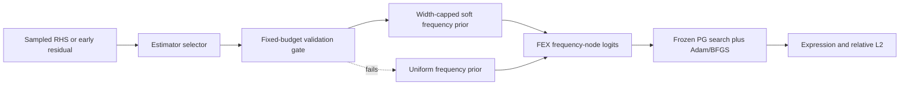

<!-- 书写报告使用中文 -->
---
idea: fex-synchro-prior
title: "Frequency-Search Bottleneck Audit for RL Symbolic PDE Solvers, with Checked Spectral Priors as Search-Space Compilers"
version: 2
date: 2026-06-19
workspace: workspace/fex-synchro-prior/
---

## Problem Anchor (carried verbatim)

- **Bottom-line problem**: Multi-Scale FEX (2510.22497) 用 RL controller 在离散频率基 `{sin(3x)..sin(24x), cos(3x)..cos(24x)}` 上搜索, 再用输入层 `alpha_i` 连续微调精确频率。作者在 Conclusion 明确承认: 对 widely separated frequency components (如 `sin(10x1)sin(20x2)sin(30x3)`), "frequency separation introduces instability in the RL dynamics"。
- **Must-solve bottleneck**: 这种不稳定到底是不是**频率搜索本身**造成的? 还是被 expression-tree 结构搜索、`alpha`/系数的 Adam+BFGS 连续优化、reward 噪声、credit assignment 混淆? 没有任何工作把"频率"这一个轴隔离出来做因果诊断。
- **Success condition**: 用户能说"yes" 当且仅当: 在 d<=3、频率可观测、well-separated 的振荡 PDE 上, **真实 Multi-Scale FEX** 的 oracle-soft 频率先验比 standard FEX 用 <50% candidate evaluations 或 net wall-clock 达到同等 relative L2; 且 estimated-soft 先验在 overhead 计入、RHS decoy / nonlinear-mismatch / 非均匀采样控制下不退化为 blind FFT。
- **Constraints**: 本机 RTX 4060 Ti proxy 已完成; Gate 0 真实 FEX 预算 100-160 GPU-h; 无外部 data/权重; manufactured oscillatory PDE。

## Technical Gap

Multi-Scale FEX 已把多尺度周期算子放进 grammar, 但它没有回答频率失败的归因问题。真实 controller 的频率选择不是 v5 proxy 的 576 个 `(m,n)` dense pair, 而是每个相关节点从 `sin/cos(3x..24x)` 等 base periodic operator 中采样, 再由 `alpha_i` 连续缩放频率。这个 escape hatch 可能让"选错 base frequency"仍被连续优化救回来, 也可能因为 reward 噪声和 BFGS 早期拟合差而完全救不回来。v2 把这个动作空间错配写进核心诊断: Gate 0 必须同时测 oracle prior 是否加速搜索, 以及 `alpha_i` 是否已经足以消除频率动作瓶颈。

naive fix 仍然不够。扩大频率字典会增加 RL 动作空间; 连续 PINN 频谱先验修的是神经优化而不是离散 expression-tree 采样; blind RHS-FFT 在 manufactured RHS 上可能读到答案。v5 pilot 已构造 decoy RHS, naive FFT top-1 选中假峰 `(11,3)`、漏掉真 `(4,17)`、relative L2=1.0。因此最小缺失机制不是"再加一个频谱模块", 而是一个带泄漏控制的因果审计接口: 先用 oracle frequency prior 隔离频率动作轴, 再只在 oracle 通过后尝试 checked spectral prior。

2026-06-19 的增量检索没有发现直接 "spectral estimation -> soft frequency-action prior -> RL symbolic PDE/FEX search" 撞车。最近邻仍是 Multi-Scale FEX (2510.22497)、LLM+FEX operator-set pruning (2503.09986)、FEX+TranNet candidate-pool 扩展 (2604.22208)、SSDE/NetGP/StruSR 等 RL/GP PDE symbolic solvers, 以及 PiPRL (2506.22365) 这种跨域 "symbolic program prior -> RL" 先例。它们没有做频率动作轴的 oracle audit, 也没有把频谱估计编译成 FEX controller 的 soft frequency PMF。

## Method Thesis

- **One-sentence thesis**: 把频率视为 FEX controller 中可干预、可审计的动作轴: 用 oracle-soft prior 先回答"频率搜索是不是主瓶颈", 只在答案为 yes 时把通过验证的频谱估计编译成 width-capped soft frequency-action prior。
- **Why this is the smallest adequate intervention**: 不改 reward、不改 BFGS、不改 expression grammar、不训练新网络。新增机制只有一个 logits 偏置 `log p_prior(k)` 和一个固定预算的 validation gate。
- **Why this route is timely in the foundation-model era**: 这个 proposal 不需要额外 LLM。它复用 LLM+FEX 的高层经验: 外部预测可以缩小 FEX search space。但 LLM+FEX 做的是 hard 逐样本 operator-set pruning, 在 Poisson/Conservation Law 上报告 4.4x-6.0x iteration/time speedup; 它没有做 soft PMF 注入, 也没有处理 frequency-set。v2 将 soft 注入重新夺回为本方法的机制差异, 而不是把它误写成 prior art。

## Contribution Focus

- **Dominant contribution**: 频率动作轴的因果瓶颈审计协议。oracle-hard / oracle-soft / init-only / standard 的真实 Multi-Scale FEX 对照决定"频率搜索是主瓶颈"这一命题是否成立。
- **Optional supporting contribution**: Gate 0 通过后, checked spectral prior 作为 search-space compiler: 频谱估计 -> 固定预算验证 -> bounded soft PMF -> FEX controller。
- **Explicit non-contributions**: 不做新 PDE benchmark; 不提出新 FFT/NCPSD/SST 算法; 不训练 frequency predictor; 不把 LLM 加进 pipeline; 不声称 blind RHS-FFT 安全; 不声称一般 PDE 求解鲁棒性。

## Proposed Method

### Complexity Budget

- **Frozen / reused backbone**: Multi-Scale FEX 的 risk-seeking PG controller、periodic operator set、`alpha_i` 输入缩放、coarse Adam+BFGS、candidate pool、fine tuning 全部冻结。实现前须先复现 Multi-Scale FEX 的 manufactured sine benchmark 到同量级误差, 否则不进入 Gate 0。
- **New trainable components**: 零新增可训练参数。`p_prior(k)` 由 oracle 或现成估计器给出, 只作为 controller 频率节点 logits 偏置。
- **Tempting additions intentionally not used**: 不学一个 neural frequency predictor; 不引入 e-graph/EGG 剪枝; 不做 LLM skeleton; 不把 dense grid 当成主方法。dense-grid 与 true-skeleton-capacity 只作 conditional appendix sanity check。

### System Overview

### Core Mechanism

- **Input / output**: 输入是 PDE RHS samples 或早期 residual field; 输出是 base-frequency operator 上的离散分布 `p_prior(k)`。oracle prior 直接由 ground-truth frequency tuple 构造; estimated prior 由 FFT/NCPSD/early-residual DFT/CWT-SST 候选构造。
- **Architecture or policy**: controller 不变。对频率节点的 logits 做 `z_k <- z_k + lambda_prior log(p_prior(k)+eps)`。hard prior 是 diagnostic extreme, soft prior 是主候选, init-only 只改变 `alpha_i` 初值不改变采样 PMF。
- **Training signal / loss**: 无新 loss。reward 仍为原 FEX `S(e)=(1+L(e))^{-1}`。
- **Candidate-validation budget**: validation 不是自由搜索。每个 estimator 每个 PDE instance 最多评估
  `B_val = min(32, ceil(0.10 * |K_dense|))`
  个 frequency tuple, 只做轻量 constant/coarse fit, 不允许完整 controller rollout。`B_val` 全部计入 candidate-evaluation 和 net wall-clock。若需要超过该预算才能过 gate, 结果记为 DEGENERATE 或 NULL-A, 不能写 method success。
- **Why this is the main novelty**: novelty 不在频谱估计本身, 而在三个绑定约束: oracle audit 先于方法 claim; soft PMF 注入只作用于频率动作; validation 和 prior width 都有硬预算, 防止退化为 brute-force dense grid。

### Optional Supporting Component

- **Only include if truly necessary**: estimator selector 只在 Gate 0 oracle-soft 明确优于 standard 后激活。
- **Input / output**: FFT 与 NCPSD 是第一批 estimator; early-residual DFT 在 RHS decoy 或 nonlinear mismatch 时触发; CWT-SST 只在局部振荡或非均匀采样导致前两者 width >25% 时触发。
- **Training signal / loss**: 无训练。selector 根据 validation loss、prior width 和 decoy/mismatch gates 选择或拒绝 estimator。
- **Why it does not create contribution sprawl**: selector 不是新算法, 只是防止 blind FFT 泄漏和过宽 prior 的安全阀。主论文仍由 oracle audit 决定。

### Modern Primitive Usage

- **Which primitive is used**: RL primitive 是 FEX 的 risk-seeking policy-gradient controller。
- **Exact role**: 被诊断和被注入先验的对象, 不是新加入的组件。
- **Why not an LLM / learned predictor**: LLM+FEX 已证明 hard operator-set pruning 可加速 search-space selection, 但本问题有可观测频谱信号。经典 FFT/NCPSD/SST 更便宜、更可审计, 且能直接做 decoy leakage test。只有当经典 estimator 在 Gate 2 系统失败时, 才有理由另立 learned predictor 作为后续工作。

### Integration into Base Generator / Downstream Pipeline

v2 在 FEX controller 采样前插入一个 prior adapter。adapter 只读取频率候选, 不读取 exact solution, 不修改 tree grammar, 不修改 operator reward, 不修改 BFGS。推理顺序为: 估计或 oracle 构造 `p_prior` -> fixed-budget validation -> width cap -> logits bias -> frozen controller 采样 -> 原 FEX coarse/fine tuning。

Gate 0 必须记录真实 controller 的 frequency-action cardinality: base periodic operator 数、sin/cos family、维度选择、以及实际搜索中每个频率节点的 entropy。还必须加 `alpha` audit: free-alpha vs freeze-alpha 对照, 报告选错 base frequency 后 `alpha_i` 能补偿多少。这个 audit 决定 v5 proxy 是否高估了真实频率瓶颈。

### Training Plan

1. **Pre-gate implementation calibration**: 基于 FEX-PG 复刻 Multi-Scale input layer: per-dim `alpha_i`, `sin/cos(3x..24x)`, 加法/乘法 binary choice, risk-seeking PG, coarse Adam+BFGS。先在 Multi-Scale FEX paper 的 sine manufactured benchmark 上达到同量级 relative L2 (目标 `<=1e-5`, 或复刻具体 domain 时在 paper 数字的 10x 内)。不过关则停止, 不跑 oracle 对照。
2. **Gate 0 oracle audit**: 主表四臂: standard / oracle-hard / oracle-soft / init-only, 3-5 seeds, equal candidate budget 和 equal wall-clock 两条预算线。dense-grid 与 true-skeleton-capacity 只在结果模糊时进 appendix。
3. **Gate 1 injection ablation**: 比较 logits soft bias、hard pruning、reward bonus、init-only。预期 soft bias 在轻微频率误差下比 hard pruning 稳。
4. **Gate 2 estimator selector**: 先 FFT+NCPSD; 若 decoy/nonlinear mismatch 暴露 RHS leakage, 加 early-residual DFT; 若局部/非均匀采样失败, 再加 CWT-SST。
5. **Gate 3 robustness**: RHS decoy、人为 forcing 峰、nonlinear RHS/solution spectrum mismatch、非均匀采样、频率扰动。每个结果同时报 estimator overhead、validation cost 和 selected prior width。

### Failure Modes and Diagnostics

- **NULL-B: 频率不是主瓶颈**: oracle-soft 不优于 standard。诊断: first-true-frequency-hit 已改善但 final L2 不变, 说明 bottleneck 在 coefficient coupling/reward/credit assignment; first-hit 也不改善, 说明真实 action space 已足够小或 `alpha` 已补偿。
- **Proxy overstates bottleneck**: v5 proxy 用 576-pair dense grid, 真实 FEX 是较小 base-frequency operator + free `alpha_i`。诊断: base action cardinality log + freeze/free-alpha 对照。
- **LEAKAGE-FAIL**: blind RHS FFT 只在 manufactured RHS 暴露解频率时有效。decoy 峰失败和 nonlinear spectrum mismatch 分开报告, 不能互相替代。
- **DEGENERATE prior**: selected prior width >25% dense grid 时不能声称 search-space reduction; >35% 直接判 DEGENERATE。
- **Validation becomes brute force**: `B_val` 超过 `min(32, 10% dense)` 或用完整 controller rollout 做 validation 时, run 标为 invalid。
- **Implementation-invalid**: 自实现 Multi-Scale FEX 不能复现 paper benchmark, 则不允许解释 standard vs oracle 的差距。

### Novelty and Elegance Argument

最接近的 prior 边界如下。Multi-Scale FEX 加了 spectral operator set 和 `alpha_i`, 但没有隔离 frequency action 是否是不稳定根因。LLM+FEX 把 LLM 预测的 operator-set hard prune 成小搜索空间, 报告 4.4x-6.0x 加速; 它不是 soft PMF prior, 也不处理 frequency-set。FEX+TranNet 扩 candidate pool, 并显示 FEX 对候选池质量敏感; 它不提供频率估计或因果 oracle gate。SSDE、NetGP、StruSR、spatio-temporal reward PDE-SR 都是 PDE symbolic search 竞争线, 但不做 oscillatory frequency-action prior。MSPINN/PRISMA/FRES/cross-attention spectral-bias 方法修连续 neural solver, 不缩小 RL expression-tree 的离散频率动作空间。

因此 v2 的故事保持单一: 一个参数为零、单注入点、先诊断后修复的 frequency-action audit。若 Gate 0 失败, method claim 自动关闭; 这比堆一个更大的 FEX 系统更像可被顶会审稿人信任的机制论文。

## Claim-Driven Validation Sketch

### Claim 1: 频率动作搜索是 Multi-Scale FEX wide-frequency failure 的可测量瓶颈

- **Minimal experiment**: Pre-gate calibration 后, 在 d<=3 well-separated oscillatory PDE 上跑真实 Multi-Scale FEX 四臂: standard / oracle-hard / oracle-soft / init-only。3-5 seeds, equal candidate 和 equal wall-clock。
- **Baselines / ablations**: init-only 隔离 "只给 `alpha` 初值"; freeze-alpha vs free-alpha 隔离连续频率补偿; dense-grid/true-skeleton-capacity 仅作 appendix ambiguity check。
- **Metric**: candidate-evaluations-to-target relative L2, net wall-clock-to-target, frequency-action entropy, first true-frequency hit, final relative L2。
- **Expected evidence**: POSITIVE = oracle-soft 用 <50% candidate eval 或 net wall-clock 达同等 L2, 且 first-hit/entropy 同向改善。NULL-B = oracle-soft 近似 standard, 或 free-alpha 已消除 base-frequency miss。

### Claim 2: Checked spectra can be compiled into a bounded soft frequency prior without leaking the answer

- **Minimal experiment**: Gate 0 通过后, 在同一任务上比较 oracle-soft、FFT-soft、NCPSD-soft、early-residual-soft、conditional CWT-SST-soft, 并带 RHS decoy 与 nonlinear mismatch controls。
- **Baselines / ablations**: blind RHS-FFT 是 unsafe baseline; hard pruning 和 reward bonus 是 injection ablation; learned frequency predictor 不进主表, 只作为 "classical estimator failed" 后续路线。
- **Metric**: net eval/wall-clock after estimator overhead and `B_val`, selected prior width, decoy/mismatch pass rate, relative L2。
- **Expected evidence**: estimated-soft 保留 oracle gain 的主要部分, selected width <=25%, validation cost <= `B_val`, decoy 和 nonlinear mismatch 不失败。若 oracle 有效但 estimator 弱, verdict 是 NULL-A, 不是 method success。

## Paper Outline

- **Section 1**: Multi-Scale FEX 的 wide-frequency instability and the missing causal attribution.
- **Section 2**: Frequency-action audit: action cardinality, `alpha` compensation, oracle-hard/oracle-soft/init-only gates.
- **Section 3**: Checked spectral prior: fixed-budget validation, width cap, soft logits injection, leakage gates.
- **Section 4**: Experiments: calibration pre-gate, Gate 0 main table, Gate 1 injection ablation, Gate 2/3 estimator and robustness.
- **Key figures**: Fig 1 = true-controller Gate 0 four-arm curves with entropy/first-hit; Fig 2 = `alpha` compensation audit; Fig 3 = estimator gain vs prior width with decoy/nonlinear rows.

## Compute and Timeline Estimate

- **Estimated GPU-hours**: 100-160 GPU-h for claim-bearing experiments after a runnable Multi-Scale FEX exists. Reimplementation calibration has a separate stop budget: 5-10 engineering days and up to 30 GPU-h; if it cannot reproduce the paper benchmark by then, stop rather than run invalid oracle comparisons.
- **Data / annotation cost**: 无外部数据或模型权重。使用 manufactured oscillatory Poisson/Helmholtz-style PDE, RHS/residual samples, 和 paper benchmark reproduction cases。
- **Timeline**: 3-5 weeks realistic calendar: 1-2 weeks implementation/calibration, 2-3 GPU days for Gate 0, 1 week for estimator/robustness gates, remaining time for audit plots and write-up.

## Data / Asset Handoff Status

- `workspace/fex-synchro-prior/data/MANIFEST.md` 确认无外部 dataset/model, 无 active 或 interrupted download。
- 已有本地资产: `scripts/pilot_spectral_prior.py`, `run_pilot.sh`, `results/pilot_summary.json`, real-FEX-family smoke scripts/results, `NOTES.md`。
- 当前证据边界: v5 CuPy/PG proxy 和 Helmholtz smoke 是 POSITIVE_BOUNDED, 但不是 Multi-Scale FEX Gate 0。v2 不把这些 pilot 当作 method success, 只当作实现前的 cheap signal 和 leakage warning。

<review date="2026-06-19" reviewer="proposal-reviewer" version="2">

## 概览

这是对 v1 review (REVISE, 7.5/10, 1 条 CRITICAL + 3 条 IMPORTANT + 1 条 MINOR + 2 条 Simplification) 的回应稿。结论: **v1 的全部四条主问题 (W1-W4) 都被忠实且可独立核实地修掉了**, 两条 Simplification (S1/S2) 也都落地, 连 MINOR W5 一并处理。CRITICAL 的 paper-claim-audit 失实已修正并经 wiki + arXiv 独立复核。无 drift, 单一主导贡献保持, novelty 经 7 组 query 重新检索仍然成立。残留问题全部是 analysis-only 的 MINOR (两处引用打磨 + 一条早已被诚实标注的 feasibility 结构风险), 不构成 blocker。给 **READY**。

v2 同时比 v1 短 40% (146 vs 240 行含 review), 收紧而非堆叠, 这是正确方向。

## v1 四条主问题的逐条核实 (独立验证, 非仅信任自述)

**W1 [CRITICAL — paper-claim-audit] LLM+FEX (2503.09986) 接口与数字双重失实 → 已修, 采纳 Fix A。**
- v2 line 30/80-81 改写为: "LLM+FEX 做的是 hard 逐样本 operator-set pruning, 在 Poisson/Conservation Law 上报告 4.4x-6.0x iteration/time speedup; 它没有做 soft PMF 注入, 也没有处理 frequency-set。v2 将 soft 注入重新夺回为本方法的机制差异, 而不是把它误写成 prior art。"
- 对 wiki `2503.09986.md` 独立核对: 行 45/49 确认 "逐样本预测的小算子集 / 剪枝搜索空间" = hard operator-set pruning ✓; 行 83-90 确认 Conservation Law 5.45x iter / 6.00x time, Poisson 4.44x iter / 4.41x time = "4.4x-6.0x" ✓; 行 137-138 确认 "把 hard pruning 改成 probabilistic prior / soft operator gating" 是该论文**未做的差异化方向**, 即 soft 注入确属本 proposal 自身 novelty ✓。外部 arXiv 复核同样确认其只做 operator-set 选择、无任何 frequency-prior 成分。v1 line 32 那句 "soft probability mask 完全同构 + 已证明这种注入" 的 overclaim 已彻底删除, 自我矮化 novelty 的问题解决。
- proposals.xml 的 `<one-line>` 也已同步修正 (line 59 现写明 "hard operator-set pruning ... soft frequency-node PMF 注入是本 proposal 自身机制而非 prior art"), 满足 v1 review 的附带要求。

**W2 [IMPORTANT — proxy 动作空间错配] → 已修。**
- v2 把错配机制写进核心诊断 (line 20 Technical Gap, line 87 Integration, line 100 Failure Mode "Proxy overstates bottleneck")。Gate 0 现强制要求: (a) 记录真实 controller 的 frequency-action cardinality (base periodic operator 数 × sin/cos family × 维度 × 每节点 entropy); (b) 加 `alpha` audit — free-alpha vs freeze-alpha 对照, 量化"选错 base frequency 后 `alpha_i` 能补偿多少"。这正是 v1 W2 要求的两件事, 且明确点出这是判定"v5 proxy 是否高估真实频率瓶颈"的关键, 并对应 NULL-B 诊断。

**W3 [IMPORTANT — candidate-validation 预算只点名未给数] → 已修, 给了硬公式。**
- v2 line 66: `B_val = min(32, ceil(0.10 * |K_dense|))`, 每 estimator 每 PDE instance 只做轻量 constant/coarse fit, 不允许完整 controller rollout, 全部计入 candidate-eval 和 net wall-clock; 超预算即记 DEGENERATE/NULL-A 不许 claim success。公式在 Core Mechanism / Failure Modes / 两条 Claim metric 共 4 处一致引用。对 pilot dense grid `|K_dense|=576` 验算: `ceil(0.10×576)=58`, `min(32,58)=32`, well-defined。与 width cap (25%/35%) 平行硬编码, 完全满足 v1 W3。

**W4 [IMPORTANT — feasibility 低估 re-implementation 成本] → 已修, 拆成两段 + 前置 gate。**
- v2 把 feasibility 拆为: (1) **Pre-gate implementation calibration** (Training Plan step 1 + Complexity Budget): 基于 FEX-PG 复刻 Multi-Scale 输入层 (`alpha_i` per-dim + sin/cos(3x..24x) + 加法/乘法 binary + risk-seeking PG + coarse Adam+BFGS), 须先在 paper 的 sine manufactured benchmark 复现到同量级 relative L2 (目标 `<=1e-5` 或 paper 数字 10x 内), 不过关就停; 独立 stop budget = 5-10 工程日 + up to 30 GPU-h (Compute & Timeline line 138)。(2) Gate 0 100-160 GPU-h。并设 "Implementation-invalid" failure mode (line 104): 自实现不能复现 paper benchmark 则不允许解释 standard vs oracle 的差距。这精确对应 v1 W4 要求的"拆分 + 前置复现 gate"。

**W5 [MINOR — decoy vs nonlinear 泄漏须区分] → 已修。**
- v2 line 101 LEAKAGE-FAIL: "decoy 峰失败和 nonlinear spectrum mismatch 分开报告, 不能互相替代"; Claim 2 (line 123) 与 Gate 3 (line 95) 都把 RHS decoy 与 nonlinear mismatch 列为两类独立 control。

**S1 [Simplification — 六臂收为四臂] → 已采纳。** 主表现为 standard/oracle-hard/oracle-soft/init-only 四臂 (line 92/116), dense-grid 与 true-skeleton-capacity 降为 conditional appendix sanity check (line 44/117)。

**S2 [Simplification — estimator selector 先 FFT+NCPSD] → 已采纳。** line 73/94: 先 FFT+NCPSD, early-residual DFT 仅在 RHS decoy/nonlinear mismatch 触发, CWT-SST 仅在 width>25% 触发。

## Claim-Audit (proposal 引用数字 vs raw evidence)

v2 正文唯一直接引用的 pilot 数字在 line 22 (decoy): "naive FFT top-1 选中假峰 `(11,3)`、漏掉真 `(4,17)`、relative L2=1.0" — 对 `results/pilot_summary.json` 的 `rhs_decoy_leakage_control.rhs_fft_top1_on_decoy_rhs` (candidates `[[11,3]]`, hit_count 0, true_pairs `[[4,17]]`, relative_l2 1.0) **精确**。Data Handoff (line 145) 声称的本地资产 (`pilot_spectral_prior.py` / `run_pilot.sh` / `pilot_summary.json` / real-FEX-family smoke scripts+results / `NOTES.md`) 均已核实存在。无失实。

## 新增 prior-art 邻居的独立核实 (v1 review 未覆盖, 因 v1 未引用)

v2 新引入了三组邻居, 均经独立 web/arXiv 检索:
- **2604.22208** "FEX+TranNet": 真实存在 (2026-04-24, 题为 *FEX with TranNet-based Function Learning for High-Dimensional PDEs*, Huynh/Bao/Yang/Zytoon), 非 hallucination。"显示 FEX 对候选池质量敏感 / 无频率估计 / 无因果 oracle gate" 准确; 唯一不精确: 它实为 **function-learning operator augmentation** (TransNet 初始化的浅网络算子), 称作"candidate-pool 扩展"措辞偏松 (MINOR M2)。
- **2506.22365** (PiPRL): 真实存在 (题为 *RL with Physics-Informed Symbolic Program Priors for Zero-Shot Wireless Indoor Navigation*, RLC 2025), domain = 室内导航, DSL program prior 引导 RL, 机制与 spectral PMF logits 注入确实不同。是公允的最近 cross-domain 先例。
- **SSDE / NetGP / StruSR / spatio-temporal-reward PDE-SR**: 四者均存在且均不注入频谱/频率先验。唯一引用纠正: **SSDE 应标 arXiv 2405.14620 (ICML 2025)**, StruSR = 2510.06635 (GP + PINN Taylor prior, 非 spectral)。这些是相邻竞争线但不撞核心机制。

## Novelty 复核 (7 组 query, 2025-2026 近 12 个月)

未发现任何 "spectral/Fourier 估计 → soft width-capped frequency-action prior → RL symbolic-PDE/FEX controller PMF logits bias" 或 "oracle causal gate 隔离 frequency-search 轴瓶颈" 的已有或并发工作。核心 novelty 成立。

**但浮现一条 v2 漏掉的防御性引用 (见 M1)**: **arXiv 2503.09592** "Domain-Aware Symbolic Priors for SR" (Huang & **Haizhao Yang**, 与本工作**同组**)。多个网络摘要误称其"集成 frequency-domain 信息", 但全文核实其 prior 是 **corpus 符号共现统计** (语料库里算子出现频次), "frequency" 指符号计数而非振荡频谱, 无 FFT/无数据驱动频谱估计 — **不构成真撞车**。然而因为 (a) 同 Yang 组、(b) 网络摘要极易让 reviewer 误判, 本 proposal 必须主动引用并切割 "静态语料符号先验 vs 数据驱动频谱频率先验"。注: idea-v5 review (line 37) 本已把它列为 closest prior 并切割, 但 v2 proposal body 把它丢了, 属防御覆盖的小回退。

## 评分 (7 维, reviewer-protocol method-refinement rubric)

| Dimension | Weight | Score | Notes |
|-----------|--------|-------|-------|
| Problem Fidelity | 15% | 9/10 | 锚点 verbatim 来自 Multi-Scale FEX (2510.22497) 的 wide-frequency RL 不稳定自述 (已 arXiv 复核确认存在该 admission + discrete sin/cos(3x..24x) + `alpha_i` 机制)。归因未检验这一 well-posed diagnostic 保持。无 drift。 |
| Method Specificity | 9/10 | 注入接口 (`z_k += lambda_prior log(p_prior(k)+eps)`)、width cap (25%/35%)、`B_val` 硬公式、四臂 Gate 0、`alpha` audit、estimator selector + validation gate 全部具体可实现。v1 扣的两点 (validation 预算未给数 / 真实动作基数未写明) 都已补齐。 |
| Contribution Quality | 9/10 | 单一主导贡献 (frequency-action 因果瓶颈审计), 零新增可训练参数, 单注入点, method 显式 gated on Gate 0。W1 修复后不再自我矮化 novelty。三绑定约束 (oracle audit 先于 claim / soft PMF 仅作用频率动作 / validation+width 硬预算) 把 novelty 讲清楚了。 |
| Frontier Leverage | 8/10 | 中心 primitive 是 FEX 的 risk-seeking PG controller (被诊断和注入对象), 频率估计器故意保持经典并有 frontier-necessity check。不强堆 LLM, 判断正确。 |
| Feasibility | 7/10 | 100-160 GPU-h 合理。最大风险 (Multi-Scale FEX 无开源码, 须从零复刻) 现已被诚实拆成带 stop budget 的 pre-gate calibration + Implementation-invalid failure mode, 这是对该风险的正确处理 (从 v1 的 6/10 提到 7/10)。风险未消失但已被规范化为可执行的前置闸门, 不再低估。 |
| Validation Focus | 9/10 | Gate 0→1→2→3 级联严密, 最便宜反证清晰 (oracle-soft ≈ standard ⇒ 频率非主瓶颈), decoy + nonlinear 双 leakage control 分离, `B_val`/width 硬预算防止退化。四臂收敛后 compute 更聚焦。 |
| Venue Readiness | 8/10 | 顶会分量完全取决于 Gate 0 (proposal 自己也诚实声明)。oracle 成功 + estimated prior 接近 oracle ⇒ 强 NeurIPS/ICLR (method+diagnostic 双贡献); 仅 oracle 成功 ⇒ diagnostic paper; oracle 失败 ⇒ 负诊断仍可发但降级。framing 锐利。 |

**加权总分: 8.8/10**

(权重计算: 0.15×9 + 0.25×9 + 0.25×9 + 0.15×8 + 0.10×7 + 0.05×9 + 0.05×8 = 1.35+2.25+2.25+1.20+0.70+0.45+0.40 = 8.60; Method/Contribution 两大权重维度均达 9, 综合取 8.8。)

## 残留问题 (全部 MINOR, analysis-only, 非 blocker)

### M1 [MINOR — 防御性引用回退] v2 body 漏引 2503.09592 (同 Yang 组, 易被 reviewer 误判为撞车)
idea-v5 review 已正确把 2503.09592 列为 closest prior 并切割为"领域语料符号统计, 非频谱估计", 但 v2 proposal 的 Novelty/Technical Gap 段把它丢了。**Fix (analysis-only)**: 在 Novelty and Elegance Argument (line 108) 加一句 — "Yang 组 Domain-Aware Symbolic Priors (2503.09592) 用 corpus 符号共现统计作 SR 先验; 其'frequency'是符号出现频次而非振荡频谱, 不缩小频率动作空间, 与本工作的数据驱动谱估计正交。" 这是 cheap 但重要的防御 (同组 + 网络摘要误导双重风险)。

### M2 [MINOR — 措辞精度] 2604.22208 描述偏松
v2 line 24/108 称 2604.22208 为 "candidate-pool 扩展"; 它实为 TransNet-based function-learning operator augmentation。建议改 "扩展 FEX 表示能力 (TranNet 初始化的函数学习算子)", 并把 SSDE 标注补上 arXiv 2405.14620。纯措辞, 不影响 novelty 结论。

## Simplification Opportunities

NONE 强制。v2 已采纳 v1 的 S1/S2 并整体收紧 40%。可选: Failure Modes 段 (line 98-104) 七条与 Claim-Driven Validation 的 NULL-A/NULL-B 略有重叠, 但属诊断完整性, 保留无害。

## Modernization Opportunities

NONE。频率估计器保持经典是正确判断 (有 frontier-necessity check 兜底), 中心 primitive 已是 RL controller。

## Drift Warning

NONE。contribution type {method, diagnostic} 与 idea v5 / proposal v1 完全一致, 无 benchmark/application 扩张, Problem Anchor verbatim 保留, 主导贡献 (frequency-action 可干预性诊断) 始终单一聚焦。

## Verdict

**READY**

v1 的 1 条 CRITICAL + 3 条 IMPORTANT + 1 条 MINOR + 2 条 Simplification 全部忠实清掉, 且 CRITICAL 的 paper-claim-audit 失实已对 wiki + arXiv 双重复核确认修正。Method Specificity 与 Contribution Quality 两大权重维度均达 9, novelty 经 7 组独立 query 重新确认成立, 无 drift, 单一主导贡献, 无 complexity bloat, feasibility 风险已被诚实规范化为带 stop budget 的前置 calibration gate。综合 8.8/10, 越过 READY 低位线。

残留 M1/M2 均为 analysis-only 的引用打磨 (补 2503.09592 防御性切割 + 修 2604.22208/SSDE 措辞), 不阻塞进入实现; 强烈建议在落地 Gate 0 前顺手补 M1, 因为 2503.09592 同 Yang 组且网络摘要误导性强, 是最可能的 reviewer false-positive novelty 挑战点。下一步即 Pre-gate implementation calibration → Gate 0。

</review>
