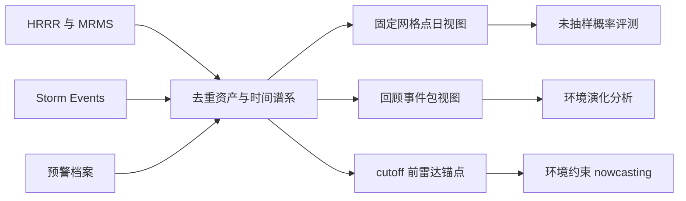

<!-- 书写报告使用中文 -->
---
idea: scs-env-benchmark
title: "SCS-EnvBench：带 issue-time 契约的强对流环境—雷达开放数据产品"
version: 1
date: 2026-07-16
workspace: workspace/scs-env-benchmark/
---

## Technical Gap

现有公开资源分别覆盖雷达影像、全球天气评测、事件报告或对象级特征，但缺少一份把原始环境场演化、雷达序列、事件前正常态和预警/实况的可用时刻语义共同产品化的数据底座。结果是环境条件化预报研究反复自建不可比管线；若仍以事后报告裁预测区域、在事件富集样本上报 Brier 分数，模型即使有效也不能回答真实基率总体上的校准问题。

必须解决的瓶颈不是新模型，而是四个可执行契约：源资产到样本的 issue/valid/availability-time 谱系、分析与预测双视图、代表性概率评测总体、跨重叠事件包无泄漏 split。成功标准是第三方仅凭发布清单即可重建样本，在冻结总体上复现概率与 nowcasting 评测；预测增量为 NULL 时，数据产品仍满足 ESSD 的可追溯、可复用要求。

真实 pilot 已完成而非计划结果：2024-05-06 Oklahoma 四源访问与 schema/hash 检查 4/4 PASS；ST-DBSCAN 在真实 114 条报告上得到 1--17 簇、对 NOAA `EPISODE_ID` 的最高 ARI=0.206，并完成每个 cutoff 先截表再重聚类的审计；84 个真实 MRMS 时刻无缺测，其中 52/84 满足正常态候选条件、32 个位于 -15d..-2d。后两数只作 6 小时采样实测，不外推为小时数或“六倍裕量”。无中断下载，无需本轮扩大下载；30 日审计先于全量采集。

## Method Thesis

- One-sentence thesis: 发布同源、双视图、issue-time 可审计的 HRRR--MRMS--Storm Events--预警数据产品，并用未抽样固定时空总体与重叠组件 split，使环境演化分析、概率预报和雷达锚定 nowcasting 可复现且不混入事后信息。
- Why this is the smallest adequate intervention: 复用 NOAA/IEM 源、FunnelCloud 在先的表格 ST-DBSCAN、成熟气象基线与评分器；新增的是数据契约和评测清单，不发明追踪器或预报架构。
- Why this route is timely in the foundation-model era: 环境条件化模型已证明多源组装与 train-on-analysis/test-on-forecast shift 是瓶颈（FuXi-Nowcast, 2512.08974），统一底座比再加一个专有模型更能改变可比性。

## Contribution Focus

- Dominant contribution: 版本化开放数据产品，含去重资产索引、原始/谐一化层、issue-time 语义、固定与风暴中心双视图、正常态抽样框、canonical tasks/splits/metrics、CF/ACDD/STAC/Croissant/RAI 元数据、代码与 DOI。
- Optional supporting contribution: 在冻结总体和容量匹配下，报告原始环境演化场相对 issue-time-safe 特征统计表的增量如何随 lead time、区域和季节变化；功效充分的 NULL 同样报告。
- Explicit non-contributions: 不主张 ST-DBSCAN、预测模型或“环境+雷达+标签”组合首次；不作 15 天物理记忆、因果、业务部署或 CONUS 外泛化主张。0--6 h 报告预警与 3D 风暴核仅在专项 pilot 后转正。

## Proposed Method

### Complexity Budget

- Frozen / reused backbone: NOAA HRRR/MRMS/Storm Events、IEM/NCEI 预警档案，ST-DBSCAN 表格聚类，逻辑回归、树模型、持久性/光流及小型场编码器。
- New trainable components: 无数据构建必需组件；示范实验只训练容量匹配的表格/场编码器和 MRMS-only/+environment 两臂。
- Tempting additions intentionally not used: 不加入 LLM/VLM、扩散生成器、新追踪算法、卫星/闪电/WoFS 或全分辨率 Level-II。后续版本可加模态，但不改变 v1 契约。

### System Overview

### Core Mechanism

#### 1. 数据与时间契约

每个资产记录源 URL/对象键、字节范围、SHA-256、处理 commit、变量/层位、issue time、valid time、实际或可复算 availability time、插值窗口、QC 与许可状态。预测视图在 cutoff `t` 只解析 `availability_time <= t` 的资产；HRRR f00 分析与 f01+ 预报分组保存，不以 valid time 相同为由互换。Storm Events 及其约 75--90 日发布时滞只作事后 target/provenance，不进入输入或区域定义；研究阶段等待最终标签不损害任务，业务可用性声明则明确禁止。

固定视图使用报告无关的 CONUS 0.5° NCEP Grid 4 网格；事件包视图用整日 Storm Events 表做回顾 ST-DBSCAN 索引，区域随报告簇形成但绝不用于预测裁剪。每个 cutoff 重跑“先按时间截表、再聚类”，量化最终 bbox 的后视偏差。nowcasting 空间锚仅来自 cutoff 前 MRMS 回波。

环境窗固定为事件锚点 -15d/+5d，用于正常态预算、环境演化和姊妹课题估计器预热，不解释为物理记忆。landscape H 节只支持小时至数日并建议 -72 h；因此物理 precursor 分析明确限于 -72h..0，-15d..-72h 仅作背景/预热池。正常候选仍须同时满足 bbox 内 ±3 h 无匹配报告且 MRMS 最大反射率 <35 dBZ，并发布到最近“事件信号”的距离：事件信号为同 bbox 报告时刻或 MRMS 首次/再次达到 35 dBZ 的时刻，分箱 `<6 h`、`6--24 h`、`24--72 h`、`>72 h`。主要正常合成只用 `>=24 h`；近事件候选保留但不混称静稳背景。

#### 2. 冻结的 canonical 概率总体

选择 C3 的“未抽样固定时空框架”而非纳入概率加权。发布总体

`U = {(g,d): g 为预先发布的 CONUS 陆地 0.5° 网格点，d 为 2018--2024 每个 eligible 1200--1200 UTC 有效日}`。

每个 `(g,d)` 的 cutoff 为有效日开始前 12 h 的 0000 UTC，输入仅含当时已可用的 HRRR 环境轨迹，目标 `Y=1` 当且仅当随后 12--36 h 有龙卷、冰雹 >=1 in 或对流大风 >=50 kt 的最终 Storm Events 报告落在 `g` 的 40 km 邻域；否则为 0。40 km/24 h 定义复用 Hill et al.（2208.02383），并与 Flora et al.（2603.20250）发现 36 km 有技巧而 9/18 km 近乎无技巧的尺度证据一致。静态 land/coverage mask 与因源缺测形成的 eligible mask 在读取标签前冻结并逐项发布；不得按事件密度删 test 单元。

确认性 test 包含其全部 eligible 网格点日，不抽 confirmed/hard/random 子集。面积权重 `w(g,d)=cos(latitude_g)`；例如 35°N 与 45°N 单元的未归一化权重分别为 0.819 与 0.707。Brier、BSS 和可靠性分箱均用同一权重，BSS 参照只用 train 年估计的逐日/逐时气候学（±15 日、120 km 平滑），逻辑回归为第二强基线。三类样本仍作为训练、困难负例诊断和独立 stress-test 发布，可任意重采样；其分数不得替代 `U` 上的主结果，也无需估计纳入概率。

#### 3. 无泄漏 split 与重叠包规则

canonical 时间块固定为 train=2018--2022、validation=2023、test=2024。所有同一 UTC 日的网格单元先整体入同一 split，故同日相邻区域不会跨 split。所有任务样本仅在完整输入/标签支撑落入对应时间块时进入 manifest；事件包按最长的 -15d/+5d 支撑统一执行各块首 15 日、末 5 日 embargo。跨界包仍在档案层发布，但不进入 canonical 训练/评测。

随后按实际谐一化支撑建无向图：两个包若共享任一 `(source, variable, spatial_chunk, valid_hour)`，或其 bbox 加一格 halo 后相交且事件核心相距 <=24 h，则连边；连通分量即 `leakage_component_id`，正常候选引用也继承该 ID。一个分量只能属于一个 split；若审计发现跨块分量则从任务 manifest 整体 purge，不拆包、不复制为不同标签。地域泛化附加采用 leave-one-NCEI-climate-region-out：跨界分量归 test，训练再去掉一格空间 halo。显著性以该分量为 block 做 2000 次 bootstrap，分量内日期/区域共同移动。

TorNet 的 Julian-day-mod-20 规则不作 canonical 切分：21 天环境窗会穿透逐日交错。为可比性，仅在完成上述分量合并后记录 `j20 = earliest_anchor_day mod 20` 辅助字段及 `<17 / >=17` 标签；它只用于 event-core stress-test，不支持主 claim。

#### 4. 雷达锚定 nowcasting 契约

输入为 cutoff 前 MRMS 历史与 issue-time-safe HRRR，比较 MRMS-only 与 +environment；输出未来 MRMS 组合反射率，分别报告 0--2 h 与 2--6 h。主判据为 5 km 邻域最大池化后的 40 dBZ CSI，30/50 dBZ 为预注册次指标，并同时报告 POD/FAR/frequency bias/FSS。确定性场直接用同一物理阈值；若输出超阈概率，只在 validation 的 `q=0.05,0.10,...,0.95` 中选择使 `|log(FB)|` 最小者，平局取 CSI 高者再取较高 `q`，按 lead/反射率阈值冻结后一次性测试，并发布完整 performance diagram。`Delta CSI = CSI(+environment)-CSI(MRMS-only) >=+0.02` 只在对应 lead 与 5 km/40 dBZ 层声明，不能跨尺度汇总掩盖 NULL。

### Optional Supporting Component

- Only include if truly necessary: 环境演化分析是一等数据用途，不是预测附录；以 `>=24 h` 正常层为参照，合成 -72h..+事件衰减期的 CAPE/CIN/PWAT/shear/湿度廓线与 MRMS 强度、结构、移动关系，按区域、季节和标签置信度分层。
- Input / output: 输出带不确定性的合成曲线、事件级效应分布与可复算样本清单；不输出因果效应。
- Training signal / loss: 无训练；事件/`leakage_component_id` 为重采样单位。
- Why it does not create contribution sprawl: 它直接验证长窗和正常态交付物的科学可用性，仍服务同一数据产品。

### Modern Primitive Usage

- Which LLM / VLM / Diffusion / RL-era primitive is used: 无；此数据 proposal 不需要前沿生成组件。
- Exact role in the pipeline: 现代天气基础模型仅是未来消费者，可在固定输入/输出契约上另报结果。
- Why it is more natural than an old-school alternative: 不适用；简单基线更能暴露数据契约本身的价值。

### Integration into Base Generator / Downstream Pipeline

源文件只存一次，固定视图与事件包通过索引引用同一资产；开放层发布可再分发数据、标签、元数据与 derived cubes，受限或条款未覆盖的资产只发布 hash 清单和重建 recipe。数据 DOI 与软件 DOI 分离、版本不可变；landing page 提供英文说明、license matrix、datasheet、field dictionary、split manifests、读取示例和独立数值复核样本。

### Training Plan

先跑 30 日 gate，再全量索引/谐一化，最后冻结 manifest 后训练基线。旗舰“特征表 vs 原始演化场”只用 canonical 概率任务：两臂共享网格、cutoff、变量、-72h..0 可用窗口、训练样本、loss、优化器、更新数、5 个 seed 与 12 次 validation 调参预算；表格特征只由固定 40 km 邻域内 cutoff-safe 场计算 mean/max/std 与分位数，不用事后对象位置。两编码器均输出 256 维、共享分类头，trainable parameters 匹配在 ±5% 内；主表同时报告参数量、训练 FLOPs 与峰值显存。这样比较的是信息形态，不是未来定位、样本或容量差异；MYRORSS-2026 只作对象级特征统计近邻，不跨 2006--2011 RUC 与现代 HRRR 直接比数。

### Failure Modes and Diagnostics

- 四源覆盖、再分发或体量失控: 30 日矩阵逐源给出 cadence、缺测、字节与 license；未知条款即 FAIL 或转 recipe-only，不启动全量下载。
- 聚类不稳: 报告参数网格、簇数/面积/噪声与 cutoff 重聚类；若相邻参数使簇统计跨 2 倍或无法冻结，删除报告簇任务，不拿最终区域替代预测区域。
- 正常态不足或近事件污染: 执行 80%/48 h/24 h gate与 distance-to-event 分层；失败即否定当前窗/包规格。
- 标签偏差: 保存源版本、空间/时间不确定性及报告类型；按人口密度/时代/区域分层，不把“无报告”称为无灾真值。
- 环境增量为 NULL: 数据照发；不得再以预测增量论证长窗，长窗价值限演化分析和预热用途。
- 托管成本过高: DOI 层优先发布谐一化子集、资产索引和可复算 recipe；不承诺镜像所有上游原始文件。

### Novelty and Elegance Argument

15 个近邻审计中仅三轴同时空缺：事件对齐的原始环境长序列、正常态时段作为交付物、预警与实况分离的 issue-time 契约。HR-Extreme（2409.18885）只在论文内抽 ±15d 正常时刻；MYRORSS Storm Cluster 2026（DOI:10.5281/zenodo.19644586）交付约 1060 列对象级派生统计而非场/廓线/演化序列；MeteorPred（2508.06859）把预警当标签。FunnelCloud 已在 2017 年使用报告 ST-DBSCAN 关联环境与雷达，故聚类及宽松组合不主张新颖。方案的简洁性在于一个时间/空间/标签契约同时约束三种消费者，而不是为每个任务再造一套数据。

## Claim-Driven Validation Sketch

### Claim 1: v1 发布规格可被真实数据支撑

- Minimal experiment: 30 个分层抽取 UTC 日覆盖至少 3 个气候区，审计四源交集、许可、小时缺测/体量、ST-DBSCAN 参数与 cutoff 重聚类、正常态产率。
- Baselines / ablations: 35 dBZ 扫 30/40 dBZ，报告缓冲 ±3 h 扫 ±1/±6 h；聚类参数各上下一个网格点。
- Metric: HRRR 所需场与小时 MRMS 审计覆盖均 >=95%，四源状态无 unknown license；相邻聚类设置的簇数/中位面积不得跨 2 倍；>=80% 包含 >=48 正常候选小时且 >=24 小时位于 -15d..-2d。
- Expected evidence: 全部通过才启动全量下载；任一失败即停在审计报告并修改或撤回对应发布规格，不以 pilot 52/84 代替。

### Claim 2: 数据产品支持基率可解释的概率评测，且原始演化场的信息增量可被公平检验

- Minimal experiment: 在冻结 `U` 与 year split 上跑气候学、逻辑回归、容量匹配特征表、原始场四臂，并做正常态—事件演化分析。
- Baselines / ablations: 特征表 vs 原始场为决定性消融；单时刻场只作诊断，不扩成第三贡献。
- Metric: area-weighted BS/BSS、reliability、AUROC/NAUPDC；按 `leakage_component_id` bootstrap。分别冻结 `Delta BSS_base=BSS_raw-max(0,BSS_logistic)` 与 `Delta BSS_repr=BSS_raw-BSS_table`；对应 claim 仅在差值 >=+0.02 且 95% CI 不含 0 时成立。该门槛只适用于 0.5°/40 km/12--36 h，等价于两臂 BS 差至少达到气候学 BS 的 2%，避免海量网格点把微小差异做成“显著”；40 km 尺度有 2208.02383 与 2603.20250 的直接协议依据。
- Expected evidence: 预期完整场在部分区域/季节有增量，但不预设正结果；NULL 支持“统计表已足够”的克制结论。

### Claim 3: 环境约束的价值随 nowcasting lead time 改变

- Minimal experiment: 同 split、同容量和训练预算比较 MRMS-only 与 +environment，分 0--2 h/2--6 h 报告。
- Baselines / ablations: 持久性、光流、MRMS-only；+environment 是唯一主消融。
- Metric: 5 km/40 dBZ CSI 主指标，30/50 dBZ、POD/FAR/FB/FSS 辅助；每个 lead 的 `Delta CSI >=+0.02` 且 component-bootstrap 95% CI 不含 0 才作增量 claim。5 km/30--50 dBZ 协议复用 FuXi-Nowcast；短 lead 环境可被观测替代、较长 lead 增量上升的先例使分 lead 判定优于 pooled gate。
- Expected evidence: 允许 0--2 h 为 NULL、2--6 h 为正，也允许全 NULL；0--6 h 报告预警和 3D 核失败只删除可选项。

## Paper Outline

- Section 1: 数据产品空白、三条审计差异轴与 ESSD/NeurIPS D&B 双轨定位。
- Section 2: 四源、时间语义、双视图、正常态与许可/provenance。
- Section 3: 固定总体、标签、重叠组件 splits、tasks/metrics。
- Section 4: 30 日 QC、覆盖与代表性；Section 5: 演化分析和最小基线/旗舰消融；Section 6: 局限、版本与访问。
- Key figures: 资产到双视图的谱系图；固定总体与 split/embargo 图；覆盖/QC 地图；正常态—事件演化；特征表/原始场及 MRMS-only/+environment 的 lead-time 图。

## Compute and Timeline Estimate

- Estimated GPU-hours: 整编以 CPU/网络/存储为主；概率基线、容量匹配消融与初步 nowcasting 共 300--800 GPU-hours；全量 nowcasting 预算在 30 日 gate 后冻结。
- Data / annotation cost: 无新增人工标注；预计多 TB，先核算 dedup 后字节、出口与 DOI 托管费用。当前本地 handoff 为 23,916,994 bytes 源 pilot 加 573 MB、84 个 git-excluded MRMS smoke 文件。
- Timeline: 30 日 gate 3--4 周；数据产品、概率旗舰与演化分析 6--12 个月，形成 ESSD 主稿；nowcasting 第二期，总计 12--18 个月，NeurIPS D&B 仅在 canonical 结果与托管完成后投稿。
