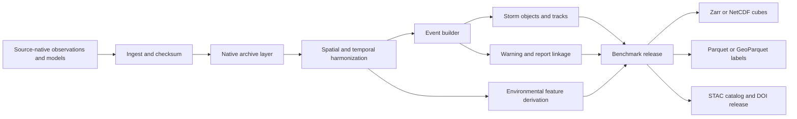
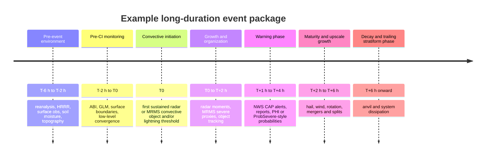
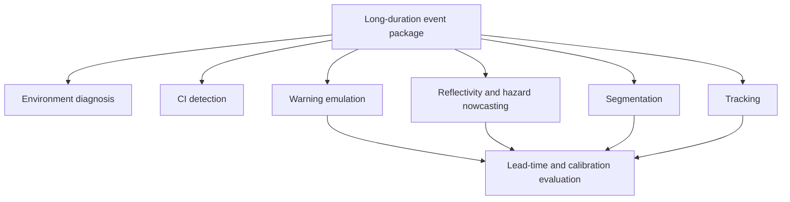

<!-- 书写报告使用中文; 本 landscape 是单一事实源, 允许膨胀。 -->
# Landscape: 强对流环境–雷达多模态开放基准数据集 (0713-scs-benchmark)

> **来源与健康警告 (dispatcher, 2026-07-13)**
> 下方"用户提供的 deep-research 蓝图"整段转写自用户源文件
> `/blue/yixin.wen/weikangqian/GitRepo/myproject/SCSDataset_benckmark_report.md`,
> 由一个 deep-research 工具生成。**其中所有内联 `citeturn…search…` 标记是 web-search 工具的内部引用锚, 不是可核验的 arXiv/DOI, 论文标题/年份/作者均未经核验。**
> 按项目手册红线, 任何要写进 idea/review/proposal 的论文引用都必须用 `agon:arxiv-tools` 拉原文核验后才能落笔。
> 因此本蓝图仅作**结构性 landscape 起点**(它对数据模型、任务套件、许可、QC、发表清单的组织是有价值的), 具体撞车判定与必引清单以 deep-lit 阶段 arxiv-tools 核验结果为准。

---

## 已读论文 arxiv_id 清单 (deep-lit 维护)

<!-- deep-lit-tick 每读一篇经核验的论文, 在此登记 arxiv_id + 一行结论。 -->

**状态 (2026-07-14, topic-scope tick, 第 4 次 resume 完成整合)**: 累计 54 篇, 全部零撞车 (无一篇发布"环境场为一等公民的风暴中心多模态开放事件包"), B4 饱和条件已满足 (依据见文末"Deep-lit 综合结论"节)。按主题分组, 每篇一行结论。全部经 `arxiv_tool.py info/tex` 核验。

### A. 标签源质量 / 理论机理支撑 (4 篇)

| arxiv_id | 标题(简) | 一行结论 |
|---|---|---|
| 1606.06973 | NOAA Storm Events 数据库可靠性短评 | 损失字段缺失过半、量级码混乱、$115B 录入错误 — 我们 QC/不确定性标记设计的一手动机证据 |
| 2004.11636 | 理想化 SCS 探空物理模型 (Chavas & Dawson) | CM1 实验证明 bulk 诊断量相同的探空可产生完全不同风暴演变 — 环境场须存完整垂直结构而非仅 CAPE/CIN 派生量的核心物理依据 |
| 2310.11631 | 未来 SCS 环境垂直结构变化 (CMIP6) | 变暖使低层 shear/SRH 增强; 消费 SCS 环境数据的科学研究范例, 印证垂直剖面变量清单需求 |
| 2503.15466 | Supercell 环境 (GridRad-Severe + HRRR) | 同一物理问题因数据集构建选择(网格/SM 来源/时空过滤)得出相反结论 — 标准化基准必要性的直接证据 |
| 2512.14304 | 全球雷暴环境气候变率 (BTE 数据集) | CAPE×WS06 阈值标定数据集, 证明"thunderstorm environment dataset"命名空间已有人占, 需在 novelty 段划清 severe vs occurrence-climatology 边界 |

### B. 直接对照 / 近邻数据集与基准 (12 篇, novelty 段必须逐一对表)

| arxiv_id | 标题(简) | 一行结论 |
|---|---|---|
| 2401.16437 | TorNet | 头号先例: 事件驱动+Storm Events 标签+雷达 benchmark, 但零环境场、单 hazard、chip 快照式 — 差异化基线 |
| 2409.18885 | HR-Extreme | HRRR+Storm Events/SPC 骨架最接近的先行者, 但是预报评测集 (t=3h 快照, 无 provenance/QC/DOI 整编), 需显式对表 |
| 2510.16031 | Storm250-L2 | 风暴中心 250m NEXRAD 事件包, 纯雷达单模态, **已于 2026-06-25 因事件覆盖不足撤稿** — 直接印证 idea review 提到的覆盖率风险为真实风险 |
| 2512.17924 | UK curated rain radar 数据集 | "雷达序列+环境标量特征"抽象模式已被占先 (2025-12); 差异化须落在 SCS 特化而非该抽象模式本身 |
| 2406.11217 | WeatherQA | SPC MCD 文本+渲染图 VLM QA 基准; 缺时间演变、渲染档案止于 2020、标签无实况校验 — 反面证据 |
| 2409.19058 | CLLMate | 新闻事件×ERA5 日均缩略图 MLLM 基准; 无时间窗/雷达/官方事件库 |
| 2412.02780 | WxC-Bench | 6 任务 ML-ready "dataset of datasets"; 环境场仅单时刻快照用法, 实证我们 gap 声明 |
| 2508.06859 | MeteorPred / MP-Bench | **最近邻 prior work**: ERA5 4D×CMA 预警文本 42 万对+MLLM; 差异化轴= SCS 专用类别/实况标签/pre-storm 提前量/气象检验指标 (POD/FAR/CSI) |
| 2508.12291 | RadarQA | SEVIR 之上的雷达质量评估文本层 (RQA-70K); 无环境场/事件标签, 佐证生态位空缺 |
| 2510.03349 | AgentCaster | LLM-agent 龙卷预报基准, 环境场降维成 PNG 图像 — 反向验证本 topic 立项 gap |
| 2510.04017 | Zephyrus | 气象 agentic 框架+ERA5 基准, 极端天气检测 F1≈0.00-0.04, 评测基建 (三段式抽取-验证-打分) 可平移 |
| 2601.23268 | TCBench | 事件中心任务定义→统一 schema→四级 baseline→三层 metrics 的完整骨架, 是**最佳同型模板**（非撞车，领域不同） |

### C. 协议式基准谱系 (全球/气候尺度 model-intercomparison, 定位参照非竞品, 9 篇)

| arxiv_id | 标题(简) | 一行结论 |
|---|---|---|
| 2308.15560 | WeatherBench 2 | 全球中期场变量基准范式起点; 设计三要素(开放云数据+开源评测代码+持续更新网站)是我们交付物验收标杆 |
| 2409.09371 | WeatherReal | 站点实测评测基准; ERA5 系统性低估极端天气的证据链可直接引用支撑"须用 HRRR 级环境场"主张 |
| 2604.16643 | WP-MIP | WMO 首个 AI/混合/物理三方对比计划; KE 谱能量亏损证据支撑"需要风暴尺度专用基准" |
| 2605.01126 | Extreme Weather Bench (EWB) | 首个社区高影响天气评估基准; 把环境压缩成单一 CBSS 标量, 反向强化环境场一等公民空白 |
| 2605.06944 | AIMIP Phase 1 | 首个 AI 气候模型互比协议; CO₂-as-clock 泄漏案例直接支撑"时间泄漏须显式记录"原则 |
| 2605.24945 | RealBench | 2025 零泄露测试年+11539 站点+事件级指标; "现有 benchmark 不反映业务条件"的量化证据 |
| 2602.00622 | "What is a realistic forecast?" | Popper 式三层 realism (functional/structural/physical) 评估框架, 可作 canonical metrics 组织骨架 |
| 2606.10642 | PhysMetrics.Weather | NeurIPS E&D Track 论文, 九指标物理一致性评估; **目标 venue 结构先例**(Related Work 对比表范式可直接借鉴) |
| 2606.29172 | CORDEX-ML-Bench | 13 机构 40 ML 配置区域降尺度基准; 作者自陈 sub-daily/对流尺度为最高优先级未来方向 — 反向印证空白成立 |

### D. 评估方法论 / Metrics 工具箱 (4 篇)

| arxiv_id | 标题(简) | 一行结论 |
|---|---|---|
| 2306.11249 | OpenSTL | NeurIPS D&B 同 track 方法基准先例, 代码库可作 nowcasting baseline zoo, 论文结构可作提交模板 |
| 2401.15305 | Practical Probabilistic Benchmark (lagged ensemble) | 无偏 CRPS + 去偏 SER 公式进 canonical metrics; time-lagged ensemble 概率基线可零额外存储成本落地 |
| 2510.25045 | Threshold-weighted spatial verification (HiRA+twCRPS) | 评分协议可翻转模型排名的实证 — SCS 事件天然空间对象, 不能用点对点 CSI/RMSE |
| 2606.21170 | Weighted Potential CRPS | twCRPS 逐格点历史分位阈值+records 双口径进 canonical metrics; 警示: 弱基线会使 skill 虚高 |

### E. 环境 → 对流/灾害 ML 应用 (motivation + baseline 素材, 8 篇)

| arxiv_id | 标题(简) | 一行结论 |
|---|---|---|
| 2208.02383 | CSU-MLP day4-8 RF 强对流概率 | 业务级工作训练对仍 ad hoc 不开放; 验证协议(BSS+AUROC+reliability)可作 baseline 模板 |
| 2012.00679 | WoFS ML 概率校准 | 数据 upon-request 不公开; Table 1 环境变量清单是我们 HRRR 抽取清单的选型起点 |
| 2509.08802 | ML 降尺度环境变量预测对流空间频率 | 16 变量清单+Steiner 掩膜代码可直接复用; 模拟世界内静态映射, 无时间演变 |
| 2505.11750 | Transformer 后处理 AI 预报做强对流预测 | lead-time-as-token 证明环境时间序列携带预测技巧; 更高分辨率完整环境场是其点名的 future work |
| 2504.00128 | 统计后处理神经天气模型预测阵风 | +44%~215% CRPSS 增益是"环境场信息值钱"最干净定量证据; GEV+CRPS loss 任务模板 |
| 2603.20250 | WoFS watch-to-warning ML 指导 | 数据 upon-request、WoFS 无公共档案 — 实证"无公共可比基准"空白; UH-NMEP 可作 canonical 基线 |
| 2606.26699 | 冷锋对流单体发生 XGBoost | 欧洲最活跃冷锋对流 ML 线也建立在不可再分发数据上; 60 变量 ERA5 清单+防泄漏标注规则可直接借鉴 |
| 2501.06907 | DL/基础模型天气预报综述 | 60+ 数据集附录逐条核验"无一把环境场时空演变当一等公民"; baseline menu 参照 |

### F. Nowcasting 模型 (SOTA 消费者视角, gap 证据 + 协议先例, 13 篇)

| arxiv_id | 标题(简) | 一行结论 |
|---|---|---|
| 2211.13181 | WSR-88D 速度退模糊 DL | 雷达 QC 单模态工程已成熟, 反衬多模态封装才是真空白; Storm Event 驱动采样+时间切分先例可引 |
| 2310.09392 | ML 反演雷达最大垂直速度 | WoFS 训练/GridRad-Severe 评估需手工谐一化 — "重复造轮子"活体证据 |
| 2310.16015 | GOES-16 CI nowcasting + XAI | 零环境场输入, 作者自认时间信息缺失致误报— 一手 gap 证据; CI 三条件定义可复用 |
| 2507.16219 | 贝叶斯 DL CI 临近预报 UQ | 单月单区域, 无环境场; UQ 评测套件(BSS 分解+discard test)可定为 canonical UQ metrics |
| 2507.05658 | HRRRCast | NOAA 自建 emulator 都要重复造 HRRR 管线且踩坑(GFS T2M 遗漏); Table 1 变量清单+f00/f01 语义讨论直接支撑数据模型设计 |
| 2512.08974 | FuXi-Nowcast | **本轮最强先验证据来源**: 环境增量随 lead time 增大(0-2h小/2h+递增), 修正"短 lead 环境增量为 null"的先验预期; issue-time 语义(f00 analysis vs f01 forecast)业务先例 |
| 2601.17268 | Stormscope (NVIDIA) | 2026 工业 SOTA 刻意仅用 Z500 单通道环境条件, 自证更密条件有增益但无开放数据产品 — 旗舰级 gap 佐证 |
| 2602.05204 | exPreCast (KMA 雷达) | 平衡极端天气 benchmark 已被 ICLR 接受为一等贡献的先例 (motivation 层可引) |
| 2604.02818 | MAG-Net (卫星+雷达融合) | CMA 域方法论文私有数据无 splits; Band Power Ratio 抗糊图指标值得纳入 metric 套件 |
| 2604.15377 | M3R (站点+雷达多模态) | 加雷达空间语境使站点雨率 RMSE 降 22% — 跨模态封装有预测增益的近期证据 |
| 2604.24224 | IMPA-Net | 环境输入仅静态地形, 时变环境场明确列为 future work — 支持我们"4D 环境特征"定位 |
| 2605.24067 | MeteoLogist (GridRad-Severe 消费者) | 手搓数据管线暴露"缺规范化 SCS benchmark"需求清单; HKUST-GZ 组有转投 D&B track 风险, 需尽快锁定差异化 |
| 2606.18436 | GNN 多模态降水消融 (Nordic) | NWP 只用最近快照 — 反向印证环境场静态化是普遍现状 |
| 2606.25937 | Event-aware loss (KMA 闪电) | 闪电权重图标签流水线可迁移; KMA 内部数据管线再次证明三模态对齐数据只能各自私建 |

### G. 基准设计范式参照 (非天气领域, 1 篇)

| arxiv_id | 标题(简) | 一行结论 |
|---|---|---|
| 2506.13652 | PeakWeather (瑞士站点观测) | 站点类开放基准, 与我们互补支撑"环境场从未当一等公民"论述; contributions 三段式+双许可写作模板可参照 |

## 已确认撞车风险 / 候选对照数据集 (待 arxiv-tools + 官网核验)

以下数据集来自用户蓝图, 是最可能的"撞车/baseline/可复用"对象, **均未核验**, deep-lit 阶段须逐一核实其真实范围、时窗、模态、许可与是否已含环境场:
- **SEVIR** — 多模态风暴影像基准 (雷达/卫星/闪电), 约 1 万+ 事件, 384×384 km, 固定 4 小时窗。疑似最直接对照。
- **MYRORSS** — 多年雷达再分析 + 近风暴环境分析, 1998–2011, 0.01° 网格。
- **WeatherBench 2** — 全球中期预报评估框架 (非风暴尺度/预警)。
- **HKO-7** — 香港雷达 nowcasting 经典基准 (雷达为主, 地域局部)。
- **MeteoNet** — Météo-France 开放集 (雷达/站点/卫星/NWP/地形掩膜)。
- **TORUS** — 超级单体/龙卷外场过程观测 (campaign 尺度)。
- **Storm Events / SPC archives / NWS CAP alerts** — 权威事件/预警记录 (仅标签)。
- (deep-lit 需另查是否有更新的 2024–2026 强对流多模态基准, 如 TorNet 及类似, 以及"环境场作为一等公民"是否已被他人占坑。)

## 候选原始数据源 (用户设定 + 蓝图扩展, 待核验许可与再分发条款)

MRMS (雷达融合) / NEXRAD Level II (单雷达矩) / GLM (闪电) / IGRA·RAOB (探空) / ERA5 (再分析) / HRRR·WoFS (高分辨 NWP) / GOES ABI (卫星) / ISD·ASOS·MADIS (地面) / SMAP (土壤湿度) / USGS 3DEP (地形) / NOAA Storm Events·SPC·NWS CAP (事件与预警标签)。

---

# 用户提供的 deep-research 蓝图 (原文转写, 引用未核验)

# Open Benchmark Database for Severe Convective Environment Analysis, Event Warning, and Nowcasting

## Executive summary

An open benchmark database built around **storm-centered regional clusters**, paired **MRMS and raw radar observations**, and **much longer-duration environmental context spanning pre-convective conditions, convective initiation, mature severe phase, and decay**, would fill a real gap in the current open-data landscape. Existing resources are valuable, but they are fragmented by purpose: **SEVIR** is a landmark multimodal storm-imagery benchmark with fixed 4-hour event windows, **WeatherBench 2** is a global medium-range forecast benchmark rather than a severe-convection warning dataset, **HKO-7** and **MeteoNet** are strong nowcasting datasets but are mostly radar/precipitation oriented and geographically local, while **MRMS/MYRORSS**, **Storm Events**, **SPC archives**, and **WoFS/ProbSevere products** are open components rather than a single curated benchmark with unified labels, splits, provenance, and evaluation tasks. citeturn3search0turn3search1turn3search13turn4search5turn4search8turn2search3turn21search15

For a journal such as *Earth System Science Data*, the strongest publication angle is **not merely releasing assembled files**, but releasing a rigorously curated, versioned, and openly documented **research data product**: harmonized event packages; machine-readable metadata; provenance down to file and processing step; explicit uncertainty and quality flags; open access through a repository with DOI/versioning; and demonstration analyses that show the dataset supports **climatology, process studies, nowcasting, and warning evaluation**. ESSD explicitly targets high-quality Earth system datasets, requires reliable repositories and data citations, and expects the dataset to be reusable beyond the paper itself. citeturn5search14turn9search4turn13search1turn13search5turn13search16

My overall assessment is that your proposed architecture is **novel enough for an ESSD-style data descriptor if implemented carefully**, especially if it does all of the following at once:  
(1) packages **storm-evolution windows longer than typical image-based benchmarks**;  
(2) links **storm-centered MRMS/radar observations** with **environmental context** from soundings, reanalysis, surface observations, land-surface fields, and high-resolution NWP;  
(3) includes **warning and report labels** suitable for decision-support evaluation; and  
(4) publishes **canonical tasks, splits, baselines, and metrics**. The largest risks are not scientific novelty, but **license mixing, label noise, temporal alignment errors, data volume, and ambiguous event definitions**. citeturn3search0turn4search8turn20search4turn16search0turn13search9

Because your exact **spatial extent, temporal span, event definition, and release repository are unspecified**, the recommendations below are written as a design blueprint. Since MRMS is a NOAA U.S.-focused product, the most natural first release is U.S.-centered; if the project later expands internationally, analogous radar and satellite sources should be substituted with equally explicit metadata and licensing treatment. citeturn0search11turn4search4turn23search14

## Design objectives and recommended data model

The central design choice should be to treat the benchmark not as a stack of frames, but as a set of **event packages** with three linked coordinate systems: **time**, **space**, and **storm object identity**. In practice, each package should contain a fixed or semi-fixed regional domain, native-time observations, harmonized gridded fields, object tracks, and event/warning/report labels. That structure is much more suitable for severe-convection science than a pure image-sequence benchmark, because warning decisions depend on storm history, environmental forcing, and downstream impacts, not only on the next radar frame. This recommendation is consistent with how MRMS, WoFS, ProbSevere, PHI, and modern verification methods are used operationally and in research. citeturn14search0turn20search4turn21search15turn21search0turn7search0

A strong data model would therefore separate:

- **dataset-level entities**: release version, spatial coverage, temporal coverage, source list, processing pipeline, split definitions;
- **event-level entities**: event ID, region cluster ID, start/end time, CI time, mature phase time, decay time, primary hazard labels, associated warning/report IDs;
- **object-level entities**: storm cell/segment IDs, tracks, mergers/splits, per-object features, probabilistic hazard scores;
- **asset-level entities**: the actual radar, satellite, NWP, sounding, and surface files or chunks with source provenance and QC flags. citeturn5search4turn5search0turn5search1turn5search2

For the **regional architecture**, I recommend publishing **both** a fixed-grid and a storm-centered view. The fixed-grid view supports reproducible benchmarking and climatology. The storm-centered view is better for object tracking, storm evolution, and ML training efficiency. If you publish only dynamic storm-following crops, intercomparison becomes harder; if you publish only static grids, environmental inflow and storm-relative evolution are less natural to analyze. A dual-view design significantly improves utility. This is one of the clearest ways your dataset can differentiate itself from image-centric predecessors such as SEVIR. citeturn3search0turn3search15

A good **temporal design** is to begin the environmental context **well before CI** and continue through **system decay**, instead of stopping at the “interesting” severe phase. That matters scientifically because severe outcomes depend not only on the mature storm, but on boundary-layer recovery, pre-storm moisture transport, antecedent land conditions, storm mergers, and upscale growth. In other words, the data package should support both **forecasting** and **post hoc diagnosis**. Operational systems such as WoFS and PHI are explicitly designed around extending short-term lead time and evolving storm-scale hazard guidance, which supports this long-window philosophy. citeturn20search4turn20search9turn21search0turn21search4

This pipeline is especially suitable for ESSD because it exposes the full lineage from raw source to benchmark asset, which is exactly what FAIR reuse and data-publication review require. citeturn5search4turn9search9turn13search1

## Essential data holdings and technical specifications

The database should include the data types below. The “typical” resolutions are source-typical, not mandatory benchmark resolutions; because your final extent and timespan are unspecified, the benchmark should preserve native information where possible and supply a harmonized analysis grid in parallel.

| Data type | Why it is essential | Typical native cadence and resolution | Common open source and format | Recommended benchmark representation |
|---|---|---|---|---|
| **MRMS products** | Best open U.S. multi-radar fused severe-weather context; useful for reflectivity mosaics, MESH, azimuthal shear, echo-top and severe proxies. MRMS products are designed to support warnings, aviation, hydrology, and NWP. citeturn0search11turn0search6turn10search7turn10search12 | Many core fields at **2 min**, **0.01°** grid. citeturn10search7turn10search12 | NOAA/NODD MRMS; native files commonly distributed as **GRIB2**. citeturn0search1turn2search15 | Preserve source GRIB2; publish harmonized event cubes in **Zarr** or **NetCDF4**, plus object masks and QC layers. |
| **Single-radar reflectivity and velocity** | Needed for native radar moments, Doppler signatures, radial-velocity-based rotation diagnostics, and reproducible preprocessing beyond fused MRMS. citeturn10search0turn10search5 | Volume scans typically **4.5–10 min**, native polar coordinates; Level II includes reflectivity, velocity, spectrum width, and dual-pol variables. citeturn10search0turn10search1turn10search5 | NEXRAD Level II archive; native Level II binary/chunked archive. citeturn0search2turn10search1 | Convert to **CfRadial2 NetCDF4** for interchange and optionally **Zarr** for cloud access. citeturn23search0turn23search6 |
| **Lightning** | Total lightning is useful for storm intensification and warning lead time; ProbSevere and PHI also exploit lightning-related information. citeturn0search8turn21search10turn21search15 | GLM native observations are continuous; Level 2 files are for **20 s periods**, with gridded products commonly aggregated at **1 min** or **5 min** and gridded to the **ABI 2 km** fixed grid. Native GLM spatial sampling is about **10 km**. citeturn19search13turn19search15turn19search4turn19search5 | NOAA/NASA GLM in **netCDF4/HDF5**. citeturn19search11turn19search6 | Publish both event/group/flash tables and 2 km gridded FED-style fields. |
| **Sounding/RAOB** | Essential for thermodynamic and kinematic severe-environment diagnosis and for validating reanalysis/NWP-derived environments. IGRA is quality controlled and widely reusable. citeturn1search2turn14search7 | Station-point profiles with station-specific times; in U.S. operational practice, many routine launches are at **00/12 UTC**. citeturn24search9turn24search8 | IGRA is distributed in **plain text**; NWS upper-air archives are official through NCEI. citeturn11search0turn24search0 | Publish native profile tables plus derived sounding features in **Parquet**. |
| **Reanalysis** | Backbone for long-duration environmental context and climatology; essential when soundings are sparse. ERA5 provides hourly global fields and pressure/single-level products. citeturn0search9turn11search1turn9search11 | Commonly **hourly**, regridded **0.25°** for reanalysis products. citeturn11search1turn11search6 | ERA5 in **NetCDF/GRIB**; Copernicus now also supports cloud-oriented access patterns. citeturn11search6turn9search16 | Publish event subsets in **Zarr** with pressure-level and single-level groups. |
| **High-resolution NWP** | Provides true forecast context and supports warning-lead-time tasks. HRRR offers operational 3 km convection-allowing guidance; WoFS provides rapidly updating storm-scale ensemble guidance for 0–6 h hazards. citeturn1search0turn1search12turn20search4turn20search9 | HRRR: **3 km**, hourly updated, with **15 min** outputs early in forecast. WoFS: rapidly updating ensemble with storm-scale 0–6 h hazard focus. citeturn1search6turn20search2turn20search4turn20search8 | HRRR native **GRIB2**, with public **Zarr** archive examples. WoFS availability is more experimental/research oriented. citeturn11search2turn11search7turn20search1 | Use HRRR as the default public CAM baseline; add WoFS where redistributable, or distribute WoFS-derived labels/features if raw fields cannot be mirrored. |
| **Satellite** | GOES ABI provides cloud, moisture, and overshooting-top context before and during convective initiation; joint ABI+GLM is especially valuable. citeturn2search6turn2search11 | ABI spatial resolution is about **0.5–2 km** depending on band; **CONUS every 5 min**, **mesoscale every 30 s**, **full disk about 5–15 min** depending on mode. citeturn10search3turn10search13 | GOES ABI and many L2+ products in **netCDF4** via NODD/NCEI. citeturn2search2turn2search10 | Publish a selected band set and derived multispectral indices on harmonized grids. |
| **Surface observations** | Needed for boundary placement, mesoscale gradients, verification, and real-time environmental diagnosis. ISD and ASOS are official and open; MADIS adds QC flags but some feeds have restrictions. citeturn1search3turn12search4turn12search1turn22search0 | ISD is **hourly/synoptic**; ASOS also offers **1 min** and **5 min** products for many stations. citeturn12search3turn12search4turn12search0turn12search5 | ISD in gzipped **fixed-width ASCII**; ASOS archival text products; MADIS common-format feeds with QC flags. citeturn12search8turn14search1 | Publish station tables in **Parquet/GeoParquet** with QC and provider flags. |
| **Soil moisture and land surface** | Antecedent land-state matters for boundary-layer recovery and convective potential; useful especially for warm-season severe environments. SMAP gives open global soil-moisture products. citeturn1search4turn11search3turn11search8 | Typical benchmark-friendly products are **daily 9 km** or **3-hourly 9 km** depending on level. citeturn11search3turn11search8 | SMAP products in **HDF5**. citeturn11search3 | Publish reprojected land-surface rasters or derived anomalies. |
| **Topography** | Needed for beam blockage interpretation, terrain forcing, and downstream modeling. USGS 3DEP is authoritative for U.S. topography. citeturn1search5turn11search4 | Common national product: **1 arc-second** seamless DEM; finer products also exist. citeturn11search4turn11search9 | USGS 3DEP in **GeoTIFF**. citeturn11search4 | Publish static terrain rasters and derivatives: slope, aspect, relief, local beam-blockage fraction where relevant. |

Two design choices deserve emphasis. First, I would treat **MRMS as the canonical benchmark observation layer**, but I would **not** omit raw radar moments; several high-value warning tasks depend on radial velocity and native polar geometry in ways that mosaics do not fully preserve. Second, I would treat **HRRR as the universal high-resolution NWP layer** and **WoFS as a premium subset** for specialized warning experiments, because HRRR is broadly open and stable as a national archive, whereas WoFS is still more research/prototype oriented. citeturn0search1turn10search5turn1search12turn20search4turn20search1

The benchmark should also include **open event/impact labels**. At minimum, use the **NCEI Storm Events Database**, **SPC severe-weather event archive**, and **NWS warning/CAP products**. Storm Events is essential because it contains official NOAA severe-event records, but it should be accompanied by uncertainty caveats because periods of record and collection procedures differ by event type and through time. CAP and NWS alert products are needed if warning-emulation and lead-time evaluation are core tasks. citeturn2search3turn2search8turn2search4turn16search1turn16search6

## Metadata, provenance, licensing, and quality control

For ESSD, metadata and provenance are not secondary; they are part of the scientific contribution. At minimum, your published benchmark should follow **CF metadata conventions** for gridded scientific variables, **ACDD** for discovery-oriented global metadata, and a **STAC catalog** for searchable asset-level geospatial metadata. That combination is practical and aligns with current Earth-science interoperability practice. citeturn5search0turn5search1turn5search2turn5search17

A concise set of recommended metadata fields is below.

| Metadata scope | Example fields | Why they matter |
|---|---|---|
| **Dataset-level** | `dataset_title`, `version`, `release_date`, `doi`, `license`, `creators`, `institution`, `summary`, `keywords`, `spatial_extent`, `temporal_coverage_start`, `temporal_coverage_end`, `grid_definition`, `crs`, `vertical_reference`, `event_definition`, `processing_pipeline_version`, `software_commit`, `citation`, `contact` | Discovery, citation, and ESSD repository/reuse requirements. citeturn5search1turn13search1turn9search4 |
| **Event-level** | `event_id`, `region_cluster_id`, `bbox`, `storm_mode`, `primary_hazard`, `ci_time`, `mature_time`, `decay_time`, `warning_ids`, `report_ids`, `label_confidence`, `data_gaps`, `split_assignment` | Prevents ambiguity in event construction and benchmark leakage. |
| **Object-level** | `object_id`, `parent_id`, `track_id`, `merge_split_flag`, `area_km2`, `max_refl`, `max_mesh`, `rotation_proxy`, `prob_hail`, `prob_wind`, `prob_tor`, `lifetime_min` | Enables tracking, warning and object-centric ML tasks. |
| **Asset-level** | `source_dataset`, `source_doi`, `source_provider`, `native_format`, `original_filename`, `checksum`, `acquisition_time`, `valid_time`, `latency`, `reprojection_method`, `resampling_kernel`, `qc_mask_name`, `quality_flag`, `units`, `scale_factor`, `add_offset` | Supports full lineage and reproducibility. citeturn5search4turn5search0turn5search2 |

On licensing, the safest policy is to treat licensing as **asset-specific**, not assumed homogeneous. NOAA data disseminated through NODD are generally open to the public, but NOAA explicitly asks for attribution, disallows implied endorsement, and asks that modified products not be represented as original NOAA data. NASA Earthdata follows a strong open-data policy with unrestricted access for Earth science data and metadata. USGS data are generally U.S. public domain. Copernicus moved CDS/ADS/EWDS products to **CC-BY** in July 2025, which means attribution obligations must be preserved in downstream redistribution. By contrast, parts of **MADIS** have provider restrictions, including limitations on redistributing some mesonet feeds. citeturn5search3turn9search0turn9search2turn9search7turn9search1turn22search0

The implication for your benchmark is important: if you want a **fully open redistributable release**, you should either  
(a) include only assets whose upstream terms allow redistribution, or  
(b) publish the benchmark in two layers: an **open derivative layer** containing your labels, metadata, derived features, and openly redistributable source subsets, plus a **manifest-and-recipes layer** that reconstructs non-redistributable components from official sources. For a mixed-source derivative, **CC-BY 4.0** is usually safer than CC0, because it is compatible with attribution expectations from Copernicus and many scientific-data communities. citeturn9search1turn9search9turn22search0turn13search1

The main ethical issues are therefore practical rather than sensitive-human-data issues:  
you should avoid redistributing restricted MADIS feeds; avoid exposing exact private-station metadata where provider terms are unclear; document uncertainty and collection biases in reports/warnings; and avoid language that implies NOAA/NASA/ECMWF endorsement of your derivative benchmark. Storm Events labels also require caution because official collection practices differ over time and by event category. citeturn22search0turn22search11turn9search13turn2search8

Preprocessing and quality control should be strict and explicit. For radar/MRMS, I would recommend preserving native files, then applying standardized harmonization with published masks for data voids, beam blockage, clutter contamination, bright band, anomalous propagation, and interpolation/resampling ranges. MRMS itself already applies substantial QC and multi-sensor fusion, including mitigation of non-meteorological echoes and meteorological artifacts; you should propagate that information rather than obscuring it. citeturn14search0turn14search5turn0search6

For surface data, ingest official QA/QC flags from MADIS or source archives and keep them in the public tables instead of dropping “bad” observations silently. For IGRA, preserve the original profile and station metadata because vertical extent and record length vary by station and time. For satellite, retain source quality flags and L2/L3 data-quality fields. For lightning, document clearly that GLM measures total lightning but cannot cleanly distinguish lightning types in the gridded products. citeturn14search1turn14search7turn11search0turn14search14turn19search9

Finally, temporal alignment must be handled as a first-class scientific issue. Do **not** force all sources to a single synthetic timestamp without preserving native valid times and latency. Instead, publish both native-time assets and a harmonized analysis timeline, and record the interpolation window used to populate each harmonized step. This is one of the easiest places where otherwise good multimodal benchmarks become scientifically unreliable. The long-duration architecture you propose will be strongest if it explicitly records these alignment choices at the asset level. citeturn5search4turn13search9

## Benchmark tasks, baselines, metrics, and split strategy

A benchmark intended for severe-convective science and warning applications should not be limited to one nowcasting task. It should define a **task suite** spanning diagnosis, prediction, object evolution, and warning support.

| Benchmark task | Typical target | Recommended baselines | Recommended metrics |
|---|---|---|---|
| **Pre-convective environment classification** | Severe/non-severe event, or hazard family within next 2–6 h | Logistic regression; random forest; gradient-boosted trees using sounding/reanalysis/CAM features; climatology and persistence baselines. RF/GBT/logistic baselines are well established in severe-weather guidance work. citeturn18search3turn18search2turn18search0 | ROC-AUC, PR-AUC, Brier score, reliability, calibration error, POD/FAR at operational thresholds. citeturn6search1turn6search3turn6search15 |
| **Convective initiation detection/forecast** | CI occurrence in grid/object/time window | Persistence, optical flow, threshold rules from satellite cooling/lightning/radar, ConvLSTM-style multimodal models, U-Net hazard maps. citeturn17search0turn17search1turn20search7 | POD, FAR, CSI/ETS, lead-time distribution, spatial tolerance/FSS. citeturn6search15turn6search0turn7search6 |
| **Reflectivity or hazard-field nowcasting** | Future MRMS reflectivity, MESH, FED, or severe-probability fields at 0–120 min | Eulerian persistence; optical flow/rainymotion; ConvLSTM; TrajGRU; PredRNN; Earthformer/transformers. citeturn17search0turn17search1turn17search4turn17search12turn17search13 | MAE/RMSE for continuous fields, CSI at thresholds, FSS, MODE, SAL. citeturn7search6turn7search0turn7search1 |
| **Segmentation** | Convective object masks, severe-proxy masks, warning polygons | Thresholded MRMS rules; U-Net; feature pyramid networks; object-based postprocessing with morphology. ProbSevere-like object extraction is a practical baseline philosophy. citeturn21search15turn21search5 | IoU, Dice/F1, object POD/FAR, MODE, boundary metrics. citeturn7search0turn7search9 |
| **Tracking** | Storm-object associations across time, merger/split graphs | Centroid nearest-neighbor; overlap-based association; Hungarian assignment; ProbSevere-style object-track evolution; graph neural nets as advanced baseline. citeturn21search15turn21search5 | Track continuity, association accuracy, lifetime error, IDF1/HOTA if adopted, initiation and termination timing error. citeturn7search3turn7search18 |
| **Warning and lead-time evaluation** | Deterministic or probabilistic warning decisions/polygons | Threshold rules on MRMS/GLM/satellite; logistic/RF/GBT object models; HRRR/WoFS ML guidance; ProbSevere and PHI-style probabilistic updates. citeturn18search3turn18search9turn21search15turn21search0 | Mean/median lead time, fraction warned in advance, POD, FAR, warning duration, geospatial verification of warnings, Brier score and reliability for probabilities. citeturn8search3turn8search10turn6search3turn6search13 |

For deterministic detection and warning tasks, the core categorical metrics should be **POD**, **FAR**, **CSI/TS**, and often **ETS**, because these are standard for rare severe events and directly interpretable by the weather community. For probabilistic guidance, the benchmark should require **Brier score**, **Brier skill score**, **reliability diagrams**, and where continuous predictive distributions are used, **CRPS**. For gridded fields, add **FSS** so models are not unfairly punished for small spatial displacements. For object-rich products, include **MODE** or **SAL** because they are more informative than pixelwise scores when storms merge, split, or are slightly displaced. citeturn6search15turn6search0turn6search3turn6search8turn7search6turn7search0turn7search1

For baseline algorithms, I recommend releasing **two tiers**. The first tier should be simple, transparent baselines: persistence, optical flow, threshold rules based on MRMS or environment, logistic regression, random forest, and gradient-boosted trees. The second tier should be modern sequence models: ConvLSTM, TrajGRU, PredRNN, U-Net-like multimodal encoders, and transformer models such as Earthformer. This two-tier strategy is important for ESSD because data descriptors should show accessible value to the community, not only leaderboards for large labs. citeturn17search0turn17search1turn17search4turn17search12turn17search13turn18search3

Your split design matters enormously. The benchmark should **never** split at the individual-frame level, because that leaks storm evolution and nearby environments across train and test. The default split should be **event-level** and ideally also **year-level** or **season-block-level**. In addition, publish at least two challenge splits: a **leave-one-region-cluster-out** split for geographic generalization and a **leave-one-season/year-out** split for temporal generalization. If you later add storm-mode annotations, a **leave-one-mode-out** or **rare-hazard holdout** split would be extremely valuable for robustness testing. This principle is consistent with the careful evaluation philosophy behind standardized weather benchmarks such as WeatherBench 2. citeturn3search1turn3search11

## Existing open datasets, gap analysis, and improvement opportunities

The current landscape strongly suggests that your dataset would be complementary rather than redundant.

| Existing open dataset | What it offers | Limitation relative to your proposal | How your dataset can differ |
|---|---|---|---|
| **SEVIR** citeturn3search0turn3search15 | Curated, aligned storm imagery; radar, satellite, lightning; over 10,000 events; about 384 km by 384 km and 4-hour sequences. | A landmark benchmark, but it is still fundamentally an imagery/event-sequence dataset; it does not center the full long-duration storm environment and warning-evaluation workflow. | Add longer pre-CI to post-decay windows, richer environmental variables, warning/report linkages, and object/lead-time tasks. |
| **MYRORSS** citeturn4search3turn4search8 | Multi-year radar reanalysis with near-storm environmental analyses; 1998–2011; 0.01° grid; valuable historical severe-weather coverage. | Not a modern benchmark release with multimodal long-duration packaging, canonical task definitions, or standardized public ML splits. | Modernize the benchmark layer around MRMS-era observations, satellite/lightning, and explicit benchmark protocols. |
| **Operational MRMS archive** citeturn0search1turn0search11turn10search7 | Authoritative real-time/open multi-radar fused products for warnings and severe-weather analysis. | A product archive, not a benchmark: no event packages, no object tracks, no standardized labels/splits, no environmental context bundle. | Turn MRMS from a product source into a reproducible research benchmark. |
| **WeatherBench 2** citeturn3search1turn3search11 | Excellent open framework for like-for-like evaluation of global medium-range weather forecasting. | Different problem class: global, medium-range, not storm-object/severe-warning centric. | Fill the storm-scale severe-convection niche with short-range multimodal event packages. |
| **HKO-7** citeturn3search13turn3search18 | Classic radar-based nowcasting benchmark from Hong Kong, with strong methodological importance. | Local/regional and radar-centric; not a multimodal severe-environment/warning database. | Provide a broader severe-weather benchmark with environment, warnings, objects, and reports. |
| **MeteoNet** citeturn4search0turn4search5turn4search15 | Open weather dataset from Météo-France with radar, stations, satellite, NWP, and relief masks. | Highly useful, but not specifically framed around severe-convective event evolution and warning lead-time evaluation. | Use a severe-weather event architecture and standardized warning/lead-time tasks. |
| **TORUS field data** citeturn3search4turn3search14 | Rich process-study observations for supercells and tornadoes. | Campaign-scale, intensive-observation, not broad/population-scale benchmark design. | Offer scale, standardization, and benchmarkability rather than only high-detail cases. |
| **Storm Events / SPC archives / NWS CAP alerts** citeturn2search3turn2search4turn16search6 | Authoritative event records and warning products. | Labels only; not co-registered multimodal observations and forecasts. | Fuse them into event packages with uncertainty-aware label linkage. |

The clearest novelty in your architecture is the combination of **event-centric storm evolution**, **storm-environment context**, and **warning-relevant labels** in one openly released, benchmark-ready system. That is a stronger proposition than “another severe weather dataset,” because most existing resources serve either **process study**, **imagery prediction**, **product dissemination**, or **event cataloging**, but not all four at once. citeturn3search0turn3search1turn4search8turn2search3

I do think your proposed concept **fills a genuine gap**, but only if you make a few design improvements.

The most important improvement is to add **explicit labeling layers at multiple scales**. I would strongly recommend releasing:  
(a) **event labels** such as tornado / severe hail / severe wind / non-severe;  
(b) **object labels** such as supercell / QLCS / multicell / merger / bowing segment where feasible;  
(c) **pixel/grid labels** such as future MRMS exceedance or warning probability; and  
(d) **decision labels** linking warnings, reports, and lead time. PHI and ProbSevere show the value of probabilistic storm-based products updated frequently, and your benchmark will be far more useful if it supports that style of evaluation. citeturn21search0turn21search15turn21search2

The second improvement is to strengthen the **environmental variable set**. At minimum, derive and store sounding-style diagnostics that operational severe-weather analysts actually use: CAPE, CIN, LCL/LFC, lapse rates, precipitable water, 0–6 km bulk shear, storm-relative helicity, and composite severe indices such as STP or supercell-related parameters. SHARPpy and SPC severe-parameter documentation provide a practical template for feature design that matches forecaster reasoning. citeturn15search2turn15search8turn15search0turn15search18

The third improvement is to publish **temporal alignment metadata explicitly**. This is especially important because your windows are intentionally longer than standard nowcasting windows. If an environmental field is hourly, a sounding is 00/12 UTC, radar is every few minutes, and satellite mesoscale scans are every 30 s, users need machine-readable records of how each harmonized step was populated. Without that, model performance can look better than it really is due to hindsight leakage or overly aggressive interpolation. citeturn10search3turn24search9turn11search6turn5search4

The main limitations to acknowledge openly in the paper are these. The benchmark will be **U.S.-centric** if MRMS is the foundation. Raw radar and long-duration multimodal packaging will be storage-heavy. Severe-event reports and warnings are imperfect truth, with temporal and spatial uncertainty and evolving collection practices. Soundings are sparse relative to storm evolution. GLM is valuable but does not distinguish lightning types in the way some users may assume. None of these are fatal, but all should be declared clearly in an ESSD-style paper. citeturn0search11turn2search8turn14search7turn19search9

## ESSD-style data descriptor package and publication checklist

An ESSD paper will be strongest if it is written as a **data descriptor**, not as a model paper with a small dataset section. ESSD requires public data availability with a repository path to DOI, emphasizes traceability and reproducibility, allows review-time temporary access but requires a functional DOI upon acceptance, and expects the data and software cited in the paper to appear in the manuscript and reference list. Repository landing pages and metadata should be available in English. citeturn9search4turn13search6turn13search3turn13search1

The prioritized checklist below is the package I would prepare before submission.

| Priority | Item to prepare | Why it matters for ESSD | Minimum deliverable |
|---|---|---|---|
| **Highest** | **Public repository and versioning plan** | ESSD requires reliable public access and DOI-based citation. citeturn9search4turn13search1turn13search5 | Versioned repository, review-access link, final DOI plan, English landing page. |
| **Highest** | **Data model and provenance document** | Reviewers need to understand event construction and processing lineage. citeturn5search4turn13search9 | Figure of pipeline, schema tables, processing graph, checksums, software commit hashes. |
| **Highest** | **Licensing matrix** | Mixed-source benchmarks fail review if redistribution terms are unclear. citeturn9search1turn22search0turn5search3 | Table listing every source, license/restriction, redistribution status, attribution text. |
| **Highest** | **Canonical split files** | Prevents leakage and makes the release a true benchmark. | `train/validation/test` event lists plus geographic and temporal challenge splits. |
| **Highest** | **Reference analyses** | ESSD data papers must demonstrate value and quality, not just existence. citeturn5search14turn13search16 | Exploratory statistics, event climatology, at least two case studies, baseline results. |
| **High** | **Open example code** | Reduces friction and improves reuse. citeturn13search3 | Notebooks/scripts for discovery, reading, plotting, and one baseline model. |
| **High** | **Metadata tables** | Makes the benchmark machine-readable and reviewable. citeturn5search0turn5search1turn5search2 | Dataset-, event-, object-, and asset-level field dictionaries. |
| **High** | **Quality-control documentation** | Reviewers will ask how raw observations were filtered or aligned. | QC flags, missing-data policy, temporal alignment rulebook, uncertainty fields. |
| **Medium** | **Visualization suite** | ESSD readers expect clear data-overview figures. | Coverage maps, temporal histograms, variable distributions, case-study panels, event timelines. |
| **Medium** | **Software DOI and environment** | Helps reproducibility and citation hygiene. citeturn13search3turn13search13 | Archived code release, environment file/container digest, software citation. |

The paper itself should include a compact but convincing set of **value-demonstration analyses**. I would include:  
an exploratory data overview by season, region, hazard, and event duration;  
an event climatology showing the distribution of storm modes and severe outcomes across space and time;  
at least two detailed case studies showing why long-duration environmental context matters;  
at least one nowcasting baseline benchmark;  
and one warning/lead-time evaluation example linking observations, alerts, and impacts. That combination matches the kind of “reusable data product” story ESSD handles well. citeturn5search14turn13search16turn13search10

For figures, I would prioritize the following:

| Figure type | What to show |
|---|---|
| **Coverage map** | Spatial distribution of event clusters, radar coverage, sounding sites, and topographic background. |
| **Temporal histogram** | Number of events by month, year, hazard type, and event duration. |
| **Variable-distribution panel** | CAPE, shear, MRMS reflectivity percentiles, GLM flash rates, soil-moisture anomalies, warning lead times. |
| **Case-study composite map** | MRMS composite reflectivity, radar velocity inset, GLM FED, selected ABI channels, surface boundaries, warnings/reports. |
| **Event timeline** | Pre-CI environment, CI, severe phase, warning issuance, decay. |
| **Task schematic** | How event packages map to detection, segmentation, tracking, nowcasting, and warning tasks. |

An illustrative event timeline suitable for the paper is below.

And an illustrative task flowchart suitable for a benchmark overview figure is below.

If you want the manuscript to be especially persuasive for ESSD reviewers, present the benchmark as a **community resource with immediate reuse**. That means including a “getting started” example, split files, baseline code, clear access instructions, one DOI for the dataset, and ideally a separate DOI for the release code. ESSD’s policies on data access, repository criteria, and data citation make these items more than “nice to have.” citeturn9search4turn13search1turn13search3turn13search6

In summary: your proposed architecture is scientifically meaningful, publication-suitable, and likely novel enough **if** you frame it as an **open, provenance-rich, warning-relevant, multimodal severe-convection benchmark**, rather than just a collection of files around storms. The biggest opportunity is the combination of **MRMS/raw radar**, **long-duration environment**, and **warning/report evaluation**. The biggest practical threats are **license mixing, label ambiguity, and hidden temporal leakage**. If you solve those cleanly, the resulting dataset would stand apart from existing open resources and would be well positioned for an ESSD-style data descriptor. citeturn3search0turn4search8turn21search15turn13search16turn13search9
---

## 新增相关论文 [idea-reviewer, 2026-07-13]

以下均经 arxiv-tools info/tex 或出版方页面核验 (标注核验方式):

- **TorNet** (arXiv:2401.16437; AIES 2025; Veillette, Kurdzo, Stepanian et al.) [arxiv info + tex 核验]: 从 10 年 storm events 采样的全分辨率偏振 WSR-88D Level-II 龙卷检测/预测基准, 附 ML/DL baselines 与开源代码权重. 纯雷达, 无环境场、无预警 lead-time 任务.
- **Storm250-L2** (arXiv:2510.16031, 2025-10, A. Shi) [arxiv info + abs 页核验]: 沿 GridRad-Severe 风暴轨迹裁剪 250 m NEXRAD Level-II 的风暴中心雷达数据集 (HDF5 + manifests). 纯雷达. **已于 2026-06-25 撤稿**, 理由: "dataset construction yielded insufficient event coverage to support the intended ML use cases" — 对本 topic 是一个直接的事件覆盖率/可行性警示.
- **Coffer, Parker, Coniglio, Homeyer — Supercell environments using GridRad-Severe and the HRRR** (arXiv:2503.15466, 2025) [tex 全文核验]: 客观识别的 supercell 数据集 (观测风暴运动) 配对 HRRR 高分辨率分析, 研究 SRH 层深对龙卷预报技巧; 属科学分析论文. 数据声明: GridRad-Severe 在 NCAR RDA、HRRR 在 AWS、SPC SFCOA 需联系 SPC — 配对产品本身未作为 ML 基准开放发布. 说明 "风暴轨迹 + HRRR 环境" 配对已在业内使用, 但没有基准化.
- **HR-Extreme** (arXiv:2409.18885, Ran et al.) [arxiv info 核验]: 从 HRRR 3 km 数据提取极端天气 cases 的高分辨率数据集, 评估 SOTA DL 预报模型并给出 HR-Heim baseline. 面向格点预报误差评估, 非风暴事件包, 无雷达序列/事件标签封装.
- **Extreme Weather Bench (EWB)** (arXiv:2605.01126, McGovern, Mandelbaum, Rothenberg, Loveday, Potvin, Flora, Magnusson, Gilleland, Allen, 2026-05) [arxiv info 核验]: 社区驱动的高影响天气**评估框架**: ~300 个全球 case studies (含对流 outbreak、热浪、大西洋河等), 观测数据 + impact-based metrics + 开源代码, 含美国以外 (加/澳) storm reports. 是 verification suite 而非训练 ready 的多模态事件包数据集; 对本 topic 的 warning/评估任务构成部分占位, 应作为评估协议引用与差异化对象.
- **Stormscope** (arXiv:2601.17268, Pathak, Abbas, Harrington et al. (NVIDIA 等), 2026-01) [arxiv info 核验]: GOES 多波段 + 地基雷达训练的 transformer 生成扩散模型族, 10 min / 6 km, 1–6 h 达到或超过业务中尺度 NWP; 观测直达 nowcasting 模型论文, 非数据集; 其训练语料未作为基准发布.
- **Flora, Varga, Potvin, Lang — ML watch-to-warning guidance from WoFS** (arXiv:2603.20250, 2026-03) [arxiv info 核验]: 用 2019–2023 HWT 春季实验 108 天 WoFS 集合预报训练 HGBT/U-Net, 输出 2–6 h SPC outlook 式严重天气概率, 超过 2–5 km UH 校准 baseline. 数据为内部整编, 非开放基准.
- **Leinonen, Hamann, Germann, Mecikalski — Nowcasting thunderstorm hazards using machine learning: the impact of data sources on performance** (NHESS 22:577, 2022, doi:10.5194/nhess-22-577-2022) [出版方页面核验]: 用 NEXRAD 雷达/GOES-16 ABI/GLM/ECMWF NWP/DEM 共 106 个预测变量, GBT 模型 nowcast 雷达反射率、闪电、45 dBZ echo top (0–60 min). 结论: 雷达最重要; NWP 对所有目标有用且相对重要性随 lead time 增加, 但 **omission 分析显示 NWP 缺失可被观测信息大体补偿** — 对 "短 lead time 下环境场增量" 是直接的先验负面证据.
- **CIDS** (Scientific Data 2026, doi:10.1038/s41597-026-06902-3) [出版方/检索核验]: 中国东南部 CI 检测与 nowcasting 数据集, 2018–2023 年 3–9 月, 10 种雷达 mosaic 产品 (0.01°) + FY-4A 9 波段辐射, 10 min 间隔, 含强降水/雷暴大风/冰雹事件采样. 无 NWP 环境场、无预警 lead-time 任务.
- **Feng et al. — 美国 MCS/IDC 统一观测数据产品** (ESSD 13:827, 2021, essd-13-827-2021) [出版方检索核验]: 2004–2017 美国落基山以东 4 km/hourly MCS 与孤立深对流统一追踪数据产品 (FLEXTRKR, 卫星亮温+雷达+降水). 对象追踪型数据产品先例, 无环境场事件包/预警标签.

## 补充核验: 蓝图中两个关键对照 [idea-reviewer, 2026-07-13]

- **SEVIR** (NeurIPS 2020, Veillette, Samsi, Mattioli) [NeurIPS proceedings 页面核验]: 五模态 (GOES-16 C02/C09/C13 + NEXRAD VIL mosaic + GLM 闪电) 时空对齐, 384 km × 384 km, 固定 4 h 事件窗; 部分事件已链接 NOAA Storm Events 获取灾害描述. **不含 NWP/环境场**.
- **MYRORSS — Comprehensive Radar Data for the Contiguous United States** (BAMS 103(3), 2022) [AMS/NOAA registry 检索核验]: 用 MRMS 框架融合 WSR-88D 雷达与 **Near-Storm Environment (NSE) 模式分析**, 1998–2011, CONUS ~1 km / ~5 min, 17 种产品 (3D 反射率/MESH/VIL/SHI/AzShear 等), AWS Open Data 开放. 非 ML 基准 (无 canonical tasks/splits/baselines), 但证明 "雷达 + 近风暴环境" 捆绑发布已有先例 — 本 topic 的 "无一以环境场为一等公民" 绝对表述需要降格为组合层面的差异化表述.

## Deep-lit 综合结论 [dispatcher, topic-scope, 2026-07-14, 第 4 次 resume 完整整合]

### B4 饱和判定: 已满足

累计 5+ 轮、54 篇论文（本次 resume 收尾 7 篇: 5 篇上轮遗留 + 1 篇补读缺失 + 1 篇 B7 新发现）。本轮对最后 7 篇（含上轮遗留的 6 篇）执行了完整的 dispatcher 级 B7 反向扩展（references + cited + author-search + title-term-search，28 次调用，S2 429 限流下部分退化到 arXiv 兜底但四项均执行），结果呈现清晰的饱和信号：
1. 候选池大量重复撞见已读论文（2510.25045、2604.24224、2605.06944、2308.15560、2602.00622、2501.05648、2402.00712 等反复出现于不同论文的引文/反引文/关键词检索）。
2. 唯一有全文可读的新发现（PhysMetrics.Weather, 2606.10642）已读完，属于"协议式基准/评估框架"簇——该簇已有 AIMIP、CORDEX-ML-Bench、WP-MIP、forecast-realism 四篇代表，边际新颖度低。
3. 其余候选绝大多数是无关领域噪音（系外行星、LLM、GenIR、宇宙学、量子机器学习、犯罪预测、山火风险、CT 影像等）或已被证明结构性无法深读的期刊专属条目（SEEPS4ALL, DOI:10.5194/essd-18-713-2026；MT-GAN, DOI:10.1109/LGRS.2024.3522463——均确认无 arXiv 预印本，仅记录标题/摘要供后续参考，不计入已读清单）。
4. 全程 54 篇零真实撞车：没有任何一篇发布"环境场时空演变为一等公民的风暴中心多模态开放事件包"。最近邻分别在各自维度上缺一角（TorNet/HR-Extreme/Storm250-L2 缺环境场，MeteorPred/CLLMate/WeatherQA 缺雷达原始场或实况标签，AIMIP/CORDEX-ML-Bench/WP-MIP 缺风暴尺度，MYRORSS 缺现代 ML 基准封装）。

符合 [[deep-lit-tick-ops]] 记录的饱和经验规律（候选池中心从直接语义重叠漂移到同领域泛化噪音 + 已读论文被反复重新推荐）。不再开新 B1 search round。

### 跨论文提炼的可执行设计输入（供 idea/proposal refine 直接消费）

- **环境变量选型**：多篇给出可直接比对/合并的现成清单——2012.00679 Table 1（WoFS 校准消费的 environment/intra-storm 两组变量）、2509.08802 Table 1（16 个 28km 变量）、2606.26699 Table A1（60 个 ERA5 变量, 含 RFECV 精选 12 个）、2507.05658 Table 1（HRRRCast 操作验证过的 HRRR 变量/层位清单）、2512.08974 SI Table S1（数据模型 datasheet 模板）。四份清单在 CAPE/CIN/SRH/shear/湿度廓线上高度重合，可作变量集选型的交叉验证基准。
- **Issue-time / 泄漏语义（回应 idea review 硬缺口 iv）**：2512.08974（FuXi-Nowcast）给出业务级 f00(analysis)/f01(forecast) 语义讨论 + 定量化的 train-on-reanalysis/infer-on-forecast shift（CR@50dBZ 12h −25.4%）；2601.17268（Stormscope）与 2605.06944（AIMIP 的 CO₂-as-clock 案例）都是"环境场来源必须显式标注分析/预报/再分析"的独立佐证。三篇合起来构成事件包 provenance 层"issue time 元数据"设计的直接依据。
- **环境增量随 lead time 的先验修正（回应 idea review 的 pilot 设计缺陷 v）**：2512.08974 提供关键正面证据——环境模态增量在 0–2h 小、2h+ 显著递增（w/o 3D 大气场变体在 dryline CI 个例完全失败）。这与 idea review 引用的 Leinonen et al. 2022（0–60min 尺度上 NWP 输入可被观测大体补偿，负面先验）并不矛盾，而是精确定位了负面先验的适用窗口——短 lead。**建议 pilot 设计从"单一 0–2h 二元对比"改为"0–2h / 2–6h / 6–12h 三档 lead-time sweep"**，这是本次 deep-lit 对 idea v1 review 最直接、可立即采纳的修正。
- **负例/事件覆盖率设计（回应硬缺口 ii, iii）**：2605.01126（EWB）的"zero-tornado + <10-hail 负样本日"判据、2401.16437（TorNet）的三类采样（confirmed/困难负样本/random）+ Julian-day-mod-20 防泄漏 split，都是可直接移植的负例设计先例。2510.16031（Storm250-L2）因"事件覆盖不足"撤稿是覆盖率风险的实证案例，应在 proposal 风险登记中引用为前车之鉴。
- **Canonical metrics 套件**：evaluation protocol 一节可整合 twCRPS/PCRPS（2606.21170, 2510.25045）+ HiRA 邻域法 + FSS/CSI/POD/FAR 网格法 + MODE/SAL 对象法 + V/D/F 三层框架（2602.00622）+ 物理一致性检查（2606.10642），并强制要求气候学强基线（2606.21170 警示：弱基线致 skill 虚高）。
- **Venue 结构模板**：2606.10642（PhysMetrics.Weather, NeurIPS E&D Track 录用）与 2601.23268（TCBench, IOP Benchmarks）是撰写 Related Work 对比表与 D&B 提交结构的最直接范式参照。

### 竞争态势观察（非撞车，但需持续关注的临近赛道）

- HKUST-GZ 组（2605.24067 MeteoLogist 作者）已手握完整 GridRad-Severe 处理管线 + 11 基线复现，tex 注释显示知晓 NeurIPS E&D track，存在转投数据集论文的风险——应尽快锁定差异化（环境场配对、初生前 lead-time 评测、object-based 打分）并考虑加速时间线。
- "气象 MLLM/QA 基准"赛道（WeatherQA→CLLMate→MeteorPred→RadarQA→AgentCaster→Zephyrus）2024–2026 快速拥挤，但全部集中在评测/QA 层，无人做数据底座层——这是本 topic 定位仍然成立的结构性原因，但需要在 novelty 章节明确"数据产品 vs 评测框架"这一区分维度本身站得住。
- "协议式基准"谱系（WeatherBench2→AIMIP→WP-MIP→CORDEX-ML-Bench→PhysMetrics.Weather）持续成熟，均止步于全球/区域气候尺度，sub-daily/对流尺度被多篇（尤其 CORDEX-ML-Bench）明确列为最高优先级未来方向——若该谱系任一团队在 2026 下半年扩展到风暴尺度，将是本 topic 最直接的撞车风险来源，建议下次 deep-lit 优先复查这几个团队的后续工作。

### Watch-list（无 arXiv 全文, 未计入已读清单, 仅记录供未来核查）

- **SEEPS4ALL**（DOI:10.5194/essd-18-713-2026, Ben-Bouallègue et al. 2026, ESSD）：开放降水验证数据集+工具, ESSD 同刊发表先例, 值得作为 venue 对照引用但无法深读。
- **MT-GAN**（DOI:10.1109/LGRS.2024.3522463, 2025）：多任务 GAN 雷达+闪电 nowcasting, 中国中部域, 期刊专属无 arXiv。
- **Liu et al. 2026**（S2 无 arXiv ID, 反引文自 2310.16015/2507.16219 两篇独立浮现）：华东南 CI 检测数据集论文, 建议下次若重启本 topic deep-lit 优先人工检索确认范围。
- Schmidt et al. 2024（3D U-Net 冰雹）、Flora et al. 2025（WoFS ML 标签偏差）——2603.20250 点名的后续精读候选, 关系标签质量/不确定性层设计, 未及在本轮追。
