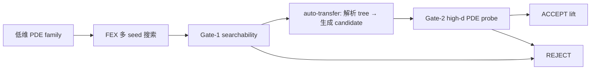

# fex-dim-lift-skeleton

> 低维 FEX 表达式树能否用可学习的维度映射安全提升到高维？V22h receipt 有真实数字：parser leaf_mixing 5/5；d100 lift worst 8.87e-5；scratch d50/d100 0/6；SR 0/6000；NN d100 mean rel-L2≈1.0；HD-TLGP structural infeasible；width m100/200/500 仍失败。但 audit56 阻塞：V22h 的 `evidence_commit=c757883` 不包含结果文件，PSR triage 未纳入 receipt，且把 scope ceiling 当作 mechanism paper 路线仍未满足 §5 的主 claim。

## 1. 背景

### 1.1 领域常识

FEX 用 RL 搜索表达式树做 PDE 求解，低维有效但高维搜索代价爆炸。本项目研究低维搜到的 skeleton 如何安全提升到高维，而不是重新在高维从零搜索。

V1-V21 旧 macro 模板方法被 §5 否决。V22c leaf mixing 在 Conservation 验证了 signed-sum 概念。V22c Helmholtz pilot 暴露了 tree insertion 的实现缺陷：Phase 2 硬编码 `sin` 而非从 tree 自动推导，这仍是 macro matching 的变种。V22e/V22f 已把 parser 推进到 `make_basic_tree(tree)` + `best_action` 的节点/action 重建，并加入系数感知 active/constant-like 标注；但当前证据只覆盖 leaf_mixing / unary_replication 两个基础 primitive。

### 1.2 核心概念

| 概念 | 一句话解释 |
|------|-----------|
| FEX skeleton | FEX 搜索得到的表达式树，叶子是变量 x_i 和常数 |
| leaf mixing | 每个 x_i → Σ_j w_{ij} x_j；处理 signed-sum 型 g(Σ c_i x_i) |
| tree insertion | 在中间节点复制子树到所有高维坐标并聚合；处理 separable-sum 型 Σ g(x_i) |
| auto-transfer | 从低维 FEX tree/action 自动识别转移模式；V22f 支持两个 primitive 并修复当前 seed 的 active/constant-like 标注，但还不是完整 learnable functor |
| activation dimension | pipeline 价值边界；Conservation scratch d=30 3/3, d=40 0/3 |

### 1.3 研究问题

给定低维 FEX 公式 f_low(x_i, α)，如何系统性构造 f_high(x_j, β)？§5 要求：transfer 必须从 tree 结构自动生成，不能退化为模板查表或 oracle 硬编码。

FEX 两种已知树形对应不同 transfer：depth2_sub `unary(binary(leaf,leaf))` 的活跃叶子线性合并后适合 leaf mixing；depth1 中一个或多个同类 unary 叶子加权汇总时适合 unary replication。auto-transfer 模块必须从 `make_basic_tree(tree)` + `best_action` + 低维表达式中的活跃分支推导模式，不能只看 PDE 名、宏名、`tree` 配置名或字符串里出现了几个 `sin`。

## 2. 实验全景

### 2.1 实验流程

### 2.2 核心指标

| 指标 | 含义 | 计算 |
|------|------|------|
| relative L2 | 表达式解与解析真值误差 | `sqrt(sum((pred-truth)^2)/sum(truth^2))` |
| scratch gap | lift 成功维度 vs scratch 失败维度 | pipeline 价值 = gap 存在 |

### 2.3 实验矩阵

| 实验 | 研究问题 | 状态 | 核心结果 |
|------|---------|------|---------|
| R12 Conservation (旧 macro) | 完整链 | ✅ | scout→lift d100 1e-6→scratch d≥40 fail |
| V10 gate ablation | Gates 必要 | ✅ | 624 cells 0 FA/0 FR |
| SR baseline | 外部 baseline | ✅ | d=100 6000 trials 0 hit |
| V22c leaf-mixing | learnable 替代 macro | ✅ | d100 5/5 worst 9.18e-5; provenance clean |
| V22c Helmholtz pilot | oracle tree insertion 诊断 | ❌ | lift 20/20; 但硬编码 sin + scratch 全 HIT + provenance broken |
| V22d auto-transfer 2×2 | 从 tree 自动生成 transfer | ⚠️ | 初步数字有信号，但 audit52 阻塞 |
| V22f all-seed 2×2 | coefficient-aware parser + 两 primitive 负控 | ✅ | diagonal 10/10, offdiag 10/10；V22g wrapper 修 receipt |
| V22g Conservation artifact | §5 hard-target single receipt | ⚠️ | lift 5/5 worst 8.87e-5; scratch 0/6; SR 0/6000；audit55 阻塞 baseline/scope |
| V22h baseline extension | V22g receipt 外部 baseline 扩展 | ⚠️ | NN/HD-TLGP/width 已纳入；audit56 阻塞 evidence_commit、PSR omission、scope |

## 3. 算法与代码

### 3.1 算法本质

**Auto-transfer pipeline**（§5 要求的核心能力）：解析低维 FEX 表达式树 → 识别结构模式 → 自动生成高维 transfer candidate → PDE 优化。当前只允许两种基础 primitive：

1. leaf mixing：把低维表达式中的叶变量替换成高维变量线性组合，处理 signed-sum。
2. unary replication：把低维 tree 的活跃 unary 叶子复制到高维坐标并加权汇总，处理 separable-sum。

关键：候选选择必须来自 tree/action/活跃子树签名；unary 函数可以从低维 tree 的节点提取，但不能由 runner 手写。

### 3.2 代码地图

| 想知道... | 文件 | 函数/类 |
|----------|------|--------|
| FEX search | `fex_dim_lift.py` | `run_search()` |
| leaf mixing | `leaf_mixing_transfer.py` | `LeafMixingTransfer` |
| tree insertion | `tree_insertion_transfer.py` | `fit_tree_insertion_high_dim()` |
| auto-transfer | `auto_transfer.py` | `parse_fex_tree()` / `identify_transfer_pattern()`（V22f 重建节点/action并用 `final_expr` 系数修 active/constant-like） |

## 4. 当前结果

### 4.1 当前证据

| 证据 | 关键数字 | 来源 | 强度 |
|------|---------|------|------|
| Conservation 完整链 | 5/5 scout; d100 lift ≤2.12e-6; scratch d≥40 0/6 | R12 | 强 |
| Gate ablation | 624 cells 0 FA/0 FR | V10 | 强 |
| SR d100 | 6000 trials 0 hit | V13 | 强 |
| V22c leaf mixing | d100 5/5 worst 9.18e-5 | `results/v22c_provenance_rerun/` | 有信号 |
| V22c Helmholtz oracle lift | 20/20 worst 1.26e-6 | `results/v22c_helmholtz_sep_pilot/` | oracle 诊断 only |
| V22d auto-transfer 2×2 | diagonal 8.35e-6 / 1.27e-7; offdiag 0.779 / NaN | `results/v22d_auto_transfer_2x2/` | **阻塞**：JSON/provenance/parser/seed/all-seed |
| V22f all-seed 2×2 | diagonal 10/10, worst 8.87e-5; offdiag 0/10, finite min 0.775, 5 explicit nonfinite | `results/v22f_parser_coefficient_fix/` + `results/v22g_receipt_repair/` | 机制信号；receipt 已由 V22g wrapper 修 |
| V22g Conservation single artifact | parser leaf_mixing 5/5; d100 lift 5/5 worst 8.87e-5; scratch d50/d100 0/6; SR random 0/6000 | `results/v22g_conservation_endtoend/endtoend_receipt.json` | 有信号；缺更强 baseline 纳入 artifact |
| V22h extended receipt | V22g + NN d100 3/3 mean rel-L2 1.000011; HD-TLGP infeasible; width m100/200/500 fail | `results/v22h_baseline_extension/endtoend_receipt.json` | 数字存在；provenance/scope 阻塞 |

### 4.2 当前警告

1. V22h `evidence_commit=c757883` 指向脚本 commit（只含 `.py`），结果文件在 `7fca676`。provenance 待修。
2. V22h 遗漏 PSR triage（`results/r15_psr_baseline_triage/`），且 MANIFEST 写错 PSR 名称（"Physics-informed" → 应为 "Projective"）。
3. 5 个 Conservation wrong-primitive cells 是 `nonfinite_optimization`；论文引用 wrapper receipt，不写成全部 offdiag 有限高误差。
4. **结构性瓶颈**：activation gap 需要 depth2_sub+ 离散搜索空间随 d 增长；depth1（unary_replication 的领域）搜索空间固定 ~243 种，不随 d 增长 → 无法产生 hard target。FEX unary 算子集 {sin,cos,exp,id,x²,x³,x⁴} 进一步限制了 depth2_sub hard targets 只有 sin/cos of signed sums → Conservation 一族。扩展 hard targets 需要改 FEX 算子集或树配置（如 depth3），不是找更多 PDE。
5. V22f/V22g/V22h 只覆盖两个 primitive + Conservation/leaf_mixing 作 hard-target chain。这是 "屁股方案" 的两个基础 primitive 门禁，不是 §5 完整 learnable functor。scope 决策需要人类输入。

### 4.3 Claims 速查

| 要证明的事 | 当前证据 | 强度 |
|-----------|----------|------|
| A. Leaf mixing 替代 macro (signed-sum) | V22c d100 5/5; provenance clean | 有信号 |
| B. Pipeline 在真实 PDE 成功 + scratch 失败 | Conservation old chain | 强 |
| C. Gate audit 质量控制 | 624 cells 0 FA/0 FR | 强 |
| D. 外部 baseline 不可行 | SR d100 0/6000 + NN/HD-TLGP/width receipts；PSR 未并入 V22h | 部分 |
| E. Auto-transfer 从 tree 自动选择正确 mechanism | V22f 10/10 diag + 10/10 offdiag fail；V22g receipt repair hash clean | 有信号；只限两个 primitive |
| F. 完整链 = auto-transfer + activation gap | V22h Conservation receipt: lift 5/5 worst 8.87e-5 + scratch 0/6 + SR/NN/HD-TLGP/width negative evidence | 有信号；evidence_commit/PSR/scope 阻塞 |

## 5. 战略决策（人类决定）

### 2026-06-22 (V3 iter9) 人类决策：基本原则

- Claim 永远不许降级。
- 光证明 idea work 不够。要用这个 pipeline 在一个真实的、以前 FEX 高维搞不定的 PDE 上 lift 成功，解一个能令人震惊的、以前解决不了的问题。外部 baseline 必须够强，不许挑软柿子对比。

### 2026-07-01 (V14 iter47) 人类决策：macro library 是根本错误，必须重构第二步

请先逐字精读下面这几句话，它们是最高优先级。

> 这里这几个 macro 说白了不就是模板吗？我背好了这几个解题套路去考试，试题被押中了我就会，不会就是 0 分，这不就是现在 STATE.md 的情况吗？

> 这个 idea 能够成立的背后的直觉就是"结构是广泛存在的"，进而我们可以在低维寻找结构，在高维应用结构，将不可解的高维问题变成可解的低维问题。

> 虽然结构广泛存在，但是我们也不能说把它写死成一套模板，规则性的东西是不可能解决所有问题的，这里的结构要是"学习出来的"，但是现在的这个 STATE.md，其结构是写死的，所以注定做不成。

> 自然界的结构不可能是规则能够覆盖的，它们必须是可学习的

### 2026-07-02 (V14 iter57) 人类决策：auto-transfer 又是规则系统，必须改成逐层尝试；至少在 6 个 PDE 上做出 positive result

> 你可是要给我气死了! "auto-transfer 自动判断": 你怎么又把项目做成规则系统了? 那要是恰好你的规则失败了不就废了? 我是说要尝试所有插入方法, 最简单的方案就是从叶子层的插入一层层往上试, 试到足够好的就 break, 高级一点的方法你可以做一个尝试顺序的重排, 比如说你说这个结构我先试 -2 层, 再试 -1 再试 -3, 试到足够好的 break, 但我从来是没说过只试一种! 也没说过有的可以直接抛弃! 你怎么可能能从结构看出来这个 lowd-highd lift 该在哪一层扩展? 你写这个 "自动判断" 规则简直就是愚蠢! 我刚刚批评完你 "macro library" 全是规则跟傻逼一样, 结果马上你就又写一个规则出来! 你有没有好好理解我的 idea 啊, 我说了, 结构是学习出来的, 不是规则定死的, 你 "auto-transfer 自动判断" 又是往里面加规则! 这玩意根本就过不了审稿, 我直接就一句话: "你这个是针对这几个 pde 人为写的规则" 你就废了! 但是我的方案, 从叶子层的插入一层层往上试, 就不是规则, 因为是你的方案的超集, 效果一定不差于你的方案, 才是解决方案! 好好动动脑子吧! 我说了这么多都听不明白!
>
> 然后怎么就做了 2 个 pde? 不是有五六七八个 pde 吗? 怎么现在就两个? 快点把更多 pde 都做了! 要求至少 6 个 pde 的 positive result!

## 6. 下一步行动

| 优先级 | 行动 | 完成标志 |
|--------|------|---------|
| P0 | V22i provenance + PSR 修复 | evidence_commit 指向 `7fca676`；PSR triage 纳入 receipt 或 source-backed exclusion；PSR ledger 名称修正 |
| P0 | 请求人类 scope 决策（dispatcher ask_user） | 人类明确回复写入 §5 |

### 6.1 scope 决策材料

当前证据：auto-transfer 从 tree 结构正确选择两个 primitive（V22f 2×2 20/20）+ Conservation end-to-end chain（lift 5/5 worst 8.87e-5, scratch 0/6, SR 0/6000, NN/HD-TLGP/width 负）。这是 §5 "屁股方案" 的最小可行证据。

**结构性瓶颈**：hard targets 需要 depth2_sub 离散搜索空间随 d 增长产生 activation gap。当前 FEX unary 算子集下，只有 sin/cos of signed sums (Conservation 一族) 满足此条件。扩展路线：
- (a) 接受当前 scope 发 mechanism paper（两 primitive + Conservation hard chain），不降级 claim 但诚实标注覆盖范围
- (b) 扩展 FEX 算子集或树深度（如 depth3），开辟新 hard targets → 更强证据但需大量代码/实验投入
- (c) 集中做更多 primitive 类型的负控验证和跨 PDE 机制测试，不追加 hard target

### 6.2 叙事框架速览

1. **Problem**: 低维 FEX skeleton 到高维的 transfer 不能是模板查表或 oracle 硬编码
2. **Method**: auto-transfer — 从 tree/action 的结构签名选择 transfer primitive
3. **Current evidence**: V22f all-seed 2×2 + V22h Conservation end-to-end（待修 provenance）
4. **Contribution ceiling**: tree→transfer 的两个基础 primitive 门禁；Conservation 是唯一 hard chain；scope 决策待人类

---

# Agent 执行层

## A0. Audit / Review Response

### Audit56 Response

| audit issue | scientist response | action/evidence | status |
|-------------|--------------------|-----------------|--------|
| AUD-BLOCKER-001 V22h evidence_commit 错 | Accept. `c757883` 只含脚本，结果在 `7fca676`。同类 provenance bug 反复出现。 | V22i 修 receipt/manifest/ledger：`code_commit=c757883`, `evidence_commit=7fca676`。 | open → V22i |
| AUD-BLOCKER-002 PSR triage 遗漏 | Accept. oversight：我的 V22h plan 漏写 PSR。receipt 存在于 `results/r15_psr_baseline_triage/`。 | V22i 将 PSR receipt 纳入 endtoend_receipt external_baselines stage，或写 source-backed exclusion（PSR 代码不可用 + Conservation 非 PSR 可处理结构 = infeasible）。 | open → V22i |
| AUD-BLOCKER-003 scope ceiling ≠ claim resolution | Accept.声明更小 scope 不是 §5 的替代。不进入 reviewer。 | 准备 scope 决策材料（§6.1）供 dispatcher ask_user。两个 primitive + Conservation 是当前 ceiling，扩展受限于 FEX 算子集/树深度（§4.2 #4）。 | open → 人类决策 |
| AUD-CRIT-001 success criteria 不检查 PSR/commit | Accept. | V22i 脚本加 PSR coverage 和 evidence_commit 验证。 | open → V22i |
| AUD-CRIT-002 STATE stale | Accept (auditor 已维护)。 | — | closed |
| AUD-MAJOR-001 PSR ledger 名/scope 错 | Accept. "Physics-informed" → "Projective"；"targets 1D PDEs" → "up to 3 spatial dimensions"。 | V22i 修 MANIFEST.md。 | open → V22i |
| AUD-MAJOR-002 单 family + leaf_mixing | 已知。与 BLOCKER-003 同源。activation gap 结构性限制见 §4.2 #4。 | 等人类 scope 决策。 | open → 人类决策 |

## A1. Experiments-to-do

### Task Group A: V22i provenance + PSR + ledger 修复

- runs: [v22i_provenance_and_psr_fix]
- can_split: false
- depends_on: none
- priority: P0

### Run: v22i_provenance_and_psr_fix

- Task Group: A
- Advances: 修复 audit56 BLOCKER-001/002 和 MAJOR-001。不改变任何实验数字，只修 provenance 和 baseline 覆盖。
- Config: local CPU, 纯文件操作
- Input assets: `results/v22h_baseline_extension/endtoend_receipt.json`, `results/r15_psr_baseline_triage/psr_infeasibility_receipt.json`, `data/MANIFEST.md`
- Expected outputs: `results/v22i_provenance_repair/{endtoend_receipt.json, manifest.json, strict_parse_report.json, train.log}`
- Priority: MUST-RUN
- Compute cost: 0 GPU-h
- Server: local
- remote_dir: N/A
- Success criterion: (a) receipt `evidence_commit=7fca676` 且 `git cat-file -e 7fca676:results/v22h_baseline_extension/endtoend_receipt.json` 成功; (b) external_baselines stage 包含 PSR 字段（纳入或 source-backed exclusion）; (c) MANIFEST.md PSR 名称为 "Projective Symbolic Regression"; (d) strict JSON + Node parse 通过
- Failure interpretation: N/A（纯文件操作）
- Risk: 无

### 代码改动

1. `scripts/run_v22i_provenance_repair.py`：读 V22h receipt，修 evidence_commit，加 PSR stage，输出修复后 receipt + manifest + strict report。
2. `data/MANIFEST.md`：PSR 行名称修正 + V22i 登记。

## A2. 实验详细规格

### E22-A: Leaf mixing MVP (Conservation) — 完成

- V22c: d100 5/5, worst 9.18e-5. Signed-sum sanity.

### E22-B: Helmholtz pilot — oracle diagnostic only

- 硬编码 `sin`，provenance broken，scratch d≤40 全 HIT。非 claim 证据。

### E22-C: Auto-transfer 2×2 validation

- 输入: 已有 Conservation (depth2_sub) + Helmholtz (depth1) search seeds
- 核心产物: 4 cells 表 —— diagonal 有强数值，offdiag 有 0.779 和 NaN
- audit52 状态: 不能支撑 claim；需修 strict JSON、manifest commit、deterministic seed、parser depth 和多 seed coverage

### E22-D: Tree/action parser repair

- Parser 必须输出每个 node 的 inorder index、path、arity、op index、op family、是否 leaf、是否 active/constant-like、子树 signature。
- Conservation seed 等价表示包括 `sin`/`cos` 相移、零系数高次叶子、符号翻转；不能要求 exact action 一致。要比较 transfer-relevant signature：活跃叶子线性合并后进入单个 outer unary。
- Helmholtz seed 等价表示包括常数/零分支乘法或加法抵消；要识别 transfer-relevant signature：一个活跃 unary leaf 在所有坐标上共享 `sin` 并被线性汇总。
- 任何 fallback 到 `"sin"`、PDE 名、宏名、或 `tree == depth1/depth2_sub` 直接决定 pattern 的路径都必须在 smoke 中失败。
- audit53: V22e 已重建节点/action，但 `is_active` 未解析拟合系数，seed3 quartic 零系数分支被误标 active。

### E22-E: All-seed 2×2 validation

- Conservation inputs: `results/v22c_provenance_rerun/search_seed{0..4}.json`, all d=3 successful.
- Helmholtz inputs: `results/v22c_helmholtz_sep_pilot/search_d2_depth1_seed{0..4}.json`, all d=2 successful, but pilot remains non-claim for hard-target evidence.
- Main table: 10 seeds × 2 primitives = 20 cells. Report per-PDE aggregate and per-seed signatures; no aggregate may hide failed seeds.
- Strict receipt: use `json.dump(..., allow_nan=False)` or equivalent; run Node `JSON.parse` on every output; manifest records source commit, script hashes, input hashes, seed ledger, and local/remote sync status.
- Result: V22f diagonal 10/10, worst 8.87e-5；offdiag 0/10, finite min 0.775, five explicit `nonfinite_optimization`。Claim ceiling remains two primitive classes only，且 V22f manifest hash 需修。

## A3. Runs

| run | server | remote_dir | launched_at | session_id | crash_count | phase |
|-----|--------|------------|-------------|------------|-------------|-------|
| v22i_provenance_and_psr_fix | local | N/A | 2026-07-02T11:21 | local-v22i_provenance_repair-0702 | 0 | collected |

## A4. 环境

| 服务器 | GPU | 远程路径 | 注意 |
|--------|-----|---------|------|
| local | RTX 4060 Ti + CPU | workspace local | V22e 默认本地 CPU，分钟级任务，避免远端 provenance 复杂化 |
| 1202c | RTX A6000 x8 + CPU | `/export/sun1245/fex-dim-lift-skeleton` | FEX search 用 CPU |
| majda | A100-80GB x4 | `/scr1/scratch/sun1245/fex-dim-lift-skeleton` | 不用于本轮；Purdue `/scr1` 空间紧张 |

## A5. 运行历史

| 时间 (EDT) | 事件 |
|-----------|------|
| 07-02 ~11:21 | coder: V22i collected; provenance repair (evidence_commit fix, PSR triage, MANIFEST PSR name) |
| 07-02 ~12:00 | scientist: audit56 response; provenance+PSR fix plan; scope 决策材料准备 |
| 07-02 11:00 | auditor: audit56 BLOCKER — V22h evidence_commit/PSR/scope |
| 07-02 10:53 | coder: V22h collected; receipt 扩展 R12/R13 baseline + strict JSON + scope ceiling |
| 07-02 ~11:00 | scientist: audit55 response; R12/R13 baseline 已有证据纳入 receipt; scope ceiling 明确; A1 写 V22h |
| 07-02 10:32 | auditor: audit55 BLOCKER — baseline 不完整 + scope ≠ learnable functor |
| 07-02 10:25 | coder: V22g collected; receipt repair + Conservation end-to-end |
| 07-02 ~10:30 | scientist: audit54 response; A1 写 V22g |
| 07-02 10:03 | auditor: audit54 BLOCKER — manifest hash + claim ceiling |
| 07-02 09:54 | coder: V22f collected; parser coefficient fix |
| 07-02 ~10:00 | scientist: audit53 response; A1 写 V22f |
| 07-02 09:17 | auditor: audit53 BLOCKER |
| 07-02 09:09 | coder: V22e allseed collected; diag 10/10, offdiag 10/10 fail |
| 07-02 ~06:15 | coder: V22c provenance rerun collected d100 5/5 |
| 07-01 | scientist: §5 pivot to learnable transfer |

## A6. 已知问题与修复

| 问题 | 根因 | 修复 | 状态 |
|------|------|------|------|
| V22d claim-bearing JSON 非 strict | offdiag NaN 直接写入 summary/cell JSON | V22e all-seed rerun 使用 strict JSON；非有限优化写 `relative_l2: null`, `status=nonfinite_optimization`；Node `JSON.parse` 25/25 | superseded |
| V22d manifest commit 错 | manifest 记录 e19e611，但脚本/结果在 9877a5b | V22e manifest 指向 `991b6e2`，`git cat-file` 验证含 runner 和 `auto_transfer.py`，并记录脚本/input SHA256 | superseded |
| V22d seed 不可复现 | Python 内建 `hash()` 跨进程随机化 | V22e 用 SHA256 stable_cell_seed()；cross-process smoke passed | closed |
| auto-transfer parser 太浅 | 旧版只看 `tree` 配置名和 unary 调用；V22e 已重建 tree/action，但 active label 仍缺系数语义 | V22f 已补系数感知 active/constant-like；更深层 primitive 覆盖仍待扩展 | partial |
| V22d 只测单 seed | runner 用 `hits[0]` | V22e all-seed 2×2 覆盖 10 个 successful low-d seeds，20/20 cell 完整 | closed |
| V22e allseed evidence 未入 git | coder handoff 留下 untracked `results/v22e_auto_transfer_allseed_2x2/` | audit53 将其纳入本轮 commit；scientist 使用前确认 pushed commit 可见 | audit-maintained |
| V22e active flag 不看系数 | `is_active` 只按 operator family；seed3 quartic 系数 0 仍标 active | V22f 从 `final_expr` 提取 leaf 系数；seed3 quartic `is_active=false, constant_like=true` | closed |
| V22e success criteria 字段名错 | JSON key 写 `lt_1e3` / `ge_1e2`，实际阈值 1e-3 / 1e-2 | V22f `allseed_summary.json` 改为 `lt_1e_neg3` / `ge_1e_neg2` | closed |
| anti-fallback smoke 覆盖不全 | 仅扫描 `identify_transfer_pattern()` | V22f 覆盖 parser public/helper 函数 + runner `pattern_to_primitive`/`unary_for_replication`/`transfer_signature`，110/110 clean | closed |
| V22f manifest parser-repair hash 不自洽 | parser repair 和 allseed rerun 使用同一 `results/v22f_parser_coefficient_fix/`，后者覆盖 `manifest.json` / `strict_parse_report.json` | V22g 新目录重算 29 个当前 V22f 文件 hash；记录旧 manifest 2 个 stale hash 行 | closed |
| V22f strict_parse_report 列重复 | manifest.json 列两次，self 未列 | `results/v22g_receipt_repair/strict_parse_report.json` 去重并包含自身；Python strict JSON + Node parse 通过 | closed |
| MANIFEST.md 过度标注 V22f canonical | receipt 不自洽时不应标 canonical | `data/MANIFEST.md` 新增 V22g canonical repair section；引用 V22f 时以 V22g repair receipt 为准 | closed |
| V22e full run 首次 strict JSON crash | wrong primitive 产生 NaN nested raw diagnostics，`allow_nan=False` 拒写 | 加递归 `strict_jsonable()`，保留 top-level `nonfinite_optimization`，清空半成品后重跑 | closed |
| runner success logic 漏 scratch | build_summary 只看 search+lift | `build_summary` 加 scratch gap gate；py_compile + summary assertions passed | closed |
| Helmholtz provenance broken | 远端 dirty worktree | 标 non-claim；不重跑 | accepted |
| d100 scratch no_output | timeout before producing file | missing evidence; 不当 failure | accepted |
| dim consistency 代数退化 | leaf mixing 固有 | diagnostic only | accepted |
| V22g/V22h baseline incomplete | V22g only included SR; V22h omitted PSR triage | V22i added PSR infeasibility to external_baselines | closed |
| V22h evidence_commit wrong | `evidence_commit=c757883` contains script only, not result files | V22i 修为 `evidence_commit=7fca676`, `code_commit=c757883` | closed |
| V22h PSR triage missing | audit55 要求纳入但 V22h 遗漏 | V22i 纳入 source-backed exclusion (code not available) | closed |
| PSR ledger name wrong | MANIFEST 写 "Physics-informed" 实际是 "Projective" | V22i 修正; scope 改为 "up to 3 spatial dimensions" | closed |
| scope ceiling ≠ §5 resolution | Conservation/leaf_mixing only; activation gap 结构性限制 hard targets | 需人类 scope 决策 | open → ask_user |
| MANIFEST.md V22f 直引用 | 旧 V22f manifest 仍被标 canonical | V22h 将 V22f raw outputs 降级为 deprecated direct citation；引用 V22g/V22h wrapper | closed |

### Coder 旁注

V22i 纯文件操作完成，修复了 audit56 的三个 provenance 问题：
1. evidence_commit 改为 7fca676（含结果文件），code_commit 保留 c757883（含脚本）
2. PSR 以 source-backed exclusion 纳入 receipt（代码不可用 + ICLR 2026 盲审）
3. MANIFEST.md 中 PSR 名称从 "Physics-informed" 修正为 "Projective"，scope 修正为 "up to 3 spatial dimensions"

所有 success criteria 通过（7/7 manifest + 13/13 receipt），strict JSON + Node parse 7/7。实验数字未变。scope 决策（AUD-BLOCKER-003）仍需人类输入。
