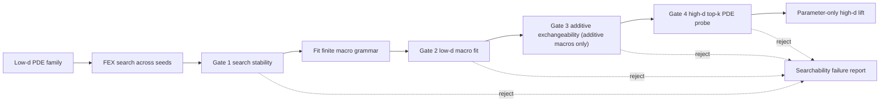

<!-- 书写报告使用中文 -->
---
idea: fex-dim-lift-skeleton
title: "Exchangeability Audit for FEX Cross-Dimension Lifts"
version: 2
date: 2026-06-19
workspace: workspace/fex-dim-lift-skeleton/
---

## Revision Note (v1 → v2)

回应 v1 review(refinery, Opus, 6.6/10, REVISE)的 1 CRITICAL + 3 IMPORTANT + 1 MINOR + 2 Simplification。逐条兑现,均 analysis/spec/排序 only,无 GPU:

- **W1 [CRITICAL] separability 的 liftability 半边构造性恒真**: pairwise "可 lift" 证据(d=100 rel-L2 9.23e-7)实为 `macro∈library` 的注入性 sanity-check——`fex_dim_lift.py:564-571` 在 pairwise 臂把 analytic ground-truth `0.2·0.5·(Σx)²−Σx²)` 直接喂给含 `pairwise_xx` primitive(line 397-400)的库。v2 **显式重标注为 analytic-injection sanity-check**,并把 "searchability ≠ liftability 可分离" 从已证 claim **降级为 conditional**(需 P0-2 的非注入证据点才升级;详见 Claim 2)。
- **W2 [IMPORTANT] Gate 3 对非加性宏无判据**(走诚实限 scope 路径 b): pilot 里 asymmetric 由 Gate 2 先拒,Gate 3 的 CV=0.471 非决定性。v2 把 **Gate 3 scope 限定为 additive 宏**,非加性宏明确走 "Gate 2 + Gate 4 only",由 Gate-3 ablation 决定主文是 "四门" 还是 "三门 + additive-only 子检验"(S1)。
- **W3 [IMPORTANT] accept-path 仅 n=2 family × 单 seed**: v2 把 "≥2 stable family × 5/5 seed + d∈{20,50} monotone" 写成 Claim 1 **硬门**,并把 `sum_x4` 纯四次 family 从 P1 上提到 **P0**。
- **W4 [IMPORTANT] amortization 无 fair baseline**: v2 把 "fair matched-compute from-scratch FEX at d∈{50,100}" 设为**头号实验 + kill-switch**;break-even 阈值(~3.8x over {10,20,50,100} sweep, `NOTES.md:82`)写进 Claim 1;曲线产出前禁用 "scalability",只用 "amortized re-use"。
- **W5 [MINOR]**: Novelty 段补 DR-SR(2506.19537)delta。**S1**: Gate-3 ablation 决定四门 vs 三门。**S2**: 明确 "library = 3 claim-eligible macros + 5 distractors"。

Problem Anchor 与 contribution types `{method, empirical-finding}` 未变,无 drift。

## Problem Anchor

- **Bottom-line problem**: FEX 有无维度灾难的 approximation theory, 也能在部分高维 PDE 上给出闭式表达式, 但实际 RL controller 是否能稳定找到可跨维复用的 skeleton 仍未知。我们要解决的不是"再做一个高维 PDE solver", 而是: 低维 FEX 搜到的 skeleton 什么时候可以被安全提升到高维, 什么时候必须拒绝。
- **Must-solve bottleneck**: 当前方法把"宏结构本身可 lift"和"controller 在低维能搜到该结构"混在一起。pairwise pilot 已显示二者可分离: analytic pairwise macro 在 d=100 probe rel-L2 为 9.23e-7, 但真实 FEX 多 seed 搜不到它。这个 weakness 若不处理, 任何 low-d-to-high-d lift 都可能把一次低维偶然结果误当成高维结构规律。
- **Non-goals**: 不做通用 symmetry discovery; 不声称解释所有 FEX 高维行为; 不做新 benchmark; 不引入 LLM/VLM/Transformer controller; 不替代 FEX/PSR/SymPlex/SSDE 作为通用 symbolic PDE solver。
- **Constraints**: 有限 exchangeable macro grammar; 解析 PDE collocation 与 boundary 点在线生成, 无外部数据或模型权重; 预算 120-180 GPU-hours; 目标是 NeurIPS/ICLR/ICML 风格的机制方法论文, claim 必须可证伪。
- **Success condition**: 用户会说"yes"当且仅当: 对 Poisson/radial 等稳定 family, 多 seed low-d FEX 输出通过四门 audit 后可在 d=100 仅优化连续参数达到 rel-L2 < 1e-3, 并在跨多个 target dimensions 上以可证伪的 break-even(≥2x over a {10,20,50,100} sweep vs fair matched-budget from-scratch FEX)摊销搜索成本; 对 asymmetric control 和 FEX 搜不到的 pairwise family, audit 必须拒绝, 不允许 false-positive lift。

## Technical Gap

FEX 原始论文证明有限表达式空间可近似高维 PDE 解, 但 controller 仍要从表达式树中搜索。FEX+TranNet 扩候选池, LLM+FEX 预测算子集合, Multi-Scale FEX 加频谱结构; 它们都改善候选或算子先验, 没有回答一个低维 FEX skeleton 是否能跨维复用。PSR 是最接近的 high-dimensional symbolic PDE prior: 它从高维解数据生成低维投影, 对每个 projection 做 local SR, 再用 global symbolic program 组合。它解决的是 projection decomposition, 不是从真实 FEX low-d skeleton 推断 exchangeable macro, 也没有 lift/reject 认证或 searchability 诊断。

当前 pipeline 的失败点是低维成功信号不可信。一个 d=2 expression 可以低误差拟合, 但它可能是非交换系数、偶然等价、或只在低维成立。naive fixes 不够: 直接跑高维 FEX 会重新付 RL search 成本; 增大 search budget 不能判断结构是否可 lift; 加更大 grammar 会增加 false positives; 用 LLM 直接命名 symmetry 会把 claim 变成另一个 predictor 的可靠性问题; PSR 式 projection + global SR 比本问题需要的机制更重。

最小充分干预是一个 empirical audit cascade: search stability, low-d macro fit, coefficient exchangeability (additive 宏), high-d top-k PDE probe。它只在低维 FEX 多 seed 稳定找到 skeleton 且该 skeleton 在有限 exchangeable macro grammar 中通过验证时允许 parameter-only lift。若 macro 解析上属于库内、但 FEX 搜不到, 结论不是强行 lift, 而是报告 searchability failure。

Route choice: Route A 是这个 gate audit, 保持 FEX controller 和 macro grammar 小而可审计。Route B 是 frontier-native 路线, 例如训练 LLM/Transformer 预测 macro 或采用 PSR-style projection composition。选择 Route A, 因为它直接解决 bottleneck, novelty 边界清楚, 且不会把论文漂移成一个更大的 solver stack。

## Method Thesis

- **One-sentence thesis**: 对落在有限 exchangeable macro grammar 中、且低维 FEX 多 seed 稳定恢复 skeleton 的 PDE family, 一个 gate audit cascade 足以决定该 skeleton 是否可被提升到高维并仅做连续参数优化; audit 同时把 controller searchability 和 macro liftability 分开诊断。
- **Why this is the smallest adequate intervention**: 不训练新模型, 不改 FEX controller, 不扩大 solver stack; 新增的只是 macro inference 和 PDE-level verification gates。
- **Why this route is timely in the foundation-model era**: 当前神经符号 solver 越来越会用 LLM/Transformer/RL 先验生成表达式, 但缺少 verifier-style 的结构复用审计。本文把高维复用从"相信生成器"改成"生成器输出必须过门"。

## Contribution Focus

- **Dominant contribution**: FEX cross-dimension lift audit: search stability, low-d macro fit, additive coefficient exchangeability, high-d top-k PDE probe 组成一个 lift/reject procedure。门数(四门 vs "三门 + additive-only 子检验")由 Gate-3 ablation 数据决定,不预设对称叙事(见 S1)。
- **Optional supporting contribution (conditional)**: empirical finding: controller searchability 和 macro liftability 可分离。当前已质的一半是 **searchability failure**(real FEX pairwise 0/3, rel-L2 0.97-1.0,这是 RL controller 在低维搜不到 pairwise skeleton 的真实信号)。另一半(该 family 仍可 lift)目前只有 analytic-injection sanity-check 支撑(见 W1),故此 finding 在 first paper **仅作 conditional claim**,需 P0-2 给出非注入证据点才升级为 "separable mechanism"。
- **Explicit non-contributions**: 不做 universal symmetry discovery; 不提出新 FEX grammar 学习器; 不追 solver SOTA; 不声称 certificate 是形式化保证; 不把有限 grammar 结果外推到任意 PDE; 不声称 separability 已被证(见 W1)。

## Proposed Method

### Complexity Budget

- **Frozen / reused backbone**: 现有 FEX depth1/depth sweep controller、Adam+LBFGS 参数拟合、解析 PDE residual/boundary loss、已有 Poisson/radial/pairwise/asymmetric pilot code。
- **New trainable components**: 无新神经网络。macro 参数用 least-squares/LBFGS 拟合, 高维 lift 只优化 macro 的连续参数。
- **New deterministic components**: finite macro grammar, seed-level searchability ledger, additive coefficient exchangeability test, high-d top-k PDE probe。
- **Tempting additions intentionally not used**: LLM macro namer, learned symmetry detector, e-graph controller, PSR global symbolic composition, large benchmark suite。

### System Overview

### Core Mechanism

- **Input / output**: 输入是一个 PDE family、低维 `d0=2` 或 `d0=3` 的 FEX search JSON、target dimensions `d in {10,20,50,100}`。输出是 `ACCEPT macro + lifted expression`, 或 `REJECT + failure reason`。
- **Representation design**: macro grammar 固定为 **3 个 claim-eligible 宏** `{sum_x2, square_sum_x2, pairwise_xx}` 及 bias/scale 参数; library 实现里另含 5 个 **distractor 宏** `{sum_x, sum_x3, sum_x4, prod_1px2, norm_x}`,仅作 Gate 2/4 的 top-k 数值对照,不进任何 accept-path(见 S2;注意 W3 要求把 `sum_x4` 升为 claim-eligible 以扩 accept-path,届时 claim-eligible 集合相应扩到 4 个,distractor 减为 4 个)。`sum_x2` 表示 `alpha sum_i x_i^2 + beta`; `square_sum_x2` 表示 `alpha (sum_i x_i^2)^2 + beta`; `pairwise_xx` 表示 `alpha sum_{i<j} x_i x_j + beta`。低维 FEX expression 被当作可采样函数, 不要求符号 parser 完全理解每个树细节。
- **Gate 1 search stability**: 低维 FEX 跑 5 seeds。family-level stable 的预注册阈值是至少 2/5 seeds 通过后续 low-d fit gate 且选中同一 macro class; 低于阈值则不 lift, 即使 analytic macro 在库内。
- **Gate 2 low-d macro fit**: 在 held-out low-d collocation points 上拟合 top-k macros, 要求 winner rel-RMSE < 0.02。top-k 保留给 Gate 4, 防止低维 fit 中多个 macro 数值接近。
- **Gate 3 additive coefficient exchangeability (scope: additive macros only)**: 对 additive 类宏(`sum_x2`, `sum_x4`)用 untied coefficient fit 检查 per-coordinate 系数 `CV < 0.1`(代码 `additive_tie_diagnostics`)。**非加性宏 `square_sum_x2`/`pairwise_xx` 没有与 additive-CV 对等的可交换性统计量**,它们明确走 **Gate 2 + Gate 4 only** 路径,Gate 3 对它们是 no-op。asymmetric quadratic 在当前 pilot 由 Gate 2 先拒(`low_dim_fit_rel_rmse>0.02`),Gate 3 的 CV=0.471 算出但非决定性。为给 Gate 3 独立必要性提供经验支撑,P0 须构造一个 **只能被 Gate 3 拦下、Gate 2 放过的 additive 反例**(低维数值上几乎 tied 但 per-coordinate 系数不可交换);若 Gate-3 ablation 显示去掉它对 additive 类无 false-positive,则诚实降为三门(见 S1)。
- **Gate 4 high-d PDE probe**: 对 top-k macros 在 target dimension 上只优化连续参数, 用 PDE residual + boundary loss 拟合, 再算 relative L2。接受条件: selected macro rel-L2 < 1e-3, 且任一 alternative macro 不以 2x margin 推翻 low-d winner。
- **Why this is the main novelty**: 各门一起构成机制, 单独的 macro library 不够新。新意在于把低维 FEX 输出变成可审计对象, 并把"能 lift 的结构"和"controller 搜得到的结构"分离诊断。

### Optional Supporting Component

- **Only include if necessary**: searchability ledger。
- **Input / output**: 输入每个 seed 的 FEX search action、final rel-L2、selected macro、gate decision; 输出 family-level stable/unstable 标签。
- **Training signal / loss**: 无训练, 只记录 pass rate、macro agreement、low-d fit error。
- **Why it does not create contribution sprawl**: ledger 是 Gate 1 的实现, 不是第二个方法。它服务于同一个 lift/reject thesis。

### Modern Primitive Usage

- **Which primitive**: 现有 FEX RL controller 是被审计的 generator; LBFGS 是连续参数 optimizer; high-d PDE residual 是 verifier。
- **Exact role**: RL controller 只负责产生 low-d candidate skeleton。本文不让 LLM/VLM/Diffusion 充当 planner、teacher、critic 或 generator prior。
- **Why no larger frontier stack**: bottleneck 是可靠复用判定, 不是生成更多 skeleton。增加生成器会扩大 credit assignment 面, 但不能替代 lift/reject evidence。

### Integration into Base Generator / Downstream Pipeline

该方法作为 FEX 后处理和复用层接入。每个 family 先低维 FEX 搜索; 通过 audit 后, 高维只保留 macro class 和少量连续参数, 不再运行完整 RL tree search。对于一个维度 sweep, 总成本约为一次 low-d multi-seed search 加 `m` 次 sub-second to second-level parameter-only probes, 而不是每个 target dimension 都从头搜索。**该成本优势必须经 fair matched-budget from-scratch FEX 对照证实**(见 W4 / P0-1),在 break-even 曲线产出前不写为既定结论。

### Training Plan

1. **Stage 0, data and sanity**: 解析生成 interior/boundary collocation; 固定 random seeds; 验证 PDE residual、boundary loss、relative L2 与 analytic truth 一致。
2. **Stage 1, low-d search**: 对 Poisson, radial, pairwise, asymmetric, 以及新增 `sum_x4`-type 纯四次 exchangeable family 各跑 5 seeds low-d FEX; depth1 为主, depth2/3 作为 sensitivity。
3. **Stage 2, macro fitting**: 对每个 seed 的 low-d expression(真实 FEX 输出,**非注入 analytic ground-truth**)采样函数值, 拟合 top-k macro parameters; loss 为 normalized held-out MSE/RMSE。
4. **Stage 3, exchangeability and probe**: additive macros 拟合 tied/untied coefficients 并跑 Gate 3; 非加性宏跳过 Gate 3; target dimensions 上只优化 macro continuous parameters, loss 为 PDE residual + boundary residual。
5. **Stage 4, baselines (head)**: **fair matched-compute from-scratch FEX/FEX-PG at d∈{50,100}**(amortization kill-switch); 其后 HD-TLGP-style transfer, PSR-style projection composition, 以及 no-Gate / gate-deletion ablations。baseline 目标是验证 cost advantage 和 false-positive control, 不是扩大 benchmark。

### Failure Modes and Diagnostics

- **False positive lift**: asymmetric family 或 wrong macro 通过。检测: Gate 2/3/4 false-positive rate; mitigation: threshold calibration on held-out families, top-k 2x margin rule。
- **False reject**: valid macro 被 Gate 1 拒绝, 如 pairwise。检测: 库内宏 probe 与 real FEX search pass rate 对照; mitigation: 明确归因 searchability failure, 不把它写成 lift failure。
- **W1 残留风险 (separability 仅注入证据)**: 若 P0-2 无法给出 non-injected liftable-but-not-searchable 证据点, separability 仍是 conditional。检测: P0-2 是否产出一个 *能被 FEX 搜到的* proxy skeleton 做 macro inference 后 d=100 < 1e-3; mitigation: first paper 只 claim "non-separable family 上 searchability failure + 宏在有限库内", 不 claim 二维可分。
- **Threshold heuristic 被质疑**: rel-RMSE 0.02, CV 0.1, top-k 2x margin 缺少理论来源。检测: held-out-family calibration; mitigation: 主文称 empirical audit, 不称 formal certificate。
- **Macro grammar 太窄**: 三个 claim-eligible 宏不能覆盖更广 FEX 行为。检测: depth/family expansion 和 "out of grammar" rate; mitigation: first paper 只 claim finite grammar。
- **Baseline 无成本优势 (W4 kill-switch)**: fair matched-budget from-scratch high-d FEX 或 PSR-style 方法同等快。检测: break-even curves 在 d∈{50,100} 是否 < 1x; mitigation: 若无优势, paper 降级为 searchability diagnostic, **但保持同一 Problem Anchor(诊断 FEX 高维行为),不转成 controller-improvement 方法论文**。

### Novelty and Elegance Argument

Closest prior work:

- **FEX (Liang and Yang, 2206.10121)**: 高维 PDE 有 finite expression approximation 和 RL search proof of concept; 不做 low-d skeleton lift/reject。
- **FEX+TranNet (2604.22208), LLM+FEX (2503.09986), Multi-Scale FEX (2510.22497)**: 都在改善候选池、算子先验或频谱表达力; 不审计 low-d skeleton 是否可跨维复用。
- **PSR (OpenReview ICLR 2026 submission)**: 用 low-dimensional projections + local SR + global symbolic program 解高维 PDE; 不从 FEX 搜到的 skeleton 推断 exchangeable macro, 也不是 parameter-only lift。
- **HD-TLGP (AAAI 2024)**: 依赖已知 1D analytic solution 和硬编码扩展, 只到 d=3; 我们从低维 FEX output 自动审计, probe 到 d=100。
- **DR-SR (Dimension Reduction for Symbolic Regression, 2506.19537)**: gate-based-validity 这条轴上的最近邻——它搜索小 substitution 的表达式空间, 用 **functional-dependence 检验** 决定降维是否合法。**Delta**: DR-SR 做 high→low substitution validity test(方向是降维, 判据是 functional dependence); 本文做 low→high lift certification(方向是升维, 判据是 exchangeable macro + PDE residual probe), 方向与判据均不同。
- **NMIPS (2602.11630)**: 同维 PDE family 的结构/参数迁移, 不是跨维 lift。
- **EGG-SR/eggp/GSR**: 处理表达式内部等价或 commutativity redundancy, 不是跨维 exchangeable macro 认证。

Elegance 在于机制小: 一个 finite macro space, 一串 gates, 一个 accept/reject 决策。paper 的主 claim 不是"模块多", 而是"低维 search result 只有在 searchability 与 exchangeability 同时成立时才可 lift"。

## Claim-Driven Validation Sketch

> **三态 claim 纪律**: POSITIVE = accept-path 在 ≥2 stable family × 5/5 seed 成立且 break-even ≥2x; NULL = analytic 库覆盖某 non-separable family 但 real FEX 搜不到 → FEX searchability diagnostic; NEGATIVE = stable family d=100 probe 失败 / asymmetric false-positive / break-even < 1x。

### Claim 1: gate audit 能在 stable exchangeable families 上安全 lift 到 d=100, 且跨维摊销成本

- **Minimal experiment**: Poisson、radial、以及新增 `sum_x4`-type 纯四次 family 各 5 low-d FEX seeds; target d in `{10,20,50,100}`; audit 后做 parameter-only lift; **fair matched-budget from-scratch FEX at d∈{50,100} 为头号对照**。
- **Baselines / ablations**: fair matched-budget from-scratch FEX/FEX-PG(kill-switch); HD-TLGP-style transfer; PSR-style projection composition; no-Gate lift; remove Gate 3; remove Gate 4。
- **Metric**: pass/fail accuracy, high-d rel-L2, wall-clock 和 candidate evaluations, amortization break-even over dimension sweep。
- **Expected evidence (硬门)**: (a) **≥2 独立 stable family 上 5/5 seed 通过 Gate 1-4**(不是 v1 的 2 family × 1 seed); (b) d=100 selected-macro rel-L2 < 1e-3 且 d∈{20,50} 中间维 rel-L2 monotone 不爆; (c) **vs fair matched-budget from-scratch FEX, 在 {10,20,50,100} sweep 上 break-even ≥2x(目标量级 ~3.8x, 来自 NOTES.md:82 的 `268+4·1 s` vs `4·260 s` 估计); 若 fair from-scratch FEX 在 d∈{50,100} 单点也成功且总成本相当(break-even < 1x), Claim 1 的 cost-advantage 半边失败, paper 按 kill-switch 降级为 searchability diagnostic**; (d) no-Gate / remove-Gate variants 出现更高 false-positive risk。

### Claim 2: controller searchability 和 macro liftability 可分离 (conditional)

- **当前已质证据**: real FEX pairwise 0/3 stable(rel-L2 0.970/0.970/1.0)是 searchability failure 的真实信号; 该 family 的 `pairwise_xx` 宏在有限库内(库覆盖)。
- **W1 修正**: "该 family 仍可 lift" 目前只有 analytic-injection sanity-check(`source="analytic_low_dim_skeleton"`, 把 `0.2·0.5·(Σx)²−Σx²)` 喂给含 `pairwise_xx` 的库 → 9.23e-7 是 `macro∈library` 的定义性结果),**不构成独立 lift 证据**。
- **P0-2 升级条件 (minimal experiment)**: 给 pairwise(或另一 non-separable control 如 triplewise / cross-term)一个 **不靠 ground-truth 注入** 的 liftability 证据: 用一个 *能被 FEX 搜到的* proxy skeleton(哪怕近似)做 macro inference, 看 inferred 宏 lift 后 d=100 是否 < 1e-3; 或反向, 找一个 searchable-but-not-liftable family(real FEX 搜到 skeleton、宏在库、但 high-d probe 失败)。
- **Metric**: real FEX seed pass rate, macro agreement, proxy-skeleton-inferred 宏的 high-d rel-L2(非注入), first-hit statistics。
- **Expected evidence**: 若 P0-2 产出至少一个 non-injected 证据点 → 升级为 "searchability ≠ liftability 是 separable 机制"; **否则 first paper 只 claim "FEX controller 在 non-separable family 上有 searchability failure, 且这些 family 的宏在有限库内", 不 claim 二维可分**。若深度/预算提升能恢复 pairwise search, 则 paper 报告 controller boundary 而非固定失败。

### Claim 3: 小机制足够, 更大 solver stack 不是必要条件

- **Minimal experiment**: final gate audit vs overbuilt alternatives: PSR-style global composition, LLM macro classifier, larger macro grammar without Gate 3/4。
- **Baselines / ablations**: final audit; audit + LLM label; expanded grammar no extra gate; top-k probe removed; **Gate-3 ablation(决定四门 vs 三门, 见 S1)**。
- **Metric**: false-positive rate on asymmetric controls, net runtime, accepted-family rel-L2, number of extra components。
- **Expected evidence**: final audit matches or beats larger variants on false-positive control and cost。If LLM/PSR improves recall only by adding false positives or high overhead, keep it out of the first paper。Gate-3 ablation: 若去掉 Gate 3 后 additive 类出现 false-positive → 保留四门; 否则诚实降为 "三门 + additive-only 子检验"。

## Paper Outline

- **Section 1**: Motivation: FEX approximation success does not imply controller-discovered skeletons can be reused across dimension。明确 "empirical gate audit", 不用 "formal certificate"。
- **Section 2**: Related work: FEX family, PSR/HD-TLGP/DR-SR/NMIPS, symbolic PDE solvers, equivalence/invariance SR。
- **Section 3**: Method: finite macro grammar (3 claim-eligible + distractors) and gate audit cascade, with accept/reject semantics; Gate 3 scope = additive macros。
- **Section 4**: Main evidence: ≥2 stable families × 5 seeds lift to d=100; asymmetric control rejected; **amortization break-even vs fair matched-budget from-scratch FEX**。
- **Section 5**: Searchability vs liftability (conditional): pairwise 与 non-separable controls 的 searchability failure, non-injected liftability 证据(若 P0-2 产出), controller boundary diagnostics。
- **Section 6**: Ablations and scope: gate deletion(含 Gate-3 → 三门决策), grammar expansion, baseline comparison, threshold calibration。
- **Key figures**: Fig 1 = gate cascade and decisions; Fig 2 = d-scaling rel-L2 和 break-even runtime curve(含 fair from-scratch FEX); Fig 3 = searchability-liftability quadrant(标注 pairwise liftability 为 conditional); Fig 4 = gate ablation false-positive table。

## Compute and Timeline Estimate

- **Estimated GPU-hours**: 120-180 GPU-hours。Main cost: 5 seeds x (Poisson/radial/pairwise/asymmetric + `sum_x4`-type) x depth/budget sweep, d in `{10,20,50,100}` probes, **fair matched-budget from-scratch FEX/FEX-PG at d∈{50,100}**, HD-TLGP-style 和 PSR-style matched baselines, gate ablations(含 Gate-3)。
- **Data / annotation cost**: 无外部数据、无人工标注、无模型权重下载。所有 collocation/boundary samples 解析生成。
- **Timeline**: 2-3 weeks for full experiment matrix if existing driver remains stable; add 1 week for PSR-style baseline implementation and threshold calibration。**头号执行风险 = W4 fair-baseline kill-switch**: 先跑 d∈{50,100} fair from-scratch FEX, 其结果决定 narrative 是 "amortized re-use"(break-even ≥2x)还是降级 "searchability diagnostic"(break-even < 1x)。

## Data / Asset Handoff Status

已复查 `workspace/fex-dim-lift-skeleton/data/MANIFEST.md`, `NOTES.md`, and `deep-lit-report-2026-06-17.md`。当前无 active / interrupted download, 也没有外部 dataset 或 model weight 需求。v5 已完成本地 pilot assets, **按 W1 重新标注证据性质**:

- real FEX Poisson d=2 seeds and d=100 macro probes: accepted `sum_x2`, rel-L2 2.13e-8(**真实 FEX skeleton, 非注入**)。
- real FEX radial d=2 seeds and d=100 macro probes: accepted `square_sum_x2`, rel-L2 0.0(**真实 FEX skeleton, 非注入**)。
- analytic pairwise d=100 probe: `pairwise_xx` 拟合 rel-L2 9.23e-7, **但这是 analytic-injection sanity-check**(`source="analytic_low_dim_skeleton"`, ground-truth 喂入含目标宏的库),**不作为独立 lift 证据**; real FEX pairwise search 仍 0/3 stable(searchability failure, 真实)。
- asymmetric analytic control: rejected by **Gate 2 (low-d fit rel-RMSE 0.174 > 0.02)**; Gate 3 的 CV=0.471 算出但非决定性(Gate 2 先短路)。
- radial d=10 from-scratch FEX succeeds rel-L2 4.39e-4 in 81.1s; radial d=100 **short-budget(欠预算)** smoke fails rel-L2 0.169 in 92.7s — **这不是 fair matched baseline**(NOTES.md:355), 不能据此声称 from-scratch high-d FEX 总是失败。

这些数字是 proposal 的 pilot signal, 不作为最终论文结果声称; proposal 阶段的关键剩余证据是 **fair matched-budget from-scratch FEX(W4 kill-switch)**, unified ≥2 family × 5-seed coverage, non-injected separability 证据(W1 / P0-2), gate ablations(含 Gate-3 三门决策), and amortization break-even。

