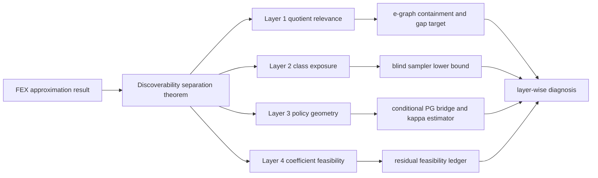

<!-- 书写报告使用中文 -->
---
idea: fex-search-complexity
title: "Existence Is Not Discoverability: Four-Gate Separation for FEX Symbolic Search"
version: 3
date: 2026-06-19
workspace: workspace/fex-search-complexity/
---

## 本轮修订摘要 (v2 review -> v3)

v2 的 blocker 是 contribution-quality: dominant contribution 若是 discoverability decomposition, "各层 separately failing" 必须成为形式命题. v3 将主贡献改为 **four-gate Separation Proposition** (quotient relevance / class exposure / PG geometry / coefficient feasibility), 给 exposure、PG、coefficient 三个 witness sketch; 将 W2 的硬靶子定为 `sound_ac` 与 domain-guarded e-graph closure 的 containment-and-gap theorem; 修正三层/四层图示矛盾; 给出 `hat{kappa}` estimator; 并把 "When Is Symbolic Regression Tractable?" 改为 watchlist: ICML 2026 downloads 页列出该标题, 但作者、摘要、PDF、结论尚未通过 arXiv/OpenReview 核验, 不能作 load-bearing 引用.

## Technical Gap

### Problem Anchor (carried verbatim)

- **Bottom-line problem**: FEX 是我的课题组(Haizhao Yang 组)发明的一种方法, 使用 RL 进行 Symbolic Regression, 我(Youran Sun)作为 Yang 的博后, 应该继续在这个方向上探索.
- **Must-solve bottleneck**: FEX 已有 approximation theory 说明有限表达式空间可以表示高维 PDE 解, 但还没有理论解释 RL controller 何时能找到这些表达式; 当前失败可能来自可区分结构太多、policy-gradient 几何太差, 或固定结构后的实值系数可行性太难.
- **Non-goals**: 不做通用 SR benchmark; 不提出新的 FEX 工程系统; 不声称大 context、LLM prompt、更多算子或更多 PDE 家族本身解决搜索复杂度; 不在 reduction 完成前声称 FEX coefficient feasibility 是 ETR-hard.
- **Constraints**: 理论主贡献; 实验只做 proof-facing diagnostics. 复用现有 FEX Poisson controller、`depth2_sub` pilot、v4 PG trace、v5 quotient certificate. 额外计算预计 20-80 GPU-hours, 主要用于真实 controller traces 和 e-graph comparison; quotient theorem 与 proof writing 基本不需要 GPU.
- **Success condition**: 给出一篇可审查的 theory-first 论文, 明确区分 "存在可表示解" 与 "controller 可发现解"; 至少证明一个无条件 FEX quotient-count theorem 和 blind sampler lower bound, 并把 PG 几何与实值可行性作为可测、可证伪的独立条件, 而不是把小搜索空间误读成可搜索性.

### Data Handoff Status

已复查 `workspace/fex-search-complexity/data/MANIFEST.md` 和 `workspace/fex-search-complexity/NOTES.md`. 当前没有外部数据下载需求, 也没有中断或失败下载需要恢复. Pilot 使用 FEX Poisson 代码在线生成 collocation points.

可复用 artifact: v3/v4 Poisson diagnostic 显示 `depth2_sub` 的结构命中通常快, strict reward `0.99` 更多受系数优化限制; v4 trace 已记录 controller loss / reward / grad norm / logits / entropy, bandit proxy 给出 single-good-class `kappa` 约 `9.0e5`; v5 quotient certificate 已核; canonical `sound_ac`: `depth1` raw `243 -> 171`, `depth2_sub` raw `2187 -> 1539`, canonicalizer idempotent 且 swap/false-equality checks 为 0. (旧 `R_ac+c` 的 `q_0=8/Q=953` 已作废, 因 zero/one 常数合并不 sound.)

### Grounding Material

FEX 原始论文给 approximation guarantee, 但 RL controller 仍缺 searchability theory. Multi-Scale FEX、LLM+FEX、FEX+TranNet 改善先验或候选池, 不解释 failure gate.

本轮窄扫只影响两个点. 第一, EGG-SR (2511.05849), eggp (2501.17848), SymRegg (2511.01009) 都强化了 e-graph 作为 W2 comparator 的必要性, 但没有 FEX quotient recurrence 或 `sound_ac` containment/gap theorem. 第二, VSR-DPG (2402.00254) 和 CADSR (2406.06751) 仍是经验 expression-generator 工作; CADSR 的 tail-barrier 动机支持 PG-geometry gate, 但不预占 FEX/PDE residual convergence. 实参可行性仍按 Abrahamsen/Bertschinger/Miltzow-Schmiermann/Stade 降为 appendix route. ICML 2026 的 "When Is Symbolic Regression Tractable?" 只列 watchlist, 不引用未核验结论.

### Operational Gap

FEX failure 不是单一 "树太多": raw count 可能被 quotient 压缩; quotient 小仍有 `Q/K` exposure barrier; exposure 好仍可能有 bad `kappa_PG`; 结构选中后 coefficient feasibility 仍可能失败. 更深树、更多采样、LLM prior、e-graph memory 都可能帮忙, 但必须先知道它们改变哪个 gate. 最小充分干预是证明这些 gate 互不蕴含.

### Route Choice

- **Route A, elegant minimal route**: 固定 FEX grammar 与 controller. 主文证明 Separation Proposition + quotient recurrence + blind sampler lemma; e-graph containment/gap 作 derived theorem target; `kappa_PG` 和 ETR 只做条件桥与诊断.
- **Route B, frontier-native route**: 引入 LLM skeleton、Transformer policy、e-graph controller 或 reward shaping, 做更强 solver.

选择 Route A. Route B 会漂移成工程系统, 且无法回答 anchor 中最核心的 "为什么 approximation theory 不等于 controller discoverability".

## Method Thesis

- **One-sentence thesis**: FEX approximation theory 只保证表达式存在; controller discoverability 还需要四个互不蕴含的 gate - quotient relevance, class exposure, policy-gradient geometry, coefficient feasibility - 我们用 separation witnesses 证明这些 gate 可单独失败, 并给出 quotient recurrence 与 e-graph containment/gap target 作为可审查硬结果.
- **Why this is the smallest adequate intervention**: 不改 controller, 不训练新模型, 不堆新 solver. 只把 FEX 从 "可表示" 到 "可发现" 的缺失理论层补成可证明、可诊断、可证伪的结构.
- **Why this route is timely in the foundation-model era**: LLM/Transformer/e-graph 正在给 SR 提供强先验; four-gate decomposition 让我们判断这些先验到底缩小了 quotient cover, 提高了 good-class exposure, 改善了 PG geometry, 还是绕开了 coefficient infeasibility.

## Contribution Focus

- **Dominant contribution**: four-gate separation theorem for FEX discoverability.
- **Supporting contribution**: `sound_ac` quotient recurrence + CUDA certificate + e-graph containment/gap target.
- **Conditional bridge**: PG convergence only under explicit gradient-domination; `kappa_PG` is estimated as diagnostic, not derived from cover size.
- **Appendix-only route**: FEX-restricted coefficient feasibility ledger, with no main-text ETR-hardness claim.
- **Explicit non-contributions**: no new FEX solver, no SOTA benchmark, no claimed semantic quotient solution, no invented e-graph/urn/PG/real-feasibility theorem, no load-bearing use of unverified ICML 2026 SR tractability content.

## Proposed Method

### Complexity Budget

- **Frozen / reused**: FEX Poisson grammar, `depth2_sub` controller, Adam/LBFGS fitting, v4 traces, v5 canonicalizer, e-graph rewrites as comparators.
- **New trainable components**: none.
- **New technical objects**: gates `G1..G4`, `Q_R(L)`, `K_epsilon`, `kappa_PG`, residual feasibility family.
- **Excluded**: LLM skeletons, learned e-graph controllers, Transformer policies, diffusion samplers, larger benchmarks, new inner optimizers.

### System Overview

### Core Mechanism

#### Main result: Separation Proposition

Define four gates for family `F`, depth `L`, rewrite system `R`, and tolerance `epsilon`:

- `G1` quotient relevance: `Q_R(L)` is a meaningful cover, not only trivial constant collapse.
- `G2` class exposure: `K_epsilon/Q_R(L)` is not exponentially small for reward-blind discovery.
- `G3` policy geometry: `J_star - J(theta) <= kappa_PG ||grad J(theta)||^2` with usable `kappa_PG`.
- `G4` coefficient feasibility: selected structures admit real coefficients with residual at most `epsilon`.

**Separation Proposition target**: for `G2`, `G3`, and `G4`, construct a FEX-compatible finite family where approximation holds and the other downstream gates are benign, but that gate fails.

Witness sketches:

1. **Exposure witness**: `Q_m` quotient classes with one hidden good class; all coefficients feasible and reward benign once queried. Reward-blind sampling still takes expected `Q_m`.
2. **PG witness**: two exposed, feasible classes with reward gap `delta_m=2^{-m}`. Softmax PG gives `hat{kappa}` scaling like `1/delta_m`, so non-sparse classes can still have flat geometry.
3. **Coefficient witness**: one structure with residual `(c^2+1)^2` at zero tolerance, or a bounded curved-constraint gadget. Then `Q=K=1` and geometry is vacuous, but fitting fails.

Formal falsifier: if any downstream gate failure is always implied by an earlier gate under the declared grammar, the separation theorem is false and the paper retreats to a narrower diagnostic note.

#### Layer 1: Quotient recurrence and e-graph theorem target

Canonical rewrite set `sound_ac`: add/mul commutativity only. (旧 `R_ac+c` 含 zero/one leaf/root 常数合并, 已证不 sound 并作废.) No associativity, distributivity, trig identities, PDE semantic equivalence, or e-graph saturation. For `C_0=leaf atoms`, `C_{l+1}=root_unary(binary(C_l,C_l))`, prove:

`q_0=9`, `q_{l+1}=9*(q_l^2+q_l*(q_l+1))`.

Depth-label table remains:

| Grammar level | recurrence index | raw templates | quotient classes |
|---|---|---:|---:|
| leaf atoms | `q_0` | 9 | 9 |
| depth1 binary-only | not recurrence step | 243 | 171 |
| depth2_sub Poisson object | `q_1` | 2187 | 1539 |
| depth2 rooted | `q_2` | not enumerated | 42647229 |
| depth3 rooted | `q_3` | not enumerated | 32738150928636999 |
| depth4 rooted | `q_4` | not enumerated | 19292157472071881094470124768801009 |

**Primary derived theorem target (W2)**: Let `E` be a domain-guarded e-graph rewrite set containing commutativity and constant folding on the common FEX operator domain. Prove `sound_ac` equivalence is contained in `E` equivalence, and exhibit gap families that `E` merges but `sound_ac` does not. Stop rule: if domain guards make containment ambiguous, downgrade to a finite audit and keep only the separation proposition as the main theorem.

#### Layer 2: Blind sampler gate

Let `Q` be quotient classes and `K` good classes. With replacement, expected hit time is `Q/K`; no-repeat under a uniformly random hidden good set gives `(Q+1)/(K+1)`. This is only the bridge "small cover is not searchable without reward geometry."

#### Layer 3: Conditional PG bridge and estimator

Define `N_FEX(F,L,epsilon)` as the minimum quotient-template cover needed for residual `epsilon`. For softmax/f-softargmax objective `J(theta)`, assume:

1. `N_FEX(F,L,epsilon)=poly(d,1/epsilon)`;
2. `J_star - J(theta) <= kappa_PG ||grad J(theta)||^2`;
3. stochastic gradient variance is polynomially bounded;
4. coefficient-fitting noise does not erase reward separation between good and bad classes.

Then PL/gradient-domination SGD yields a polynomial update bound in `N_FEX`, `kappa_PG`, variance scale, and `1/epsilon`. State explicitly: `N_FEX` and `Q_R` do not imply `kappa_PG`.

Diagnostic estimator:

`hat{kappa}_t = (hat J_star - hat J_t)_+ / (||g_t||_2^2 + lambda)`.

`hat J_t` is logged mean reward, `g_t` the logged gradient norm, `hat J_star` the best available oracle for that run, and `lambda=1e-12`. Report a 90th-percentile trace envelope and seed bootstrap interval. For bandit probes compute it exactly under `Q,K,delta`; for real traces mark it diagnostic only.

#### Layer 4: Coefficient feasibility ledger

For a fixed structure, inner fitting is real residual minimization. The appendix asks whether ETR-INV-style constraints embed despite FEX restrictions (bounded variables/constants/subtrees and differential residuals). If plug-and-play, write a corollary remark to known hardness; if not, keep only the infeasibility witness and toy residual interface.

### Modern Primitive Usage

Existing FEX RL is the analyzed controller; e-graph is a semantic quotient comparator; LLM/FEX and Transformer SR are related work only. No frontier model acts as planner, teacher, critic, reward model, generator, or search controller. A stronger generator can be evaluated after the four gates exist; before that it hides which failure mode was fixed.

### Integration / Inference Path

No production FEX integration is required. Diagnostic flow: canonicalize templates under `sound_ac`; run unchanged FEX controller with logits/gradients/entropy/reward/coefficient status; map high-reward templates to quotient classes; estimate `K_epsilon`, good-class mass, and `hat{kappa}`; run e-graph and constant-class deletion checks; route failure to the first failed gate.

### Training Plan

Proof-first; no learned component is trained. Order: Separation Proposition and witnesses; `sound_ac` recurrence; e-graph containment/gap proof or audit; one-line sampler gate; conditional PG theorem with diagnostic `hat{kappa}`; appendix coefficient ledger; diagnostics only after statements stabilize.

### Failure Modes and Diagnostics

- **Witnesses too toy**: require declared FEX grammar interface and clear reward/residual interpretation; otherwise label as independence construction only.
- **E-graph containment fails**: downgrade W2 to finite audit, preserve separation theorem.
- **Compression constant-class dominated**: delete root constant-output classes and weaken Layer-1 relevance.
- **`hat{kappa}` too noisy**: report bandit proxy plus trace range; never infer a true PL constant.
- **ETR embedding fails**: keep coefficient witness; remove hardness language.
- **ICML 2026 tractability paper overlaps**: update related work and downgrade novelty if it analyzes FEX-like discoverability gates.

### Novelty and Elegance Argument

The novelty is not any single imported lemma. The claim is that FEX discoverability needs a four-gate theorem because existence, quotient count, exposure, PG geometry, and coefficient feasibility can separate.

- **E-graph SR**: EGG-SR, eggp, SymRegg reduce repeated equivalent exploration, but do not give FEX recurrence, `sound_ac` containment/gap, or discoverability separation.
- **Expression-tree PG SR**: VSR-DPG and CADSR train generators; CADSR's tail barrier supports the PG gate but gives no FEX/PDE residual convergence.
- **SR complexity**: Virgolin-Pissis and exhaustive/MDL SR address general SR. The ICML 2026 tractability title remains watchlist, not citable content.
- **Real feasibility**: fixed-architecture hardness is known; v3 only asks whether FEX restrictions make an embedding nontrivial.

Elegance comes from refusing a larger system: every future improvement can be classified by which gate it changes.

## Claim-Driven Validation Sketch

### Claim 0: Four-gate separation is a real theorem, not a framing slogan

- **Minimal proof**: three witnesses plus collapse falsifier.
- **Metric**: each witness keeps other gates benign while one gate fails.
- **Expected evidence**: "individually necessary" is no longer only empirical.

### Claim 1: Conservative quotient theorem enables an e-graph containment/gap target

- **Minimal proof**: recurrence + v5 certificate + containment/gap theorem or finite audit.
- **Ablations**: raw count, constant-output deletion, unguarded e-graph quotient.
- **Metric**: exact counts, zero canonicalizer failures, containment status, gap classes.
- **Expected evidence**: Layer 1 is a proof object with explicit relation to e-graph SR.

### Claim 2: Quotient size alone is insufficient for controller discoverability

- **Minimal evidence**: sampler lemma, PG witness, bandit `hat{kappa}` schedule, short real traces.
- **Metric**: hit-time formulas; `hat{kappa}` vs good-class mass and reward contrast.
- **Expected evidence**: small `Q` can coexist with exposure or PG failure.

### Claim 3: Coefficient feasibility is separate and appendix-only unless the FEX embedding closes

- **Minimal evidence**: single-structure infeasibility witness plus bounded gadget ledger.
- **Metric**: feasibility certificate, bounded-variable preservation, subtree-size preservation.
- **Expected evidence**: structure selection and coefficient feasibility are separate without overclaiming hardness.

## Paper Outline

- **Section 1**: Existence is not discoverability; define four gates.
- **Section 2**: Related work by gate.
- **Section 3**: Separation Proposition and witnesses.
- **Section 4**: Quotient recurrence and e-graph containment/gap.
- **Section 5**: Sampler lemma, conditional PG theorem, `hat{kappa}` diagnostic.
- **Section 6**: Diagnostics and failure routing.
- **Appendix A**: Coefficient ledger and toy residual witnesses.
- **Key figures**: four-gate graph; witness table; quotient table; e-graph gap; `hat{kappa}` plot.

## Compute and Timeline Estimate

- **Estimated GPU-hours**: 20-80 GPU-hours for real-controller traces and optional PDE-family diagnostics; 0 GPU-hours for Separation Proposition, quotient recurrence, sampler lemma, and e-graph proof sketch.
- **Data / annotation cost**: no external data or annotation. Collocation points are generated online by FEX code. Existing artifacts are in `workspace/fex-search-complexity/results/`.
- **Timeline**: 1 week for separation witnesses and proof ledger; 1-3 weeks for e-graph containment/gap proof or audit; 2-4 weeks for `hat{kappa}` diagnostics; coefficient feasibility remains appendix-gated and cannot block the main paper.
