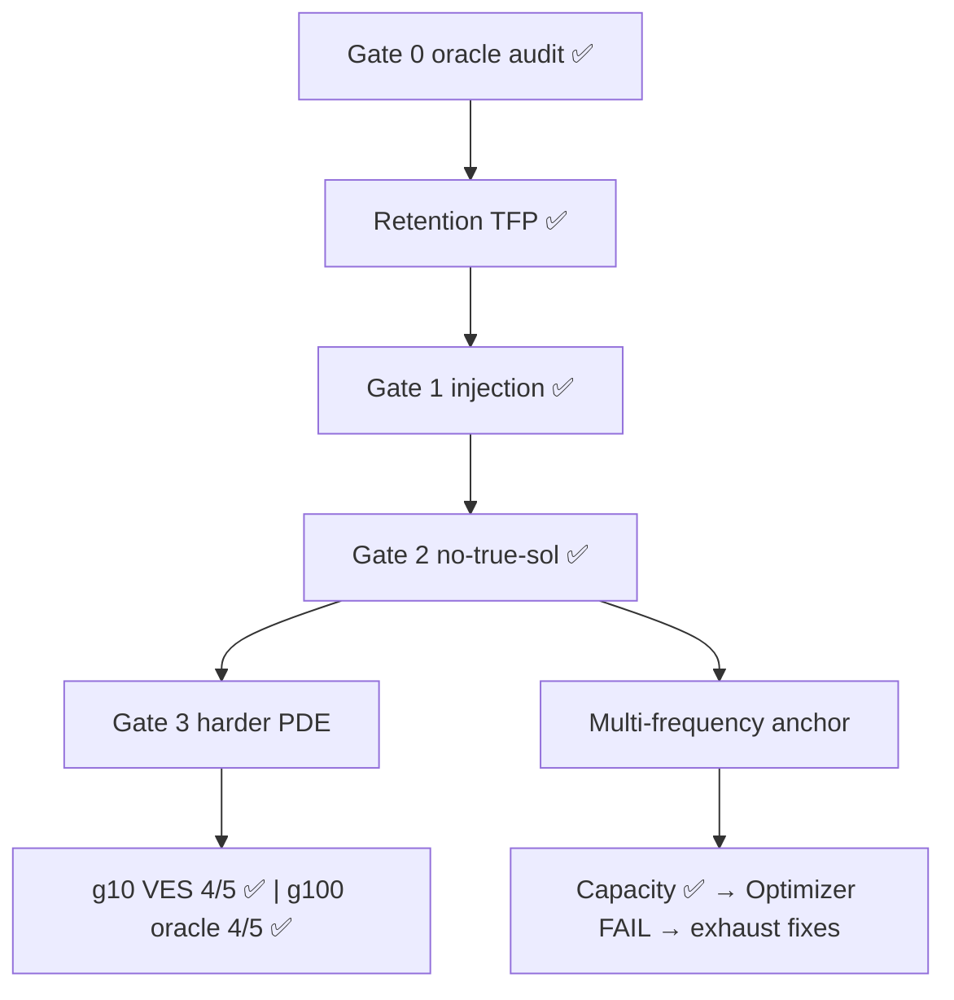

# FEX 频率先验审计

> 一句话：单频频率保持瓶颈、no-true-sol prior、nonlinear 控制都已有强证据；multi-frequency anchor 的表达容量和频率选择已解决，剩余瓶颈是连续优化——必须先穷尽低成本 optimizer 修复再判断是否 fundamental。

## 1. 背景

### 1.1 领域常识

FEX 用 RL controller 搜索 PDE 的符号解。controller 生成二叉运算树，Adam+BFGS 优化连续参数，reward 来自 PDE 残差。Multi-Scale FEX 加周期算子 `{sin(3x)..sin(24x), cos(3x)..cos(24x)}` 和 `alpha_i` 缩放。原论文承认 widely separated frequency components 让 RL dynamics 不稳定。

本项目隔离"频率"这个动作轴：先用 oracle prior 判断频率是否是可干预瓶颈；再把频谱估计编译成 soft frequency prior。§5 要求问题只能往更难推进。

### 1.2 核心概念

| 概念 | 一句话解释 |
|------|-----------|
| Oracle soft prior | 在频率叶节点 logits 上加 alpha-aware Gaussian score bias |
| 频率保持 | 搜索期间持续选择正确频率的能力；standard 常早期找到但后续丢失 |
| VES | validated_estimated_soft: 无真解的 FFT estimated prior，经 residual gate 验证后注入 |
| TFP | target_freq_prob: controller 给目标算子的 softmax 概率 |

### 1.3 研究问题

- **问题**：Multi-Scale FEX 的宽频率失败，是频率搜索/保持造成的吗？
- **已可信**：单频 Helmholtz oracle_soft 16/17 vs standard 4/17 (p=2.96e-5)；g10 VES 4/5 machine precision；residual validation 41 seeds no-true-sol。
- **当前缺口**：multi-frequency 容量和频率选择已解决，但 15/15 continuous optimization FAIL (best 1.90e-3)——optimizer 配置未穷尽。

## 2. 实验全景

### 2.1 实验流程

### 2.2 核心指标

| 指标 | 含义 |
|------|------|
| relL2 | 最终相对 L2 误差 |
| TFP | controller 给目标算子的 softmax 概率 |
| pass rate (≤1e-4) | n seeds 中 relL2≤1e-4 的比例 |
| search_error | 搜索阶段最小候选 PDE 残差 |

### 2.3 实验矩阵

| 实验 | 状态 | 核心结果 |
|------|------|---------|
| Gate 0 oracle | ✅ | oracle_soft 16/17 vs standard 4/17, p=2.96e-5 |
| Retention | ✅ | ep9 TFP 0.34 vs 0.08 |
| Gate 1 injection | ✅ | logits > reward > post-hoc |
| Gate 2 no-true-sol | ✅ | 41 seeds 全 no-true-sol |
| Nonlinear g10 | ✅ | VES 4/5, oracle 3/5, std 0/5 |
| Nonlinear g100 | ✅ | oracle 4/5, VES 2/5, std 1/5 |
| Decoy/width | ✅ | far reject; 16/18 ≤1e-4 |
| Multi-frequency | BLOCKER (optimizer) | capacity 1.83e-6 PASS; search+finetune 15/15 FAIL (best 1.90e-3) |

## 3. 算法与代码

### 3.1 算法本质

Oracle prior 只在频率叶 logits 上加 bias，不改 FEX 架构。VES 用 FFT 估计频率，residual/BC gate 检查后注入。Multi-frequency 用 additive grammar（两 component root 相加），容量已证实。搜索阶段每候选 20 Adam + 20 L-BFGS coarse eval；finetune 阶段 10K Adam。

### 3.2 代码地图

| 想知道... | 文件 |
|----------|------|
| PDE 定义 | `src/fex_synchro_prior/pde.py` |
| Tree grammar + forward | `src/fex_synchro_prior/model.py` |
| Controller prior | `src/fex_synchro_prior/controller.py` |
| Estimator + gate | `src/fex_synchro_prior/estimator.py` |
| Trainer (search + finetune) | `src/fex_synchro_prior/trainer.py` |
| Runner | `scripts/run_gate0_arm.py` |
| Capacity probe | `scripts/run_capacity_probe.py` |

### 3.3 计算量

累计 $1354.63。下一轮 MF optimizer 诊断 <25 GPU-h (~$25)。

## 4. 当前结果

### 4.1 可信证据

| 结果 | 关键数字 |
|------|----------|
| Gate 0 | oracle_soft 16/17 vs standard 4/17, Fisher p=2.96e-5 |
| Retention | ep9 TFP oracle≈0.34 vs standard≈0.08 |
| Gate 1 | logits 3/3 search conv > reward_bonus 0/3 search |
| Gate 2 | h7pi 8/8, h8pi 2/3, cd2d 3/3 machine; all no-true-sol |
| Width | 16/18 ≤1e-4 across caps |
| Nonuniform | 8/9 PASS all no-true-sol |

### 4.2 Nonlinear harder PDE (n=5, verified)

| gamma | arm | s0 | s1 | s2 | s3 | s4 | pass(≤1e-4) | median |
|-------|-----|-----|-----|-----|-----|-----|-------------|--------|
| 10 | std | 4.79e-1 | 1.08e-2 | 1.72e-2 | 1.74e-2 | 6.82e-3 | 0/5 | 1.72e-2 |
| 10 | oracle | 1.12e-6 | 4.63e-4 | 1.29e-6 | 3.76e-3 | 1.20e-5 | 3/5 | 1.20e-5 |
| 10 | **VES** | 1.12e-6 | 1.12e-6 | 6.47e-3 | 1.33e-6 | 1.07e-6 | **4/5** | **1.12e-6** |
| 100 | std | 5.06e-5 | 2.04e-3 | 3.81e-3 | 4.42e-3 | 2.15e-1 | 1/5 | 3.81e-3 |
| 100 | **oracle** | 2.17e-3 | 1.26e-6 | 1.12e-6 | 1.13e-6 | 1.12e-6 | **4/5** | **1.13e-6** |
| 100 | VES | 1.24e-6 | 7.04e-5 | 2.56e-3 | 5.67e-4 | 3.10e-3 | 2/5 | 5.67e-4 |

g10 VES 是本项目最强结果——no-true-sol 4/5 machine precision，beats oracle。g100 oracle 仍 4/5 strong，但 VES 降到 2/5。g100 VES estimator 数据确认 FFT 估计正确（22.09≈7π，gate 全 PASS，res=0.075<<0.5，selected_bases=[21,24]与 g10 完全相同）——降级不是估计失败，而是高非线性下 search noise 放大。iter12 n=1 "VES best at g100" 是 seed0 outlier。

### 4.3 Multi-frequency anchor

Capacity probe 1.83e-6 PASS。Oracle_soft 频率选择 PASS（s3 first_hits ep0/ep21）。但 15/15 finetune 全 FAIL：os s3 = 1.90e-3（best），cand1 search_error=1495（vs 单频 converged <10）。搜索质量和 finetune budget 是双重瓶颈，但低成本修复手段未测试。

### 4.4 Claims 速查

| Claim | 证据 | 强度 |
|-------|------|------|
| 频率保持是可干预瓶颈 | Gate 0 + TFP | 强 |
| Early logits > reward/post-hoc | Gate 1 | 强 (单 PDE) |
| No-true-sol 可部署 | Gate 2 residual validation | 强 (单频) |
| Nonlinear 拉开差距 | g10 VES 4/5; g100 oracle 4/5 | g10 强; g100 分层 |
| Multi-frequency anchor | 容量 PASS, optimizer FAIL | 缺——optimizer 未穷尽 |
| Width 不脆弱 | 16/18 across caps | 强 |

## 5. 战略决策（人类决定）

### 当前指令

1. Scope 只能往大换不能往小换，要有伟大的梦想。做出平庸的东西还不如挑战难的但是失败——挑战难的失败你至少可以说"我试过"，做普普通通的平庸的东西，真的没意思。
2. 越难的问题（在我们这里是越难的 PDE）越容易出 positive result。为什么？因为简单问题以前的方法也能解，你看不出新方法的好；你得去挑战难的才能拉开新方法和已有方法的差距。越挑战难问题的人反而越容易成功，而开始就觉得难放弃的人，可能连简单的事情也做不成。

## 6. 下一步行动

| 优先级 | 行动 | 完成标志 |
|--------|------|---------|
| P0 | MF optimizer exhaustion (5 项诊断) | ≥1 项 relL2≤1e-4 或全 FAIL 确认 |
| P0 | f12 provenance metadata 修复 | has_decoy 字段写入 |
| P1 | 若 Group A ≥1 pass: MF 3 arms × 5 seeds | 完整对照 |

### 6.1 证据结构速览

主论证："频率动作轴是 FEX 的真实瓶颈"。证据链：Gate 0 因果 → retention 机制 → Gate 2 no-true-sol 部署 → g10/g100 harder PDE 差距 → MF anchor 原始大问题。最后一环正在 P0 修复。

---

# Agent 执行层

## A0. Audit / Review Response

| issue | response | action | status |
|-------|----------|--------|--------|
| BLOCKER-001 MF optimizer 未穷尽 | Accept. 容量 1.83e-6 vs os s3 1.90e-3，10K Adam 可能 budget 不够 | A1 Group A: 5 项诊断 each <5 GPU-h | P0 |
| CRIT-001 g100 narrative reversed | Accept. n=5: oracle 4/5 > VES 2/5 > std 1/5 | §4.2 已用 n=5 重写 | resolved |
| CRIT-002 §4 outdated | Accept | §4 已整合 iter14 数据 | resolved |
| MAJOR-001 finetune extension | Accept (= BLOCKER-001) | subsumed | P0 |
| MAJOR-002 A3 estimated blocked | Accept | 确认 | resolved |
| MAJOR-003 f12 provenance | Accept | A1 Group B | P0 |
| MINOR-002 iteration numbering | Accept | frontmatter=14 | resolved |

## A1. Experiments-to-do

### Task Group A: MF optimizer exhaustion

- runs: [mf-ft-50k-s3, mf-ft-lbfgs-s3, mf-ft-combo-s3, mf-search-100-oracle, mf-probe-perturbed]
- can_split: true
- depends_on: none
- priority: P0

### Run: mf-ft-50k-s3

- Task Group: A
- Advances: finetune budget 是否是瓶颈？
- Config: 加载 os s3 cand1 actions (candidates[1] from `results/mf-additive-grammar-oracle/oracle_soft-multifreq_4_17-s3/result.json`)，alpha init from target freqs [4π, 17π]，50000 Adam steps (lr=1e-3)。需改 capacity probe 脚本接受 `--load-actions-from`。
- Expected outputs: `results/mf-ft-50k-s3/result.json`
- Priority: MUST-RUN
- Compute cost: <3 GPU-h
- Server: arnold:GPU3; fallback 1202b:GPU3
- remote_dir: `/scr1/scratch/sun1245/fex-synchro-prior`
- Success criterion: relL2 从 1.90e-3 降到 ≤1e-4
- Failure interpretation: 50K Adam 也不行 → tree 结构质量是瓶颈

### Run: mf-ft-lbfgs-s3

- Task Group: A
- Advances: L-BFGS 是否比 Adam 更适合 MF 14-param 优化？FEX 原版用 BFGS。
- Config: 同 mf-ft-50k-s3 的 actions/alpha，L-BFGS (max_iter=1000, strong_wolfe)
- Expected outputs: `results/mf-ft-lbfgs-s3/result.json`
- Priority: MUST-RUN
- Compute cost: <2 GPU-h
- Server: arnold:GPU4
- Success criterion: relL2 ≤ 1e-4
- Failure interpretation: L-BFGS 也不行 → tree 结构本身不够好

### Run: mf-ft-combo-s3

- Task Group: A
- Advances: Adam warmup + L-BFGS polish 组合
- Config: 50K Adam + 1000 L-BFGS (same cand1 actions)
- Expected outputs: `results/mf-ft-combo-s3/result.json`
- Priority: MUST-RUN
- Compute cost: <3 GPU-h
- Server: arnold:GPU5
- Success criterion: relL2 ≤ 1e-4

### Run: mf-search-100-oracle

- Task Group: A
- Advances: 搜索阶段 coarse eval 太少 (20+20) → 候选质量差？更多 coarse eval 是否让搜索找到更好的 tree 结构？
- Config: oracle_soft, multifreq_4_17, coarse_adam_steps=100, coarse_lbfgs_iters=100, finetune 50K Adam, seeds 0,2,3。需 `run_gate0_arm.py` 加 `--coarse-steps` flag。
- Expected outputs: `results/mf-search-100-oracle/` 3 result.json
- Priority: MUST-RUN
- Compute cost: ~15 GPU-h
- Server: arnold:GPU6-8
- remote_dir: `/scr1/scratch/sun1245/fex-synchro-prior`
- Success criterion: 任一 seed 的 best cand search_error < 100 且 relL2 ≤ 1e-4
- Failure interpretation: 100+100 也不行 → 需要 curriculum/grammar hints

### Run: mf-probe-perturbed

- Task Group: A
- Advances: exact tree structure + noisy alpha 的 optimizer gap 有多大？
- Config: capacity probe exact actions, alpha init = target/base + 5% Gaussian noise, 10K Adam + 1K L-BFGS。需 capacity probe 加 `--alpha-noise 0.05`。
- Expected outputs: `results/mf-probe-perturbed/result.json`
- Priority: MUST-RUN
- Compute cost: <1 GPU-h
- Server: arnold:GPU3 (after mf-ft-50k finishes)
- Success criterion: relL2 ≤ 1e-5
- Failure interpretation: 5% alpha noise 就无法收敛 → optimizer 对 alpha 极敏感

### Task Group B: Evidence hygiene

- runs: [f12-provenance-fix]
- can_split: true
- depends_on: none
- priority: P0

### Run: f12-provenance-fix

- Task Group: B
- Advances: 修复 f12 decoy result.json provenance metadata 缺陷。
- Config: 修改 result schema，decoy runs 写入 `has_decoy`/`decoy_freq`/`decoy_amp`。不改历史文件；在 f12 trace rerun manifest 中补 directory→condition 映射注释。
- Expected outputs: code commit + manifest 更新
- Priority: MUST-RUN
- Server: local

### Task Group C: MF full comparison

- runs: [mf-full-comparison]
- can_split: false
- depends_on: Group A (至少一项 ≤1e-4)
- priority: P1

### Run: mf-full-comparison

- Task Group: C
- Advances: MF anchor 完整对照
- Config: standard/oracle_soft/validated_estimated_soft × seeds 0-4, 使用 Group A 成功的 optimizer 配置
- Priority: MUST-RUN (after Group A passes)
- Compute cost: 60-100 GPU-h
- Server: arnold

### 代码改动

1. `scripts/run_capacity_probe.py`: 新增 `--load-actions-from <result.json> --candidate-rank <int>` 从 result.json 读取 candidate actions；新增 `--optimizer {adam,lbfgs,adam+lbfgs}` 和 `--alpha-noise <float>`。
2. `scripts/run_gate0_arm.py`: 新增 `--coarse-steps <int>` 同时设置 coarse_adam_steps 和 coarse_lbfgs_iters。
3. Result schema: decoy runs 写入 `has_decoy`, `decoy_freq`, `decoy_amp`。

## A2. 实验详细规格

### E12: MF optimizer exhaustion

- 核心假设：os s3 cand1 (search_error=1495, relL2=1.90e-3) 可以通过更强优化到达 ≤1e-4。
- 对照：capacity probe (exact actions, relL2=1.83e-6)。
- 5 项实验覆盖三个假设：(a) finetune budget, (b) optimizer choice, (c) search quality。
- 全部失败才能确认 "multi-component search+opt 需要 fundamental 改进"。
- Claim ceiling：任一 ≤1e-4 → "MF 可解 given optimizer tuning"；全失败 → claim 限制 "single-freq + nonlinear"。

## A3. Runs

| run | server | remote_dir | launched_at | session_id | crash_count | phase |
|-----|--------|------------|-------------|------------|-------------|-------|
| mf-ft-50k-s3 | arnold:GPU3 | /scr1/scratch/sun1245/fex-synchro-prior | 06-28 16:54 | fexsp-ft50k-0628v2 | 0 | running |
| mf-ft-lbfgs-s3 | arnold:GPU0 | /scr1/scratch/sun1245/fex-synchro-prior | 06-28 16:50 | fexsp-ftlbfgs-0628 | 0 | collected |
| mf-ft-combo-s3 | arnold:GPU5 | /scr1/scratch/sun1245/fex-synchro-prior | 06-28 16:54 | fexsp-ftcombo-0628v2 | 0 | running |
| mf-search-100-oracle | arnold:GPU6-8 | /scr1/scratch/sun1245/fex-synchro-prior | 06-28 16:54 | fexsp-s100-s{0,2,3}-0628 | 0 | running |
| mf-probe-perturbed | arnold:GPU3 | /scr1/scratch/sun1245/fex-synchro-prior |  |  | 0 | needs_impl |
| f12-provenance-fix | local | n/a | 06-28 16:50 |  | 0 | collected |
| mf-full-comparison | arnold | /scr1/scratch/sun1245/fex-synchro-prior |  |  | 0 | blocked (Group A) |

## A4. 环境

| 服务器 | GPU | 显存 | 远程路径 | 注意 |
|--------|-----|------|---------|------|
| arnold | Quadro RTX 8000 × 10 | 48GB | `/scr1/scratch/sun1245/fex-synchro-prior` | primary; 禁止 `\| tee`; fp32 only (Turing) |
| 1202b | RTX A6000 × 8 | 48GB | `/export/sun1245/fex-synchro-prior` | fallback |

## A5. 运行历史

| 时间 (ET) | 事件 |
|-----------|------|
| 06-28 16:54 | Coder: deployed ft50k(GPU3), combo(GPU5), search-100(GPU6-8); lbfgs completed FAIL (0.127); f12 provenance fixed |
| 06-28 16:20 | Audit iter14: BLOCKER — mf optimizer 未穷尽; g100 VES narrative reversed by n=5 |
| 06-28 15:30 | Coder: mf-additive 15/15, g10 12/12, g100 12/12, f12 2/2 all collected |
| 06-27 14:25 | Coder: capacity probe PASS (1.83e-6) |
| 06-27 14:00 | Audit iter12: BLOCKER — mf capacity FAIL, nonlinear n=1 |

## A6. 已知问题与修复

| 问题 | 根因 | 修复 | 状态 |
|------|------|------|------|
| MF optimizer FAIL | 10K Adam + 20+20 coarse 不够 for 14 params; cand1 search_error=1495 | A1 Group A: 5 项诊断 | P0 |
| f12 provenance | result.json 无 decoy 标识 | 补 has_decoy 字段 | resolved |
| Arnold stdout deadlock | `\| tee` blocks long run | 用 `> file 2>&1` | resolved rule |
